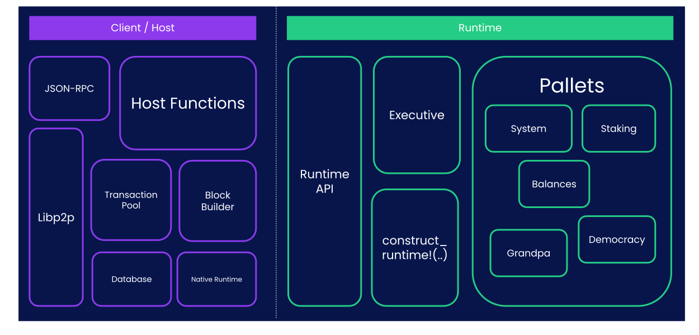
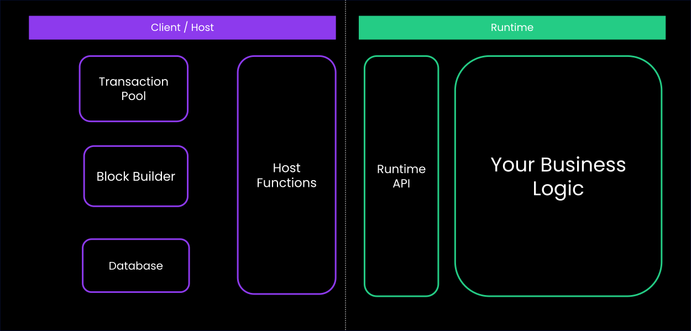

## FRAME-less Workshop

Building Substrate Runtime without the FRAME abstractions.

---

## Why Frameless?

- FRAME abstracts away significant complexity
- Understanding what happens "under the hood"
- FRAME is one opinionated way - but not the only way

Notes:

- This workshop helps you appreciate what FRAME does for you
- You'll implement manually what FRAME automates

---v

## Learning Goals

1. **Understand Core Primitives** - Storage, extrinsics, block lifecycle
2. **Appreciate FRAME's Value** - By experiencing the complexity it abstracts
3. **Gain Low-Level Knowledge** - Direct interaction with Substrate APIs
4. **Build Confidence** - Work with Substrate at any abstraction level

---

## Runtime with FRAME



Notes:

- FRAME provides pallets, storage abstractions, events, errors
- All of this sits on top of Substrate primitives

---v

## Runtime without FRAME



---

## Host Functions

```rust
// Direct storage access
sp_io::storage::set(KEY, &value.encode());
```

Notes:

- No pallets, no storage macros, no event system
- Direct manipulation of primitives

---v

## Runtime APIs

```rust
// Manual extrinsic handling
fn apply_extrinsic(ext: Vec<u8>) -> Result<(), ()> {
// Decode, validate, execute...
}

// Manual block lifecycle
fn initialize_block(header: &Header) { }
fn finalize_block() -> Header { }
```

Notes:

- We'll implement the runtime's role in this cycle
- Focus on initialize → apply → finalize

---

## Prepare

- Clone `Polkadot-Blockchain-Academy/frameless-runtime-template`
- wscat/curl.

---

## Setup

- Install the omni-node.
- Compile the runtime wasm.
- Run your Node.

Notes:

- `cargo install --force --locked --git https://github.com/Polkadot-Blockchain-Academy/pba-omni-node`
- `cargo build --release`
- `pba-omni-node --runtime <runtime> --tmp --consensus manual-seal-1000`

---

## Walk through

- Author Block
- Import Block

---

## Set Value

- FIXME-01: Make `import_and_author_equal` pass.

---

## Mint Balance

- FIXME-02: Uncomment and make `mint_balance_works` pass.

---

## Transfer Balance

- FIXME-03: Uncomment and make `transfer_balance_works`

---

## Bonus

- Call to vote with your balance.
- Signature Verification.
- Nonce Validation.

---

## Build Chain spec

```bash
  cargo install staging-chain-spec-builder
  chain-spec-builder --help
```

Notes:
https://docs.polkadot.com/develop/parachains/deployment/generate-chain-specs/

---v

## Build Chain spec

```bash
  chain-spec-builder create -r INSERT_RUNTIME_WASM_PATH INSERT_COMMAND
```

Notes:
https://docs.polkadot.com/develop/parachains/deployment/generate-chain-specs/
