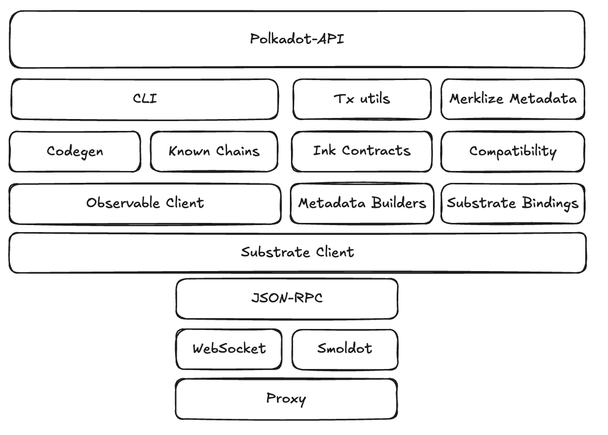
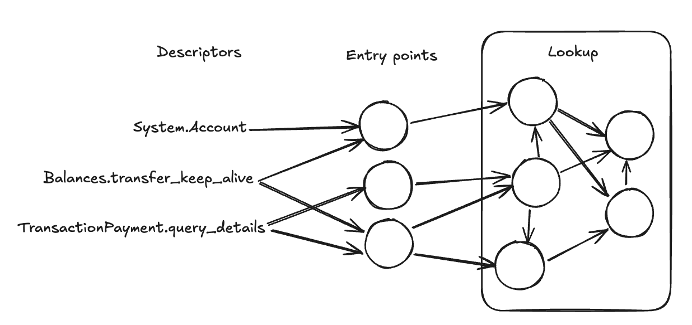
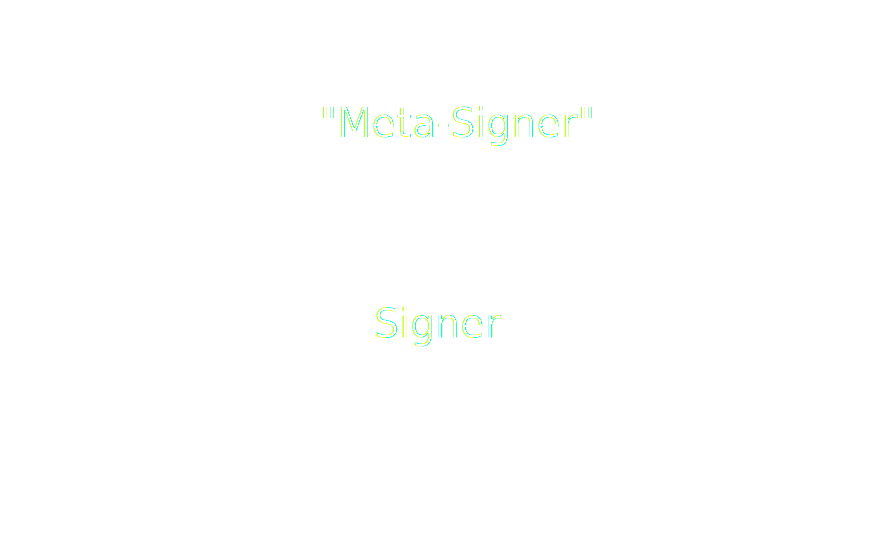

# Polkadot-API

<span style="color: lightgray; font-size: 0.8em;">(aka PAPI)</span>

Notes:

So far we've seen the low-level details for interacting with a chain. Now we'll go a higher level of abstraction and see how Polkadot-API, in specific, solves those challenges, and what other features it adds.

---

## PAPI principles

- Light-client first
- Modular
- Light weight
- Composable
- Simplify dApp development

---v

### Packages



Notes:

https://excalidraw.com/#json=MlLv0U2YI3nfTZwEkRTf1,iaAmM8qLSSYKNFkoJtlNsA

Warn that observable-client is opinionated and unstable, it's an implementational detail of papi. The other packages are unopinionated or at least stable.

---v

### Polkadot-API

- Top-level package
- Main use case: dApps
- Chain-agnostic
- Query or subscribe to chain state
- Send and track transactions

---v

### Polkadot-API

```ts
import { dot } from "@polkadot-api/descriptors";
import { createClient } from "polkadot-api";
import { getWsProvider } from "polkadot-api/ws-provider/web";

const client = createClient(getWsProvider("ws://…"));
const typedApi = client.getTypedApi(dot);

const ACCOUNT_ID = "15oF4uVJwmo4TdGW7VfQxNLavjCXviqxT9S1MgbjMNHr6Sp5";
const account = await typedApi.query.System.Account.getValue(ACCOUNT_ID);
```

---v

### CLI

- Codegen
- Generate TS types for chains
- Part of Compatibility API

---v

### Metadata Builders

- Codecs from metadata
  - Lookup
  - Storage
  - Runtime APIs
  - Transactions
  - Events

---v

### Metadata Builders

```ts
import { getDynamicBuilder, getLookupFn } from "@polkadot-api/metadata-builders";

const metadata = getMetadataFromSource();
const lookup = getLookupFn(metadata);
const dynamicBuilder = getDynamicBuilder(lookup);

const { keys, value, fallback } = dynamicBuilder.buildStorage("Pallet", "Entry");

const { codec, location } = dynamicBuilder.buildCall("Pallet", "Name");

const { args, value } = dynamicBuilder.buildRuntimeCall("Api", "Method");

const codec = dynamicBuilder.buildDefinition(134);
```

---v

### Typed Codecs

Access dynamic builder codecs directly from the top-level client.

```ts
import { dot } from "@polkadot-api/descriptors";
import { getTypedCodecs } from "polkadot-api";

const codecs = await getTypedCodecs(dot);

const xcmMsgV5 = codecs.tx.XcmPallet.send.inner.message.inner.V5;
const xcmLocationV5 = codecs.tx.XcmPallet.send.inner.dest.inner.V5;
```

---v

### Observable Client

- Internal detail
- Block pinning
- Subscriptions

---v

### Observable Client

<!-- prettier-ignore -->
```ts [|6|8-9|13-15|16-17|19-20]
import { getObservableClient } from "@polkadot-api/observable-client";
import { getWsProvider } from "@polkadot-api/ws-provider/web";
import { createClient } from "@polkadot-api/substrate-client";
import { firstValueFrom } from "rxjs";

const client = getObservableClient(createClient(getWsProvider("ws://…")));

const chainHead = client.chainHead$();
const finalized = await firstValueFrom(chainHead.finalized$);

const ACCOUNT_ID = "15oF4uVJwmo4TdGW7VfQxNLavjCXviqxT9S1MgbjMNHr6Sp5";
const account = await firstValueFrom(
  chainHead.storage$(
    finalized.hash,
    "value",
    ctx =>
      ctx.dynamicBuilder.buildStorage("System", "Account").keys.enc(ACCOUNT_ID),
    null,
    (data, ctx) => data &&
      ctx.dynamicBuilder.buildStorage("System", "Account").value.dec(data)
  )
);
```

---v

### Substrate Bindings

- Known codecs for Substrate
  - SS58 Format
  - Block header
  - Metadata v14-16
  - Extrinsic
- Other known utilities
  - Storage hashers
  - Multisig account

---v

### Substrate Client

- JSON-RPC Spec
- TS Interface
- Correlations
  - Message IDs
  - Subscription IDs
  - Operation IDs

---v

### Substrate Client

<!-- prettier-ignore -->
```ts [|4|6-7|8-18|20-24]
import { getWsProvider } from "@polkadot-api/ws-provider/web";
import { createClient } from "@polkadot-api/substrate-client";

const client = createClient(getWsProvider("ws://…"));

const chainHead = client.chainHead(
  true,
  async followEvt => {
    if (followEvt.type === "initialized") {
      const finalized = followEvt.finalizedBlockHashes.at(-1)!;

      const result = await chainHead.storage(
        finalized,
        "value",
        "0x{storage key}",
        null,
      );
      console.log("SCALE result: " + result);

      chainHead.unpin(followEvt.finalizedBlockHashes);
    }
    if (followEvt.type === "newBlock") {
      chainHead.unpin([followEvt.blockHash]);
    }
  },
  console.error
);
```

---v

### JSON-RPC Providers

```ts
type JsonRpcProvider = (onMessage: MessageCallback) => JsonRpcConnection;

type MessageCallback = (message: string) => void;

interface JsonRpcConnection {
  send: (message: string) => void;
  disconnect: () => void;
}
```

---v

#### Provider Enhancers

Having the provider decoupled from PAPI internals enables: <!-- .element: class="fragment" -->

- Interoperability with other clients. <!-- .element: class="fragment" -->
- Composability and ability to enhance them. <!-- .element: class="fragment" -->

and... <!-- .element: class="fragment" -->

#### LEGACY PROVIDER! 🚀 <!-- .element: class="fragment" -->

---v

#### Legacy Provider

It exposes a chainHead compliant RPC server... <!-- .element: class="fragment" -->

...while using the legacy APIs! <!-- .element: class="fragment" -->

<ul>
<li class="fragment">Support for <em>old</em> chains.</li>
<li class="fragment">Bypass flaky Polkadot SDK implementation.</li>
<li class="fragment">No need to rewrite the whole client, keep it in the right abstraction layer.</li>
</ul>

---v

#### WS Provider

`JsonRpcProvider` with other relevant stuff.

```ts
type WsJsonRpcProvider = JsonRpcProvider & {
  switch: (uri?: string, protocol?: string[]) => void;
  getStatus: () => StatusChange;
};
```

But still, a compilant provider! <!-- .element: class="fragment" -->

---v

### JSON-RPC Providers

Create a `withLogsRecorder`

```ts
export function withLogsRecorder(
  persistLog: (msg: string) => void,
  // Provider wrapped
  provider: JsonRpcProvider
): JsonRpcProvider {
  // TODO
}
```

---

## Subscriptions

---v

### Combining streams

Exercise: Find the referenda where a specific account voted in the same direction as the current outcome.

- Account: 1jbZxCFeNMRgVRfggkknf8sTWzrVKbzLvRuLWvSyg9bByRG
- Track: 33

Hints:

- `query.ConvictionVoting.VotingFor.watchValue(account, track)`
- `query.Referenda.ReferendumInfoFor.getValues([number][])`

Notes:

- Don't count delegations.
- Don't count split votes or abstains.

TODO Maybe find a better example. This one is interesting, but it's a shame it would need to do `watchValue[]` and that just adds boilerplate. Also, not a huge fan of the nesting and the hacks around conviction voting. Plus having to share the account which is just a random string…

```ts
const getDirectVotes = (voting: ConvictionVotingVoteVoting) => {
  if (voting.type === "Delegating") return [];

  return voting.value.votes
    .map(([id, vote]) => {
      if ("vote" in vote.value) {
        const direction = vote.value.vote & 0x80 ? "aye" : "nay";
        return { id, direction };
      }
      return null;
    })
    .filter(v => v !== null);
};

dotApi.query.ConvictionVoting.VotingFor.watchValue("1jbZxCFeNMRgVRfggkknf8sTWzrVKbzLvRuLWvSyg9bByRG", 33)
  .pipe(
    map(getDirectVotes),
    switchMap(async voting => {
      const referenda = await dotApi.query.Referenda.ReferendumInfoFor.getValues(voting.map(v => [v.id]));

      return referenda
        .filter(v => v != null)
        .filter((referendum, i) => {
          const { direction } = voting[i];
          if (referendum.type !== "Ongoing") {
            return (direction === "aye" && referendum.type === "Approved") || direction === "nay";
          }
          const referendumDirection = referendum.value.tally.ayes > referendum.value.tally.nays ? "aye" : "nay";
          return direction === referendumDirection;
        })
        .map((v, i) => ({
          ...v,
          id: voting[i].id,
        }));
    })
  )
  .subscribe(r => {
    console.log(r);
  });
```

---v

### Watch Entries


`Observable<Array<[Key, Value]>>?` <!-- .element: class="fragment" -->

Notes:

Remind issue with multiple forks

When watching entries, we might have a large list. When providing an Observable API it's important to note what has changed in specific.

Also, it's expensive, and it might skip some blocks.

---v

### Watch Entries

```ts
watchEntries().subscribe(result => {
  // Hash + number + parent
  console.log(result.blockInfo);
  // Array<{ args: Key, value: Value }>
  console.log("deleted", result.deltas.deleted);
  console.log("upserted", result.deltas.upserted);
  // Array<{ args: Key, value: Value }>
  console.log("values", result.values);
});
```

Notes:

Exercise - change the previous implementation to watch referenda from any track.

---

## Compatibility API

- Chain interactions are defined in the metadata.
- The metadata shows the "API" of the runtime.
- But the runtime is upgradeable!
- How to approach this?

---v

### Solution #1

- #YOLO #BreakEverything
- Offer types for interactions
- If the chain doesn't support it when running, too bad!
- Polkadot-API: `client.getUnsafeApi()`
- Polkadot-JS + Type Registry

---v

### Solution #2

- Get a unique value for each interaction
- Checksum based on the type for the interaction
- If the checksum changes, then the interaction is not compatible

---v

### Solution #2

<pba-cols style="font-size: 0.8em">
<pba-col>

```ts
Referenda.submit({
  proposal_origin: Enum {
    BigSpender,
    MediumSpender,
    SmallSpender,
    WishForChange
  },
  proposal: Enum {
    Inline(Binary),
    Lookup(Binary, number)
  },
  enactment_moment: Enum {
    After(number),
    At(number)
  }
})
```

</pba-col>
<pba-col>

```ts
hash(str) := str // For demo purposes
Checksum(void) := hash("0")
Checksum(number) := hash("1")
Checksum(Binary) := hash("2")
Checksum((a,b)) := hash("3(" +
  ChkS(a) + ChkS(b) + ")")

Checksum(Enum) := hash("4(" +
  forEach variant {
    name + Checksum(type)
  } + ")"
)

Checksum(Struct) := hash("5(" +
  forEach property {
    name + Checksum(type)
  } + ")"
)
```

</pba-col>
</pba-cols>

```ts
Checksum(proposal_origin) = "4(BigSpender0MediumSpender0Sma…ender0WishForChange0)";
Checksum((Binary, number)) = "3(21)";
Checksum(proposal) = "4(Inline2Lookup3(21))";
Checksum(enactment_moment) = "4(After1At1)";
Checksum(Referenda.submit) = "5(proposal_origin4(BigSpend…Change0)proposal4(Inline2Lookup3(21))enactm…r1At1))";
```

---v

### Solution #2

- Checksum changes if anything changes at all
- `polkadot-api@0.10.0`
- Problem: Cases where changes should not affect it

---v

### Solution #3

<pba-cols>

<pba-col>

```ts [7]
Referenda.submit({
  proposal_origin: Enum {
    BigSpender,
    MediumSpender,
    SmallSpender,
    WishForChange,
    CouncilElection
  },
  proposal: Enum {
    Inline(Binary),
    Lookup(Binary, number)
  },
  enactment_moment: Enum {
    After(number),
    At(number)
  }
})
```

</pba-col>

<pba-co class="fragment">

- Bundle type definitions
- Compare metadata types on runtime

</pba-col>

</pba-cols>

Notes:

For instance, how can we do it so that adding a new variant for an enum still makes it compatible?

---v

### Solution #3

- There's more!
- We can compare based on the actual value
- Compatibility levels
  - Identical
  - Backwards compatible
  - Partial
  - Incompatible
- Different between "in" and "out"

---v

### Solution #3

<table>
  <thead>
    <tr>
      <th>Change</th>
      <th>Sending</th>
      <th>Receiving</th>
    </tr>
  </thead>
  <tbody>
    <tr>
      <td>Add a property to a struct</td>
      <td class="fragment" data-fragment-index="0"><span style="color: #fc8d62">Incompatible</span></td>
      <td class="fragment" data-fragment-index="0"><span style="color: #80dbde">Backwards compatible</span></td>
    </tr>
    <tr>
      <td>Add an <b>optional</b> property to a struct</td>
      <td class="fragment" data-fragment-index="1"><span style="color: #80dbde">Backwards compatible</span></td>
      <td class="fragment" data-fragment-index="1"><span style="color: #80dbde">Backwards compatible</span></td>
    </tr>
    <tr>
      <td>Remove a property from a struct</td>
      <td class="fragment" data-fragment-index="2"><span style="color: #80dbde">Backwards compatible</span></td>
      <td class="fragment" data-fragment-index="2"><span style="color: #fc8d62">Incompatible</span></td>
    </tr>
    <tr>
      <td>Make an optional property mandatory</td>
      <td class="fragment" data-fragment-index="3"><span style="color: #8da0cb">Partial</span></td>
      <td class="fragment" data-fragment-index="3"><span style="color: #80dbde">Backwards compatible</span></td>
    </tr>
    <tr>
      <td>Add a variant to an Enum</td>
      <td class="fragment" data-fragment-index="4"><span style="color: #80dbde">Backwards compatible</span></td>
      <td class="fragment" data-fragment-index="4"><span style="color: #8da0cb">Partial</span></td>
    </tr>
    <tr>
      <td>Remove a variant from an Enum</td>
      <td class="fragment" data-fragment-index="5"><span style="color: #8da0cb">Partial</span></td>
      <td class="fragment" data-fragment-index="5"><span style="color: #80dbde">Backwards compatible</span></td>
    </tr>
    <tr>
      <td>Change the type of an optional property</td>
      <td class="fragment" data-fragment-index="6"><span style="color: #8da0cb">Partial</span></td>
      <td class="fragment" data-fragment-index="6"><span style="color: #8da0cb">Partial</span></td>
    </tr>
    <tr>
      <td>Change a u8 to a u128</td>
      <td class="fragment" data-fragment-index="7"><span style="color: #fc8d62">Incompatible</span></td>
      <td class="fragment" data-fragment-index="7"><span style="color: #fc8d62">Incompatible</span></td>
    </tr>
  </tbody>
</table>

---v

## Practice: Runtime Upgrade 🚀

---

## Descriptors

```ts
import { dot } from "@polkadot-api/descriptors";

// ...

const dotApi = client.getTypedApi(dot);

const account = await dotApi.query.System.Account.getValue(ALICE);
```

---v

## Descriptors

- Typescript definitions

```ts
  function api.query.System.Account(id: AccountID): Promise<{
    nonce: number,
    data: {
      free: bigint,
      reserved: bigint,
      frozen: bigint
    }
  }>
```

- Metadata types
  - ~500 KB SCALE per each chain
  - ~1.5 MB JSON
  - React/Vue: less than 140 KB
  - How to bundle efficiently?

---v

### Opportunities

1. Lazy-loading
2. Reduce information
3. Whitelisting
4. Common types

---v

### Lazy Loading

- Let the dApp render first
- Load descriptors in the background

```ts
// Static import
import metadata from "./metadata";

// Dynamic import
const metadataPromise = import("./metadata");
```

Notes:

Challenges when dealing with promises.

---v

### Lazy Loading

```ts
import { dot } from "@polkadot-api/descriptors";

// ...

const dotApi = client.getTypedApi(dot);

const account = await dotApi.query.System.Account.getValue(ALICE);
```

Notes:

How can we let dev start interacting without having to first "await" the descriptors?

---v

### Reduce Information

- Metadata is massive
- We're only interested in data (lookup)
- Some types can also be merged (u8, u16, u32, …)



Notes:

Checksum can be used to deduplicate types

https://excalidraw.com/#json=6r98ZeK6wQ0dsmSon8Lon,ybCarw4wIswxi3Hin5ArlQ

---v

### Whitelisting

- dApps don't use the full list of interactions
- We can offer API to reduce bundle sizes

Notes:

Explain current solution, possible alternative solutions (vite plugin, import-based, etc.)

---v

### Common types

- Multichain dApps
- Runtimes are very similar
- Combine all into one

Notes:

Tradeoff for dApps that are multichain but one at a time.

---

## Signers

---v

## Signers

- Polkadot-API creates a transaction
- Who signs it? We need a private key!
- Modular generic interface

---v

### Signers

```ts [|2|4|6-19]
interface PolkadotSigner {
  publicKey: Uint8Array;

  signBytes(data: Uint8Array): Promise<Uint8Array>;

  signTx(
    callData: Uint8Array,
    signedExtensions: Record<
      string,
      {
        identifier: string;
        value: Uint8Array;
        additionalSigned: Uint8Array;
      }
    >,
    metadata: Uint8Array,
    atBlockNumber: number,
    hasher: (data: Uint8Array) => Uint8Array
  ): Promise<Uint8Array>;
}
```

Notes:

Explain broadly the interface

---v

### Polkadot Signer

```ts
// polkadot-api/signer
function getPolkadotSigner(
  publicKey: Uint8Array,
  signingType: "Ecdsa" | "Ed25519" | "Sr25519",
  sign: (input: Uint8Array) => Promise<Uint8Array> | Uint8Array
): PolkadotSigner;
```

Notes:

This is the basic signer. I have a function that can sign stuff, give me a polkadot signer that deals with signed extensions, etc.

---v

### Polkadot Signer

```ts
import { entropyToMiniSecret, mnemonicToEntropy } from "@polkadot-labs/hdkd-helpers";
import { sr25519CreateDerive } from "@polkadot-labs/hdkd";
import { getPolkadotSigner } from "polkadot-api/signer";

const alice_mnemonic = "bottom drive obey lake curtain smoke basket hold race lonely fit walk";
const entropy = mnemonicToEntropy(alice_mnemonic);
const miniSecret = entropyToMiniSecret(entropy);
const derive = sr25519CreateDerive(miniSecret);
const alice = derive("//Alice");

const aliceSigner = getPolkadotSigner(alice.publicKey, "Sr25519", alice.sign);
```

Notes:

I have a private key from a mnemonic, how do I sign with PAPI?

You don't. Modular design: you use whatever library can sign data, and use `getPolkadotSigner` to do what PAPI knows to do.

---v

### Polkadot-JS Signer

<!-- prettier-ignore -->
```ts
import {
  connectInjectedExtension,
  getInjectedExtensions
} from "polkadot-api/pjs-signer";

const extensions = await getInjectedExtensions();
const extension = await connectInjectedExtension(extensions[0]);
const accounts = extension.getAccounts();

console.log(accounts[0].address);
const signer = accounts[0].polkadotSigner;
```

Notes:

To get a signer from a PJs-based extension

---v

### Meta signers



Notes:

The signer interface is composable: Write a signer that uses another signer

Examples: Multisig, Proxy

Exercise: Implement proxy signer, hands-on.
