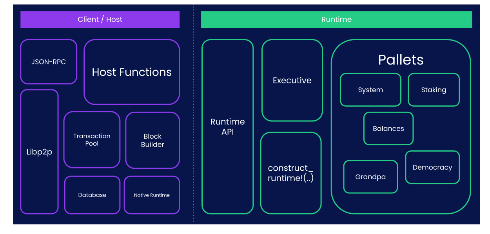

<!-- .slide: data-background-image="../../assets/img/0-Shared/bg/PBA_Background.png" data-background-size="cover" -->

# Introduction to FRAME

---

## What is FRAME?

FRAME is a Rust framework for more easily building Substrate runtimes.

---

## Explaining FRAME Concisely

<pba-flex center>

- Writing the Sudo Pallet:
- Without FRAME: up to 4021 lines of code.
- With FRAME: 365 lines of code.
- ~11x Smaller.

</pba-flex>

Notes:
Without FRAME number is based on expanded FRAME-based code.
A fair comparison would be a frameless sudo pallet that might be shorter (but potentially less featureful).

---

## Goals of FRAME

- Make it easy and concise for developers to build runtimes.
- Provide maximum flexibility and compatibility for pallet developers.
- Provide maximum modularity for runtime developers.
- Be as similar to vanilla Rust as possible.

---

## Building Blocks of FRAME

- FRAME Development
  - Pallets
  - Macros
- FRAME Coordination
  - FRAME System
  - FRAME Executive
  - Construct Runtime

---

## Pallets

FRAME takes the opinion that the blockchain runtime should be composed of individual modules. We call these Pallets.



---

## Building Blocks of Pallets

Pallets are composed of multiple parts common for runtime development:

- Dispatchable extrinsics
- Storage items
- Hooks for:
  - Block initialization,
  - Finalizing block (_!= block finality i.e. GRANDPA_)

---

## More Building Blocks of Pallets

And some less important ones:

- Events
- Errors
- Custom validation/communication with tx-pool
- Offchain workers
- A lot more! But you will learn about them later.

---

### "Shell" Pallet

```rust
#[frame_support::pallet]
pub mod pallet {
  #[pallet::pallet]
  pub struct Pallet<T>(_);

  #[pallet::config]
  pub trait Config: frame_system::Config { ... }

  #[pallet::event]
  pub enum Event { .. }

  #[pallet::error]
  pub enum Error { .. }

  #[pallet::storage]
  // snip

  #[pallet::call]
  impl Pallet { .. }
}
```

---

## FRAME Macros

Rust allows you to write Macros, which is code that generates code.

FRAME uses Macros to simplify the development of Pallets, while keeping all of the benefits of using Rust.

We will look more closely at each attribute throughout this module.

---

## See For Yourself

- `wc -l` will show the number of lines of a file.
- `cargo expand` will expand the macros to "pure" Rust.

```sh
➜  polkadot-sdk git:(master) ✗ wc -l substrate/frame/sudo/src/lib.rs
    365 substrate/frame/sudo/src/lib.rs

➜  polkadot-sdk git:(master) ✗ cargo expand -p pallet-sudo > sudo.rs; wc -l sudo.rs
    4021 sudo.rs
```

---

## FRAME System

The FRAME System is a Pallet which is assumed to always exist when using FRAME. You can see that in the `Config` of every Pallet:

```rust
#[pallet::config]
pub trait Config: frame_system::Config { ... }
```

---

## FRAME System

It contains all the most basic functions and types needed for a blockchain system, and many low-level extrinsics to manage your chain directly.

<div class="flex-container">
<div class="left-small">

- Block Number
- Accounts
- Hash
- etc...

</div>
<div class="right text-small">

- `BlockNumberFor<T>`
- `frame_system::Pallet::<T>::block_number()`
- `T::AccountId`
- `T::Hash`
- `T::Hashing::hash(&bytes)`

</div>
</div>

---

## FRAME Executive

The FRAME Executive is a "coordinator", defining the order that your FRAME-based runtime executes.

```rust
/// Actually execute all transitions for `block`.
pub fn execute_block(block: Block::LazyBlock) { ... }
```

- Initialize Block
  - `on_runtime_upgrade` and `on_initialize` hooks
- Initial Checks
- Apply Inherents
- `on_poll`
- Apply Transactions
- `on_idle`
- `on_finalize`
- Final Checks

---

## Construct Runtime

Your final runtime is composed of Pallets, which are brought together with the `#[frame_support::runtime]` macro.

<div class="flex-container text-small">

```rust
#[frame_support::runtime]
mod runtime {
  /// The main runtime type.
  #[runtime::runtime]
  #[runtime::derive(RuntimeCall, RuntimeEvent, RuntimeError, RuntimeOrigin, /* snip */)]
  pub struct Runtime;

  #[runtime::pallet_index(0)]
  pub type System = frame_system;
  #[runtime::pallet_index(1)]
  pub type Timestamp = pallet_timestamp;
  #[runtime::pallet_index(2)]
  pub type Balances = pallet_balances;
  #[runtime::pallet_index(3)]
  pub type TransactionPayment = pallet_transaction_payment;
  #[runtime::pallet_index(4)]
  pub type Sudo = pallet_sudo;
}
```

</div>

---

## Pallet Configuration

Before you can add a Pallet to the final runtime, it needs to be configured as defined in the `Config`.

<div class="flex-container text-small">
<div class="left" style="max-width: 50%;">

In the Pallet:

```rust
/// The timestamp pallet configuration trait.
#[pallet::config]
pub trait Config: frame_system::Config {
  #[pallet::no_default_bounds]
  type Moment: Parameter + Default + AtLeast32Bit + Scale<BlockNumberFor<Self>, Output = Self::Moment> + Copy + MaxEncodedLen + scale_info::StaticTypeInfo;
  type OnTimestampSet: OnTimestampSet<Self::Moment>;
  #[pallet::constant]
  type MinimumPeriod: Get<Self::Moment>;
  type WeightInfo: WeightInfo;
}
```

</div>

<div class="right" style="max-width: 50%; padding-left: 10px;">

In the Runtime:

```rust
impl pallet_timestamp::Config for Runtime {
  type Moment = u64;
  type OnTimestampSet = Aura;
  type MinimumPeriod = ConstU64<{ SLOT_DURATION / 2 }>;
  type WeightInfo = ();
}
```

</div>
</div>

---

## Pallet vs. Smart Contract

Both let you deploy logic on Polkadot. Which should you build?

- **Smart Contract**: application logic deployed _on top of_ an existing runtime.
- **Pallet**: application logic compiled _into_ the runtime itself.

Notes:
A common question for new builders: should I write a pallet, or deploy a smart contract?
The short answer: start with a contract. Only reach for a pallet when you hit the ceiling.

---

## Start With a Smart Contract

Default to a smart contract unless you have a reason not to.

- **Faster to deploy**: no governance, no runtime upgrade, no new chain.
- **Faster to iterate**: redeploy in minutes; MVPs are cheap.
- **Lower blast radius**: a buggy contract does not brick a chain.
- **Reuses an existing chain's security, accounts, and users.**

Notes:
Writing a pallet is a commitment.
It requires a runtime upgrade (or your own chain), benchmarking, governance, and careful audit — a broken pallet can halt block production.
A smart contract can ship today, get real users, and prove the idea is worth the engineering investment a pallet demands.

---

## When to Reach for a Pallet

Move to a pallet when a contract genuinely _cannot_ do the job:

- You need **runtime hooks**: `on_initialize`, `on_finalize`, `on_idle`, offchain workers.
- You need **custom transaction extensions** or fee logic (e.g. fee-less calls).
- You need **deep integration**: custom origins, governance, staking, XCM.
- You need **predictable, benchmarked weights** instead of metered gas.
- Contract overhead is your actual bottleneck — not a theoretical one.

Notes:
"I might need this someday" is not a reason. Measure first.
A pallet is the right answer when you have evidence a contract can't meet a concrete requirement.

---

## Smart Contract vs. Pallet

<div class="text-small">

|                 | Smart Contract             | Pallet                            |
| --------------- | -------------------------- | --------------------------------- |
| Deployment      | Transaction on any chain   | Runtime upgrade (or new chain)    |
| Iteration       | Redeploy freely            | Governance + migration            |
| Execution cost  | Metered gas (dynamic)      | Pre-dispatch weight (benchmarked) |
| Upgradability   | Immutable (proxy patterns) | Forkless runtime upgrade          |
| Blast radius    | One contract               | Entire chain                      |
| Low-level hooks | No                         | Yes                               |
| Best for        | MVPs, apps, DeFi logic     | Core protocol, deep integration   |

</div>

---

## Scaling a Successful Contract

If your contract outgrows shared blockspace, you have options:

1. **Migrate hot paths into a pallet** on an existing parachain.
2. **Launch your own chain** — on-demand coretime, then a dedicated parachain.
3. **With JAM**: run your app as a service directly on Polkadot — continuations let long-running computation span blocks without launching your own chain.

Notes:
The classic Polkadot scaling story was "contract → pallet → parachain".
JAM adds a new option: services with continuations let programs save state and resume across blocks, so the contract itself can scale without ever launching a dedicated blockchain.
The lesson: don't pre-optimize by starting with a pallet. Start small, measure, and upgrade only the parts that actually need it.

---

## Summary

- **FRAME**: A Rust framework that simplifies Substrate runtime development.
- **Goals**: Improve modularity, flexibility & developer ergonomics while maintaining safety.
- Core components:
  - **Pallets**: Modular runtime components with storage, extrinsics, events, errors, and hooks.
  - **FRAME System**: Foundational pallet providing basic blockchain types and functions.
  - **FRAME Executive**: Coordinates runtime execution (initialization, checks, extrinsic processing).
  - **Construct Runtime**: Combines pallets into a complete runtime
- **Development approach**: Uses Rust macros to generate boilerplate code while keeping the developer interface clean.
