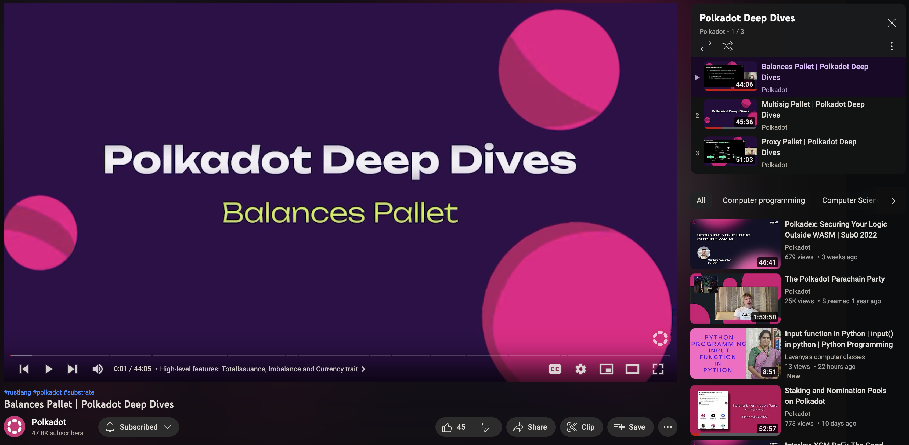

<!-- .slide: data-background-image="../../assets/img/0-Shared/bg/PBA_Background.png" data-background-size="cover" -->

# FRAME Pallets & Traits

---

## Overview

We will walk through the codebase and touch on various commonly used pallets and traits.

The goal is to learn by example, and show how you can use the Substrate codebase to self-educate and solve problems.

---

## System Pallet

---

## Utility Pallet

---

## Proxy Pallet

---

## Multisig Pallet

---

## Held vs Frozen Balance

- Reserved -> Held
- Locked -> Frozen
- Both states belong to the user... but cannot be spent / transferred.
- Held balances stack on top of one another.
  - Useful for user deposits, or other use cases where there are sybil concerns.
  - Ex: Deposit for storing data on-chain.
- Frozen balances can overlap each other.
  - Useful when you want to use the same tokens for multiple use cases.
  - Ex: Using the same tokens for both staking and voting in governance.

---

## Held Balances

```text
  Total Balance
┌─────────────────────────────────────────────────────────┐
┌────────────────────────────────┼────────────────────────┐
│┼┼┼┼┼┼┼┼┼┼┼┼┼┼┼┼┼┼┼┼┼┼┼┼┼┼┼┼┼┼┼┼┼                     |ED│
└────────────────────────────────┼────────────────────────┘
   Held Balance                      Transferable Balance

┌───────────┐
│┼┼┼┼┼┼┼┼┼┼┼│  Various Storage Deposits
└───────────┤
            ├──────┐
            │┼┼┼┼┼┼│  Treasury Proposal Deposit
            └──────┤
                   ├──────────┐
                   │┼┼┼┼┼┼┼┼┼┼│  Multisig Deposit
                   └──────────┤
                              ├──┐
                              │┼┼│  Proxy Deposit
                              └──┘
```

---

## New Holds Example

```text
  Total Balance
┌─────────────────────────────────────────────────────────┐
┌────────────────────────────────┼────────────────────────┐
│┼┼┼┼┼┼┼┼┼┼┼┼┼┼┼┼┼┼┼┼┼┼┼┼┼┼┼┼┼┼┼┼┼                     |ED│
└────────────────────────────────┼────────────────────────┘
   Held Balance                      Transferable Balance


                                     ┌────────────────────┐
              New Hold Successful!   │┼┼┼┼┼┼┼┼┼┼┼┼┼┼┼┼┼┼┼┼│
                                     └────────────────────┘

                         ┌────────────────────────────────┐
    New Hold Failed :(   │┼┼┼┼┼┼┼┼┼┼┼┼┼┼┼┼┼┼┼┼┼┼┼┼┼┼┼┼┼┼┼┼│
                         └────────────────────────────────┘
```

---

## Frozen Balances

```text
  Total Balance
┌─────────────────────────────────────────────────────────┐
┌────────────────────────────────┼────────────────────────┐
│XXXXXXXXXXXXXXXXXXXXXXXXXXXXXXXXX                     |ED│
└────────────────────────────────┼────────────────────────┘
   Frozen Balance                    Transferable Balance

┌───────────────────────┐
│XXXXXXXXXXXXXXXXXXXXXXX│  Nomination Pool Min Balance
└───────────────────────┘

┌────────────────────────────────┐
│XXXXXXXXXXXXXXXXXXXXXXXXXXXXXXXX│  Vesting Schedule
└────────────────────────────────┘

┌─────────────────┐
│XXXXXXXXXXXXXXXXX│  Governance Vote Lock
└─────────────────┘
```

---

## New Freeze Example

```text
  Total Balance
┌─────────────────────────────────────────────────┐
┌────────────────────────────────┼────────────────┐
│XXXXXXXXXXXXXXXXXXXXXXXXXXXXXXXXX             |ED│
└────────────────────────────────┼────────────────┘
   Frozen Balance                    Transferable Balance

┌───────────────────────┐
│XXXXXXXXXXXXXXXXXXXXXXX│  New Freeze Successful!
└───────────────────────┘

┌─────────────────────────────────────────────────┐
│XXXXXXXXXXXXXXXXXXXXXXXXXXXXXXXXXXXXXXXXXXXXXXXXX│  New Freeze Successful!
└─────────────────────────────────────────────────┘

┌─────────────────────────────────────────────────────────┐
│XXXXXXXXXXXXXXXXXXXXXXXXXXXXXXXXXXXXXXXXXXXXXXXXXXXXXXXXX│  New Freeze Successful!
└─────────────────────────────────────────────────────────┘
```

---

## Freeze and Hold Overlap

```text
  Total Balance
┌──────────────────────────────────────────────────────────────┐
   Held Balance
┌────────────────────────────────┼─────────────────────────────┐
│┼┼┼┼┼┼┼┼┼┼┼┼┼┼┼┼┼┼┼┼┼┼┼┼┼┼                                | E │
│XXXXXXXXXXXXXXXXXXXXXXXXXXXXXXXXX                         | D │
└────────────────────────────────┼─────────────────────────────┘
   Frozen Balance                    Transferable Balance
```

---

## Balances Pallet & Fungible Traits

---

## Assets Pallet & Fungibles Traits

---

## NFT Pallet & Non-Fungibles Traits

---

## Transaction Payment Pallet

---

## Sudo Pallet

---

## Conviction Voting + Referenda Pallet

(Open Governance)

---

## Ranked Collectives + Whitelist Pallet

(Technical Fellowship)

---

## Scheduler Pallet

---

## Polkadot Deep Dives



https://www.youtube.com/watch?v=_FwqB4FwWXk&list=PLOyWqupZ-WGsfnlpkk0KWX3uS4yg6ZztG

---

<!-- .slide: data-background-color="#000000" -->

# Questions
