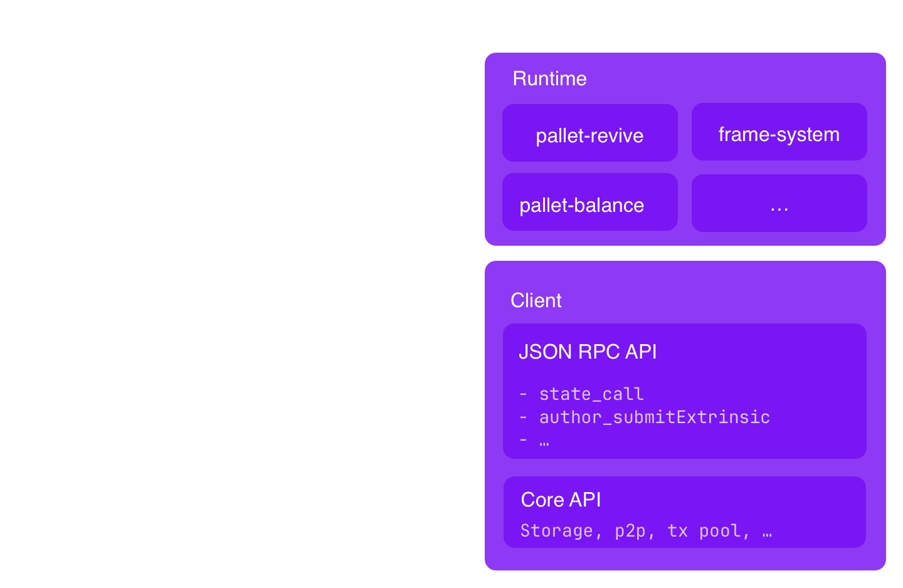
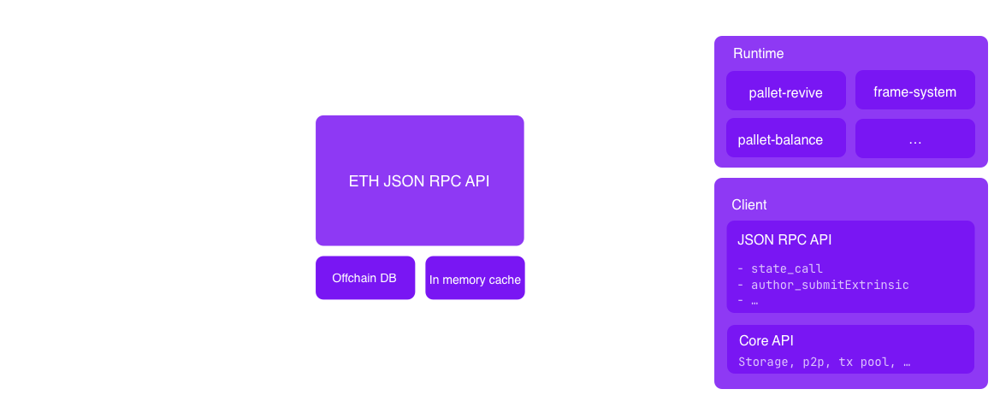
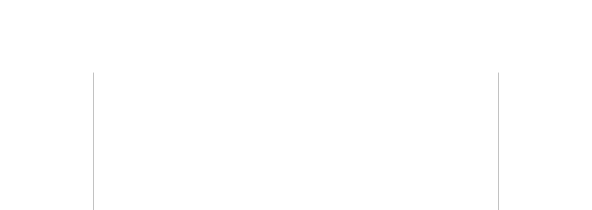

# pallet-revive architecture

Notes:

In this lecture we will cover the architecture of pallet-revive,
We will look at how the module works inside the substrate chain, as well as the EVM compatibility layer, that we built on top of it.

---

## Architecture overview



Notes:
Before we dive int the details of how our pallet works, let's step back and look at the overall architecture of a substrate node

A node is essentially composed of 2 parts. The client and the runtime.

The runtime defines the business logic of our chain, it is compiled to WASM and it's code is stored on chain and can
get upgraded via runtime upgrade. The runtime is where we find our smart contracts module among other useful pallets.

The client is the Rust program that runs natively on your computer and handle all the general purpose blockchain administration tasks:
communicating on the p2p network, answering JSON-RPC requests, ordering, prioritizing and validating the transaction pool and managing the database

---

## ETH-RPC compatibility layer



Notes:
To enable Ethereum compatibility, we need to speak the language of Ethereum.
This means implementing the Ethereum JSON-RPC API, which is the standard interface used by all Ethereum clients to interact with the chain.

To achieve this, we built a proxy server that sits between the Ethereum client and the Substrate node.
The proxy connects to the Substrate node via its JSON-RPC interface, subscribes to new blocks, and relays queries.

Additionally, it:

- Caches recent blocks to improve response time.
- Maintains a lightweight database with indexes to track mappings between Ethereum transactions and their corresponding Substrate transactions.

There have been multiple efforts to bring EVM compatibility to Substrate.

- Frontier integrates the Ethereum API directly inside the Substrate node.
- Our approach decouples the Eth API by building it as a separate proxy layer, independent of the node.

This present a few benefits:

- We can use the Omninode or any Substrate node implementation, if a Node operator decide to use a different Node
  implementation they can do so as this approach require no modification to the Node.
- We can iterate quickly on the compatibility layer, without having to wait for the Node to be updated.

---

## EVM flow


Notes:

Now, let’s examine the flow of a transaction from an Ethereum client to the Substrate node.

- A user signs and submits a transaction from an Ethereum wallet like MetaMask.
- The proxy layer intercepts the transaction and wraps it into a pallet-revive runtime call, specifically an eth_transact call.
  Different types of transactions in Substrate:
  - Inherents – Unsigned transactions included by the block author.
  - Signed and unsigned transactions – Regular transactions submitted by users.

In our case, we submit the Ethereum transaction as an unsigned transaction.

- We define a custom implementation of the Checkable trait in Substrate, that recover the signer of the transaction
  from the payload, and create a regular pallet_revive extrinsic out of it, with a signed origin and either an
  instantiate_with_code or a call dispatch call

---

# pallet-revive

Notes:

- pallet-revive is the runtime module, that handle smart contracts transactions, and manage the storage used by these contracts.

---

## pallet-revive Config

```rust[0|78-92|109-131]
pub trait Config: frame_system::Config {
  /// The fungible in which fees are paid and contract balances are held.
  type Currency: Inspect<Self::AccountId>
    + Mutate<Self::AccountId>
    + MutateHold<Self::AccountId, Reason = Self::RuntimeHoldReason>;

  /// The overarching event type.
  type RuntimeEvent: From<Event<Self>> + IsType<<Self as frame_system::Config>::RuntimeEvent>;

  /// The overarching call type.
  type RuntimeCall: Parameter
    + Dispatchable<RuntimeOrigin = Self::RuntimeOrigin, PostInfo = PostDispatchInfo>
    + GetDispatchInfo;

  /// Overarching hold reason.
  type RuntimeHoldReason: From<HoldReason>;

  /// Describes the weights of the dispatchables of this module and is also used to
  /// construct a default cost schedule.
  type WeightInfo: WeightInfo;

  /// Used to answer contracts' queries regarding the current weight price. This is **not**
  /// used to calculate the actual fee and is only for informational purposes.
  type WeightPrice: Convert<Weight, BalanceOf<Self>>;

  /// The time implementation used to supply timestamps to contracts through `seal_now`.
  type Time: Time;

  /// Find the author of the current block.
  type FindAuthor: FindAuthor<Self::AccountId>;

  /// Type that allows the runtime authors to add new host functions for a contract to call.
  ///
  /// Pass in a tuple of types that implement [`precompiles::Precompile`].
  type Precompiles: precompiles::Precompiles<Self>;


  /// The amount of balance a caller has to pay for each byte of storage.
  ///
  /// # Note
  ///
  /// It is safe to change this value on a live chain as all refunds are pro rata.
  #[pallet::constant]
  #[pallet::no_default_bounds]
  type DepositPerByte: Get<BalanceOf<Self>>;

  /// The amount of balance a caller has to pay for each storage item.
  ///
  /// # Note
  ///
  /// It is safe to change this value on a live chain as all refunds are pro rata.
  #[pallet::constant]
  #[pallet::no_default_bounds]
  type DepositPerItem: Get<BalanceOf<Self>>;

  /// The percentage of the storage deposit that should be held for using a code hash.
  /// Instantiating a contract, protects the code from being removed. In order to prevent
  /// abuse these actions are protected with a percentage of the code deposit.
  #[pallet::constant]
  type CodeHashLockupDepositPercent: Get<Perbill>;

  /// Make contract callable functions marked as `#[unstable]` available.
  ///
  /// Contracts that use `#[unstable]` functions won't be able to be uploaded unless
  /// this is set to `true`. This is only meant for testnets and dev nodes in order to
  /// experiment with new features.
  ///
  /// # Warning
  ///
  /// Do **not** set to `true` on productions chains.
  #[pallet::constant]
  type UnsafeUnstableInterface: Get<bool>;

  /// Origin allowed to upload code.
  ///
  /// By default, it is safe to set this to `EnsureSigned`, allowing anyone to upload contract
  /// code.
  #[pallet::no_default_bounds]
  type UploadOrigin: EnsureOrigin<Self::RuntimeOrigin, Success = Self::AccountId>;

  /// Origin allowed to instantiate code.
  ///
  /// # Note
  ///
  /// This is not enforced when a contract instantiates another contract. The
  /// [`Self::UploadOrigin`] should make sure that no code is deployed that does unwanted
  /// instantiations.
  ///
  /// By default, it is safe to set this to `EnsureSigned`, allowing anyone to instantiate
  /// contract code.
  #[pallet::no_default_bounds]
  type InstantiateOrigin: EnsureOrigin<Self::RuntimeOrigin, Success = Self::AccountId>;

  /// The amount of memory in bytes that parachain nodes allocate to the runtime.
  ///
  /// This is used in [`Pallet::integrity_test`] to make sure that the runtime has enough
  /// memory to support this pallet if set to the correct value.
  type RuntimeMemory: Get<u32>;

  /// The amount of memory in bytes that relay chain validators allocate to the PoV.
  ///
  /// This is used in [`Pallet::integrity_test`] to make sure that the runtime has enough
  /// memory to support this pallet if set to the correct value.
  ///
  /// This value is usually higher than [`Self::RuntimeMemory`] to account for the fact
  /// that validators have to hold all storage items in PvF memory.
  type PVFMemory: Get<u32>;

  /// The [EIP-155](https://eips.ethereum.org/EIPS/eip-155) chain ID.
  ///
  /// This is a unique identifier assigned to each blockchain network,
  /// preventing replay attacks.
  #[pallet::constant]
  type ChainId: Get<u64>;

  #[pallet::no_default]
  type AddressMapper: AddressMapper<Self>;

  /// The ratio between the decimal representation of the native token and the ETH token.
  #[pallet::constant]
  type NativeToEthRatio: Get<u32>;

  /// Allow EVM bytecode to be uploaded and instantiated.
  #[pallet::constant]
  type AllowEVMBytecode: Get<bool>;

  /// Encode and decode Ethereum gas values.
  /// Only valid value is `()`. See [`GasEncoder`].
  #[pallet::no_default_bounds]
  type EthGasEncoder: GasEncoder<BalanceOf<Self>>;
}
```

Notes:

Let's take a quick peek at the config of pallet-revive.
We won't go in depth on all types defined in the config, but let's look at a few interesting ones

- As for any pallet, we depends on types from the runtime, like the `Time` type, the `Currency` type, the `FindAuthor` type, etc.
- Then we have some specific types for pallet-revive
- `DepositPerItem` and `DepositPerByte` are the cost of storing data in the contract storage.
- `CodeHashLockupDepositPercent` is the percentage of the deposit that is deposited when a contract with this hash is
  instantiated.
- `WeightInfo` is the trait that define the weights for all the functions of the pallet.
- `RuntimeMemory` and `PVFMemory` are constants that we use in our integrity tests to make sure that the runtime has enough memory
- UnsafeUnstableInterface is used in development to enable unstable features
- UploadOrigin and InstantiateOrigin allow to constrain who can upload and instantiate a contract
- Finally we have Ethereum specific types, like the `ChainId`, the `AddressMapper`, the `NativeToEthRatio` and the `EthGasEncoder`, to work with Ethereum.

---

## Dispatch functions

```rust[0|3|4-11]
/// Makes a call to an account, optionally transferring some balance.
#[pallet::call_index(1)]
#[pallet::weight(T::WeightInfo::call().saturating_add(*gas_limit))]
pub fn call(
    origin: OriginFor<T>,
    dest: H160,
    value: BalanceOf<T>,
    gas_limit: Weight,
    storage_deposit_limit: BalanceOf<T>,
    data: Vec<u8>,
) -> DispatchResultWithPostInfo { /* ... */  }
```

Notes:
Like any pallet, pallet-revive define a set of dispatch functions, that can be called by the users to submit transactions to the chain.
Usually the weight of a dispatchable is fixed, but in pallet-revive, the weight is dynamic, and depend on the gas limit of the transaction.
Antother interesting fact is that we return `DispatchResultWithPostInfo`, instead of `DispatchResult` to return the excess weight of the transaction.

---v

## Dispatch functions

| pallet call             | Description                                                         |
| ----------------------- | ------------------------------------------------------------------- |
| `upload_code`           | Uploads new code without instantiating a contract from it.          |
| `instantiate`           | Instantiates a contract from a previously deployed binary.          |
| `instantiate_with_code` | Instantiates a new contract from the supplied code.                 |
| `call`                  | Makes a call to an account, optionally transferring some balance.   |
| `map_account`           | Registers the caller's account ID for use in contract interactions. |
| `unmap_account`         | Unregisters the caller's account ID and frees the deposit.          |

---

## pallet-revive & VM


Notes:

The big elephant in the room here, is that we are not using EVM bytecode but Polkavm bytecode.

- The reason behind this choice is that EVM is a stack machine. This means that arguments to functions are passed on a stack.
  PolkaVM is based on RISC-V which is a register machine.
- This means it passes arguments in a finite set of registers.

The main benefit of this is that translating the bytecode into the underlying hardware is much more efficient as those are all register machines.

We chose the number of registers carefully so that they are smaller than in hardhare instruction set such as x86
This allow us to reduce the NP-hard register allocation problem to a simple 1to1 mapping
This is the secret ingredient to PolkaVM's fast compilation times.

We include a PolkaVM interpreter within the runtime itself.
A later update will deliver a full PolkaVM JIT running inside the client.
note that we will still keep the interpreter available so that we can use the most appropriate backend for each workload. For example, for contract invocations
that just execute very little code the interpreter will still be faster as it can start executing code right away (lazy interpretation).

### Reduced Word Size

EVM uses a word size of 256bit. Which means that **every** arithmetic operation has to be performed on those big numbers. This makes any meaningful
number crunching really slow as it has to be translated to a lot of native instructions. PolkaVM uses a word size of 64bit which is natively supported
by the underlying hardware. That said, when translating Solidity contracts via YUL (#Revive) we will still end up with 256bit arithmetic as YUL is too low-level
to automatically convert the integer types. However, it is perfectly possible to write contracts in a different language and call that seamlessly
from Solidity. We imagine a system where business logic is written in Solidity but the underlying architecture in faster languages, akin to Python where
most of the heavy lifting is done by C modules.

Our solution is Ethereum-compatible: You can write your contracts in Solidity and interact with the node
using Ethereum JSON RPC alongside an Ethereum wallet like MetaMask. Under the hood, we recompile the
contracts from YUL (EVM assembly) to RISC-V to run them using [PolkaVM](https://wiki.polkadot.network/docs/learn-jam-chain#polkadot-virtual-machine-pvm) instead of EVM.

---v

## Host & Guest

<pba-cols>
<pba-col>

```rust
// Runtime Host implementation

#[define_env]
pub mod env {
 #[stable]
 #[mutating]
 fn set_storage(
  &mut self,
  memory: &mut M,
  flags: u32,
  key_ptr: u32,
  key_len: u32,
  value_ptr: u32,
  value_len: u32,
 ) -> Result<u32, TrapReason> {
  // implementation
 }
```

</pba-col>
<pba-col center>

```rust
// Contract foreign function definition

#[polkavm_import(abi = self::abi)]
extern "C" {
  pub fn set_storage(
    flags: u32,
    key_ptr: *const u8,
    key_len: u32,
    value_ptr: *const u8,
    value_len: u32,
  ) -> ReturnCode;


```

</pba-col>
</pba-cols>

Notes:

`#[define_env]` defines the list of system calls that the VM can make to the runtime.

- It generates the syscall dispatching logic, handling input and output passing through registers.
- It synchronizes the VM’s gas meter with the runtime’s gas meter, ensuring that execution cost is properly accounted for before and after each system call.

In the same way, to define Rust guest polkavm contracts, we need to define the list of foreign functions that the
contracts can call. They are defined in a dedicated crate `pallet-revive-uapi`.

- it exposes all the foreign functions that a contract can import.
- The #[polkavm_import] macro take care of converting the arguments and return values between the VM and the Rust runtime, by setting the registers A0 to A5

---v

## Activity: Build and deploy a Rust contract

> Build the fibonacci contract using Rust and `pallet-revive-uapi`

Notes:
<https://github.com/paritytech/rust-contract-template>

---

## Precompile

```rust
pub trait Precompile {
 /// Your runtime.
 type T: Config;
 /// The Solidity ABI definition of this pre-compile.
 type Interface: SolInterface;
 /// Defines at which addresses this pre-compile exists.
 const MATCHER: AddressMatcher;
 /// Entry point for your pre-compile
 fn call(
  address: &[u8; 20],
  input: &Self::Interface,
  env: &mut impl Ext<T = Self::T>,
 ) -> Result<Vec<u8>, Error>;
}
```

---v

## Example the ERC20 Asset precompile

```rust[0|1-8|9-19|21-37]
alloy_core::sol!{
  interface IERC20 {
      function transfer(address to, uint256 value) external returns (bool);
      // ..
  }
};

/// An ERC20 precompile.
pub struct ERC20<Runtime>(PhantomData<Runtime>);

impl<Runtime> Precompile for ERC20<Runtime>
  where Runtime: pallet_asset::Config + pallet_revive::Config,
{
  type T = Runtime;
  type Interface = IERC20::IERC20Calls;

  // Match all addresses 0xaaaaaaaa00000000000000000000000000010000
  const MATCHER: AddressMatcher = AddressMatcher::Prefix(0x1);

  fn call(
    address: &[u8; 20],
    input: &Self::Interface,
    env: &mut impl Ext<T = Self::T>,
  ) -> Result<Vec<u8>, Error> {
    // extract the asset_id encoded in the first 4 bytes
    let asset_id = extract_asset_id_from_address(address)?.into();

    // Execute the call using the public function of pallet-asset
    match input {
      IERC20Calls::transfer(call) => Self::transfer(asset_id, call, env),
      IERC20Calls::totalSupply(_) => Self::total_supply(asset_id, env),
      IERC20Calls::balanceOf(call) => Self::balance_of(asset_id, call, env),
      IERC20Calls::allowance(call) => Self::allowance(asset_id, call, env),
      IERC20Calls::approve(call) => Self::approve(asset_id, call, env),
      IERC20Calls::transferFrom(call) => Self::transfer_from(asset_id, call, env),
    }
  }
}
```

---v

## Precompile on Asset Hub

```rust
impl pallet_revive::Config for Runtime {
  // ...
 type Precompiles = (
  ERC20<Self, InlineIdConfig<0x120>, TrustBackedAssetsInstance>,
  ERC20<Self, InlineIdConfig<0x320>, PoolAssetsInstance>,
  XcmPrecompile<Self>,
 );
  // ...
}
```

---v

## USDC ERC20 precompile on Asset Hub

- USDC is defined in `pallet-asset` with id 1337 (0x539)
- Precompile address: `0x0000053900000000000000000000000001200000`

```bash
# Transferring 100 USDC token to $RECIPIENT_ADDRESS
cast send 0x0000053900000000000000000000000001200000 \
  "transfer(address,uint256)" $RECIPIENT_ADDRESS 100000000
```

---

## Design Differences

### Substrate & pallet-revive vs Ethereum

Notes:
In this section we will highlight some of the key differences between Substrate and Ethereum, and how we designed pallet-revive to be as compatible as possible with Ethereum.

---v

## 1. Transaction hashes



- `https://etherscan.io/tx/<tx-hash>`
- `https://polkadot.subscan.io/extrinsic/<block>-<tx-index>`

> ‼️ The transaction hash is a unique identifier on Ethereum not Substrate

---v

## 1. Transaction hashes

| Origin | Nonce | Call                | Results               |
| ------ | ----- | ------------------- | --------------------- |
| A      | 0     | Transfer 5 DOT to B | A reaped              |
| B      | 4     | Transfer 7 DOT to A | A created (nonce = 0) |
| A      | 0     | Transfer 5 DOT to B |                       |

Notes:
Imagine this contrived example with a reaped account. The first and last
transactions are identical, and both valid.
See <https://wiki.polkadot.network/docs/build-protocol-info#unique-identifiers-for-extrinsics>

---v

## 2. Existential Deposit

- Every Ethereum RPC / EVM opcode that returns a balance will subtract the existential deposit.
- When sending balance `x` to a **new account**, we actually send `x + ed`.

Notes:
On Polkadot, an account must hold a minimum balance to exist. When it drops below this minimum amount, the account is deleted.
We call this minimum amount the "existential deposit" (`ed`). It exists to prevent unused accounts from bloating the state. This is not the case on Ethereum, where
accounts are never deleted once created, and there is no minimum balance an account must hold to retain its associated data structures (e.g., nonce) in state.
Since contracts are accounts (more precisely, code that controls an account), they are also affected by this.

This leads to a situation where every account on Polkadot has some portion of its currency that it cannot spend. This may confuse contracts and off-chain
tools (e.g., wallets) written for Ethereum.

Luckily, we can hide this fact from all participants so everything keeps working as expected. It's just something to be aware of:

- Every Ethereum RPC that returns a balance will subtract the existential deposit. This means that all returned balance is actually spendable, just as on Ethereum.
- Every EVM opcode that returns the balance of an account will do the same.
- When sending balance `x` to a new account, we actually send `x + ed`. This ensures that balance transfers of any amount will succeed and the receiver has `x` as available
  balance. The downside is that it might be unexpected for the sender to send more than `x`. To prevent confusion, we add the `ed` to the transaction fee if it needs to
  be paid. This way, the user is always aware of the total cost of a transaction. \* This is also true when a contract sends balance to another contract. In this case, we always take the `ed` from the signer of the transaction and not the sending contract.
  This makes the additional send balance transparent to contracts. This is important since contract code is free to assume that exactly `x` is sent.
  If a call to a contract funds multiple new accounts, this will be reflected in the transaction fee, just like any other deposit made to cover storage costs
  (see `storage_deposit_limit` above).

---v

## 3. Code deployment (Ethereum)

<pba-flex>

- The EVM executes the init code, which:
  - runs the constructor with the passed arguments
  - returns the runtime code, which gets stored on-chain
  - The compiler will modify the contract’s runtime code before it is returned by replacing all references to immutables with the values assigned to them

</pba-flex>

<pba-flex>

```sh
❯ solc Hello.sol --combined-json bin,bin-runtime | jq ".contracts"
```

```json
{
  "Hello.sol:Hello": {
    "bin": "6080604052348015600e575f5ffd5b50603e80601a5f395ff3fe60806040525f5ffdfea26469706673582212208e040e5268feafa994012e9cb5d525195f19af6c7241997e2ea91601f98f10d064736f6c634300081d0033",
    "bin-runtime": "60806040525f5ffdfea26469706673582212208e040e5268feafa994012e9cb5d525195f19af6c7241997e2ea91601f98f10d064736f6c634300081d0033"
  }
}
```

</pba-flex>
<!-- .element: class="fragment" -->

---v

## 3. Code deployment (pallet-revive)

In pallet-revive, the code is uploaded and stored on-chain

- The constructor doesn't return the runtime code.
- The immutable variables are stored in a pallet storage map and read when the contract is called.
- Multiple contracts can be instantiated by referencing the same code hash.

---v

## 3. Code deployment (pallet-revive)

```rust
pub trait Config: frame_system::Config {
  // ...

  /// The percentage of the storage deposit that should be held for using a code hash.
  /// Instantiating a contract, protects the code from being removed. In order to prevent
  /// abuse these actions are protected with a percentage of the code deposit.
  #[pallet::constant]
  type CodeHashLockupDepositPercent: Get<Perbill>;
}
```

</pba-col>
</pba-cols>

---v

## 4. Balance Decimals

- 1 ETH = 1000000000000000000 ($10^{18}$ wei)
- 1 KSM = 1000000000000 ($10^{12}$ planck)
- 1 DOT = 10000000000 ($10^{10}$ planck)

```rust
pub trait Config: frame_system::Config {
    type NativeToEthRatio: Get<u32>;
    // ...
}
```

Notes:
In theory, EVM wallets are configurable, and should let you define the number of decimals you want to use.
In practice, most wallets use 18 decimals, and we have to play nicely with them.
Also everything that is passed by the contract as argument to any opcode is assumed to use 18 decimals.
A transaction that attempt to use a value that can't be translated to a substrate value without a rounding error, will be rejected.
Fixed by <https://github.com/paritytech/polkadot-sdk/pull/9101>

---v

## 5. Address mapping

- Most Substrate chain, including Asset Hub, use a 32 byte (AccountId32) address usually encoded in SS58 format.
- EVM uses a 20 byte address (H160), usually encoded in hex format.

```rust
use sp_core::{crypto::AccountId32, H160};

fn main() {
    println!("Substrate: {}", AccountId32::new([1u8; 32]));
    // Substrate: 5C62Ck4UrFPiBtoCmeSrgF7x9yv9mn38446dhCpsi2mLHiFT

    println!("EVM: {:?}", H160([1u8; 20]));
    // EVM: 0x0101010101010101010101010101010101010101
}
```

Note:
Substrate uses 32 bytes address, while EVM uses 20 bytes address.
Everything that is executed in the VM expect a 20 bytes address, we need to map the 32 bytes address to a 20 bytes address.

---v

## 5. Address mapping

```rust[0|4-9|16-20|11-12]

#[frame_support::pallet]
pub mod pallet {
  pub trait Config: frame_system::Config {
    #[pallet::no_default]
    type AddressMapper: AddressMapper<Self>;
    // ...
  }

  #[pallet::storage]
  type OriginalAccount<T: Config> = StorageMap<_, Identity, H160, AccountId32>;
  // ...
}

pub trait AddressMapper<T: Config> {
 fn to_address(account_id: &T::AccountId) -> H160;
 fn to_account_id(address: &H160) -> T::AccountId;
 fn map(account_id: &T::AccountId) -> DispatchResult;
  // ...
}
```

---v

## 5. Address mapping

```rust[1-10| 12-21 | 14-18,23-27]
// H160 -> AccountId32 -> H160

//  alice_eth: 0x0101010101010101010101010101010101010101
let alice_eth = H160([1u8; 20]);

// alice_sub: 0101010101010101010101010101010101010101eeeeeeeeeeeeeeeeeeeeeeee (5C62Ck4U...)
let alice_sub = <Runtime as Config>::AddressMapper::to_account_id(&alice_eth);

// 👍 Convert back
assert_eq!(alice_eth, <Runtime as Config>::AddressMapper::to_address(&alice_sub));

// AccountId32 -> H160 -> AccountId32

// bob_sub: 0202020202020202020202020202020202020202020202020202020202020202 (5C7LYpP2 ...)
let bob_sub = AccountId32::from([2u8; 32]);

//  bob_eth: 0xaf32a8053c2d446446d7019359e210b82e53b8ba
let bob_eth = <Runtime as Config>::AddressMapper::to_address(&bob_sub);

// ❗ Original substrate accounts need a stateful mapping
assert_ne!(bob_sub, <Runtime as Config>::AddressMapper::to_account_id(&bob_eth));

// Map the account (this is a stateful operation)
<Runtime as Config>::AddressMapper::map(&bob_sub).unwrap();

// 👍 Convert back
assert_eq!(bob_sub, <Runtime as Config>::AddressMapper::to_account_id(&bob_eth));
```

---v

## 6. Gas Model

**Ethereum**

- 📜 Gas costs are defined in the yellow paper and EIPs
- 📈 Quadratic memory expansion cost

**Polkadot**

- 📏 Gas cost are measured in benchmarks, and updated frequently
- 📊 Fixed memory expansion cost, with hard limits

Note:

In Ethereum the gas costs are defined in the yellow paper and EIPs, they are not updated frequently, and each change require a hard fork.
In pallet-revive, the gas costs are measured in benchmarks, they reflect the actual performance of the reference hardware. These benchmark are run and updated every time we make a new runtime.

Finally, to avoid an OOM attack, Ethereum uses a quadratic memory expansion cost. This is calculated so limit the
maximum amount of memory that can be allocated in a transaction given the block gas limit. This means that they are
overchariing for memory to make sure the memory consumption is bounded.

In pallet-revive, we have a fixed memory expansion cost, with hard limits. This is a more realistic model. The downside
is that these limits can be too constraining, but this is something that we will adjust over time.

---v

### Current limits

| Limit                                      | Maximum           |
| ------------------------------------------ | ----------------- |
| Call stack depth                           | 25                |
| Event topics                               | 4                 |
| Event data payload size (including topics) | 416 bytes         |
| Storage value size                         | 416 bytes         |
| Transient storage variables                | 128 `uint` values |
| Immutable variables                        | 16 `uint` values  |
| Contract code blob size                    | 1MiB              |

Notes:

Limits might be increased in the future. To guarantee existing contracts working as expected we will _never decrease_ the limits.

---v

## 7. Gas mapping

- **Different resource types**

  - Weight = measure of block space
  - Storage deposit = measure of disk space

- **Fee accuracy**
  - Gas estimation × gas price = accurate fee

Notes:

What makes gas mapping particularly challenging is the intersection of these two problems:

**Fee Accuracy**: The gas returned from gas estimation, when multiplied with the current gas price, needs to be an accurate fee. This means even though gas is a u256, we can't just naively encode our much smaller resources into different parts of that integer. The fee displayed in the wallet wouldn't make sense to users.

**Resource Type Mismatch**: Weight is a measure of block space consumption, but storage deposit is a measure of disk space usage. Conflating the two (charging storage consumption from block space) as done by Ethereum and also Frontier is highly problematic. Block space prices vary with chain utilization - an attacker could consume a lot of disk space during low congestion periods, paying almost nothing, forcing the chain to store that state forever.

This creates a complex engineering challenge in maintaining Ethereum compatibility while preserving Polkadot's more sophisticated resource accounting model.

---v

## 7. Gas mapping

- Current solution: Encode Weight + Storage deposit into the least significant bytes of the Eth gas

- Upcoming solution: Map Weight Gas by using a ratio

Notes:

Currently, we are mapping Weight + Storage deposit into the least significant bytes of the Eth gas with low precision. While the higher bytes are chosen in a way that gas \* gas_price displays an accurate estimated fee. This works because the low bytes don't influence the displayed price significantly.

This is the design chosen by Acala. It has one flaw: It can break apart when wallets fiddle with the returned gas estimation as the mapping is not linear. We expected that this could happen but thought it should be okay since it worked by Acala. And it is by far the easiest solution to implement. But as it turned out: It is a massive problem as most Dapps and wallets add some security margin to the estimated gas

Solution:

Gas is a Substrate Balance
The general idea is that the gas estimation returned is in “fee space”. Meaning it is a substrate Balance rather than a Weight. This allows us to simply add the storage deposit which is already a balance.

Map Weight Gas by using a ratio
The idea is that we just assume that ref_time and proof_size are consumed at a fixed ratio. Meaning that for each gas supplied we allow alpha _ gas amount of ref_time and beta _ gas amount of proof_size. No matter what the original values were. We also don’t pick a custom ratio but rely on the ratio already defined in the pallet_tx_payment config (WeightToFee).

---

# Questions?
