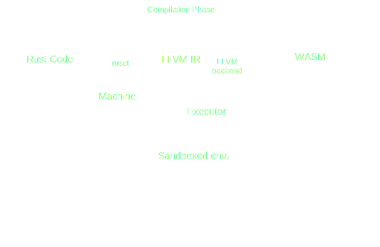

# Platform Agnostic Bytecode

---

## Definition

A PAB is a bytecode that follows two main principles: 

- Turing Completness, as a standard bytecode would respect 

<!-- .element: class="fragment" data-fragment-index="1" -->

- Support for tooling that makes it executable on every machine 

<!-- .element: class="fragment" data-fragment-index="2" -->

---

## Bytecodes

<pba-cols>
<pba-col left>

<pba-flex center>

###### High Level Languages


</pba-flex>
</pba-col>
<!-- .element: class="fragment" data-fragment-index="1" -->

<pba-col center>
<pba-flex center>

###### PABs


</pba-flex>
</pba-col>
<!-- .element: class="fragment" data-fragment-index="2" -->

<pba-col right>
<pba-flex center>

###### Architecture's bytecode


</pba-flex>
</pba-col>
<!-- .element: class="fragment" data-fragment-index="3" -->

</pba-cols>

---

<div class="r-stack">

<!-- .element: class="fragment" data-fragment-index="0" -->

<!-- .element: class="fragment" data-fragment-index="1" -->

<!-- .element: class="fragment" data-fragment-index="2" -->

<!-- .element: class="fragment" data-fragment-index="3" -->
</div>

---

#### What a PAB allows is:

<pba-flex center>

- Portability
<!-- .element: class="fragment" data-fragment-index="1" -->
    - Block Hardware Centralization
<!-- .element: class="fragment" data-fragment-index="3" -->
- Determinism
<!-- .element: class="fragment" data-fragment-index="2" -->
    - Make consensus possible
<!-- .element: class="fragment" data-fragment-index="4" -->

</pba-flex>

---v


##### That's why PABs are so important

---

## PABs Rating
Features that a PAB should follow:

- Hardware Independence
<!-- .element: class="fragment" data-fragment-index="1" -->
- Efficency
<!-- .element: class="fragment" data-fragment-index="2" -->
- Tool Simlicity
<!-- .element: class="fragment" data-fragment-index="3" -->
- Support as Compilation Target
<!-- .element: class="fragment" data-fragment-index="4" -->
- Sandboxing
<!-- .element: class="fragment" data-fragment-index="5" -->

---v

### Sanboxing?

A sandbox environment is where potentially unsafe software code can be executed without affecting the security of the machine in which is executed.
<!-- .element: class="fragment" data-fragment-index="1" -->

A sandboxed environment must be created by the executor of the PAB.
<!-- .element: class="fragment" data-fragment-index="2" -->

</br>

A SmartContract is *Arbitrary Code* that should be executed by multiple nodes, we don't want SmartContracts capable of destroying the nodes on which they are executed 
<!-- .element: class="fragment" data-fragment-index="3" -->

---

<!-- .slide: data-background-color="#4A2439" -->


---

<pba-cols>
<pba-col center>

# WebAssembly 
<!-- .element: class="fragment" data-fragment-index="1" -->

</pba-col>
<pba-col center>


</pba-col>
</pba-cols>

---

## Wasm's keypoins

<pba-flex center>

- Binary instruction format for a stack-based virtual machine
<!-- .element: class="fragment" data-fragment-index="1" -->
- Supported as compilation target by many languages
<!-- .element: class="fragment" data-fragment-index="2" -->
  - Rust, C, C++ and many others
<!-- .element: class="fragment" data-fragment-index="3" -->
- Fast (with near-native performance)
<!-- .element: class="fragment" data-fragment-index="4" -->
- Safe (executed in a sandoxed environment)
<!-- .element: class="fragment" data-fragment-index="5" -->
- Hardware-independent
<!-- .element: class="fragment" data-fragment-index="6" -->
- Open
<!-- .element: class="fragment" data-fragment-index="7" -->

</pba-flex>


---
## Stack-Based Virtual Machine Example

<pba-cols>
<pba-col center>

Adding two number in wasm text representation (.wat)
<!-- .element: class="fragment fade-out" data-fragment-index="1" -->

``` wasm [1-12|5|6|8]
(module
  (import "console" "log" (func $log (param i32)))
  (func $main
    ;; load `10` and `3` onto the stack
    i32.const 10
    i32.const 3

    i32.add ;; add up both numbers
    call $log ;; log the result
  )
  (start $main)
)
```
<!-- .element: class="fragment" data-fragment-index="0" -->

</pba-col>
<pba-col center>

<div class="r-stack">

<!-- .element: class="fragment" data-fragment-index="1" -->

<!-- .element: class="fragment" data-fragment-index="2" -->

<!-- .element: class="fragment" data-fragment-index="3" -->

<!-- .element: class="fragment" data-fragment-index="4" -->

<!-- .element: class="fragment" data-fragment-index="5" -->

<!-- .element: class="fragment" data-fragment-index="6" -->
</div>

</pba-col>
</pba-cols>

Notes:

Wasm has also a text representation,
Wat has some features that allow for better readability:
- Stack push operations can be grouped to its consuming instruction.
- Labels can be applied to elements.
- Blocks can enclosed with parenthesis instead of explicit start/end instructions.

Instructions push results to the stack and use values on the stack as arguments.
Register machines use registers for passing values to instructions as a primary mechanism

---

## Wasm seems to be a perfect PAB, but

- How works the communication with the environemt?
<!-- .element: class="fragment" data-fragment-index="1" -->
- How is it sandboxed?
<!-- .element: class="fragment" data-fragment-index="2" -->
- How can we compile to WASM? (maybe not needed)
<!-- .element: class="fragment" data-fragment-index="3" -->
- How is it executed on-chain?
<!-- .element: class="fragment" data-fragment-index="4" -->

Notes:

To demonstrate why Wasm is (almost) a perfect PAB and why Polkadot decide to use will be explained how:

---

## Communication with the Environemnt

Let's call **Embedder** the program that will take the wasm blob as input and execute it
<!-- .element: class="fragment" data-fragment-index="0" -->

- the embedder may want to be able to pass arguments as input to functions defined in the wasm blob
  - (embedder -> wasm)

<!-- .element: class="fragment" data-fragment-index="1" -->

- the execution could depend on external factor 
  - (wasm -> embedder)

<!-- .element: class="fragment" data-fragment-index="2" -->


---v

### Problem

**Wasm has no ambient access to the computing environment in which code is executed**
<!-- .element: class="fragment" data-fragment-index="0" -->

### Solution
<!-- .element: class="fragment" data-fragment-index="1" -->

- Every interaction can be done by only a set of functions provided by the embedder and imported in wasm
<!-- .element: class="fragment" data-fragment-index="2" -->
  - Called: **Host Functions**
<!-- .element: class="fragment" data-fragment-index="2" -->
- The embedder is able to call only the functions provided by the wasm blob
<!-- .element: class="fragment" data-fragment-index="3" -->
  - Called: **Runtime API**, later in the course you will understand why they are called by that 
<!-- .element: class="fragment" data-fragment-index="3" -->

How data are passed between two worlds is managed by something called FFI  ????
<!-- .element: class="fragment" data-fragment-index="5" -->

---

## Sanboxing

In addition to the stack Wasm has also access to memory provided by the embedder, this memory is called **Liner Memory**.
<!-- .element: class="fragment" data-fragment-index="0" -->

</br>

- This area will be used also used as a frontier for data sharing
- To make everything secure the Embedder is doing incredibly convoluted things (resources linked)

<!-- .element: class="fragment" data-fragment-index="1" -->

Notes: 

From Wasm the Linear Memory is byte addressable
Linear Memory can be manipulated using functions called 'store' and 'load'

The Rust compiler uses for dynamic/heap memory and to pass non primitives to functions by emulating an additional stack within the linear memory it allocates at some offset.
- This emulated stack is what we would understand as stack in other architectures.
- The Wasm stack on the other would be implemented using registers in other architectures.

---

## How WASM is executed on-chain

There are multiple ways to execute wasm, the ones used in polkadot are:

- Ahead Of Time Compilation (not sure if substrate-based chain uses JIT or AOT)
- Interpretation

<!-- .element: class="fragment" data-fragment-index="0" -->

But also other type of execution exists, for example:
<!-- .element: class="fragment" data-fragment-index="1" -->
- Just in Time Compilation
- Single Pass Compilation
- Stream Compilation

<!-- .element: class="fragment" data-fragment-index="1" -->

---v

### Wasmtime

- It is a stand alone wasm environment
- Used in substrate as embedder for the blockchain logic
- It compiles once the wasm blob 
- It executes the compiled wasm blob in sanboxed environment while keeping everything extremely secure

---v

### Wasmi

- It also is a wasm environment
- Used as embedder for SmartContracts (wich in turn is embedded in Wasmtime)
- It interpret the wasm blob and execute it securly 
- The Interpreter itself can be built in wasm itself

Due to it's characteristics it is mainly used to execute SmartContracts on chain

---v

There are also light clients, where both Runtime and Client are implemented in wasm, so we have:
<!-- .element: class="fragment" data-fragment-index="0" -->

- A browser as embedder of the node's client
  - the node's client as embedder for the node's runtime
    - the node's runtime as embedder for the SmartContract

<!-- .element: class="fragment" data-fragment-index="1" -->


<!-- .element: class="fragment" data-fragment-index="2" -->

We have a double recursion of a PAB that embed itself
<!-- .element: class="fragment" data-fragment-index="2" -->

---

# Alternatives

---v

## EVM

- The **Ethereum Virtual Machine** executes a stack machine
  - Interesting: here the bytecode was create to be executed in a blockchain, so instructions are not hardware-dependent but there are instruction tightly realated to Cryptography and others blockchain field 
- There is a transient linear memory for each contract (?)

---v

## CosmWasm

- Wasm is always uesed but the used different tools
- They use CosmWasm as Embedder and internally is used Wasmer, a Single Pass Compiler

---v

## Solana eBPF

- eBPF is used as PAB, but intrinsecaly eBPF has a lot of restrictions
- Solana forked the eBPF backend of LLVM to makes every program to be compiled in eBPF
- The Embedder is rbpf, a virtual machine for eBPF programs

Notes:
https://forum.polkadot.network/t/ebpf-contracts-hackathon/1084

---v

## RISC-V ?!

- RISC-V is a new instruction-set architecture
- main goals are: 
  - real ISA suitable for direct native hardware implementation
  - avoids “over-architecting”
  
</br>

Being so simple and "Hardware-Indendent" there are wip projects to test if it is suitable to become the new polkadot smart contract language
  
Notes: 
resources: polkadot blogpost - polkavm + risc-v specs

---

All refereces can be found in the speaker notes

---

<!-- .slide: data-background-color="#4A2439" -->


---
