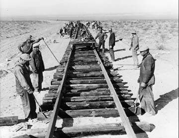
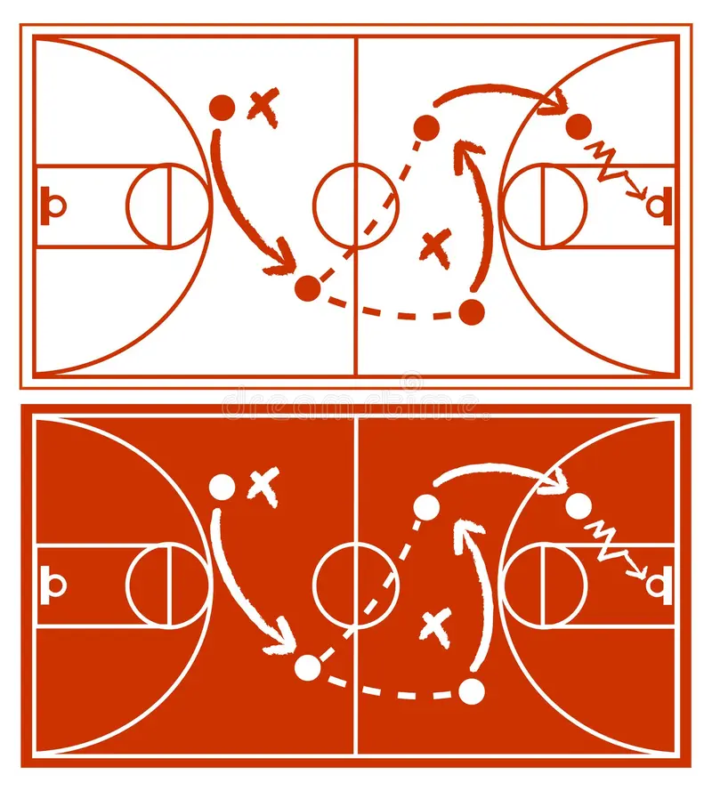
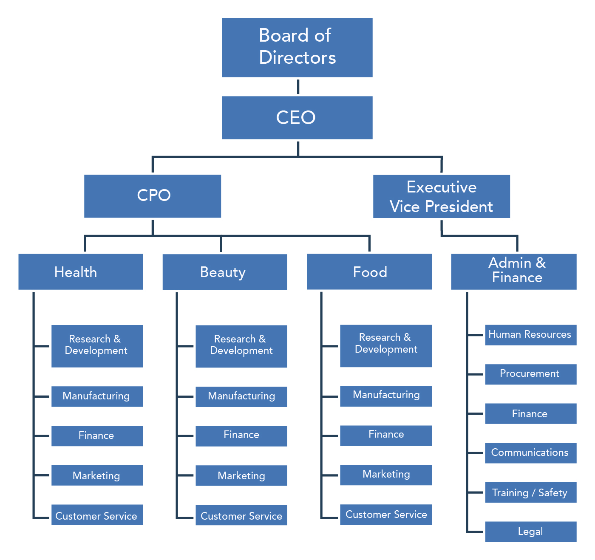
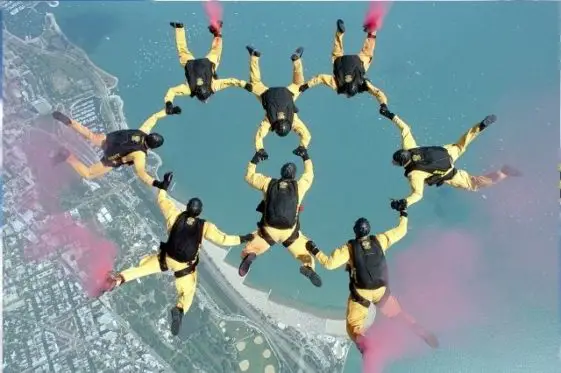
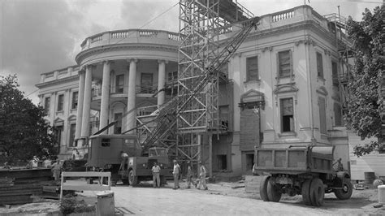
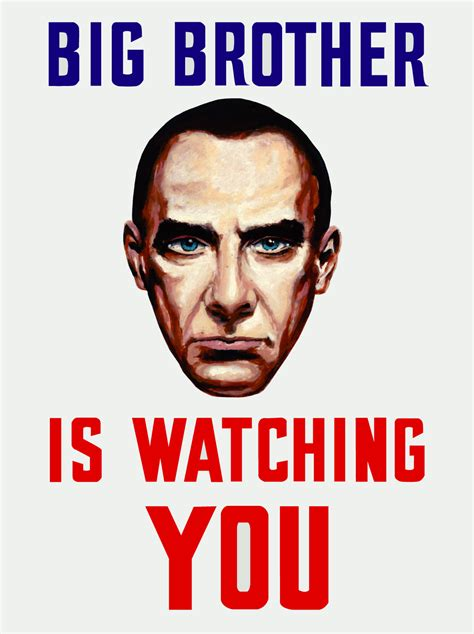

# Smart Contracts

## Overview

Notes:

In this module we're going to talk about Smart Contracts.
Before we can understand smart contracts and what makes them smart, we need to understand what contracts are in the first place.
Afterall we are standing on the shoulders of giants here.
And in order to understand what contracts are, we'll start all the way back at human coordination.
We'll see that contracts are just a pretty good technology to achieve coordination, and that smart contracts are a improvement on that technology.

---

## Coordination



Examples of coordinated activities:
dancing, music band
money, business, trade
rowing team
building homes, buildings, roads
Doing the above safely through beaurocracies like inspection and certificaition proceedures, automobile registration

Notes:

Coordinated activity is the basis of so much human behavior.
Consider the building we're in right now.
It has a whole crew of technicians, janitors, grounds people,to run it, not to mention the crew it took to build it.

Coordination is also what allows this team of workers, along with many others like it, to complete a railroad that stretches aacross a continent.

---v

## Coordination

 <!-- .element: class="fragment" -->
 <!-- .element: class="fragment" -->
 <!-- .element: class="fragment" -->

Notes:
There are so many examples of things we can achieve only through coordination, not as individuals, it would be impossible to list them all

---v

## Voluntarty vs Forced Coordination


Notes:

Coordiation can happen volunterily or by force.
We could simply avoid considering slavery because it is immoral.
And avoiding slavery is a really good heuristic btw; I recommend you all avoid slavery because it is immoral in your daily lives.

But it's about more than that.
We want to create conditions (incentives) where voluntary coordination can happen freely and easily.
When we don't have these conditions, you do end up with slavery.
Because eventually someone sees the potential of coordination and forces it to happen.

By building proper tools for voluntary coordination, we can help prevent forced coordination from happening in the first place.
We can also help those who are enslaved coordinate to rise up for their liberation.

---

# Trust

So you want to make some kind of agreement.
But you don't want to get ripped off.

Notes:

For example: we'll build my house this week, then we'll build your house next month.

---v

# Personal vs Rational Trust

- personal trust - you can build it over time through a slow give and take like you do with your family or long term business partners for example
- rational trust - you can believe that a person will act faithfully because they are incentivized to do so.

---v
## Trust: A Dirty Word

"trust" is sometimes a _dirty word_ in web3 spaces.

TODO image of dealing with a shady-looking banker or bmv employee and thinking "do I really want this guy knowing where I live?"

Notes:

"less trust more truth" right? RIGHT?

This saying refers to scenarios where you have to treat strangers as though you had personal trust with them.
This happens all the time when you give a merchant your credit card number and trust that they won't buy stuff online with it.

---v

## Personal Trust for Performance

The truth is that this kind of trust can make things really efficient, and it is reasonable to leverage this trust _when it is warranted_

how to bootstrap genuine trust: start small and accept a small counterparty risk. Gradually increase over time.

Notes:

TODO too many words on this slide. MAke the same good point with fewer words.

It takes a long time and a lot of effort and cumulative risk to bootstrap this trust, so if you have it, you should use it.

When you shouldn't rely on personal trust?
when you don't have it.
When the banker at the big bank tells you you can't have your money back unless you verify your identity by telling them where you live.

---v

## Rational Trust Everywhere

Not really trust at all

TODO decide what to actually _show_ on the slide
Maybe a silly figure of margerine or something saying it isn't really butter.

Notes:

In the increasingly common case that you are interacting with strangers, and you do _not_ have personal trust, we strive for rational trust.
Rational trust is not really "trust" in the dirty word sense at all.
It is more of a civic trust.
Knowing that the people you are interacting with are likely to honor their promises because they are incentivized to do so.
We'll focus a lot on setting up these incentives this week.

---

# Scaffolding Trust

(show slides of bicycles, flying machines, electric lights evolving over time)

Notes:
So let's look at some existing technologies that allow us to scaffold the second kind of trust.
As in all lines of technology, the older more original versions are not always as sexy as the newer versions.

---v

## Promises and Reputation

- how enforceable is it?
- does it work in small setting?
- does it work in a large setting?

We are at a point where we need to have some coordination between 8 billion people.
It doesn't have to all be fancy stuff like social media and metaverse and stuff.
But we at least need to coordinate on how much pollution we are gonna put into the air.
It's the modern equivalent of a primative village deciding "okay everyone, let's all agree we're gonna shit in the same corner of the village, not just wherever we feel like it."

Promise can make a village of 100 shit in the same corner, but not 8 billion.

---

## Business and Trade

primitive trade, dead weight loss, coordinating over time, this is another example of needing trust

---v

## Business and Trade 2

TODO the three vertical slides i nthis column need to tell the story more clearly.
We're trying to look at business, trade, money, finance as an example or case study, then generalize to contracts.

One example is money, it allows strangers to coordinate over time because they don't have to hunt down the same person later to get the second half of the trade. They know that everyone else around them will accept the money for whatever goods and services they choose. In some ways the thing that is used for money is just a matter of convention. One thing we're going to try to do is make some improvements on money itself.

```
         promises - trade over time
        /                            \
simple swaps                 credit - trading an abstract notion of value today for
        \                           /                   a debt to be repaid over time
        money - trade for abstract notion of value
```

Notes:

Let's focus in on the idea of trade and business for a bit and explore some of the tools we've built there.
trading over time requires trust for sure
money only requires trust to get started. After it has caught on, it is sticky. Everyone wants their money to still be valuable.

---v

## x

So how do we actually get people to keep their promises? Well, maybe social norm of keeping promises is kind of sticky too. If people tend to keep promises, the society prospers. But eventualy it will be sufficiently profitable to defect.

---

# Contracts :tada:

- **Contracts are Promises**
- Some involve money, but they're much **more general than just money**.
- Traditionally, contracts are special promises that the **government will enforce**.

Notes:

The key idea is that the government is big enough to have power over individuals interacting, and if anyone tries to rip someone else off, the government will step in and make sure the contract is upheld.
This allows us to interact as if we trusted each other. Then the stickiness sets in and people actually do start to trust each other.

---v

# Promises with Force


 <!-- .element: class="fragment" -->
 <!-- .element: class="fragment" -->

Together, we build anything!

This is the power of contracts!

Notes:
Contracts are promises that, thanks to their backing, are as powerful as the government itself.

As long as the government fairly and reliably enforces them, we can get really far.
Of course sometimes the government can be a lot like the slave owner.
We need to watch out for that...

---v

## What is a Contract Again?

(to summarize)

A promise, made between parties, backed by the government, to coordinate together to accomplish something together.

Notes:

The notion of promise is very abstract.
It could involve coordinating over time.
It could involve money or even credit.
It could have multiple possible valid outcomes.

---

# Smart Contracts

 <!-- .element: class="fragment" -->

Notes:

This CS guy, Nick Szabo, and some other cipherpunks realized in the 90s that contract law and computer science actually had a lot in common, and developed the idea of smart contracts.

We'll develop the same ideas here.

---v

## Smart Contracts - Szabo Definition

<blockquote>A machine program with rules that we could have defined in a contract, but instead a machine performs or verifies performance.</blockquote>

Broad definition
aka Szabo definition
formulated c 1997

Notes:

So Szabo has this idea of the smart contracts which is basically to write contractual agreements as computer programs in programming languages.
And then run those programs on some computer that will execute the instructions faithfully with machine-like precision.
He was pretty excited about some of the research in multi-party computation that was happening at the time and had a sense that this vision might be right around the corner.

BTW, there is a second definition that we'll call the Narrow definition or the "Web3 definition" that I'll tell you in a day or two when we have more foundational material built.
It makes sense that back in '97 people were thinking more big picture and we got this broad definition, and now 25 years later we have a more precise, technically specific definition.

https://nakamotoinstitute.org/the-god-protocols/
https://nakamotoinstitute.org/formalizing-securing-relationships/
TODO I got the definition above from https://youtu.be/v_-mxyN4pcY?t=296 but there might be a better and older one in the second link.

---v

## Smart Contract Objectives

* Retain all the value of traditional governmental contracts
  * Can trust strangers promises
  * Can coordinate with little risk
  * etc
* Remove ambiguity about what contracts are enforceable
* Make writing and understanding contracts more approachable
* Make contract execution and enforcement more efficient

Notes:

TODO find link to court case that set precident for contracts that were "frolic and gamble" or something not being enforceable.

---

# Expression and Enforcement

1. Expression
2. Execution / Enforcement

Notes:
As we work through Szabo's ideas, we'll look at smart contracts in two parts.
The part about actually codifying what you agree to unambiguously - expression.
And then the part about making sure it actually happens, and what to do if something goes wrong - execution / enforcement.

Programming languages are good at part 1 and computers are good at part 2.

---

# Expression -- Part 1

Domain Specific Languages
are important
oldest writing samples are clerical
Humans have been inventing dsls forever.
It's one of our main things.

Contract law
is a DSL
is an important part of society
is hard to read (screenshot of legaleze)

Computer Programming
also a DSL
independant evolution from contract law
Can be quite hard to read (asm or solidity), good ones can also be easier to read. - example about napoleon wanting the average educated citizen to be able to understand the napoleonic code

They are not so different
They are both DSL meant to precisely express the nuances of detailed human agreements
They are both hard to read for non experts
someone in the early 90s had the realization that they were similar and had the idea that programming may be the future of law.
Nick Szabo

smart contracts broad definition
Insert definition

Cultures are different

- legal culture always adds, rarely removes
- legal culture is all about human judgement
- programmers love negative diffs
- programmers prefer to express things elegantly and minimally
- programmers like testing
- programming in about repeatability and objectivity

One goal of mine is to make smart contracts more accessible to everyday people so that you can read your own contracts

---

# Execution / Enforcement -- Part 2

TODO images of courts, judges, jails for the traditional system.
also images of "executing computer code" whatever that might look like. - or maybe of a contract deployment success in a dapp ui.

Notes:

Once a legal agreement is made, it must be executed / enforced somewhere

---v

## Traditional Execution

* There is rarely an official submission moment.
* Parties Self Execute
* Sometimes, that's it. Success.
* Sometimes it goes to court.

Notes:

Parties just sign.
Sometimes there is a witness
Sometimes even a notary
Rarely a submission to a judge.

On the happy path, no further action is necessary - this is actually a decided strength of the traditional system - it is maximally lazy
When there is a dispute, parties can go to court for a human judge to rule.
Judge enforces through powerful agencies like police and jails, and through social consensus.
In practice there is little consideration for scaling, queue length, ruling priority, resource exhaustion. But in principle there could be. The existing systems of the nation states could be optimized considerably without having to even adopt any real smart contracts.

---v

# Computerized Execution

* There is a deployment moment
* Sometimes there are checkpoints or milestones or other official interactions
* Sometimes there is dispute resolution

Notes:

You start some process on some computer and that computer faithfully executes the program for users to interact with.
At first you can think of it like a computer in the basement and we walk up to it when we want to interact. This is how nintendo works. Multiple controllers and multiple physically present users.
The internet makes it bettter in some ways. We can interact with our smart contract remotely instead of being physically present.
But now there is the question of the server operator. Are they really executing the correct contract?
The corrupt server opporator is analogous to a corrupt judge.

---v

TODO: Code is law memes; show the and explain it.

---

web2 style contracts in actix_web or whatever

- nth caller
- blind bargaining
- simple money

---

slides about state machines

---

slides about web1,2,3, digital services where do we run these things?

The search for a neutral platform
Now that we have this great idea of smart contracts, we begin our search for a place to run them.
One common solution is a platform like amazon. Their business is to be reliable, they want a reputation for being reliable. And they mostly don't care about your shit. Until uncle sam comes knocking.

Another option is dedicated hardware.
vending machine
laundry machine
voting machine

---

P2P networking

PAB
