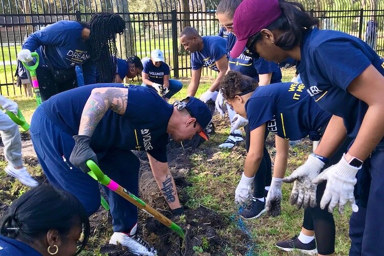

# Smart Contracts

## Overview

Notes:
Intro 
In this module we're going to talk about Smart Contracts.  
Before we can understand smart contracts and what makes them smart, we need to understand what contracts are in the first place.  
Afterall, we are standing on the shoulders of giants here.  
And in order to understand what contracts are, we'll start all the way back at human coordination.  
We'll see that contracts are just a pretty good technology to achieve coordination, and that smart contracts are an improvement on that technology.

---

## Coordination


Examples of coordinated activities:
dancing, music band  
money, business, trade  
rowing team  
building homes, buildings, roads  
  
Doing the above safely through bureaucracies like inspection and certification procedures, automobile registration

Notes:
Coordinated activity is the basis of so much human behavior.  
Consider the building we're in right now.  
It has a whole crew of technicians, janitors, grounds people to run it, not to mention the crew it took to build it.  
Coordination is also what allows this team of workers, along with many others like it, to complete a railroad that stretches across a continent. Some require more bureaucracy than others. Building a railroad that crosses many state lines? That will require government approval, inspection, and certification procedures - especially as it relates to safety. But two people dancing? That we can navigate and coordinate just the two of us. 

---v

## Coordination

 <!-- .element: class="fragment" -->

Notes: 
CLICK 
There are so many examples of things we can achieve only through coordination, not as individuals, it would be impossible to list them all. 
Coordination is good - we can build big big things and create beautiful music in a symphony together because of it. 

---v

## Coordination

 <!-- .element: class="fragment" -->

Notes:
CLICK 
It is how massive organizations like corporations and governments are able to function.

---v

## Voluntarty vs Forced Coordination



Notes:
It can happen voluntarily or by force. Here we have a picture of folks working together, let's assume voluntarily as they volunteer their time at a community garden. 

---
## Voluntarty vs Forced Coordination


Notes:
But what about slavery? That's certainly a coordinated effort to force people to work.  
Now, of course, we could simply avoid considering and discussing slavery because it is immoral.  
And avoiding slavery is a really good heuristic btw; I recommend you all avoid slavery because it is immoral in your daily lives.
But it's about more than that.  
We want to create conditions (incentives) where voluntary coordination can happen freely and easily.  
When we don't have these conditions, you do end up with slavery.  
Because eventually someone sees the potential of coordination and forces it to happen.  
By building proper tools for voluntary coordination, we can help prevent forced coordination from happening in the first place.   
We can also help those who are enslaved coordinate to rise up for their liberation. 

---
# Trust

So you want to make some kind of agreement.
But you don't want to get ripped off.

Notes:
Alright let’s talk about trust - as it's required for coordination - Let's imagine, you want make an agreement, but you don't want to get ripped off.  
Trust means I trust you not to rip me off.  
Say for example, that we decide to build your house this week, I in turn believe that we’ll build mine next week. 

---v

# Personal vs Rational Trust

- personal trust - you can build it over time through a slow give and take like you do with your family or long term business partners. 
- rational trust - you can believe that a person will act faithfully because they are incentivized to do so.

Notes:
So, the goal of trust is to make some kind of agreement.  
There's this idea of personal trust, which is familial and personally developed over time kind - I for example trust that my mom who is watching my son right now, is taking good care of him. 
But she and I have gradually built up that trust over many years. This sort of trust happens a lot with families or neighbors or whatever. It can also happen in business if you have a business partner where you start by doing say one small deal. And sure there’s a little risk involved but it’s small. And then the next time the deal is a little bigger and maybe that time the other person takes a little risk.  
But at no point is there SO much risk that you could get completely wrecked if they rip you off. Of course there's some, and by accepting that risk slowly more and more over the years, you actually build up personal type of trust. 
And so that's one kind, again - you could think of it as what feels like genuine/familial - but what we’re calling personal trust.
The other kind is RATIONAL trust, which is more of like the game theory kind of trust where you believe credibly that a person will act faithfully according to an agreement you made because the incentives make them do so. 
And so, either one of these two types of trust are, yes, usable. Just note that a lot of times you can't get personal trust because it takes such a long time to bootstrap.
And frankly, sometimes you want to interact with a stranger more immediately, say today, and not have to court them for years upon years. 

---v

## Trust: A Dirty Word

less trust, more truth 

Notes:
So, some historical context on myself, when I was a newbie into the world that is web3, I hadn’t heard the phrase “less trust, more truth" slogan. I saw it on ppl’s hats and felt a bit confused and kind of excluded from what felt like an inside joke. But I hope what it means is becoming a bit clearer as we talk about now? 
Because in all reality, trust is a dirty world in our world. Now let’s discuss WHY.
Again the phrase is: less trust; more truth
And it refers to scenarios where you have to take a complete stranger and treat them as if you had personal trust. As if they were a close friend or business partner or family member. And that is definitely bad and is a dirty word and is a thing that we relaly shouldn't do.
And yet, this literally happens all the time - when you give a merchant your credit card number and you trust that they won't buy a bunch of stuff online with it.

TODO image of dealing with a shady-looking banker or bmv employee and thinking "do I really want this guy knowing where I live?"

---v

## Personal Trust for Performance

Personal trust can make things really efficient, and it's reasonable to leverage this trust _when it's warranted_

How to bootstrap genuine trust: start small. Accept a small risk. Gradually increase over time.

Notes:
I should caveat here - personal trust is not wrong, or bad, or dirty - especially when it's warranted. I don’t want us all walking out here calling our moms and dissolving our trust with them. That just isn’t the scenario we speak to when we say 'trust is dirty'   
Because, if you have someone who you genuinely trust, you can actually get things done a whole lot faster and more efficiently by leveraging that trust. So, it may be worth it to bootstrap genuine personal trust. It's only bad when you have to do that with someone that you don't know or actively distrust. 

---v

## Rational Trust Everywhere

Not _really_ trust at all

Notes:
And in all actuality, rational trust isn’t really how we colloquially think about trust in the original sense at all. It's more like game theory and incentives. In the increasingly common case that you are interacting with strangers, and you do _not_ have personal trust, we strive for rational trust.   
Rational trust is not really "trust" in the dirty word sense at all.  
It is more of a civic trust - where we know that the people we're interacting with are likely to honor their promises because they are incentivized to do so.  
We'll focus a lot on setting up these incentives this week.

---

# Scaffolding Trust

 

Notes:
So let's look at some existing technologies that allow us to scaffold this RATIONAL type of trust. Because again, that’s the business we're in here. We're trying to build technologies to scaffold this rational trust. 
As in all lines of technology, the older, more original versions are not always as sexy as the newer versions.   
Think of a crappy old flying machine design,


---v

# Scaffolding Trust

 

Notes:
and then a really basic plane which then evolves into a then a jumbo jet and then a fighter jet and then a spacecraft. It's all been scaffolded off of one another over time. 

---v

## Promises and Reputation

- how enforceable is it?
- does it work in small setting?
- does it work in a large setting?

Notes: 
Now, we're at a point where we need to merge some of the concepts we’ve discussed thus far. Coordination and trust. Because let’s be real, to achieve things on this planet, it requires some coordination between 8 billion people here.  
And this is where the concept of promises and reputation comes into play. Promises can get you far. As in, you might choose to trust a stranger's or a semi-acquaintance's promise. But again, you probably won't trust a stranger's promise to the same degree that you would trust your mom's promise. 
It sort of allows us to bootstrap trust, but it doesn't get you all the way up to global trust. 
And with the world is now being an interconnected world of 8 billion people, we have bigger coordination problems than society has ever had in the past. Which is why we're now needing bigger and more resilient coordination tools.
When talking with Joshy about this problem his example, that I can’t seem to get out of my head was that: “It's the modern equivalent of a primitive village deciding "okay everyone, let's all agree we're going to poop in the same corner of the village, not just wherever we feel like it.” So as he says: Promises can make a village of 100 shit in the same corner, but not 8 billion. 

---

## Business and Trade

- primitive trade
- dead weight loss 
- counterparty risk 
- coordinating over time - I need trust! 

Notes: 
Now, I want to take a look at some ways that people have been able to coordinate over time. And I want to focus on financial systems as they allow us to abstract over a lot of specific details.  
Back to the concept of coordination - one of the first forms of it was simple trading.  
Let's imagine that I grow food and you make houses. So, I'll give you some food, if you build me a house, and I pay your daily wage by giving you food as long as you're building my house.  
This is a classic example of primitive trade    
The house builder - she needs food, so she can only build houses for people who grow food. As in, she can't earn food by building houses for randos who don't have food to pay her with.   
And obviously, there's a whole lot of problems within this situation and won't scale over time.  
And the field of finance has interestingly solved a lot of these problems! 
Okay wait so, back to what I described about the situation of someone only being able to build houses for people who have food to pay them because they only need food - this is an example of deadweight loss. 
The definition of which is: "a cost to society created by market inefficiency, which occurs when supply and demand are out of equilibrium".  
Another classic example of deadweight loss would be if I, for example, grow corn in the summer and you ice fish in the winter.  
And together, we would love to have some way for me to feed you in the summer and you to feed me in the winter, but there's no way to coordinate that because someone has to go first. So let's say I go first and I just give you half of my corn all summer. Then you could just, you know, piece out and I'm… left with nothing all winter.
And that, is what we call counterparty risk.  
And because I don't want the counterparty risk, I don't engage in such a deal, which is then deadweight loss. 
Even though we both kinda want to trade, we have no real way of making it happen.  

---v

## Business and Trade 

```
         promises - trade over time
        /                            \
simple swaps                 credit - trading an abstract notion of value today for
        \                           /                   a debt to be repaid in time
        money - trade for abstract notion of value
```

Notes:
So, money is a good tool because it abstracts value and it means someone now can build a house for anyone who'll give them money. Not just those who could give them food. Because they know that money's widely accepted and then they can use it for getting other things or services of that value.  
And this, ding ding ding, again is just another example in the history of coordination tools.  
And in some ways, that physical thing that is used for money - is just a matter of convention. One thing WE'RE going to try to do is make some improvements on money itself.   
And trading over time requires trust for sure. Money only requires trust to get started. After it has caught on, it's sticky, because everyone wants their money to still be valuable.  

---v

## Promises promises promises 

Notes: 
So how do we actually get people to keep their promises? Well, maybe the social norm of keeping promises is kind of sticky too. From a sociological perspective, we know that if people within a society tend to keep promises, the society tends to prosper.   
But! Eventually, it will be sufficiently profitable to defect and to break promises. womp womp! 

---

# Contracts 🎉

- **Contracts are Promises**
- Some involve money, but they're much **more general than just money**.
- Traditionally, contracts are special promises that the **government will enforce**.

Notes:
So! Finally this brings us to the idea of contracts. They're basically, pretty much, promises. 
They could involve money, a lot of them do, though they don't have to. 
Ultimately, think of them as abstractions over promises. And traditionally what you've probably learned is that contracts are special promises that the government will enforce.  
And sure, that's valuable because governments are big and powerful. You could say that even in some sense, the government enforcing it is a lot like God enforcing it.  
As in, the government is big enough to have power over individuals interacting, and if anyone tries to rip someone else off, the government will step in and make sure the contract is upheld.  
Which essentially allows us to interact as if we trusted each other. Then, over time, the stickiness sets in and people actually do start to trust each other! Yay, happy days - do we see now how all of these concepts are beginning to connect with one another?    
But wait! What am I talking about? We know the unfortunate truth which is that governments are unfortunately corruptible... 

---v

# Promises with Force


 <!-- .element: class="fragment" -->

Notes:
this is a picture of the white house being built CLICK and of course the pyramids.  
Together, we can build anything - this is the power of contracts!   
Contracts are promises that, thanks to their backing, are as powerful as the government itself. 
And as long as the government fairly and reliably enforces them, we can get really far.

---v

# Promises with Force
 <!-- .element: class="fragment" -->

Notes:
CLICK Of course sometimes the government can be a lot like the slave owner.
Sooo we need to watch out for that...

---v

## What is a Contract Again?

(to summarize)

A promise, made between parties, backed by the government, to coordinate together to accomplish something together.

Notes:
And yeah, that's what we're trying to solve. 
Okay, again, just to make it clear, let’s make sure we’re all on the same page about what a contract is.
A promise, made between parties, backed by the government, to coordinate together to accomplish something together.
The notion of promise is very abstract:  
It could involve coordinating over time.  
It could involve money or even credit.  
It also could have multiple possible valid outcomes.  
Okay. Cool. All on the same page? Nodding heads? We can agree we understand this concept? 

---

# Smart Contracts

 <!-- .element: class="fragment" -->

Notes:
Amazing… so, now onto smart contracts! CLICK
We've finally made it here, folks, horaayyy! 
Back in the 90s, this CS guy, Nick Szabo, and some other cypher-punks realized that contract law and computer science actually had a lot in common, and thus developed the idea of smart contracts.
And together, we'll develop and tease out those same comparisons here.

---v

## Smart Contracts - Szabo Definition

<blockquote>A machine program with rules that we could have defined in a contract, but instead a machine performs or verifies performance.</blockquote>

Broad definition   
_aka Szabo definition_   
formulated c 1997

Notes:
So Szabo has this idea of the smart contract - which is basically to write contractual agreements as computer programs in programming languages.
And then to run those programs on a computer that will then execute the instructions faithfully with machine-like precision.  
He was pretty excited about some of the research in multi-party computation that was happening at the time and had a sense that this vision might be right around the corner.  
BTW, there is a second smart contracts definition that we'll call the "Narrow definition" or maybe the "Web3 definition" that I'll tell you about in a day or two when we have more foundational material built and that's sort of what Szabo was beginning to allude to himself. 
But, for now, it makes sense that back in '97, people were thinking about the bigger picture and thus we got this broad definition.  
Of course now, 25 years later, we have a more precise, technically specific definition. 

https://nakamotoinstitute.org/the-god-protocols/
https://nakamotoinstitute.org/formalizing-securing-relationships/

---v

## Smart Contract Objectives

* Retain all the value of traditional governmental contracts
  * Can trust strangers promises
  * Can coordinate with little risk
  * etc. 
* Remove ambiguity about what contracts are enforceable
* Make writing and understanding contracts more approachable
* Make contract execution and enforcement more efficient

Notes:
Okay, so these are the goals of a smart contract. We basically want to keep all the good stuff that contracts brought us, but then of course make them better by not making the government the central point of enforcement. 
We want to know, without a doubt that the contracts will be enforced. We want them to be approachable, legibility wise, and we want them to be efficient.    
And really quickly, before I dive into the expression and enforcement part of smart contracts, I really quickly want us to review:  
So we started all the way back at simple primitive trade. To personal trust. To rational trust - which allowed us to get money and credit and all this other stuff. Contracts were the golden child - those promises allowed us to really scale and achieve some incredible coordination.  
And now, we're going make the next iteration in this long, rich history of how to coordinate: which is the smart contract.

TODO find link to court case that set precident for contracts that were "frolic and gamble" or something not being enforceable.

---

# Expression and Enforcement

1. Expression
2. Execution / Enforcement

Notes:
So, as we work through Szabo's ideas, we'll look at smart contracts in two parts.
Expression - this is the part about actually codifying or expressing what you agree to unambiguously. From a programmer's perspective, this is by writing code. Or from a lawyer's perspective, this is writing up a bunch of pages of legalese, which basically is a DSL for being really specific in a legal contract.  
And then the part about making sure it actually happens? and what to do if something goes wrong? That’s the execution or enforcement part. 
And this part is ultimately where the two worlds contrast - running unstoppable code on a blockchain vs. having courts and judges and police officers and things like that.   
Essentially the idea of a smart contract is: we're going to take a contract, which we all feel really confident in our definition, and we're going to glue it together with all of Szabo’s incredible Computer Science research that's come out way more recently than contract research, and that all together is the next iteration and improvement on contracts.   
I should note: of these two parts, Programming languages are good at part 1 and computers are good at part 2.  

---

# Expression -- Part 1
_Domain Specific Languages_

*Legalese:* In witness whereof, the parties hereunto have set their hands to these presents as a deed on the day month and year hereinbefore mentioned.  

*ink!:* `signatures = [alice, bob]`

Notes: 
Okay when we're talking expression we're really talking - Domain Specific Languages (which we say DSL for short).  
Humans have been inventing DSL forever.  
Contract law is a DSL and is an important part of society. It’s hard to read (read the sentence on the slide).  
Computer Programming is also a DSL, which of course had it’s own independent evolution from contract law. 
It can be quite hard to read (asm or solidity), whereas good ones can also be easier to read. 
But really, the point I'm trying to make here is that legalese contract law and computer programming languages are not so different. They are both DSL meant to precisely express the nuances of detailed human agreements. And they're both hard to read for non experts. 
Szabo recognized this similarity and thus had the idea that programming may be the future of law.   
HOWEVER since we're talking similarities - we should also speak to the differences. And hence be careful with this legal and coding comparison. 
The culture of the two can certainly be different: 

- legal culture always adds, as in, they rarely remove laws - plus it’s all about human judgement
- whereas programmers love negative diffs
- we prefer to express things elegantly and minimally
- we like testing
- and programming in repeatability and objectivity   

Back to the thing about both being hard to read for non-experts, a goal of mine is to make smart contracts more accessible to everyday people so that people can read their own contracts! 

---
 
# Execution / Enforcement -- Part 2

 <!-- .element: class="fragment" -->

Notes:
CLICK
Okay, so now that we understand what it means to express and write a contract, imagine now that the legal agreement has been made, what comes next? 

---v

# Execution / Enforcement -- Part 2

 <!-- .element: class="fragment" -->

Notes:
CLICK
Well it must be executed / enforced. Where does that happen? How does that work? 

---v

## Traditional Execution

* There is rarely an official submission moment.
* Parties Self Execute
* Sometimes, that's it. Success.
* Sometimes it goes to court.

Notes:
So - let’s talk about execution. 
In a traditional sense, parties often just sign the contract - maybe there is a witness, sometimes even a notary, rarely does it actually get submitted to a judge.
On the happy path, no further action is necessary - this is actually a decided strength of the traditional system - it is maximally lazy.   
When there is a dispute though, parties can go to court for a human judge to rule.  
A judge enforces through powerful agencies like police and jails, and also through social consensus.  
In practice there is little consideration for scaling, queue length, ruling priority, resource exhaustion. But in principle there could be. The existing systems of the nation states could be optimized considerably without having to even adopt any real smart contract. 

---v

# Computerized Execution

* There is a deployment moment
* Sometimes there are checkpoints or milestones or other official interactions
* Sometimes there is dispute resolution

Notes:
Moving beyond traditonal execution to computerized: you start some process on some computer and that computer faithfully executes the program for users to interact with.  
At first you can think of it like a computer in the basement and we walk up to it when we want to interact. This is how nintendo works. Multiple controllers and multiple physically present users.   
The internet makes it bettter in some ways. We can interact with our smart contract remotely instead of being physically present.   
But now, there is the question of the server operator. Are they really executing the correct contract?   
A corrupt server operator is essentially the same as a corrupt judge.   
Hmmm... so I wonder how we might solve this?   

---v
 
# Code is Law 

 <!-- .element: class="fragment" -->

Notes:
CLICK   
So, after all of that talk comparing law and code, it's inevitable that we get here: 'Code is law' which is another web3-ism you'll hear quite often.  
We know tech can be used to enforce rules. So we might wonder, do we actually need lawyers? Can code dictate what we can and cannot do? Can smart contracts be the answer? I'm not coming for lawyers. I'm sure they're nice. But could this be the answer to make life more trustless and secure?  
But this is where we'll end it today. I hope I've primed you with a few lingering questions. These smart contracts do sound cool, but perhaps the execution, where it actually happens, hopefully is a bit opaque and puzzling still. That's what Joshy will be able to speak to this week ;) 

---
# ACTIVITY 
Notes: 
TODO - connect activity to the lecture 
web2 style contracts in actix_web or whatever 
- nth caller
- blind bargaining
- simple money
