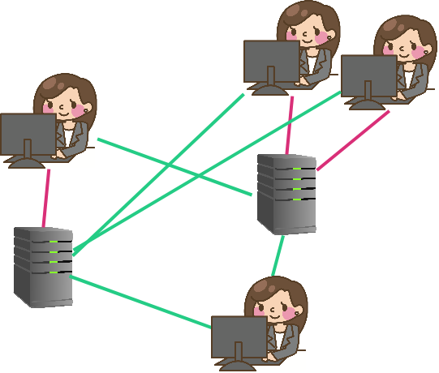
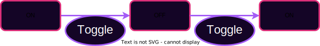
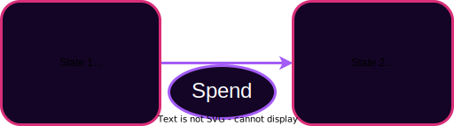

## Web 0

Telegraph, Telephone

Users transmit information peer-to-peer.

Crypto not typically used except by military, but upheld guarantees when used.

---

## Web 1

Introduction of always-on servers.

Still mostly peer-to-peer.

Cryptography more often, but still not ubiquitous.

---

## Web 2

Introduction of **Digital Services** with **Rich State**.

Administered by service providers: "Send _us_ your information."

However, users must place faith in the service provider.

Cryptographic guarantees are about interactions with the service provider, not peers.

Notes:

TODO Maybe add a second version of this image where it is a little mesh of facebook servers connected with pink lines.
This shows that there is at least redundancy for accident protection.

---v

## Digital Services

People rely on digital services every day.
They are inescapable and valuable.

- Game Servers (AOE or Minecraft)
- Twitter, Instagram, Facebook, etc.
- Journalism and sources
- Banks
- Lawyers, notaries, regulators

Notes:

- Ask class for more examples
- Digital services are not bad in and of themselves. They are very valuable. We use all of these every day. We are even using some to administer this course. But they are also hard to escape.

---v

## Trust Example

Two users on Twitter:

- Trust that we are seeing information from the same database\*
- Trust that if a tweet is from X, then X wrote that tweet\*
- Trust that others see our messages as from us\*
- Trust that the messages we see are the messages the users wrote\*
- Trust that we're interacting with the application as equals

Notes:

- Cryptography actually provides a lot of these guarantees, but not when an intermediary has stepped in between users.
- This is one example, but class should discuss.

---v

## God Mode Enabled

In web 2, service providers can perform abuses:

- Censoring user interaction
- Restricting users interaction
- Failing to produce requested data
- Mutating state opaquely

---v

## Thought experiment: Digital Currency

Bitcoin's application was digital currency - a trivially simple application.

Could this be built with Web2 technology?

Notes:

Yep it could. This is the kind of simple app you might build in a Freshman year course
on modern web interfaces. It just needs to maintain a set of bank notes and their owners (or alternatively a set of accounts and their balances.) So why didn't this exist in web 2? Because the provider could print money. Or steal money. Or freeze funds.
Side thought. How different is this from fiat currencies?

---v

## Distributed Applications in Web 2

Providers run redundant data centers to prevents accidents.

But it still assumes benevolent participants and some trusted leader.

Notes:

Even in web2 we start to see the idea of redundancy to prevent accidents from natural disasters, sabotage, hardware failure etc.
But we do not yet see disintermediation. In web 2, the masses become beholden to the service providers who were free to extract value and manipulate the users.

In fact redundant systems were widely studied even before web 2. Consider a flight computer that has sensors for things like air speed and altitude. If one sensor fails we want the plane to keep flying.

---

## Web3

A provision of digital services without the need to trust a service _provider_.

Providers do not need to be trusted; they are economically incentivized to behave honestly.

Notes:

We want to maintain the value, versatility, and richness of Web2, but remove the trust, and possibility of extractive behavior.

---v

## Desired Approach

Allow users to interact with a common system without trusting any intermediaries.

Opens the door to new application stacks:

- Shared state and state change rules
- Custom rendering, moderation, interfaces

---

## State Machines

We can formalize this notion of shared story with state machine model.

Notes:

Most systems that we care about can be modeled as state machines. A state machine is not a real machine that you can touch. It is a model comprised of a set of states and a set of rules about how to transition between the states.

---v

## Labelled Transition Systems

Sometimes you can map the entire state space as an LTS.

Other times it is too big.

Notes:

Consider if we tried to map all possible states of a social media app or a digital currency. Sometimes an LTS drawing like this is useful, other times it would be too large or even infinite. Even still, sometimes drawing part of it can help you think about what the states and transitions might be.

---v

## Example: Light Switch

Simple Switch: 2 States, 1 Transition

**Labelled Transition System** <!-- .element: class="fragment" data-fragment-index="2" -->

 <!-- .element: class="fragment" data-fragment-index="2" -->

**History** <!-- .element: class="fragment" data-fragment-index="3" -->

 <!-- .element: class="fragment" data-fragment-index="3" -->

---v

## State Machine Example: Digital Cash

Each state is a set of bank notes. Where a bank note has an amount and an owner.
A transition involves a user consuming (spending) some bank notes and creating new ones.

Notes:

Not all conceivable transitions are valid. Imagine a user consuming a bank note worth 5 coins, and creating two new ones each worth 3 coins.

---v

## Sate Machine Example: Social Media

Each state is a set of posts and their associated comments and emoji reaction counts.
A transition involves, making a new post, or reacting to someone elses, or commenting

Notes:

There is not a single model here. Some state machines will allow deleting or editing posts, while others will not. Some will allow disliking posts while others only allow liking.

---v

## More State Machine Examples:

<pba-flex center>

- Ride sharing platform
- Voting system
- Blackjack table

</pba-flex>

Notes:

Let's brainstorm what the state and the transitions might be for each of these.

---

## Build Some State Machines

Blockchain From Scratch Activity

Chapter 1 State Machines

Notes:

This activity is going to run over the next four days.
We will have a good amount of time to work on it in class.
We will also set some minimum completion goals each evening.
