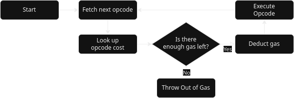

# EVM

Ethereum Virtual Machine

* A VM designed specifically for the constraints and features of Ethereum

---v

## EVM Properties

* Deterministic: execution outcome easy to agree upon
* Spam-resistant: Opcodes and other resources are metered at a very granular level
* Turing-complete (with a caveat)
* Stack-based design
* Ethereum-specific (EVM can query block hash, accounts and balances, etc.)

Note:

It is critical that the EVM be 100% deterministic and that each implementation
produce the same outcome. Even the smallest discrepancy between two running
nodes would lead to different block hashes, violating consensus about the
results. (TODO: too much elaboration? I'm sure other course material covers this).

Charging appropriately for each opcode is also critical in order to prevent
abuse. Opcodes which are underpriced can allow spam, allowing attackers to
force the network to do more work than are paid for by fees, or even outright
DoS.

---v

## Turing completeness and the Halting Problem

* EVM: Turing-complete instruction set

* But what about the Halting Problem?
* Obviously cannot allow infinite loops
* Solution: Gasometer, a way to pre-pay for each opcode execution

Note:

The Halting Problem tells us that it's not possible to know that an arbitrary
program will properly stop. To prevent such abuse, we check that there is gas
remaining before every single opcode execution. Since gas is limited, this
ensures that no EVM execution will run forever and that all work performed is
properly paid for.

---v

## Gasometer


* TODO: diagram, show that execution halts for each opcode to check gas balance
* TODO: talk about disadvantages (perf)
* TODO: talk about other resource metering?
* TODO: gas estimation (RPC call)

---

# History of EVM

ideas:
* Early concepts (IIRC, was attempted to be built on Bitcoin first)
* Shortcomings of Ethereum (storage bloat, ...?)
* DAO & hardfork
* Important updates, Eth 2.0

---v

## Ethereum as first smart contracting platform

ideas: talk about the real-world problems that we can reflect on
* performance
* frontrunning (etc)
* hacks
* problems with aggregating smart contract protocols together

---v

## Idiosyncrasies

- Everything is 256bits
- No floating point arithmetic
- Revert
- Reentrancy
- ABI
- Exponential memory expansion cost

---

# EVM Concepts

---v

## Contract accoutns vs EOAs

An account is designated by a 160-bit account ID. These accounts can be controlled in
one of two ways: An `Externally-owned Account` or a `Contract Account`.

### Externally-owned Account (EOA)

* Traditional user-controlled account
* Can only be controlled via transactions signed with corresponding private keys
* Account ID generated by hashing public key

### Contract Account

* Controlled by code
* Created with immutable contract bytecode
* May only ever do precisely what the code specifies
* Account ID generated deterministically when bytecode is deployed

---v

## Bytecode

Executable code is stored on-chain in the form of bytecode. Only `Contract
Account`s have bytecode, and this bytecode controls what these accounts do when
they are interacted with.

TODO: example bytecode, etc.

---v

## Sandboxed Contract State

`Contract Account`s contain a sandboxed state, which stores everything that the
contract writes to storage. Contracts may not write to storage outside of their
own sandbox, but they can call other contracts whose bytecode *might* write to
their respective storage.

---v

## Calling contracts

TODO: talk about different ways to call (may need more context first)

---

# Programming the EVM

The EVM is ultimately programmed by creating bytecode. While it is possible to
write bytecode by hand or through low-level assembly language, it is much more
practical to use a higher-level language. We will look at two in particular:

* Solidity
* Vyper

---

# Solidity

* Designed for EVM
* Similar to C++, Java, etc.
* Includes inheritance (including MI)
* Criticized for being difficult to reason about security

---v

## Basics

```Solidity
// 'contract' is analogous to 'class' in other OO languages
contract Foo {
    // the member variables of a contract are stored on-chain
    public uint bar;

    constructor(uint value) {
        bar = value;
    }
}
```

---v

## Functions

```Solidity
contract Foo {
    function doSomething() public returns (bool) {
        return true;
    }
}
```

---v

## Payable

```Solidity
contract Foo {
    uint256 received;
    // this function can be called with value (Ether) given to it.
    // in this simple example, the contract would never do anything with
    // the Ether (effectively meaning it would be lost), but it will faithfully
    // track the amount paid to it
    function deposit() public payable {
        received += msg.value;
    }
}
```

---v

## Types

```Solidity
contract Foo {
    function basics() public {
        bool b = false;

        // signed and unsigned ints
        int32 i = -1;
        int256 i2 = -10000;
        uint8 u1 = 255;
        uint16 u2 = 10000;
        uint256 u3 = 99999999999999;

        // dynamic length strings
        string memory foo = "<3 Solidity";

        // fixed length byte sequence
        bytes1 = "a";
    }

    function advanced() public {
        // address represents a 20-byte Ethereum address
        address a = 0x1010101010101010101010101010101010101010;
        uint256 balance = a.balance;

        // arrays
        uint[3] arr = [1, 2, 3];

        // mapping
        mapping(address => uint) memory balances;
        balances[a] = balance;
    }
}
```

---v

## Enums

```Solidity
contract Foo {
    enum Suite {
        Hearts,
        Diamonds,
        Clubs,
        Spades
    }

    function getHeartsSuite() public returns (Suite) {
        Suite hearts = Suite.Hearts;
        return hearts;
    }
}
```

---v

## Structs

```Solidity
contract Foo {
    struct Ballot {
        uint32 index;
        string name;
    }

    function makeSomeBallot() public returns (Ballot memory) {
        Ballot memory ballot;
        ballot.index = 1;
        ballot.name = "John Doe";
        return ballot;
    }
}
```

---v

## Dev Environment

We will use the online [Remix IDE](https://remix.ethereum.org) for our sample
coding. It provides an editor, compiler, EVM, and debugger all within the
browser, making it trivial to get started.

---v

## Flipper Example

Code along and explain as you go

---v

## Deployment and interaction with Flipper

---v

## Adder or Multiplier

write, deploy, interact

Stephen: adder or multiplier is trivially different than flipper (discuss)

---

# Vyper

* Also designed for the EVM
* Similar to Python
* Intentionally lacks some features such as inheritance
* Auditable: "Simplicity for the reader is more important than simplicity for the writer"

---v

## Compared to Solidity

Vyper mostly lacks features found in Solidity, all in the spirit of improving
readability. Some examples:

* No Inheritance
* No modifiers (TODO: cover this under Solidity)
* No function overloading
* No recursive calling (!)
* No infinite-loops

---v

## Basics

```Python
# There is no `contract` keyword. Like Python Modules, a contract is implicitly
# scoped by the file in which it is found.

# storage variables are declared outside of any function
bar: uint

# init is used to deploy a contract and initialize its state
@external
def __init__(val):
    self.bar = val
```

---v

## Functions

```Python
@external
def doSomething() -> bool:
    return True
```

---v

## Decorators and Payable

```Python
# Vyper contains decorators for restricting functions:

@external # function can only be called externally
@internal # function can only be called within current context
@pure # cannot read state or environment vars
@view # cannot alter contract state
@payable # function may receive Ether

# also, to cover the most common use case for Solidity's modifiers:
@nonreentrant(<unique_key>) # prevents reentrancy for given id
```

source: https://docs.vyperlang.org/en/stable/control-structures.html#decorators-reference

---v

## Types

```Python
# value types are small and/or fixed size and are copied
@external
def valueTypes():
    b: bool = False

    # signed and unsigned ints
    i: int128 = -1
    i2: int256 = -10000
    # u: uint128 = 42 # TODO: docs say int<multiple of 8> should work...
    u2: uint256 = 42

    # fixed-point (base-10) decimal values with 10 decimal points of precision
    # this has the advantage that literals can be precisely expressed
    f: decimal = 0.1 + 0.3 + 0.6
    assert f == 1.0, "decimal literals are precise!"

    # address type for 20-byte Ethereum addresses
    a: address = 0x1010101010101010101010101010101010101010
    b = a.balance

    # fixed size byte arrays
    selector: bytes4 = 0x12345678

    # bounded byte arrays
    bytes: Bytes[123] = b"\x01"

    # dynamic-length strings
    name: String[16] = "Vyper"

# reference types are potentially large and/or dynamicly sized.
# they are copied-by-reference
@external
def referenceTypes():
    # fixed size list. can also be multidimensional.
    # all elements must be initialized
    list: int128[4] = [1, 2, 3, -4]

    # bounded, dynamic-size array. these have a max size but initialize to empty
    dynArray: DynArray[int128, 3]
    dynArray.append(1)
    dynArray.append(5)
    val: int128 = dynArray.pop() # == 5

    map: HashMap[int128, int128]
    map[0] = 0
    map[1] = 10
    map[2] = 20

```

---v

## Enums

```Python
enum Suite {
    Hearts,
    Diamonds,
    Clubs,
    Spades
}

# "hearts" would be considered a value type
hearts: Suite = Suite.Hearts
```

---v

## Structs

```Python
struct Ballot:
    index: uint256
    name: string

# "someBallot" would be considered a reference type
someBallot: Ballot = Ballot({index: 1, name: "John Doe"})
name: string = someBallot.name
```

---v

## Remix Plugin

Remix supports Vyper through a plugin, which can be easily enabled from within
the IDE. (TODO: provide a few screenshots or other instructions)

---v

## EVM Assembly

show an example

---

# Storing or Secrets On-Chain

TODO: format this -- how to do the one-click-per-line thing?

Can we store secrets on-chain? What if we want to password-protect a particular
contract call?

Obviously we can't store any plaintext secrets on-chain, as doing so reveals
them.

---v

## Storing Hashed Secrets On-Chain

What about storing the hash of a password on chain and using this to verify some
user-input?

Accepting a pre-hash also reveals the secret. This reveal may occur in a txn
before it is executed and settled, allowing someone to frontrun it.

---v

## Verifying with commit-reveal

One potential solution is a commit-reveal scheme where we hash our reveal with
some salt, then later reveal it.

```
// stored on-chain:
secret_hash = hash(secret)
```

```
// first txn, this must execute and settle on chain before the final reveal.
// this associates a user with the soon-to-be-revealed secret
commitment = hash(salt, alleged_secret)
```

```
// final reveal, this must not be made public until commitment is recorded
reveal = alleged_secret, salt
verify(alleged_secret == secret)
verify(commitment == hash(salt, alleged_secret))
```

---v

## Alternative: Signature

Another approach is to use public-key cryptography. We can store the public key
of some keypair and then demand a signature from the corresponding private-key.

This can be expanded with multisig schemes and similar.

How does this differ from the commit-reveal scheme?

Note:

Commit-reveal requires that a specific secret be revealed at some point for
verification. A signature scheme provides a lot more flexibility for keeping the
secret(s) secure.
