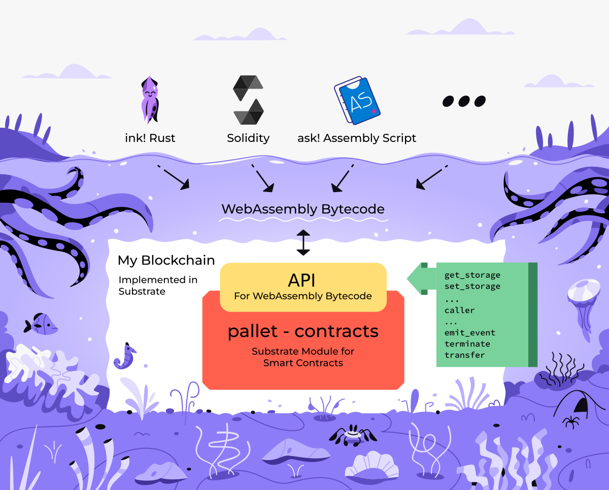
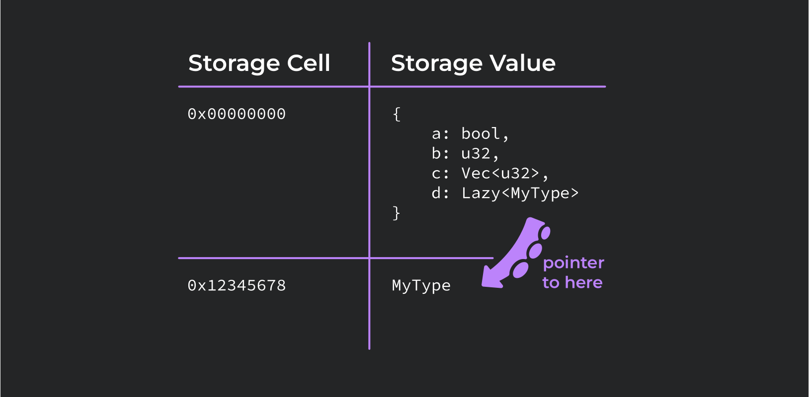

# WASM Smart Contracts in Ink!
A working programmer’s guide

---

# ink! vs. Solidity

|                 | ink!                        | Solidity      |
|-----------------|-----------------------------|---------------|
| Virtual Machine | Any Wasm VM                 | EVM           |
| Encoding        | Wasm                        | EVM Byte Code |
| Language        | Rust                        | Standalone    |
| Constructors    | Multiple                    | Single        |
| Tooling         | Anything that supports Rust | Custom        |
| Storage         | Variable                    | 256 bits      |
| Interfaces?     | Yes: Rust traits            | Yes           |

Notes:
They are freshly of an EVM lecture so migh tbe wondering why another SC language
The EVM operates on 256 bit words (meaning anything less than 32 bytes will be treated by the EVM as having leading zeros)

---

# ink! overview
- DSL in Rust
- Inherits all the benefits
 - Modern functional language
 - Type & Memory safety
- Compiled to WASM
 - Ubuquitous
 - Fast

NOTE:
ink! is not a separate language
has access to vast collection of libraries, tooling
WASM is targeting the browsers and quickly becoming the "assembly" od the web in lieu of JS

---

## ink! & Substrate


NOTE:
technically ink! is just a language
but in practice it has close ties to the larger Substrate framework
Substarte is a framework for developing customized blockchains

---

## ink! & Substrate


NOTE:
contracts written in ink! are compiled to WASM bytecode
pallet contracts porvides
 - instrumentation
 - excution engine
 - gas metering

---


NOTE:
pallet contracts is oblivious to the programming language
it accepts wasm bytecode and executes it's instructions

---


Notes:
contracts itself can be written in ink!

---



NOTE:
But also any other language that compilers to WASM
- Solang
- or ask!

---

## Developing contracts

Install the required tooling

```bash
sudo apt install binaryen
rustup component add rust-src --toolchain nightly
rustup target add wasm32-unknown-unknown --toolchain nightly
cargo install dylint-link
cargo install cargo-contract --force
```

NOTE:
Binaryen is a compiler and toolchain infrastructure library for WebAssembly
at the moment ink! uses a few unstable Rust features, thus nightly is require
rust source code is needed to compile it to wasm
wasm target is added
cargo-contract is a batteries included CLI tool for compiling, deploying and interacting with the contracts

---

## Developing contracts

Create a contract

```bash
cargo contract new flipper
```

```
  /home/CloudStation/Blockchain-Academy/flipper:
  drwxrwxr-x 2 filip filip 4096 Jul  7 11:11 .
  drwxr-xr-x 5 filip filip 4096 Jul  7 11:11 ..
  -rwxr-xr-x 1 filip filip  573 Jul  7 11:11 Cargo.toml
  -rwxr-xr-x 1 filip filip  285 Jul  7 11:11 .gitignore
  -rwxr-xr-x 1 filip filip 5186 Jul  7 11:11 lib.rs
```

---

## Developing contracts

Write contract code

```rust
#[ink::contract]
mod flipper {

    /// Defines the storage of your contract.
    /// Add new fields to the below struct in order
    /// to add new static storage fields to your contract.
    #[ink(storage)]
    pub struct Flipper {
        /// Stores a single `bool` value on the storage.
        value: bool,
    }

    impl Flipper {
```

---

## Developing contracts

Compile the contract

```bash
cargo +nightly contract build
```

---

## Developing contracts

Compilation artifacts

```
 [1/*] Building cargo project
    Finished release [optimized] target(s) in 0.09s

The contract was built in RELEASE mode.

Your contract artifacts are ready. You can find them in:
/home/CloudStation/Blockchain-Academy/flipper/target/ink

  - flipper.contract (code + metadata)
  - flipper.wasm (the contract's code)
  - flipper.json (the contract's metadata)
```

NOTE:
.wasm is the contract compiled bytecode
- .json is contract ABI aka metadata (for use with e.g. dapps)
  - definitions of events, storage, transactions
- .contracts is both of these together

<!--  -->

---

## Developing contracts

Deploy the contract

```bash
cargo contract instantiate --constructor default --suri //Alice
  --skip-confirm --execute
```

```
 Dry-running default (skip with --skip-dry-run)
    Success! Gas required estimated at Weight(ref_time: 138893374, proof_size: 16689)
 ...
  Event Contracts ➜ CodeStored
         code_hash: 0xbf18c768eddde46205f6420cd6098c0c6e8d75b8fb042d635b1ba3d38b3d30ad
       Event Contracts ➜ Instantiated
         deployer: 5GrwvaEF5zXb26Fz9rcQpDWS57CtERHpNehXCPcNoHGKutQY
         contract: 5EXm8WLAGEXn6zy1ebHZ4MrLmjiNnHarZ1pBBjZ5fcnWF3G8
...
       Event System ➜ ExtrinsicSuccess
         dispatch_info: DispatchInfo { weight: Weight { ref_time: 2142580978, proof_size: 9009 }, class: Normal, pays_fee: Yes }

   Code hash 0xbf18c768eddde46205f6420cd6098c0c6e8d75b8fb042d635b1ba3d38b3d30ad
    Contract 5EXm8WLAGEXn6zy1ebHZ4MrLmjiNnHarZ1pBBjZ5fcnWF3G8
```

NOTE:
we see a bunch of information on gas usage
we see two events one for storing contract code another for instantiating the contract
we will come back to that
finally we see code hash and the newly created contracts address

---

## Developing contracts

Interact with the contract: query

```bash
cargo contract call --contract 5EXm8WLAGEXn6zy1ebHZ4MrLmjiNnHarZ1pBBjZ5fcnWF3G8
  --message get --suri //Alice --output-json
```

```
  "data": {
    "Tuple": {
      "ident": "Ok",
      "values": [
        {
          "Bool": false
        }
      ]
    }
  }
```
---

## Developing contracts

Interact with the contract: transaction

```bash
cargo contract call --contract 5EXm8WLAGEXn6zy1ebHZ4MrLmjiNnHarZ1pBBjZ5fcnWF3G8
  --message flip --suri //Alice --skip-confirm --execute
```

```
      Events
       Event Balances ➜ Withdraw
         who: 5GrwvaEF5zXb26Fz9rcQpDWS57CtERHpNehXCPcNoHGKutQY
         amount: 1.813139954mUNIT
       Event Contracts ➜ Called
         caller: 5GrwvaEF5zXb26Fz9rcQpDWS57CtERHpNehXCPcNoHGKutQY
         contract: 5EXm8WLAGEXn6zy1ebHZ4MrLmjiNnHarZ1pBBjZ5fcnWF3G8
       Event Balances ➜ Deposit
         who: 5GrwvaEF5zXb26Fz9rcQpDWS57CtERHpNehXCPcNoHGKutQY
         amount: 721.062099μUNIT
       Event TransactionPayment ➜ TransactionFeePaid
         who: 5GrwvaEF5zXb26Fz9rcQpDWS57CtERHpNehXCPcNoHGKutQY
         actual_fee: 1.092077855mUNIT
         tip: 0UNIT
       Event System ➜ ExtrinsicSuccess
         dispatch_info: DispatchInfo { weight: Weight { ref_time: 1092077701, proof_size: 9050 }, class: Normal, pays_fee: Yes }
```
---

## Developing contracts

Interact with the contract: query

```bash
cargo contract call --contract 5EXm8WLAGEXn6zy1ebHZ4MrLmjiNnHarZ1pBBjZ5fcnWF3G8
  --message get --suri //Alice --output-json
```

```
  "data": {
    "Tuple": {
      "ident": "Ok",
      "values": [
        {
          "Bool": true
        }
      ]
    }
  }
```

---

## Deeper dive: Storage

```rust
    use ink::storage::Mapping;

    #[ink(storage)]
    #[derive(Default)]
    pub struct Token {
        total_supply: Balance,
        balances: Mapping<AccountId, Balance>,
        allowances: Mapping<(AccountId, AccountId), Balance>,
    }
```

NOTE:
now that we dipped our toes lets dissect more
starting with the storage

---


<font color="#8d3aed">SCALE</font> (*<font color="#8d3aed">S</font>imple <font color="#8d3aed">C</font>oncatenated <font color="#8d3aed">A</font>ggregate <font color="#8d3aed">L</font>ittle <font color="#8d3aed">E</font>ndian*)

NOTE:
Pallet contracts storage is organized like a key-value database
SCALE codec is not self-describing (vide metadata)
each storage cell has a unique storage key and points to a SCALE encoded value

---

## SCALE: examples of different types

<div style="font-size: 0.82em;">

| Type    | Decoding                              |                     Encoding | Remark                                                                         |
|---------|---------------------------------------|------------------------------|--------------------------------------------------------------------------------|
| Boolean | true                                  |                          0x0 | encoded using least significant bit of a single byte                           |
|         | false                                 |                          0x1 |                                                                                |
| Unsigned int | 42                                  |  2a00                         |                            |
| Enum    | enum IntOrBool { Int(u8), Bool(bool)} |            0x002a and 0x0101 | first byte encodes the variant index, remaining bytes encode the data          |
| Tuple   | (3, false)                            |                       0x0c00 | concatenation of each encoded value                                            |
| Vector  | [4, 8, 15, 16, 23, 42]                | 0x18040008000f00100017002a00 | encoding of the vector length followed by conatenation of each item's encoding |

</div>

---

## Storage: Packed Layout

```rust [6]
    use ink::storage::Mapping;

    #[ink(storage)]
    #[derive(Default)]
    pub struct Token {
        total_supply: Balance,
        balances: Mapping<AccountId, Balance>,
        allowances: Mapping<(AccountId, AccountId), Balance>,
    }
```

* By default ink! stores all storage struct fields under a single storage cell (`Packed` layout)

NOTE:
Types that can be stored entirely under a single storage cell are called Packed Layout
by default ink! stores all storage struct fields under a single storage cell
as a consequence message interacting with the contract storage will always need to read and decode the entire contract storage struct
which may be what you want or not

---


## Storage: Packed Layout

```rust [1-4,7]
    use ink::storage::traits::{
        StorageKey,
        ManualKey,
    };

    #[ink(storage)]
    pub struct Flipper<KEY: StorageKey = ManualKey<0xcafebabe>> {
        value: bool,
    }
```

* The storage key of the contracts root storage struct defaults to `0x00000000`
* However you may store it under any arbitrary 4 bytes key instead

---

## Storage: Packed Layout

<div style="font-size: 0.82em;">

```json
  "storage": {
    "root": {
      "layout": {
        "struct": {
          "fields": [
            {
              "layout": {
                "leaf": {
                  "key": "0xcafebabe",
                  "ty": 0
                }
              },
              "name": "value"
            }
          ],
          "name": "Flipper"
        }
      },
      "root_key": "0xcafebabe"
    }
  }
```

</div>

NOTE:
here a demonstartion of packed layout - value is stored under the root key

---

## Storage: Un-packed Layout

```rust [1,7-8]
    use ink::storage::Mapping;

    #[ink(storage)]
    #[derive(Default)]
    pub struct Token {
        total_supply: Balance,
        balances: Mapping<AccountId, Balance>,
        allowances: Mapping<(AccountId, AccountId), Balance>,
    }
```

* Mapping consists of a key-value pairs stored directly in the contract storage cells


---

## Storage: Lazy

```rust [1,5-6]
use ink::storage::{traits::ManualKey, Lazy, Mapping};

    #[ink(storage)]
    pub struct Roulette {
        pub data: Lazy<Data, ManualKey<0x44415441>>,
        pub bets: Mapping<u32, Bet, ManualKey<0x42455453>>,
    }
```

* Every type wrapped in `Lazy` has a separate storage cell.
* `ManualKey` assignes explicit storage key to it.

NOTE:
packed layout can get problematic if we're storing a large collection in the contracts storage that most of the transactions do not need access too
there is a 16kb hard limit on a buffer used for decoding, contract trying to decode more will trap / revert
mapping provides per-cell access
Lazy storage cell can be auto-assigned or chosen manually
Using ManualKey instead of AutoKey might be especially desirable for upgradable contracts, as using AutoKey might result in a different storage key for the same field in a newer version of the contract. This may break your contract after an upgrade

---

## Storage: Lazy




---


<!-- TODOs -->
<!-- storage -->
<!--   packed layout -->
<!--   mapping -->
<!--   lazy & un-packed layout -->
<!-- common vulnerabilities -->
<!-- runtime calls -->
<!-- upgradeability -->


<!-- ---v -->

<!-- ## Other wasm contracting platforms -->

<!-- Compare and contrast to cosmwasm and others (if there are others?) -->

<!-- ---v -->

<!-- ## Turing completeness and gas metering -->

<!-- ---v -->

<!-- ## Idiosyncracies -->

<!-- - Are there any? -->

<!-- --- -->

<!-- # Programming Wasm Contracts -->

<!-- ---v -->

<!-- ## WAT and manual assembly -->

<!-- show an example -->

<!-- ---v -->

<!-- ## High Level Languages -->

<!-- - ink! -->
<!-- - ask! -->
<!-- - There could be plenty of others. -->

<!-- --- -->

<!-- # ink! -->

<!-- Based on Rust -->
<!-- ... TODO -->

<!-- ---v -->

<!-- ## Semantics -->

<!-- IDK if this is really necessary. Up to the instructor. -->

<!-- ---v -->

<!-- ## Dev Environment -->

<!-- Make it clear that students should have these tools installed or available already or should be doing their aboslute best to install them as you go. They will need these tools immenently. -->

<!-- - contracts-ui -->
<!-- - DRink? -->
<!-- - Polkadot js? -->
<!-- - ink-playgroud? -->

<!-- @piotr, @filip, I'll leave it largely up to you what the standard dev environment should be. It is good to be flexible and let students use the tools they like. But many students will have no prior preference or experience, and we need to be able to recommend a fully concrete stack for them. -->

<!-- ---v -->

<!-- ## Flipper Example -->

<!-- Code along and explain as you go -->

<!-- ---v -->

<!-- ## Deployment and interaction with Fliper -->

<!-- ---v -->

<!-- ## Adder or Multiplier -->

<!-- write, deploy, interact -->

<!-- ---v -->

<!-- ## Beware Public Information -->

<!-- Show a few bad things that could be done to help develop blockchain thinking models. -->

<!-- - A call that only executes if the proper hard-coded password is passed as a param (insecure, the code and therefore the password is onchain) -->
<!-- - An attempted improvement where the password is not hardcoded. It is passed to the constructor and stored in a private variable. (still insecure. All storage is publicly visible from off-chain.) -->
<!-- - If time permits and students are digging this, try storing a hash in storage and requiring the preimage as a password. This is actually secure for only-call-once functions. But if you intend to call it multiple times, the first call leaks the password publicly. -->

<!-- --- -->

<!-- # Ask! -->

<!-- If you are so inclined, you could show a few screenshots or somethig from ask and make the point that there will eventually be more languages, just like there is already solidity and vyper in evm world. -->

<!-- --- -->

<!-- # Summary -->
