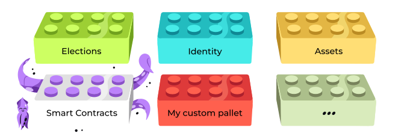
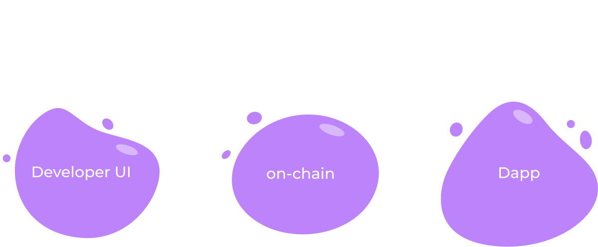
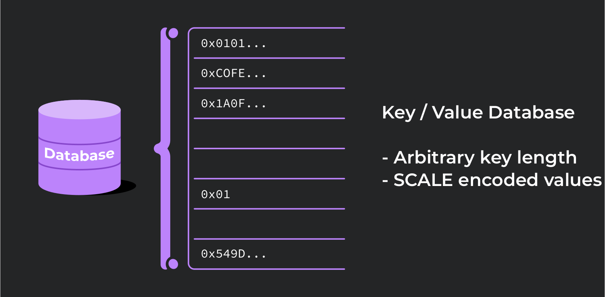
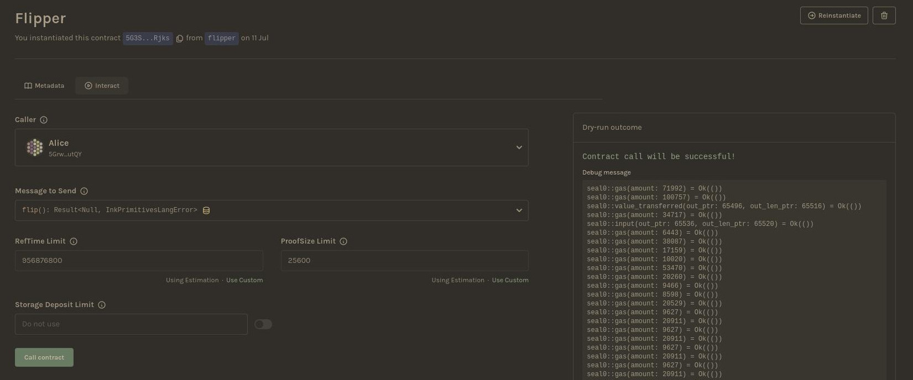

# WASM Smart Contracts in Ink!
A working programmer’s guide

---

# ink! vs. Solidity

|                 | ink!                        | Solidity      |
|-----------------|-----------------------------|---------------|
| Virtual Machine | Any Wasm VM                 | EVM           |
| Encoding        | Wasm                        | EVM Byte Code |
| Language        | Rust                        | Standalone    |
| Constructors    | Multiple                    | Single        |
| Tooling         | Anything that supports Rust | Custom        |
| Storage         | Variable                    | 256 bits      |
| Interfaces?     | Yes: Rust traits            | Yes           |

Notes:
They are freshly of an EVM lecture so might be wondering why another SC language
The EVM operates on 256 bit words (meaning anything less than 32 bytes will be treated by the EVM as having leading zeros)

---

# ink! overview
- DSL in Rust
- Inherits all the benefits
 - Modern functional language
 - Type & Memory safety
- Compiled to WASM
 - Ubuquitous
 - Fast

NOTE:
ink! is not a separate language
has access to vast collection of libraries, tooling
WASM is targeting the browsers and quickly becoming the "assembly" od the web in lieu of JS

---

## ink! & Substrate


NOTE:
technically ink! is just a language
but in practice it has close ties to the larger Substrate framework
Substarte is a framework for developing customized blockchains

---

## ink! & Substrate



NOTE:
contracts written in ink! are compiled to WASM bytecode
pallet contracts porvides
 - instrumentation
 - excution engine
 - gas metering

---


NOTE:
pallet contracts is oblivious to the programming language
it accepts wasm bytecode and executes it's instructions

---


Notes:
contracts itself can be written in ink!

---


NOTE:
But also any other language that compilers to WASM
- Solang
- or ask!

---

## Developing contracts

Install the required tooling

```bash
sudo apt install binaryen
rustup component add rust-src --toolchain nightly
rustup target add wasm32-unknown-unknown --toolchain nightly
cargo install dylint-link
cargo install cargo-contract --force
```

NOTE:
Binaryen is a compiler and toolchain infrastructure library for WebAssembly
at the moment ink! uses a few unstable Rust features, thus nightly is require
rust source code is needed to compile it to wasm
wasm target is added
cargo-contract is a batteries included CLI tool for compiling, deploying and interacting with the contracts

---

## Developing contracts

Create a contract

```bash
cargo contract new flipper
```

```
  /home/CloudStation/Blockchain-Academy/flipper:
  drwxrwxr-x 2 filip filip 4096 Jul  7 11:11 .
  drwxr-xr-x 5 filip filip 4096 Jul  7 11:11 ..
  -rwxr-xr-x 1 filip filip  573 Jul  7 11:11 Cargo.toml
  -rwxr-xr-x 1 filip filip  285 Jul  7 11:11 .gitignore
  -rwxr-xr-x 1 filip filip 5186 Jul  7 11:11 lib.rs
```

---

## Developing contracts

Write contract code

```rust
#[ink::contract]
mod flipper {

/// Defines the storage of your contract.
/// Add new fields to the below struct in order
/// to add new static storage fields to your contract.
#[ink(storage)]
pub struct Flipper {
    /// Stores a single `bool` value on the storage.
    value: bool,
}

impl Flipper {
...
```

---

## Developing contracts

Compile the contract

```bash
cargo +nightly contract build
```

---

## Developing contracts

Compilation artifacts

```
 [1/*] Building cargo project
    Finished release [optimized] target(s) in 0.09s

The contract was built in RELEASE mode.

Your contract artifacts are ready. You can find them in:
/home/CloudStation/Blockchain-Academy/flipper/target/ink

  - flipper.contract (code + metadata)
  - flipper.wasm (the contract's code)
  - flipper.json (the contract's metadata)
```

NOTE:
.wasm is the contract compiled bytecode
- .json is contract ABI aka metadata (for use with e.g. dapps)
  - definitions of events, storage, transactions
- .contracts is both of these together

<!--  -->

---

## Developing contracts

Deploy the contract

```bash
cargo contract instantiate --constructor default --suri //Alice
  --skip-confirm --execute
```

```
 Dry-running default (skip with --skip-dry-run)
    Success! Gas required estimated at Weight(ref_time: 138893374, proof_size: 16689)
 ...
  Event Contracts ➜ CodeStored
         code_hash: 0xbf18c768eddde46205f6420cd6098c0c6e8d75b8fb042d635b1ba3d38b3d30ad
       Event Contracts ➜ Instantiated
         deployer: 5GrwvaEF5zXb26Fz9rcQpDWS57CtERHpNehXCPcNoHGKutQY
         contract: 5EXm8WLAGEXn6zy1ebHZ4MrLmjiNnHarZ1pBBjZ5fcnWF3G8
...
       Event System ➜ ExtrinsicSuccess
         dispatch_info: DispatchInfo { weight: Weight { ref_time: 2142580978, proof_size: 9009 }, class: Normal, pays_fee: Yes }

   Code hash 0xbf18c768eddde46205f6420cd6098c0c6e8d75b8fb042d635b1ba3d38b3d30ad
    Contract 5EXm8WLAGEXn6zy1ebHZ4MrLmjiNnHarZ1pBBjZ5fcnWF3G8
```

NOTE:
we see a bunch of information on gas usage
we see two events one for storing contract code another for instantiating the contract
we will come back to that
finally we see code hash and the newly created contracts address

---

## Developing contracts

Interact with the contract: query

```bash
cargo contract call --contract 5EXm8WLAGEXn6zy1ebHZ4MrLmjiNnHarZ1pBBjZ5fcnWF3G8
  --message get --suri //Alice --output-json
```

```
"data": {
  "Tuple": {
    "ident": "Ok",
    "values": [
      {
        "Bool": false
      }
    ]
  }
}
```
---

## Developing contracts

Interact with the contract: transaction

```bash
cargo contract call --contract 5EXm8WLAGEXn6zy1ebHZ4MrLmjiNnHarZ1pBBjZ5fcnWF3G8
  --message flip --suri //Alice --skip-confirm --execute
```

```
Events
 Event Balances ➜ Withdraw
   who: 5GrwvaEF5zXb26Fz9rcQpDWS57CtERHpNehXCPcNoHGKutQY
   amount: 1.813139954mUNIT
 Event Contracts ➜ Called
   caller: 5GrwvaEF5zXb26Fz9rcQpDWS57CtERHpNehXCPcNoHGKutQY
   contract: 5EXm8WLAGEXn6zy1ebHZ4MrLmjiNnHarZ1pBBjZ5fcnWF3G8
 Event Balances ➜ Deposit
   who: 5GrwvaEF5zXb26Fz9rcQpDWS57CtERHpNehXCPcNoHGKutQY
   amount: 721.062099μUNIT
 Event TransactionPayment ➜ TransactionFeePaid
   who: 5GrwvaEF5zXb26Fz9rcQpDWS57CtERHpNehXCPcNoHGKutQY
   actual_fee: 1.092077855mUNIT
   tip: 0UNIT
 Event System ➜ ExtrinsicSuccess
   dispatch_info: DispatchInfo { weight: Weight { ref_time: 1092077701, proof_size: 9050 }, class: Normal, pays_fee: Yes }
```
---

## Developing contracts

Interact with the contract: query

```bash
cargo contract call --contract 5EXm8WLAGEXn6zy1ebHZ4MrLmjiNnHarZ1pBBjZ5fcnWF3G8
  --message get --suri //Alice --output-json
```

```
"data": {
  "Tuple": {
    "ident": "Ok",
    "values": [
      {
        "Bool": true
      }
    ]
  }
}
```

---

## Deeper dive: Storage

```rust
use ink::storage::Mapping;

#[ink(storage)]
#[derive(Default)]
pub struct Token {
    total_supply: Balance,
    balances: Mapping<AccountId, Balance>,
    allowances: Mapping<(AccountId, AccountId), Balance>,
}
```

NOTE:
now that we dipped our toes lets dissect more
starting with the storage

---



<font color="#8d3aed">SCALE</font> (*<font color="#8d3aed">S</font>imple <font color="#8d3aed">C</font>oncatenated <font color="#8d3aed">A</font>ggregate <font color="#8d3aed">L</font>ittle <font color="#8d3aed">E</font>ndian*)

NOTE:
Pallet contracts storage is organized like a key-value database
SCALE codec is not self-describing (vide metadata)
each storage cell has a unique storage key and points to a SCALE encoded value

---

## SCALE: examples of different types

<div style="font-size: 0.82em;">

| Type    | Decoding                              |                     Encoding | Remark                                                                         |
|---------|---------------------------------------|------------------------------|--------------------------------------------------------------------------------|
| Boolean | true                                  |                          0x0 | encoded using least significant bit of a single byte                           |
|         | false                                 |                          0x1 |                                                                                |
| Unsigned int | 42                                  |  2a00                         |                            |
| Enum    | enum IntOrBool { Int(u8), Bool(bool)} |            0x002a and 0x0101 | first byte encodes the variant index, remaining bytes encode the data          |
| Tuple   | (3, false)                            |                       0x0c00 | concatenation of each encoded value                                            |
| Vector  | [4, 8, 15, 16, 23, 42]                | 0x18040008000f00100017002a00 | encoding of the vector length followed by conatenation of each item's encoding |
| Struct  | {x:30, y:true}                        | [0x1e,0x0,0x0,0x0,0x1]       | names are ignored, Vec<u8> structure, only order matters                       |

</div>

---

## Storage: Packed Layout

```rust [6]
use ink::storage::Mapping;

#[ink(storage)]
#[derive(Default)]
pub struct Token {
    total_supply: Balance,
    balances: Mapping<AccountId, Balance>,
    allowances: Mapping<(AccountId, AccountId), Balance>,
}
```

* By default ink! stores all storage struct fields under a single storage cell (`Packed` layout)

NOTE:
Types that can be stored entirely under a single storage cell are called Packed Layout
by default ink! stores all storage struct fields under a single storage cell
as a consequence message interacting with the contract storage will always need to read and decode the entire contract storage struct
which may be what you want or not

---


## Storage: Packed Layout

```rust [1-4,7]
use ink::storage::traits::{
    StorageKey,
    ManualKey,
};

#[ink(storage)]
pub struct Flipper<KEY: StorageKey = ManualKey<0xcafebabe>> {
    value: bool,
}
```

* The storage key of the contracts root storage struct defaults to `0x00000000`
* However you may store it under any arbitrary 4 bytes key instead

---

## Storage: Packed Layout

<div style="font-size: 0.82em;">

```json
  "storage": {
    "root": {
      "layout": {
        "struct": {
          "fields": [
            {
              "layout": {
                "leaf": {
                  "key": "0xcafebabe",
                  "ty": 0
                }
              },
              "name": "value"
            }
          ],
          "name": "Flipper"
        }
      },
      "root_key": "0xcafebabe"
    }
  }
```

</div>

NOTE:
here a demonstartion of packed layout - value is stored under the root key

---

## Storage: Un-packed Layout

```rust [1,7-8]
use ink::storage::Mapping;

#[ink(storage)]
#[derive(Default)]
pub struct Token {
    total_supply: Balance,
    balances: Mapping<AccountId, Balance>,
    allowances: Mapping<(AccountId, AccountId), Balance>,
}
```

* Mapping consists of a key-value pairs stored directly in the contract storage cells


---

## Storage: Lazy

```rust [1,5-6]
use ink::storage::{traits::ManualKey, Lazy, Mapping};

#[ink(storage)]
pub struct Roulette {
    pub data: Lazy<Data, ManualKey<0x44415441>>,
    pub bets: Mapping<u32, Bet, ManualKey<0x42455453>>,
}
```

* Every type wrapped in `Lazy` has a separate storage cell.
* `ManualKey` assignes explicit storage key to it.

NOTE:
packed layout can get problematic if we're storing a large collection in the contracts storage that most of the transactions do not need access too
there is a 16kb hard limit on a buffer used for decoding, contract trying to decode more will trap / revert
mapping provides per-cell access
Lazy storage cell can be auto-assigned or chosen manually
Using ManualKey instead of AutoKey might be especially desirable for upgradable contracts, as using AutoKey might result in a different storage key for the same field in a newer version of the contract. This may break your contract after an upgrade

---

## Storage: Lazy


NOTE:
only the pointer (the key) to the lazy type is stored under the root key
only when there is a read of `d` will the pointer be de-referenced
lazy is a bit of a mis-nomer here, because storage is already initialized

---

## Constructors

```rust [1,6,11|2,7-8]
#[ink(constructor)]
pub fn new(init_value: bool) -> Self {
    Self { value: init_value }
}

#[ink(constructor)]
pub fn default() -> Self {
    Self::new(Default::default())
}

#[ink(constructor)]
pub fn non_default() -> Self {
    Self::new(false)
}
```

NOTE:
no limit of the number of constructors
constructors can call other constructors

---

## Queries

```rust
        #[ink(message)]
        pub fn get(&self) -> bool {
            self.value
        }

```

- `#[ink(message)]` is how we tell ink! this is a function that can be called on the contract
- `&self` is a reference to the object you’re calling this method on

NOTE:
returns information about the contract state
.. as stored on chain (agreed to by the nodes)

---

## Mutations

```rust [1-4|1]
#[ink(message, payable)]
pub fn place_bet(&mut self, bet_type: BetType) -> Result<()> {
    let player = self.env().caller();
    let amount = self.env().transferred_value();
    ...
```

- `&mut self` is a mutable reference to the object you’re calling this method on
- `payable` allows receiving value as part of the call to the ink! message

NOTE:
constructors are inherently payable
ink! message will reject calls with funds if it's not marked as such

---

## Error handling

```rust
#[ink(message)]
pub fn spin(&mut self) -> Result<()> {
    if !self.is_betting_period_over() {
        return Err(RouletteError::BettingPeriodNotOver);
};
```

- ink! uses idiomatic Rust error handling: `Result<T,E>` type

NOTE:
messages are the `system boundary`
returning error variant reverts the transaction
panicing the same (`Result` is just being nice)

---

## Error handling

```rust [1-3|8-13|15]
pub enum MyResult<T, E> {
    Ok(value: T),
    Err(msg: E),
}

#[derive(Debug, PartialEq, Eq, Encode, Decode)]
#[cfg_attr(feature = "std", derive(scale_info::TypeInfo))]
pub enum MyError {
    InkEnvError(String),
    BetAmountIsTooSmall,
    NativeTransferFailed(String),
    NotEnoughBalance,
}

pub type Result<T> = core::result::Result<T, MyError>;
```

- ink! uses idiomatic Rust error handling: `Result<T,E>` type
- Use the Err variant to pass your own semantics
- Type aliases reduce boilerplate & enhance readability


NOTE:
messages are the `system boundary`
returning error variant reverts the transaction
panicing the same (`Result` is just being nice)

---

## Events

```rust
#[ink(event)]
#[derive(Debug)]
pub struct BetPlaced {
    #[ink(topic)]
    player: AccountId,
    #[ink(topic)]
    bet_type: BetType,
    amount: Balance,
}
```

- Events are a way of letting the outside world know about what's happening inside the contract.
- `#[ink(event)]` is a macro taht defines events.
- Topics mark fields for indexing.

<!-- NOTE: -->

---

## Defining shared behaviour

<div style="font-size: 0.5em;">

```rust [1-14|16-25]
#[ink::trait_definition]
pub trait PSP22 {
    #[ink(message)]
    fn total_supply(&self) -> Balance;

    #[ink(message)]
    fn balance_of(&self, owner: AccountId) -> Balance;

    #[ink(message)]
    fn approve(&mut self, spender: AccountId, amount: Balance) -> Result<(), PSP22Error>;

    #[ink(message)]
    fn transfer(&mut self, to: AccountId, value: Balance, data: Vec<u8>) -> Result<(), PSP22Error>;
    ...

impl SimpleDex {
    use psp22_trait::{PSP22Error, PSP22};

    /// Returns balance of a PSP22 token for an account
    fn balance_of(&self, token: AccountId, account: AccountId) -> Balance {
        let psp22: ink::contract_ref!(PSP22) = token.into();
        psp22.balance_of(account)
    }

    ...

```

</div>

* Trait Definition: `#[ink::trait_definition]`
* Wrapper for interacting with the contract: `ink::contract_ref!`


NOTE:
(part of) PSP22 (ERC20 like) contract definition
all contracts that respect this definition need to implement it
you can now share the trait definition with other contracts
getting a typed reference to an instance

---

## Call runtime

<div style="font-size: 0.5em;">

```rust [23-27]
#[derive(scale::Encode)]
enum RuntimeCall {
    #[codec(index = 4)]
    Balances(BalancesCall),
}

#[derive(scale::Encode)]
enum BalancesCall {
    #[codec(index = 0)]
    Transfer {
        dest: MultiAddress<AccountId, ()>,
        #[codec(compact)]
        value: u128,
    },
}

#[ink(message)]
pub fn transfer_through_runtime(
    &mut self,
    receiver: AccountId,
    value: Balance,
) -> Result<(), RuntimeError> {
    self.env()
        .call_runtime(&RuntimeCall::Balances(BalancesCall::Transfer {
            dest: receiver.into(),
            value,
        }))
        .map_err(Into::into)
}
```

</div>

- Contract performs native token transfer.
- `call_runtime` is an escape hatch from the VM sandboxed environment.
- Call any dispatchable function of the blockchain runtime.
- See also <font color="#8d3aed">[chain extension](https://use.ink/macros-attributes/chain-extension/)</font>.

NOTE:
allows for calling runtime dispatchable functions but not for returning data (cannot read from storage)

---

## Contracts upgradeability: `set_code_hash`

```rust [3]
#[ink(message)]
pub fn set_code(&mut self, code_hash: [u8; 32]) -> Result<()> {
    ink::env::set_code_hash(&code_hash)?;
    Ok(())
}

```

- Within SC's lifecycle it is often necessary to perform an upgrade or a bugfix.
- Contract's code and it's instance are separated.
- Contract's address can be updated to point to a code stored on-chain.

NOTE:
append only != immutable
proxy pattern known from e.g. solidity is still possible
Within the Substrate framework contract's code is stored on-chain and it's instance is a pointer to that code, al

---

## Contracts upgradeability: access control

```rust [3]
#[ink(message)]
pub fn set_code(&mut self, code_hash: [u8; 32]) -> Result<()> {
    ensure_owner(self.env().caller())?;
    ink::env::set_code_hash(&code_hash)?;
    Ok(())
}

```

NOTE:
you do not want to leave this message un-guarded
solutions to `ensure_owner` can range from a very simple ones address checks
to a multiple-role database of access controled accounts stored and maintained in a separate cotnract

---

## Contracts upgradeability: storage

<div style="font-size: 0.82em;">

```rust [1-4,6-10|1-4,12-16|18-21]
#[ink(message)]
pub fn get_values(&self) -> (u32, bool) {
    (self.x, self.y)
}

#[ink(storage)]
pub struct MyContractOld {
    x: u32,
    y: bool,
}

#[ink(storage)]
pub struct MyContractNew {
    y: bool,
    x: u32,
}

#[ink(message)]
pub fn get_values(&self) -> (u32, bool) {
    (self.y, self.x)
}
```

</div>

- Make sure your updated code is compatible with the existing contracts state
- Will this updated code work with the new definition and the old storage ?

NOTE:
Various potential changes that can result in backwards incompatibility:
- Changing the order of variables
- Introducing new variable(s) before any of the existing ones
- Changing variable type(s)
- Removing variables
Will this work? (no, SCALE encoding is oblivious to names, only order matters)

---

## Contracts upgradeability: storage migrations

```rust [1-13|15-17]
// new contract code
#[ink(message)]
pub fn migrate(&mut self) -> Result<()> {
    if let Some(OldContractState { field_1, field_2 }) = get_contract_storage(&123)? {
        self.updated_old_state.set(&UpdatedOldState {
            field_1: field_2,
            field_2: field_1,
        });
        return Ok(());
    }

    return Err(Error::MigrationFailed);
}

// old contract code
#[ink(message)]
pub fn set_code(&mut self, code_hash: [u8; 32], callback: Option<Selector>)
```

NOTE:
if the new contract code does not match the stored state you can perform a storage migration
think of regular relational DB and schema migrations
a nice pattern is to perform the update and migration in one atomic transaction:
- if anyting fails whole tx is reverted
- won't end up in a broken state
- make sure it can fit into one block!

---

## Dev environment: Contracts UI


---

## Dev environment: Contracts UI



---

## Dev environment: Contracts UI


---

## Common Vulnerabilities

```rust 

impl MyContract {

#[ink(message)]
pub fn terminate(&mut self) -> Result<()> {
    let caller = self.env().caller();
    self.env().terminate_contract(caller)
}

...
```

- What is wrong with this contract?
- How would you fix it?

NOTE:
we start easy 
answer: no AC in place

---

## Common Vulnerabilities

```rust [3,8,12-14]
    #[ink(storage)]
    pub struct SubstrateNameSystem {
        registry: Mapping<AccountId, Vec<u8>>,
    }

    impl SubstrateNameSystem {
        #[ink(message, payable)]
        pub fn register(&mut self, name: Vec<u8>) {
            let owner = self.env().caller();
            let fee = self.env().transferred_value();

            if !self.registry.contains(owner) && fee >= 100 {
                self.registry.insert(owner, &name);
            }
        }
```

- On-chain domain name registry with a register fee of 100 pico.
- Why is this a bad idea?

NOTE:
everything on-chain is public
this will be front-run in no time
Can you propose a better design?
Answer: commit / reveal or an auction

---

## Common Vulnerabilities

<div style="font-size: 0.82em;">

```rust [3-7,12,18]

#[ink(message)]
pub fn swap(
    &mut self,
    token_in: AccountId,
    token_out: AccountId,
    amount_token_in: Balance,
) -> Result<(), DexError> {
    let this = self.env().account_id();
    let caller = self.env().caller();

    let amount_token_out = self.out_given_in(token_in, token_out, amount_token_in)?;

    // transfer token_in from user to the contract
    self.transfer_from_tx(token_in, caller, this, amount_token_in)?;

    // transfer token_out from contract to user
    self.transfer_tx(token_out, caller, amount_token_out)?;
    ...
}
```

</div>

- Contract is a <font color="#8d3aed">DEX</font> <font color="#8d3aed">D</font>ecentralized <font color="#8d3aed">EX</font>change, follows the popular <font color="#8d3aed">AMM</font> (<font color="#8d3aed">A</font>utomated <font color="#8d3aed">M</font>arket <font color="#8d3aed">M</font>aker) design.
- Tx swaps the specified amount of one of the pool's PSP22 tokens to another PSP22 token according to the current price.

NOTE:
no slippage protection in place.
bot will frontrun the victim's tx by purchasing token_out before the trade is executed.
this purchase will raise the price of the asset for the victim trader and increases his slippage
if the bot sells right after the victims tx (back runs the victim) this is a sandwitch attack 

---


<!-- TODOs -->


<!-- ## Dev Environment -->

<!-- documentation -->
<!-- examples -->
<!-- common vulnerabilities  -->
<!-- - everything is public on-chain (show a frontrunning vulnerability on a DEX) -->
<!-- - bidding: commit - reveal scheme  -->
<!-- - re-entrancy & guard -->
<!-- - quiz -->
<!-- https://blocksecteam.medium.com/when-safemint-becomes-unsafe-lessons-from-the-hypebears-security-incident-2965209bda2a-->

<!-- ## Dev Environment -->

<!-- Make it clear that students should have these tools installed or available already or should be doing their aboslute best to install them as you go. They will need these tools immenently. -->

<!-- - contracts-ui -->
<!-- - DRink? -->
<!-- - Polkadot js? -->
<!-- - ink-playgroud? -->

<!-- @piotr, @filip, I'll leave it largely up to you what the standard dev environment should be. It is good to be flexible and let students use the tools they like. But many students will have no prior preference or experience, and we need to be able to recommend a fully concrete stack for them. -->

<!-- ## Beware Public Information -->

<!-- Show a few bad things that could be done to help develop blockchain thinking models. -->

<!-- - A call that only executes if the proper hard-coded password is passed as a param (insecure, the code and therefore the password is onchain) -->
<!-- - An attempted improvement where the password is not hardcoded. It is passed to the constructor and stored in a private variable. (still insecure. All storage is publicly visible from off-chain.) -->
<!-- - If time permits and students are digging this, try storing a hash in storage and requiring the preimage as a password. This is actually secure for only-call-once functions. But if you intend to call it multiple times, the first call leaks the password publicly. -->
