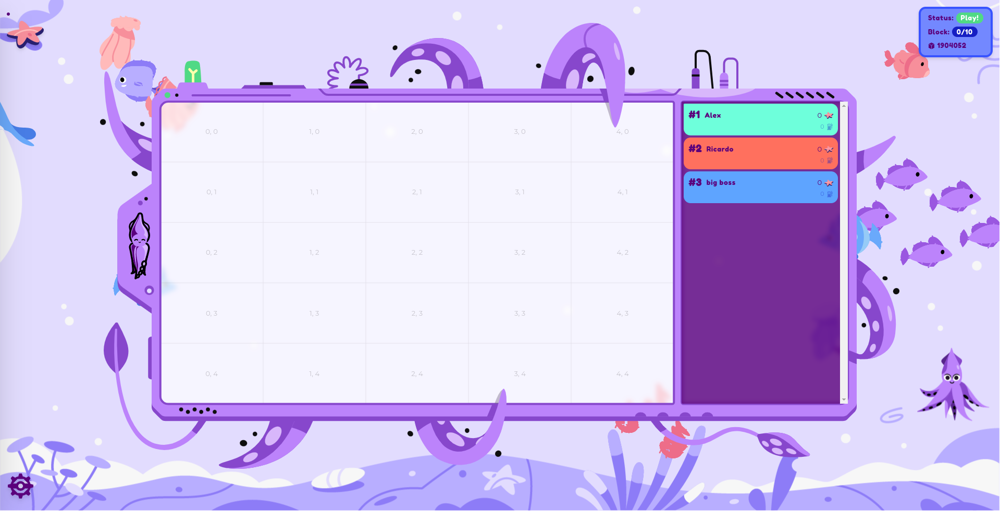

---

<pba-cols>
<pba-col>

### Agenda

</pba-col>
<pba-col>

|                    |                    |
| ------------------ | :----------------- |
| [Today](#day-1)    | ink! Intro         |
|                    | Activity           |
|                    | Hints for tomorrow |
|                    | &nbsp;             |
| [Tomorrow](#day-2) | We help you        |
|                    | Game               |
|                    | Perfect Solutions  |

</pba-col>
</pba-cols>

---

# Day 1

---


---

## Components

<br/>

<div class="flex-container fragment">
<div class="left"> <!-- Gotcha: You Need an empty line to render MD inside <div> -->
<div style="text-align: center"> <center><h2><pre> game.contract </pre></h2></center> </div>
<ul>
<li>We deploy + run.</li>
<li>Runs game loop.</li>
<li>Invokes each player.</li>
<li>Determines the score.</li>
</ul>
</div>

<div class="left fragment"> <!-- Gotcha: You Need an empty line to render MD inside <div> -->
<div style="text-align: center"> <center><h2><pre> player.contract </pre></h2></center> </div>

<ul>
<li>Your job.</li>
</ul>
</div>
<div class="right fragment"> <!-- Gotcha: You Need an empty line to render MD inside <div> -->
<div style="text-align: center"> <center><h2><pre> frontend </pre></h2></center> </div>
<ul>
<li>On big screen during game.</li>
</ul>
</div>
</div>

---

## The Process

1. 🧠 Create contract that plays on your behalf<!-- .element: class="fragment" data-fragment-index="1" -->
1. 🚀 Deploy contract to Rococo testnet <!-- .element: class="fragment" data-fragment-index="2" -->
1. 🤝 Register contract as player with game contract<!-- .element: class="fragment" data-fragment-index="3" -->
1. ️🎮 We start the game<!-- .element: class="fragment" data-fragment-index="4" -->
1. 📺️️ It runs for some minutes, we watch it on screen<!-- .element: class="fragment" data-fragment-index="5" -->

---

## How the Game looks



Notes:

- Your player gets a random color assigned

---

## How the Game looks


---

## How the Game looks


---

## How to score?

- Use as little gas as possible to paint as many fields as possible.

<!-- .element: class="fragment" -->

- Stay within your gas budget.

<!-- .element: class="fragment" -->

- The later you manage to still paint a field the better you score.

<!-- .element: class="fragment" -->

- No overpainting! First player to paint a field owns it.

<!-- .element: class="fragment" -->

---

## Basic Player Contract

```rust [1-2,19|3-4|7-10|12-17|1-19]
#[ink::contract]
mod player {
    #[ink(storage)]
    pub struct Player {}

    impl Player {
        #[ink(constructor)]
        pub fn new() -> Self {
            Self {}
        }

        /// Called during every game round.
        /// Return `(x, y)` coordinate of pixel you want to color.
        #[ink(message, selector = 0)]
        pub fn your_turn(&self) -> Option<(u32, u32)> {
            Some(1, 2)
        }
    }
}
```

---

## How to play


---

## How to play


---

## How to play


---

## How to play


---

## Now (1)

[github.com/paritytech/squink-splash-beginner ➜ todo-1.md](https://github.com/paritytech/squink-splash-beginner/blob/main/todo-1.md)

---

## Now (2)

[github.com/paritytech/squink-splash-beginner ➜ todo-2.md](https://github.com/paritytech/squink-splash-beginner/blob/main/todo-2.md)

---

## 🕹️🎮 Let's play! 🕹️🎮

[https://splash.use.ink](https://splash.use.ink)

---

## The Game Contract

> [`ink-workshop/game/lib.rs`](https://github.com/paritytech/ink-workshop/blob/main/game/lib.rs)

- `pub fn submit_turn(&mut self)`

<!-- .element: class="fragment" -->

- `pub fn board(&self) -> Vec<Option<FieldEntry>>`

<!-- .element: class="fragment" -->

- `pub fn gas_budget(&self) -> u64`

<!-- .element: class="fragment" -->

- `pub fn dimensions(&self) -> (u32, u32)`

<!-- .element: class="fragment" -->

---

## Until Tomorrow 🧠

- Find a strategy for your player.<br/><br/>
- Use as little gas as possible to paint as many fields as possible.
- Stay within your gas budget.
- The later you manage to still paint a field, the better you score.<br/><br/>
- No overpainting! First player to paint a field owns it.
- [paritytech/squink-splash-advanced](https://github.com/paritytech/squink-splash-advanced)

---

## How to test locally?

[paritytech/squink-splash-advanced](https://github.com/paritytech/squink-splash-advanced)

---

## Hint: Playfield Dimensions

- Paint within the bounds of the playfield!
- Otherwise you wasted a turn.

---

## Ideas

- You can call your own contract as often as you want!

<!-- .element: class="fragment" -->

- Random number

<!-- .element: class="fragment" -->

- Query which fields are free
  - Query game state via cross-contract call
  - Off-chain computation

<!-- .element: class="fragment" -->

---

<!-- .slide: data-background="../img/ink/Questions_2.svg"" -->

---

# Day 2

---


---

<pba-cols>
<pba-col center>

### Now

We help you debug!

</pba-col>
<pba-col center>

### Then

🕹️🎮🕹️🎮

</pba-col>
<pba-col center>

### Thereafter

Solutions Explainer

</pba-col>
</pba-cols>

<br/>

<blockquote style="text-align: left; font-size: 0.9em;">
Use as little gas as possible to paint as many fields as possible.<br/><br/>
Stay within your gas budget.<br/><br/>
The later you manage to still paint a field, the better you score.<br/><br/>
No overpainting! First player to paint a field owns it.<br/>
</blockquote>

<br/>
<br/>

[paritytech/squink-splash-advanced](https://github.com/paritytech/squink-splash-advanced)

---

## Frontend

[https://splash.use.ink](https://splash.use.ink)

---

## Questions

- What strategy did the winner choose?

<!-- .element: class="fragment" -->

- What strategies did the others choose?

<!-- .element: class="fragment" -->

- What do you think would be the perfect strategy?

<!-- .element: class="fragment" -->

---

## Board Dimensions

- Worst 😱
  - Cross-contract call to `game`<br/><br/>

```rust
#[ink(message)]
pub fn dimensions(&self) -> (u32, u32)
```

<br/><br/>

<!-- .element: class="fragment" -->

- Best 👍️
  - `const width: u32`
  - `new(width: u32, height: u32)`

<!-- .element: class="fragment" -->

---

## More Pitfalls


- Forgetting `--release`

<!-- .element: class="fragment" -->

- Iterating over a datastructure in your contract

<!-- .element: class="fragment" -->

---

## Avoid iteration

<pba-cols>
<pba-col center>

```
#[ink(message)]
fn pay_winner()
  let winner = self.players.find(…);

  self.transfer(winner, …);
}
```

</pba-col>
<!-- .element: class="fragment" -->
<pba-col center>

```rust
#[ink(message)]
fn pay_winner(
    winner: AccountId
) {
  assert!(is_winner(winner));

  self.transfer(winner, …);
}
```

</pba-col>
<!-- .element: class="fragment" -->
</pba-cols>
---

## Strategy 1<br/>Return Random Numbers


---

## Strategy 1<br/>Return Random Number

- Wasm-compatible RNG
<!-- .element: class="fragment" -->
- Use Storage to hold seed for random number
<!-- .element: class="fragment" -->
- 📈 Uses little Gas
<!-- .element: class="fragment" -->
- 📉 Quickly runs into collisions
<!-- .element: class="fragment" -->
- 📉 Score function rewards players that late in game still paint fields
<!-- .element: class="fragment" -->

---

## Strategy 2<br/>Paint only free fields


---

## Strategy 2<br/>Paint only free fields

- Query board for free fields
- 📈 Succeeds late in game

<!-- .element: class="fragment" -->

- 📉 Cross-contract call 💰️
- 📉 Need to iterate over `Mapping`: `O(n)`

<!-- .element: class="fragment" -->

---

## Strategy 3<br/>Shift computation off-chain


---

## Strategy 3<br/>Shift computation off-chain

- Off-chain Script
  - Query board ➜ Search free field<br/><br/>

<!-- .element: class="fragment" -->

- ```rust[1-2|1-7]
  #[ink(message)]
  fn set_next_turn(turn: …) {}

  #[ink(message, selector = 0)]
  pub fn your_turn(&mut self) -> {
    self.next_turn
  }
  ```

<!-- .element: class="fragment"  -->

---

## Strategy 4<br/>Exploit player sorting in game loop


---

## Strategy 4<br/>Exploit player sorting in game loop

- On top of Strategy 3 (off-chain computation).
<!-- .element: class="fragment"  -->

- Game loop calls players in same order each time.
<!-- .element: class="fragment"  -->

```rust
#[ink(message)]
fn submit_turn(&mut self) {
    // -- snip --

    for (idx, player) in players.iter_mut().enumerate() {
        …
    }

  // -- snip --
}
```

<!-- .element: class="fragment"  -->

---

## Strategy 4<br/>Exploit player sorting in game loop

```rust
impl<T: Config> AddressGenerator<T> for DefaultAddressGenerator {
	fn generate_address(
		deploying_address: &T::AccountId,
		code_hash: &CodeHash<T>,
		input_data: &[u8],
		salt: &[u8],
	) -> T::AccountId {

    // -- snip --

	}
}
```

➜ All inputs are known

<!-- .element: class="fragment"  -->

➜ Generate low `T::AccountId` with known inputs

<!-- .element: class="fragment"  -->

---

## Strategy 5<br/>Checking these slides already yesterday


---

<!-- .slide: data-background="../img/ink/Questions_2.svg"" -->
