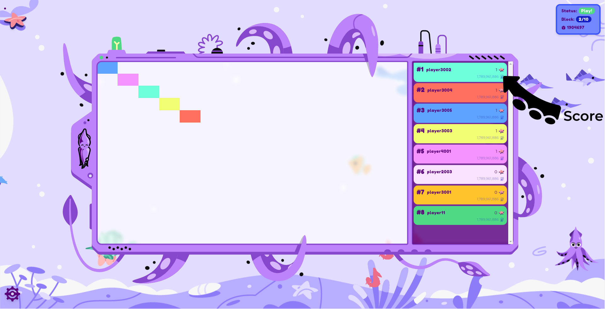
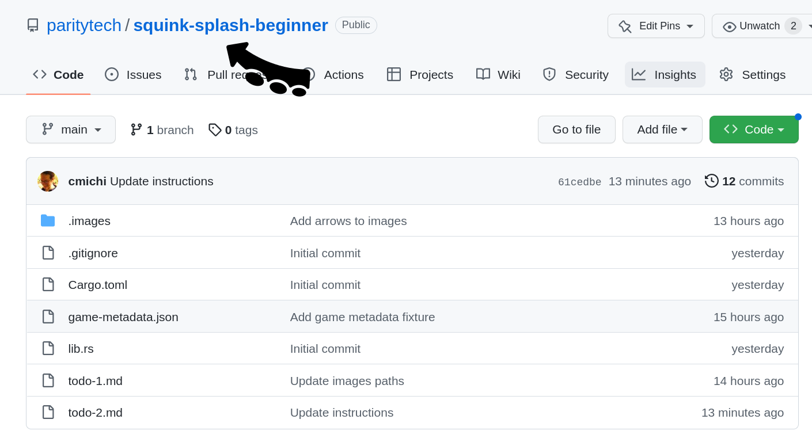
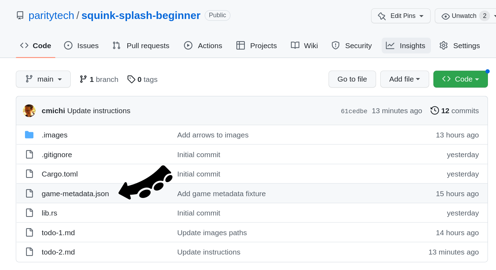

Notes:

This workshop was an idea that came from first wave of PBA in Cambridge. The first time it was ever played was back in Buenos Aires. It's very much a PBA right of passage, so it's exciting to be able to play today.

---


Notes:

This is us playing in BA earlier this year.

---

## Components

<br/>

<div class="flex-container fragment">
<div class="left"> <!-- Gotcha: You Need an empty line to render MD inside <div> -->
<div style="text-align: center"> <center><h2><pre> game.contract </pre></h2></center> </div>
<ul>
<li>We deploy + run.</li>
<li>Runs game loop.</li>
<li>Invokes each player.</li>
<li>Determines the score.</li>
</ul>
</div>

<div class="left fragment"> <!-- Gotcha: You Need an empty line to render MD inside <div> -->
<div style="text-align: center"> <center><h2><pre> player.contract </pre></h2></center> </div>

<ul>
<li>Your job.</li>
</ul>
</div>
<div class="right fragment"> <!-- Gotcha: You Need an empty line to render MD inside <div> -->
<div style="text-align: center"> <center><h2><pre> frontend </pre></h2></center> </div>
<ul>
<li>On big screen during game.</li>
</ul>
</div>
</div>

Notes:

The game has three components:  
**click** the first is a game contract, which is something that we have taken care of. I will deploy it and run it on Rococo. The game contract runs the game loop. It invokes each player contract and it determines the score.  
**click** And the player.contract, that's your job. so we we have a template for a very basic player and you can basically modify it in any way you like. I will explain the scoring function in a moment.  
**click** Lastly, we have a front-end that we will put on the big screen here, but it's online, you can open it up on your laptop and follow the game locally.

---

## The Process

1. 🧠 Create contract that plays on your behalf<!-- .element: class="fragment" data-fragment-index="1" -->
1. 🚀 Deploy contract to Rococo testnet <!-- .element: class="fragment" data-fragment-index="2" -->
1. 🤝 Register contract as player with game contract<!-- .element: class="fragment" data-fragment-index="3" -->
1. ️🎮 We start the game<!-- .element: class="fragment" data-fragment-index="4" -->
1. 📺️️ It runs for some minutes, we watch it on screen<!-- .element: class="fragment" data-fragment-index="5" -->

Notes:

So the process is as follows:  
**click** - you brainstorm and create a contract that plays on your behalf ideally in a better way than the other contracts  
**click** - you deploy the contract to the Rococo testnet  
**click** - you register your contract as a player with the game contract. We will publish the addresses and it's it's not complicated you can just use contracts UI. I will also show it in a second  
**click** - then we start the game. We have a script that calls the game contract regularly and the front end will display the changes  
**click** - so the game will run for some minutes. Your contract will already be uploaded at this point - so you can't do anything. The contract will play on your behalf. Meaning it's hands off. I mean you can also change it with upgradable contract patterns and stuff, but in general, you won't have to. So you can just watch the game play out.  
If you're familiar with AI agents, that's also a similar idea, where you have an agent that plays a game on your behalf.

---

## How the Game looks


Notes:

This is what the game board itself looks like.
You can see, it's a it's a coordinate grid.

---

## How the Game looks


Notes:

this is X1 y0  
And the idea is for you, as a contract developer, to paint as many fields of this canvas of the script as possible. There's an API function for how to paint. I'll show it in a minute, but the idea is that in the end the contract that painted the most Fields wins.

---

## How the Game looks



Notes:

So yeah, there's bit of scoring to be done. There's also scoreboard here on the side, where all players will be shown as well as their rank. You will be assigned a random color to your player contract.

---

## How to score?

- Use as little gas as possible to paint as many fields as possible.

<!-- .element: class="fragment" -->

- Stay within your gas budget.

<!-- .element: class="fragment" -->

- The later you manage to still paint a field the better you score.

<!-- .element: class="fragment" -->

- No overpainting! First player to paint a field owns it.

<!-- .element: class="fragment" -->

Notes:

This game was designed in a way where all of the best practices for smart contract development will make your player run better. We really tried to gamify some of the concepts that are really best practices of how you should develop a smart contract.  
**click** - first one is to use as little gas as possible to paint as many fields as possible. Gas consumption is a super big thing as user fees derived from that and the transaction throughput also relates to how big a contract is so the less complex your contract is the better it will do.  
**click** - There's a certain gas budget allocated per player and if you if you're above that then you just won't make a turn. So you have to stay in an optimal gas budget.  
**click** - the later in the in the game that you still manage to paint the field the better you score because what will happen is that there will be all kinds of fields painted and it will convert to a place where there's only a few left. so if you have a player that just randomly tries to paint things then at some at some point it just won't no longer work because it doesn't paint the unpainted fields. But in order to find those, you will have to have some more complex logic in your contract.  
**click** - and lastly, there's no overpainting. So the first player to paint a field owns it. So if you have a contract that just paints the same field over and over again, it will just not work. So you have to have some logic in there that checks whether a field is already painted or not.

---

## Basic Player Contract

```rust [1-2,19|3-4|7-10|12-17|1-19]
#[ink::contract]
mod player {
    #[ink(storage)]
    pub struct Player {}

    impl Player {
        #[ink(constructor)]
        pub fn new() -> Self {
            Self {}
        }

        /// Called during every game round.
        /// Return `(x, y)` coordinate of pixel you want to color.
        #[ink(message, selector = 0)]
        pub fn your_turn(&self) -> Option<(u32, u32)> {
            Some(1, 2)
        }
    }
}
```

Notes:

So this is a very basic player contract.  
We have a repository app set up with the template for this - I will share the link in a second. How it looks is - it's a contract that defines the player module,  
**click** - a super simple player doesn't have to contain any storage whatsoever.  
**click**- a super simple player also doesn't have to contain any Constructor arguments  
**click** - and it can just return a random constant value. So this is the most simple player ever.
What your player needs to do is to have one message, that has a defined selector, so you don't have to think more about this. It's just that it needs to have this function and this function is called by the game with every round. And whatever you return from this function. This is your your turn for the game.  
So if in this case you return an option some(1,2), this would mean you paint the pixel at X1 Y2.  
In that case, it would be a very boring play.  
Who can tell me what would happen here?  
_(a player that only makes one turn - it always tries to paint the same field. And if someone else also chose the same magic numbers then it wouldn't even make a turn at all.)_  
**click** - So there's a couple things of how you can improve on that and I will show some hints later, but for now what we're gonna do is look at the repository and see how we can get started with this.

---

## How to play



Notes:

This is the Squink-Splash-beginner Repository - it contains a couple of things.

---

## How to play


Notes:

It contains the cargo.toml file and the lib.rs, which is the player that I just showed.

---

## How to play



Notes:

It contains the game metadata. You will need this in order to interact with the game itself, to register your player and so on. but yeah we will show that.

---

## How to play


Notes:

And it has 2 todo files. The first is some instructions on General setup and the second one is in order to build your player.

---

## Now (1)

[github.com/paritytech/squink-splash-beginner ➜ todo-1.md](https://github.com/paritytech/squink-splash-beginner/blob/main/todo-1.md)

Notes:

So, the first thing that we are going to do is that I would ask all of you to go to this link here and follow the instructions.  
We will go around and help whoever has an issue. I think you might even have already used some of the requirements in there, so it may not be super complicated.

---

## Now (2)

[github.com/paritytech/squink-splash-beginner ➜ todo-2.md](https://github.com/paritytech/squink-splash-beginner/blob/main/todo-2.md)

Notes:

For this stage, you will need the address of the game. We'll post it in the chat.
This is a simple example - we're just giving you exposure to the flow of uploading your player contract.

---

## 🕹️🎮 Let's play! 🕹️🎮

[https://splash.use.ink](https://splash.use.ink)

Notes:

The next slides go over strategy. (maybe wait to to go through until you've played one game)

---

## The Game Contract

> [`ink-workshop/game/lib.rs`](https://github.com/paritytech/ink-workshop/blob/main/game/lib.rs)

- `pub fn submit_turn(&mut self)`

<!-- .element: class="fragment" -->

- `pub fn board(&self) -> Vec<Option<FieldEntry>>`

<!-- .element: class="fragment" -->

- `pub fn gas_budget(&self) -> u64`

<!-- .element: class="fragment" -->

- `pub fn dimensions(&self) -> (u32, u32)`

<!-- .element: class="fragment" -->

Notes:

When you deployed it you already saw that there's different functions that you can call.  
There are a lot of functions that are ineresting.  
**click** - the game runner calls this - if you're interested, you can take a look how it works and there might be some hints for for the game.  
**click** - then there's a function to to query the board in order to find out if certain fields are already occupied or if they are still free.  
**click** - there's a function for the gas budget so you can find out how much gas your player is allowed to use per one round. Because worst thing is if you are above this gas budget, then you just won't execute any turn during that round.
**click** - there's also function to query the game dimensions. same thing there, if you paint outside the bounds, then also you just missed one turn.

---

## Things to consider 🧠

- Develop a strategy for your player.<br/><br/>
- Use as little gas as possible to paint as many fields as possible.
- Stay within your gas budget.
- The later you manage to still paint a field, the better you score.<br/><br/>
- No overpainting! First player to paint a field owns it.
- [paritytech/squink-splash-advanced](https://github.com/paritytech/squink-splash-advanced)

---

## How to test locally?

[paritytech/squink-splash-advanced](https://github.com/paritytech/squink-splash-advanced)

Notes:

There's details in here. You could deploy locally to test things out. there's also commands you can use to deploy not using the UI.

---

## Hint: Playfield Dimensions

- Paint within the bounds of the playfield!
- Otherwise you wasted a turn.

---

## Ideas

- You can call your own contract as often as you want!

<!-- .element: class="fragment" -->

- Random number

<!-- .element: class="fragment" -->

- Query which fields are free
  - Query game state via cross-contract call
  - Off-chain computation

<!-- .element: class="fragment" -->

Notes:

**click** Lastly, some ideas for for your agent in the game you can you yourself can call your contract. as often as you want and this won't contribute to the gas used during the game. You can during the game you could also call a set of function of your contract if you want to adapt something.  
**click** You could also Generate random numbers. There are a couple of libraries out there, if you want to go along those lines you have to pay attention that it's a no standard Library. typically a random number generator libraries they typically have a feature that you need to enable in order to make them no standard compatible
**click** A clever strategy would be a query which fields are free. that's a bit more complex with the with the code snippet that we have in this Advanced repository, this would give you a hint.

---

<!-- .slide: data-background="../img/ink/Questions_2.svg"" -->
