# Introduction to Substrate

---

## What is Substrate?

Substrate is a **Rust framework** for **building blockchains** in a modular and extensible way.

---v

### Why Substrate?


Notes:
Highlight the multi-chain part.

---v

### Why Substrate?

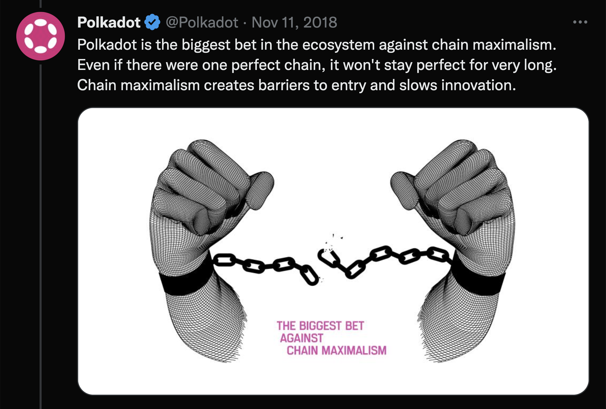

Notes:
Polkadot is the biggest bet in this ecosystem against chain maximalism, and Substrate plays a big
role in this scenario.

---v

### Why Substrate?

- ⛓️ Future is multi-chain.
- 😭 Building a blockchain is hard and prone to mistakes.
<!-- .element: class="fragment" -->
- 🧠 The need for a framework to build various blockchains is crucial for this future.
<!-- .element: class="fragment" -->

---v

### Core Philosophies of Substrate 💭

The **pre-substrate** way of thinking:

- Writing blockchains is hard.
- Coordination of upgrades in blockchains is hard.
- We are going to spend maximal resources at making sure we get it right.
<!-- .element: class="fragment" -->

---v

### Core Philosophies of Substrate 💭

The **substrate** way of thinking:

- It all starts with a deep acknowledgment that **society and technology will evolve**.
- _It is only a matter of time until the "right choice" of today turns into a mistake in the future._

---v

### Core Philosophies of Substrate 💭

Outcomes of this:

- Rust as a language.
- Upgradeability through a Wasm meta-protocol.
- Generic.

Notes:
Think about how each of these links back to "whatever you decide today will be a mistake soon".

---v

### Core Philosophies of Substrate: Rust as a language

- Memory safety is a fundamental issue in most major system-level programming languages.

- 😭 `segfault`
- 😇 You **cannot** make certain mistakes in Rust.

---v

### Core Philosophies of Substrate: Rust as a language

- 🏎️ Most Rust abstractions are **zero-cost**. Rust has no "runtime". It as fast as a binary can be.

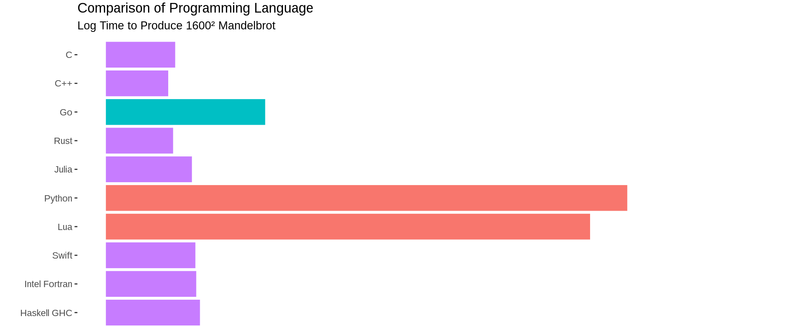

Notes:
this is not 100% accurate though, rust has a small runtime that is the panic handler etc. Rust for
Rustacean's chapter on no_std covers this very well.

---v

### Core Philosophies of Substrate: Upgradeability

- 💪🏻 Substrate is HIGHLY upgradable.
- 🕸️ Encoding the **application logic** of the chain as Wasm, and storing it onchain, such that it can be upgraded on the fly.

Notes:
make a good pause here and let them digest this.

---v

### Core Philosophies of Substrate: Generic

- Multiple consensus engines (BABE/Grandpa/AURA)
- Multiple network protocols (QUIC, TCP)
- Multiple database implementations (ParityDB, RocksDB)
- Multiple ledger-state formats (UTXO, Account-based)

---v

### Core Philosophies of Substrate: Generic

- **AlephZero**: Custom consensus, DAG-based, 1s block time.
- **Moonbeam**: Ethereum compatible, build with substrate.
- **HydraDX**: Custom transaction pool logic to match DEX orders.
- **Kulupu**: Proof of work, custom hashing.

Notes:
Substrate has been coded, from the ground up, such that it is easy to have multiple implementations
for certain functions. Heavy use of traits and generics is the key to achieve this. As noted,
Substrate has a lot of APIs, and optional implementations. You are bound to the API, but not the
particular implementation.

---

### Substrate Architecture

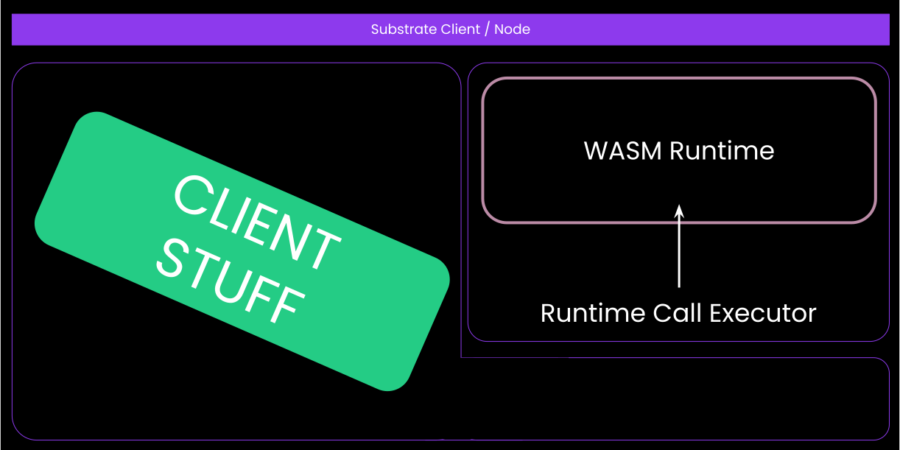

---

## The Runtime

<div>

- The runtime contains all of the **application logic** of your chain.

...

</div>
<!-- .element: class="fragment" -->
<div>

- In a more _fancy_ term, the runtime is the **state transition function**.

...

</div>
<!-- .element: class="fragment" -->

- In a more _technical_ term, the definition of **how your blockchain executes blocks**.

<!-- .element: class="fragment" -->

> (Wasm) Runtime ~ STF ~ Application/Business Logic

<!-- .element: class="fragment" -->

Notes:

- Among the definitions of the Wasm runtime, let's recap what the state transition is.
- The block execution definition will be described more in the Wasm-meta lecture.

---v

### State Transition

- **State:** The entire set of data that we want to come to consensus about.
- **Transition:** Done via the runtime, the piece of logic that dictates how the state changes.

---v

### State Transition

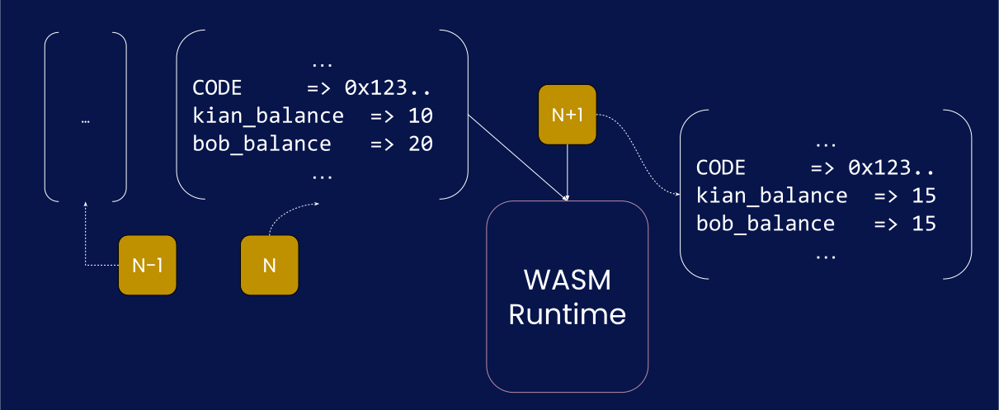

---v

### Positive Consequences of _Wasm_ Runtime 🔥

- 🤖 deterministic execution
- 🧱 sandboxing (more relevant in Polkadot)
- 🌈 Easier client development, including light clients.
- 😎 forkless upgrade!

---v

### 🤖 Deterministic Execution

- The need for determinism in a blockchain runtime is _absolute_.

---v

### 🧱 Sandboxing

- Substrate uses the same Wasm machinery for executing:

1. Smart contracts
1. Parachain runtime (i.e. PVF)

---v

### 🌈 Easier Client Development

- A Substrate client written in a different language needs to ONLY implement the host/client side.
- Then, possibly ALL SUBSTRATE BASED CHAINS will get a new client.

- Same story for a DApp that you write.

---v

### 😎 Forkless Upgrade:

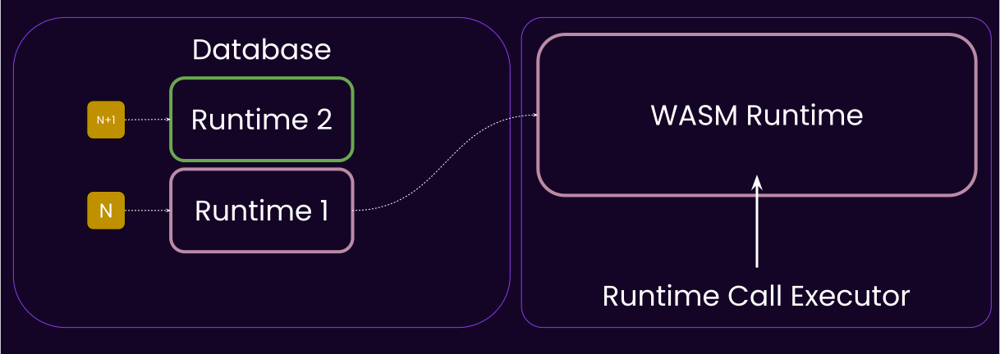

---v

### 😎 Forkless Upgrade:

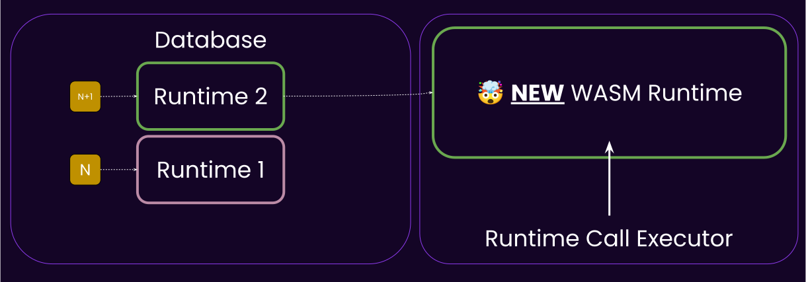

---v

### Negative Consequences of _Wasm_ Runtime 🥲

- 😩 Constrained resources (memory, speed, syscalls).
- 🤔 Client diversification != state-transition diversification

Notes:

- 4GB of memory, which we limit even further in the substrate allocator.
- Can be slower than native, depending on the executor.
- Limited access to the host host env, all needs to be done through syscalls.

---v

### What is Wasm Anyways?

> WebAssembly (abbreviated Wasm) is a _binary instruction format_ for a _stack-based virtual
> machine_. Wasm is designed as a _portable compilation_ target for programming languages, enabling
> deployment on the web for client and server applications.

---v

### What is Wasm Anyways?

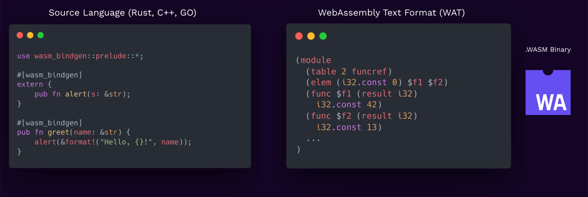

---v

### What is Wasm Anyways?

<pba-cols>
<pba-col>

- Wasm ❤️ Web
- Streaming and rapid compilation.
- Designed with the concept of host in mind.
  Sandboxed, permissioned sys-calls.

> Anyone remember "Java Applets"?

</pba-col>
<pba-col>

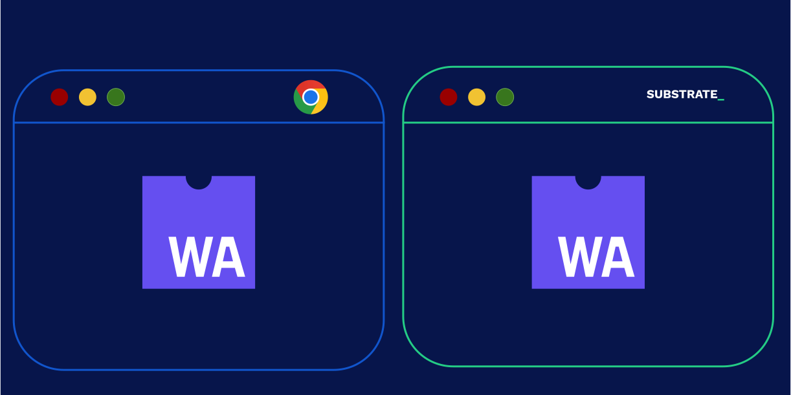

</pba-col>
</pba-cols>

Notes:
People actually tried sticking things like JVM into the browser (_Java Applets_), but it didn't work.

---v

### How to Write a Wasm Runtime?

- Any language that can compile to Wasm and exposes a fixed set of functions, to be used by the client.
- ... But, of course, Substrate comes with a framework to make this developer-friendly, **FRAME™️**.

---

## The Client

Everything else you need in a blockchain, except the runtime/STF/Application-logic we just spoke of.

---v

### The Client

- Compiled to native.
- Less need for determinism.
- Has access to anything a normal native binary does (memory, disk, syscalls etc.)
- Does all the other shared things that most blockchains want
  - Database, Networking, Mempool, Consensus..

---v

### The Client


Notes:
Walk over each component and explain what role they play. Nomenclature stuff.

---v

### The Client: Consensus 🤔

- Yes, consensus is not a core part of a blockchain runtime.
  It is not application logic.
  It is not something you want to customize.

- The consensus protocol is to your runtime what HTTP is to Facebook.

Notes:

comments from Joshy:

I think this is important.

The runtime is the application you want to run.
Consensus is outside of this application helping us agree what the official state of this runtime is.
Last wave I used this analogy.

Imagine a writers room for some TV show.
Writers are sitting around coming up with potential plot points for future episodes.
Any of their ideas could work.
But eventually they need to agree what the next episode to air actually will be.

---v

### The Client: Database 🤔

- The client is in charge of storing the data, but has **no meaningful way to interpret it**.
- The database, from the client's PoV, is a _untyped_, _opaque_, key-value storage.
- The runtime knows which key means what.

> A few exceptions exist, like `:code` being the key for the Wasm blob.

---v

### The Client: Database 🤔

<pba-cols>
<pba-col>

Because the runtime can change independently!

</pba-col>
<pba-col>


</pba-col>
</pba-cols>

---v

### SMOLDOT: Compile the Client to Wasm

<pba-cols>
<pba-col>

A marvel of universe 🤯.

- (light) Substrate\* client compiled to Wasm, by the browser.
- Itself executing another Wasm blob, the aforementioned runtime.

</pba-col>
<pba-col>

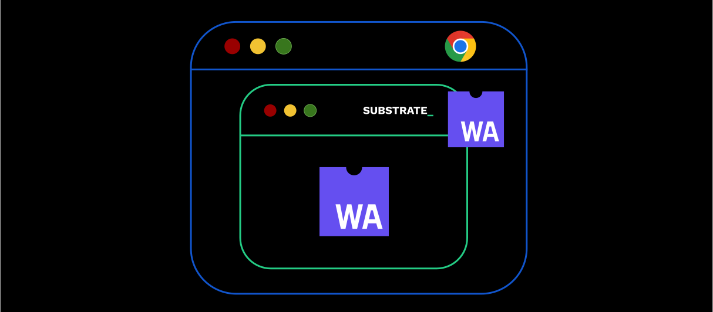

</pba-col>
</pba-cols>

---

## Communication Paths

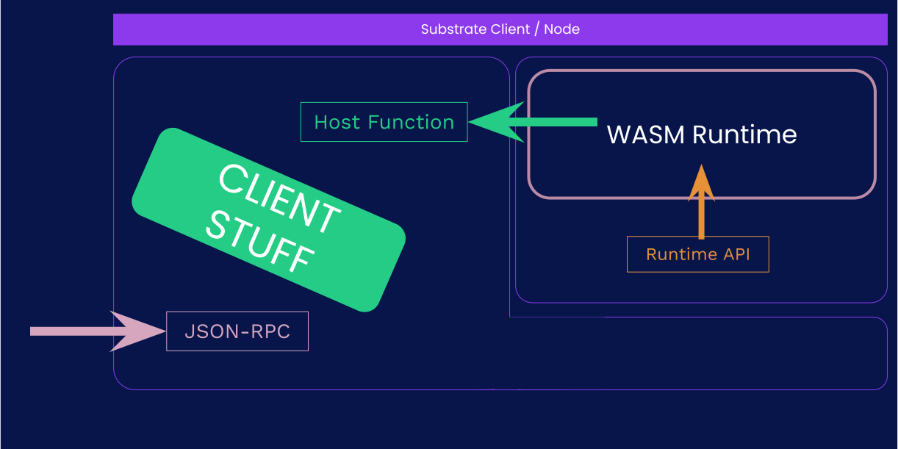

---v

### Communication Paths

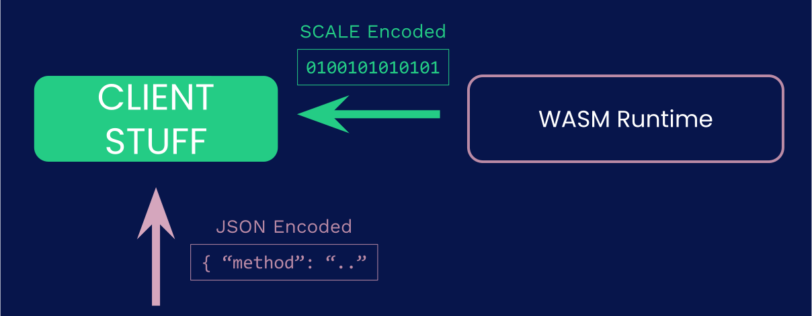

---v

### Example: SCALE vs JSON

- SCALE is an efficient, non-descriptive, binary encoding format, used EXTENSIVELY in the Substrate ecosystem.

---v

### Example: SCALE vs JSON

```rust
use parity_scale_codec::{Encode};

#[derive(Encode)]
struct Example {
	number: u8,
	is_cool: bool,
	optional: Option<u32>,
}

fn main() {
	let my_struct = Example {
		number: 42,
		is_cool: true,
		optional: Some(69),
	};
	println!("{:?}", my_struct.encode());
	// [42, 1, 1, 69, 0, 0, 0]
	println!("{:?}", my_struct.encode().len());
	// 7
}
```

---v

### Example: SCALE vs JSON

```rust
use serde::{Serialize};

#[derive(Serialize)]
struct Example {
	number: u8,
	is_cool: bool,
	optional: Option<u32>,
}

fn main() {
	let my_struct = Example {
		number: 42,
		is_cool: true,
		optional: Some(69),
	};
	println!("{:?}", serde_json::to_string(&my_struct).unwrap());
	// "{\"number\":42,\"is_cool\":true,\"optional\":69}"
	println!("{:?}", serde_json::to_string(&my_struct).unwrap().len());
	// 42
}
```

---

### Substrate: The Gaming Console of Blockchains!

<pba-cols>
<pba-col>


Substrate Client

</pba-col>
<pba-col>


Substrate Runtime

</pba-col>
</pba-cols>

Notes:

https://www.cleanpng.com/png-game-boy-advance-deviantart-video-game-consoles-2183359/

---

### Substrate: VHDL and FPGA analogy.

---

## Substrate and Polkadot

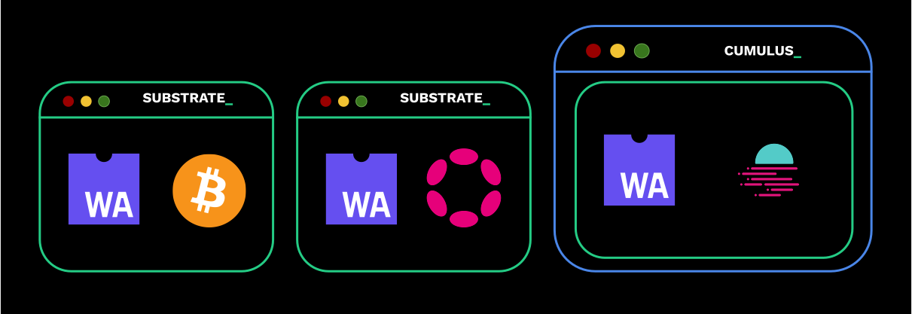

---

## Substrate and Smart Contracts

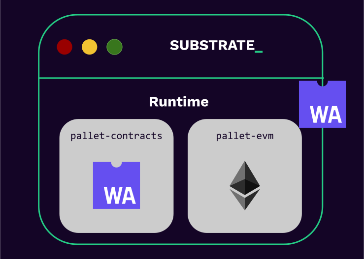

---v

### Substrate and Smart Contracts

- So a SMOLDOT instance, syncing a substrate based chain which has pallet-contracts is ...🤔

---v

### Substrate and Smart Contracts

<pba-cols>
<pba-col center>


</pba-col>
<pba-col>

- The browser is executing:
- a Wasm blob (smoldot)
- that executes a Wasm blob (runtime)
- that executes a Wasm blob (contract)

</pba-col>
</pba-cols>

---v

### Substrate and Smart Contracts


---v

### Substrate and Smart Contracts

- So when should you write with a smart contract (Ink!) and when a Runtime (FRAME)?

Notes:
I was asked this yesterday as well. My latest answer is: if you don't need any of the customizations
that a blockchain client/runtime gives to you, and the performance of a shared platform is okay for
you, then go with a smart contract. If you need more, you need a "runtime" (some kind of chian,
parachain or solo)

An example of customization is that a runtime has access to `on_initialize` etc.

Also, a contract can not have fee-less transactions.

Also, a contract usually depends on a token for gas, while a runtime can be in principle token-less
fee-less.

---

## Technical Freedom vs Ease


---

## Rest of This Module! 😈

<pba-cols>
<pba-col>

##### Lecture

- Day 0:
  - **Introduction**
  - Folder structure.
- Day 1:
  - **Wasm Meta-Protocol**
  - SCALE, JSON-RPC
- Day 2:
  - **Storage**
  - Substrate CLI, TX-Pool

</pba-col>
<pba-col>

##### Activity

- Day 0:
  - Compiling Rust to Wasm
- Day 1:
  - FRAME-less Activity
- Day 2:
  - FRAME-less Activity

</pba-col>
</pba-cols>

---

# Additional Resources! 😋

Check speaker notes (click "s" 😉).

Notes:

- Read more about why we use Rust at Parity: https://www.parity.io/blog/why-rust

- An interesting question on JVM/Wasm: https://stackoverflow.com/questions/58131892/why-the-jvm-cannot-be-used-in-place-of-webassembly

- Rust safety: https://stanford-cs242.github.io/f18/lectures/05-1-rust-memory-safety.html
- https://www.reddit.com/r/rust/comments/5y3cxb/how_many_security_exploits_would_rust_prevent/

- The substrate clients should still have some level of _determinism in their performance_. If
  authority nodes have extremely varied performances, they could start finalizing different forks.

- There have been attempts at writing FRAME alternatives, namely assemblyscript. https://github.com/LimeChain/as-substrate-runtime

- Think about the differences between a runtime and a smart contract.

  - A runtime is in some sense a smart contract as well, but not a user-deployed one.
  - https://en.wikipedia.org/wiki/Smart_contract
  - https://www.futurelearn.com/info/courses/defi-exploring-decentralised-finance-with-blockchain-technologies/0/steps/251885#:~:text=to%20the%201990s.-,Writing%20in%201994%2C%20the%20computer%20scientist%20Nick%20Szabo%20defined%20a,of%20artificial%20intelligence%20is%20implied.

- Substrate Primitives (`sp-*`), Frame (`frame-*`) and the pallets (`pallets-*`), binaries (`/bin`)
  and all other utilities are licensed under [Apache
  2.0](https://www.apache.org/licenses/LICENSE-2.0.html).

Substrate Client (`/client/*` / `sc-*`) is licensed under [GPL
v3.0](https://www.gnu.org/licenses/gpl-3.0.html) with a [classpath linking
exception](https://www.gnu.org/software/classpath/license.html).

- Apache2 allows teams full freedom over what and how they release, and giving licensing clarity to
  commercial teams.

- GPL3 ensures any deeper improvements made to Substrate's core logic (e.g. Substrate's internal
  consensus, crypto or database code) to be contributed back so everyone can benefit.

- Currently, the Wasm binary spec v1 is used, read more about the new version here: https://webassembly.github.io/spec/core/binary/index.html

### Feedback After Lecture:

- Emphasize more: SMALDOT is not the _substrate client itself compiled to Wasm_, it is another
  codebase, which can do most of the things that substrate client can do.

- Wasm runtime can allocate memory, it just does't have an allocator itself out of the box.

- State is not IN THE BLOCK, each state has AN ASSOCIATED BLOCK.
