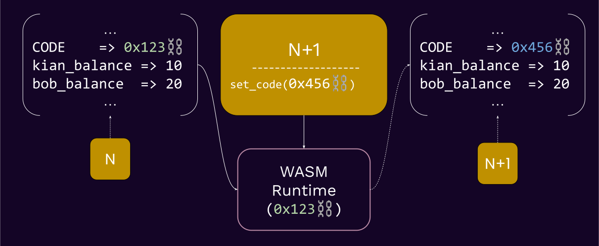

# Introduction to Substrate

---

## What is Substrate?

Substrate is a **Rust framework** for **building blockchains** in a modular and extensible way.

---v

### Why Substrate?


Notes:

Highlight the multi-chain part.

---v

### Why Substrate?


Notes:

Polkadot is the biggest bet in this ecosystem against chain maximalism, and Substrate plays a big
role in this scenario.

---v

### Why Substrate?

- ⛓️ Future is multi-chain.
<!-- .element: class="fragment" -->
- 😭 Building a blockchain is hard. Upgrading it even harder.
<!-- .element: class="fragment" -->
- 💡 Framework!
<!-- .element: class="fragment" -->

---

## Core Philosophies of Substrate 💭

The **pre-substrate** way of thinking:

- 😭 _Building a blockchain is hard. Upgrading it even harder_.
- 💪🏻 We are going to spend maximal resources at making sure we get it right.
<!-- .element: class="fragment" -->

---v

### Core Philosophies of Substrate 💭

But has this worked?

- 😭 Bitcoin block size debate
<!-- .element: class="fragment" -->
- 2️⃣ L2s and beyond
<!-- .element: class="fragment" -->
- 📈 Ethereum gas price
<!-- .element: class="fragment" -->

note:

Bitcoin block size has never been and is an ongoing debate.

I am not against L2s per se, but it is truth that they mostly exist because the underlying protocol
is too hard/slow to upgrade itself. ETH Gas prices is also shows that the underlying protocol cannot
meet the demands of today.

https://en.wikipedia.org/wiki/Bitcoin_scalability_problem
https://ycharts.com/indicators/ethereum_average_gas_price

---v

### Core Philosophies of Substrate 💭

The **Substrate** way of thinking:

- ☯️ Society and technology evolve
<!-- .element: class="fragment" -->
- 🦸 Humans are fallible
<!-- .element: class="fragment" -->
- 🧠 Best decision of today -> mistake of tomorrow
<!-- .element: class="fragment" -->

---v

### Core Philosophies of Substrate 💭

Outcomes of this:

- 🦀 Rust
- 🤩 Generic Design
- 🏦 Governance + Upgradeability

Notes:

Think about how each of these links back to "whatever you decide today will be a mistake soon".

---

## 🦀 Rust

- 😭 `segfault` / memory safety

note:

Memory safety is a fundamental issue in most major system-level programming languages.

Some such mistakes are impossible to make in Rust.

TODO: example to showcase this.

---v

### 🦀 Rust

```c
int main() {
    int* x = malloc(sizeof(int));
    *x = 10;
    int* y = x;
    free(x);
    printf("%d\n", *y);  // Accessing memory after it's been freed
}
```

<br>

```rust
fn main() {
    let x = Box::new(10);
    let y = x;
    println!("{}", *y); // ❌
}
```

<!-- .element: class="fragment" -->

---v

### 🦀 Rust

```c
int* foo() {
    int x = 10;
    return &x;
}

int main() {
    int* y = foo();
    printf("%d\n", *y); // Accessing memory out of its scope
}

```

<br>

```rust
fn foo() -> &'static i32 {
    let x = 10;
    &x
}

fn main() {
    let y = foo();
    println!("{}", y); // ❌
}
```

<!-- .element: class="fragment" -->

---v

### 🦀 Rust

> Microsoft and Google have each stated that software memory safety issues are behind around 70 percent of their vulnerabilities.

note:

https://www.nsa.gov/Press-Room/News-Highlights/Article/Article/3215760/nsa-releases-guidance-on-how-to-protect-against-software-memory-safety-issues/#:~:text=Microsoft%20and%20Google%20have%20each,70%20percent%20of%20their%20vulnerabilities.

---v

### 🦀 Rust

- 🏎️ Most Rust abstractions are **zero-cost**.
- ⏰ Rust has (almost) no "runtime".


Notes:

this is not 100% accurate though, rust has a small runtime that is the panic handler etc. Rust for
Rustacean's chapter on `no_std` covers this very well.

Also, this is a good time to talk about how we use "Runtime" in a different way.

---

### 🤩 Generic Design

- Multiple consensus engines (BABE/Grandpa/AURA)
- Multiple network protocols (QUIC, TCP)
- Multiple database implementations (ParityDB, RocksDB)
- Multiple ledger-state formats (UTXO, Account-based)
- Many types are generic
  - AccountId, Hashing, etc.

note:

---v

### 🤩 Generic Design

- **AlephZero**: Custom finality, DAG-based, 1s block time.
- **Moonbeam**: Ethereum compatible, build with substrate.
- **HydraDX**: Custom transaction pool logic to match DEX orders.
- **Kulupu**: Proof of work, custom hashing.

Notes:

Substrate has been coded, from the ground up, such that it is easy to have multiple implementations
for certain functions. Heavy use of traits and generics is the key to achieve this. As noted,
Substrate has a lot of APIs, and optional implementations. You are bound to the API, but not the
particular implementation.

---

## 🏦 Governance + Upgradeability

- 🤝 Governance and upgradeability go hand in hand. Either is pretty useless without the other.
- In fact, a third component is needed: **Self Enactment**.

note:

First, the blockchain needs to have a way to upgrade itself.
Then, we need a way to decide on that upgrade.
Finally, the upgrade need to enact itself.

---v

### 🏦 Governance + Upgradeability

- ❤️ Wasm as meta-protocol
- 🛠️ Client != Runtime

note:

Time to learn what I mean here by diving into the substrate architecture

We revisit this later and make sure we understand how the substrate architecture is designed to
allow these.

---

### Substrate Architecture

<pba-cols>

<pba-col center>
<h3 style="color: var(--substrate-runtime); top: 0"> Runtime </h3>

- Application logic
- Encoded as Wasm
- Stored as a part of your chain state
- (therefore, upgradeable 🤫)

</pba-col>

<pba-col center>
<h3 style="color: var(--substrate-host); top: 0"> Client </h3>

- Executes the Wasm runtime
- (and everything else...)

</pba-col>

</pba-cols>

---v

#### Substrate (simplified) Architecture


---

## The Client

Everything else you need in a blockchain, except the runtime/STF/Application-logic we just spoke of.

---v

### The Client

- Compiled to native.
- Acts as a _Host Environment_ for your Wasm Runtime.
- Does all the other shared things that most blockchains want
  - Database, Networking, Mempool, Consensus..

note:

recall that "Runtime Call Executor"? that, and more details are the environment in which your WASM
runs.

---v

### The Client


Notes:
Walk over each component and explain what role they play. Nomenclature stuff.

---

## The Runtime

<div>

- Runtime -> **Application Logic**.

</div>
<!-- .element: class="fragment" -->
<div>

- A _fancy_ term: Runtime -> **State Transition Function**.

</div>
<!-- .element: class="fragment" -->
<div>

- A _technical_ term: Runtime -> **how to execute blocks**.

</div>
<!-- .element: class="fragment" -->

> (Wasm) Runtime ~ STF ~ Application/Business Logic

<!-- .element: class="fragment" -->

Notes:

- I would personally call the runtime STF to avoid confusion with the "runtime" that is the general
  programming runtime, but kinda too late for that now.
- Among the definitions of the Wasm runtime, let's recap what the state transition is.
- The block execution definition will be described more in the Wasm-meta lecture.

---

## State Transition Function

Definition

1. State
2. Transition

note:

- **State:** The entire set of data that we want to come to consensus about.
- **Transition:** Done via the runtime, the piece of logic that dictates how the state changes.

---v

### State Transition Function


note:

The Wasm runtime in this figure is in fact obtained from the state (see `0x123`)

---v

### State Transition Function



---v

### State Transition Function


note:

could we have updated the code in N+1? By default, no because we load the wasm before you even look
into the block.

IMPORTANT: State is not IN THE BLOCK, each state has AN ASSOCIATED BLOCK.

---

## Positive Consequences of _Wasm_ Runtime 🔥

- 🤖 Portable, yet deterministic execution
- 🧱 Sandboxing (more relevant in Polkadot)
- 🌈 Easier (light) client development.
- 😎 Forkless upgrade!

---v

### 🤖 Deterministic Execution

- The need for determinism in a blockchain runtime is _absolute_.

note:

Wasm's instruction set is deterministic, so all good.

---v

### 🧱 Sandboxing

- Useful when executing untrusted code.

1. Smart contracts
2. Parachain runtime

note:

howe can we guarantee that neither enter an infinite loop, or try to access the filesystem?

---v

### 🌈 Easier (light)Client Development

note:

for the case of client, your client only needs to implement a set of host environments, and NOT
re-implement the business logic.

Simply compare the process to create an alternative client for Ethereum, where you need to
re-implement the EVM.

Same applies to light client, as they do not need to deal with the state transition function.

---v

### 😎 Forkless Upgrade


---v

### 😎 Forkless Upgrade


---v

### 😎 Forkless Upgrade

Forkless? 🤨

note:

take a moment to establish that this upgrade is forkless. The runtime is upgraded, but the client is
not. In fact, the client didn't need to know about this at all.

---

## Negative Consequences of _Wasm_ Runtime

- 😩 Constrained resources (memory, speed, host access).
- 🌈 Client diversification != state-transition diversification

Notes:

- 4GB of memory, which we limit even further.
- Wasm has no allocator+panic handler of its own
- Can be slower than native, depending on the executor/execution method.
- Limited access to the host host env, all needs to be done through syscalls.

Less state-transition diversification, because the runtime is the same for all clients. If there a
bug in it, everyone is affected.

---

## Consensus <> Runtime 🤔

- Yes, consensus is not a core part of a blockchain runtime.
  It is not application logic.
  It is not something you want to customize.

- The consensus protocol is to your runtime what HTTP is to Facebook.

Notes:

comments from Joshy:

I think this is important. The runtime is the application you want to run.

Consensus is outside of this application helping us agree what the official state of this runtime
is. Last wave I used this analogy.

Imagine a writers room for some TV show. Writers are sitting around coming up with potential plot
points for future episodes. Any of their ideas could work. But eventually they need to agree what
the next episode to air actually will be.

---

## The Client: Database 🤔

- The client is in charge of storing the data, but has **no meaningful way to interpret it**.
- The database, from the client's PoV, is a _untyped_, _opaque_, key-value storage.
- The runtime knows which key means what.

> A few exceptions exist, like `:code` being the key for the Wasm blob.

---v

### The Client: Database 🤔

<pba-cols>
<pba-col>

Because the runtime can change independently!

</pba-col>
<pba-col>


</pba-col>
</pba-cols>

---

## SMOLDOT: Compile Client to Wasm

<pba-cols>
<pba-col>

- (light) Substrate\* client compiled to Wasm, by the browser.
- Itself executing another Wasm blob, the aforementioned runtime.

</pba-col>
<pba-col>


</pba-col>
</pba-cols>

note:

SMOLDOT is not exactly a substrate client. It is mainly designed to work with Polkadot. But with
minimal tweaks, you could make it work for more substrate based chains.

This has to do with the fact that consensus and a few other bits of the client and runtime are not
100% independent. For example, GRANDPA has a pallet on the runtime side, but is mostly in the
client. Now, a client that is configured with GRANDPA can only work with runtimes that are also
configured with GRANDPA.

---

## Communication Paths


---v

### Communication Paths


---v

### Example: SCALE vs JSON

- SCALE is an efficient, non-descriptive, binary encoding format, used EXTENSIVELY in the Substrate ecosystem.

---v

### Example: SCALE vs JSON

```rust
use parity_scale_codec::{Encode};

#[derive(Encode)]
struct Example {
	number: u8,
	is_cool: bool,
	optional: Option<u32>,
}

fn main() {
	let my_struct = Example {
		number: 42,
		is_cool: true,
		optional: Some(69),
	};
	println!("{:?}", my_struct.encode());
	// [42, 1, 1, 69, 0, 0, 0]
	println!("{:?}", my_struct.encode().len());
	// 7
}
```

---v

### Example: SCALE vs JSON

```rust
use serde::{Serialize};

#[derive(Serialize)]
struct Example {
	number: u8,
	is_cool: bool,
	optional: Option<u32>,
}

fn main() {
	let my_struct = Example {
		number: 42,
		is_cool: true,
		optional: Some(69),
	};
	println!("{:?}", serde_json::to_string(&my_struct).unwrap());
	// "{\"number\":42,\"is_cool\":true,\"optional\":69}"
	println!("{:?}", serde_json::to_string(&my_struct).unwrap().len());
	// 42
}
```

---

### Substrate: The Gaming Console of Blockchains!

<pba-cols>
<pba-col>


Substrate Client

</pba-col>
<pba-col>


Substrate Runtime

</pba-col>
</pba-cols>

Notes:

https://www.cleanpng.com/png-game-boy-advance-deviantart-video-game-consoles-2183359/

---

### Substrate: VHDL and FPGA analogy.

---

## Substrate and Polkadot


---

## Substrate and Smart Contracts


---v

### Substrate and Smart Contracts

- So a SMOLDOT instance, syncing a substrate based chain which has pallet-contracts is ...🤔

---v

### Substrate and Smart Contracts

<pba-cols>
<pba-col center>


</pba-col>
<pba-col>

- The browser is executing:
- a Wasm blob (smoldot)
- that executes a Wasm blob (runtime)
- that executes a Wasm blob (contract)

</pba-col>
</pba-cols>

---v

### Substrate and Smart Contracts


---v

### Substrate and Smart Contracts

- So when should you write with a smart contract (Ink!) and when a Runtime (FRAME)?

Notes:
I was asked this yesterday as well. My latest answer is: if you don't need any of the customizations
that a blockchain client/runtime gives to you, and the performance of a shared platform is okay for
you, then go with a smart contract. If you need more, you need a "runtime" (some kind of chian,
parachain or solo)

An example of customization is that a runtime has access to `on_initialize` etc.

Also, a contract can not have fee-less transactions.

Also, a contract usually depends on a token for gas, while a runtime can be in principle token-less
fee-less.

---

## Technical Freedom vs Ease


---

## Recap: Substrate Architecture


---

## Recap: 🏦 Governance and Upgradeability

A timeless system must be:

1. Upgradable
2. Governable
3. Self-enact upgrades

note:

Substrate's Wasm meta-protocol exactly enables all 3 ✅.

The client is basically a wasm meta-protocol that does only one thing. This meta-protocol is
hardcoded, but the protocol itself is flexible.

---

## Rest of This Module! 😈

<pba-cols>
<pba-col>

##### Lecture

- Day 0:
  - **Introduction**
  - Folder structure.
- Day 1:
  - **Wasm Meta-Protocol**
  - SCALE, JSON-RPC
- Day 2:
  - **Storage**
  - Substrate CLI, TX-Pool

</pba-col>
<pba-col>

##### Activity

- Day 0:
  - Compiling Rust to Wasm
- Day 1:
  - FRAME-less Activity
- Day 2:
  - FRAME-less Activity

</pba-col>
</pba-cols>

---

## Appendix: What is Wasm Anyways?

> WebAssembly (abbreviated Wasm) is a _binary instruction format_ for a _stack-based virtual
> machine_. Wasm is designed as a _portable compilation_ target for programming languages, enabling
> deployment on the web for client and server applications.

---v

### What is Wasm Anyways?


---v

### What is Wasm Anyways?

<pba-cols>
<pba-col>

- Wasm ❤️ Web
- Streaming and rapid compilation.
- Designed with the concept of host in mind.
  Sandboxed, permissioned sys-calls.

> Anyone remember "Java Applets"?

</pba-col>
<pba-col>


</pba-col>
</pba-cols>

Notes:
People actually tried sticking things like JVM into the browser (_Java Applets_), but it didn't work.

---v

### How to Write a Wasm Runtime?

- Any language that can compile to Wasm and exposes a fixed set of functions, to be used by the client.
- ... But, of course, Substrate comes with a framework to make this developer-friendly, **FRAME™️**.

---

## Appendix: More Diagrams of Substrate and Polkadot

note:

I made these figures recently to explain the relationship between Substrate, Cumulus and Polkadot.
They use the most generic term for client and runtime, namely "Host" and "STF" respectively.

---v

Substrate


---v

Polkadot


---v

A Parachain


---

## Additional Resources! 😋

> Check speaker notes (click "s" 😉)

Notes:

- Read more about why we use Rust at Parity: https://www.parity.io/blog/why-rust

- An interesting question on JVM/Wasm: https://stackoverflow.com/questions/58131892/why-the-jvm-cannot-be-used-in-place-of-webassembly

- Rust safety: https://stanford-cs242.github.io/f18/lectures/05-1-rust-memory-safety.html
- https://www.reddit.com/r/rust/comments/5y3cxb/how_many_security_exploits_would_rust_prevent/

- The substrate clients should still have some level of _determinism in their performance_. If
  authority nodes have extremely varied performances, they could start finalizing different forks.

- There have been attempts at writing FRAME alternatives, namely assemblyscript. https://github.com/LimeChain/as-substrate-runtime

- Think about the differences between a runtime and a smart contract.

  - A runtime is in some sense a smart contract as well, but not a user-deployed one.
  - https://en.wikipedia.org/wiki/Smart_contract
  - https://www.futurelearn.com/info/courses/defi-exploring-decentralised-finance-with-blockchain-technologies/0/steps/251885#:~:text=to%20the%201990s.-,Writing%20in%201994%2C%20the%20computer%20scientist%20Nick%20Szabo%20defined%20a,of%20artificial%20intelligence%20is%20implied.

- Substrate Primitives (`sp-*`), Frame (`frame-*`) and the pallets (`pallets-*`), binaries (`/bin`)
  and all other utilities are licensed under [Apache
  2.0](https://www.apache.org/licenses/LICENSE-2.0.html).

Substrate Client (`/client/*` / `sc-*`) is licensed under [GPL
v3.0](https://www.gnu.org/licenses/gpl-3.0.html) with a [classpath linking
exception](https://www.gnu.org/software/classpath/license.html).

- Apache2 allows teams full freedom over what and how they release, and giving licensing clarity to
  commercial teams.

- GPL3 ensures any deeper improvements made to Substrate's core logic (e.g. Substrate's internal
  consensus, crypto or database code) to be contributed back so everyone can benefit.

- Currently, the Wasm binary spec v1 is used, read more about the new version here: https://webassembly.github.io/spec/core/binary/index.html
