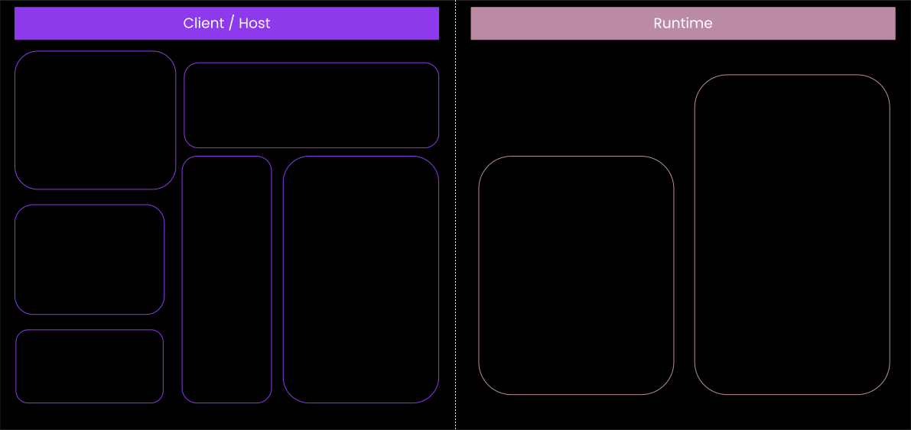
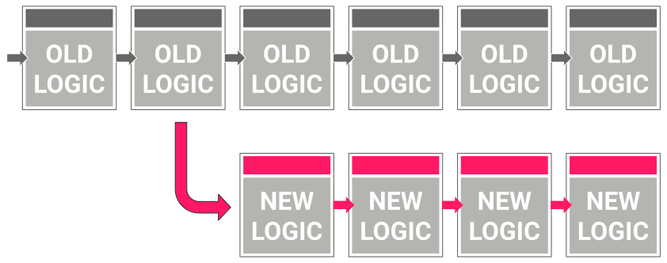
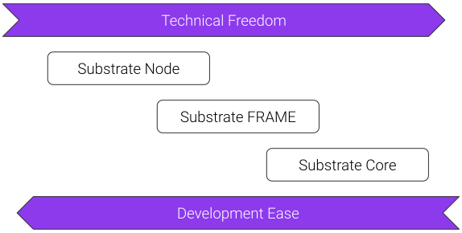

## Substrate Overview

Lecture 1, Module 4

Instructor: Shawn Tabrizi

At the end of this lecture, you will be able to:

- Describe the high level architecture of a Substrate node.
- Navigate the Substrate codebase.
- Justify why Substrate claims to be an extensible, modular framework.

---

### What is Substrate?

Substrate is a Rust framework for building modular and extensible blockchains.

---

### Why Substrate?

Building a blockchain is hard.

Like... really hard.

Note: In general you shouldn't do it. You will probably get it wrong.

---

### Why Rust?

Check out: https://www.parity.io/blog/why-rust

* Rust is Safe
* Rust is Fast
* Rust is Lightweight
* Rust is Idiomatic
* Rust is Fun (?)

---

### Substrate Architecture

At a very high level, a Substrate node has two parts:

1. The Client - A Wasm executor.
2. A Wasm runtime.

Note:

About the naming of runtime: its not the traditional sense of "runtime".

---

## What is the Runtime?

The runtime contains all of the business logic for executing the **state transition function** of the blockchain.

---

### Turing-Complete State Machine

* Turing completeness basically means you can implement any computer algorithm.
* Besides limitations from execution time, memory size, or storage limitations... the runtime is a turing-complete state machine.
* The state machine itself is broken into two components:
   * The state itself
   * The state transition function

---

### State Transition Function

Things that "transition the state":

* Messages from the "outside world".
   * For example transactions from users.
* Automated on-chain logic.

Note: We'll be revisiting these concepts later in this module.

---

## Runtime as a VM

The Runtime is designed as a Virtual Machine within the Substrate client.

### Why?

- Runtime code must execute deterministically.
- Runtime code should be sandboxed.

 

### VMs enable this.

Note: VMs handle "undefined behavior". Once translation from source to Wasm happens, the binary code is fixed. Thus if any undefined behavior is invoked the behavior will be identical, even if wrong / unintended.

---

### The runtime is always a Wasm binary.

Note:

This decision is extremely important for so many reasons we will touch on throughout the course.

---

## Wasm

* Wasm is short for WebAssembly
* It is a binary instruction format for a stack-based virtual machine.
* Originally built for the web as a faster and better alternative to technologies like JavaScript.
* The open standards for WebAssembly are developed by W3C groups.

---

### Why Substrate chose Wasm?

- Compact: Designed to be easily transferred over the web.
- Sandboxable: Keeps Wasm Safe, as capabilities have to be exposed explicitly to the Wasm environment.
- Deterministic(-ish): assuming all outputs are defined given some instruction set.
- Performance: direct mapping of operations to machine code.
- Well Supported: WASM is on its way to become a core component of the web, just like JavaScript did.

   

---

## Substrate Wasm Assumptions

- We use the WebAssembly MVP (versus the 1.0 specification).
- Uses the `wasm32-unknown-unknown` target
- The maximum amount of addressable bytes is 4 GiB
   - Substrate only allows the runtime 128 MB
- Avoid using `std` libraries in the runtime
   - Prevents most "footguns".

Note: It is _technically possible_ to use `std` however even some `std` crates that can compile to `wasm32-unknown-unknown` may lead to compile errors (for example `std::time::Instant::now()`).
Therefore, it's best practice to only use `no_std` inside a node's runtime.

---

## Wasm Execution

Substrate currently provides two Wasm Executors:

1. Wasmi
   * Wasm execution via interpretation (vs compilation)
   * About 100x slower than native execution
   * For example used for smart contract execution

2. Wasmtime
   * Compiles the Wasm (which makes it vulnerable to compiler bombs)
   * About 2x slower than native execution
   * For example used for runtime execution

Note: So the key difference here is that the compilation of the code is unsafe because you can attack an optimizing compiler. You can input some code for compilation that just takes forever to compile (compiler bombs). There is no difference on safety in the actual execution apart from interpreters being more simple and hence less likely to have bugs.

So compilation can be safe. But only if you can do it in linear time. And that prevents most optimizations which makes the produced code slow. And it is questionable and surely depend on the contract in question whether the compilation time can be recuperated if you need to compile it every time it is run.
When we have fuel metering we could port the code generation of wasmtime to the runtime and cache the produced native code on-chain. Cause with fuel metering we are immune against compiler bombs.

Then we could have near native speed for contracts.

Of course we could port the code generation of a linear time compiler to the runtime and have the same without fuel metering. However, there is none except wasmer. And they were acquired by NEAR. It was always a shady project but now I don't want to rely on it at all. Everything except wastime is a huge liability.

---

## Runtime Assumptions

To make a Substrate compatible runtime, our only assumptions are:

- It exposes a specific Runtime APIs.
- It has access to specific client-side host functions.

Note: We will learn more about Runtime interfaces in lesson 4.

---

### The Client

* This is simply the natively compiled binary which runs on your computer.
* It has access to do much more things then the restrictive Wasm VM environment.
* Generally, determinism is not important at this level.
   * Allows multiple implementations to be created.
   * Allows for compilation to different targets.

---

## Client Assumptions

The client also has high level assumptions:

- The performance of the client should the same.
   - Most relevant for block producers (which do the most work).
   - Usually this means similar computer hardware and binaries.
   - This ensures blockchains reach consensus in a similar amount of time.

- Also the same requirements for providing Host Functions and accessing Runtime APIs.

Note: In Polkadot, there is a standard hardware that we expect all nodes to use.
More on this when we touch on Benchmarking.

---

## Client Components

- Networking
- Database
- Transaction Queue
- Consensus
- Telemetry
- Runtime
- Tools
- And more!

---

### Wasm is stored on chain!

Note: The state transition function of the blockchain it part of it's own state!

---

### Problems with Hard Forks

Not everyone updates their client software in time.

Note:

This leads to security problems, coordination issues, decision making issues, and much more....

---

### Upgrading the Substrate Runtime

---

### Upgrading the Substrate Runtime

---

### Upgrading the Substrate Runtime

---

### Game Console Analogy

Substrate Client

Substrate Runtime

---

### Technical Freedom vs Ease

---

### License

Substrate Primitives (`sp-*`), Frame (`frame-*`) and the pallets (`pallets-*`), binaries (`/bin`) and all other utilities are licensed under [Apache 2.0](LICENSE-APACHE2).

Substrate Client (`/client/*` / `sc-*`) is licensed under [GPL v3.0 with a classpath linking exception](LICENSE-GPL3).

* Apache2 allows teams full freedom over what and how they release, and giving licensing clarity to commercial teams.

* GPL3 ensures any deeper improvements made to Substrate's core logic (e.g. Substrate's internal consensus, crypto or database code) to be contributed back so everyone can benefit.

---

## Exercise 1

1. Clone and open [Substrate](https://github.com/paritytech/substrate/).
1. Locate the different components we've just learnt about.

- Identify the `sc-*` crates
- Identify the `sp-*` crates
- Rust does not allow cyclic dependencies
- What is in the: - `bin` folder - `client` folder - `frame` folder - `primitives` folder - `utils` folder

Note: This can be a 10 - 15 min exercise.

---

## Exercise 2

Goal: identify how Substrate is used as a library in Polkadot.

- Check out [a visualization of the Substrate codebase](https://octo-repo-visualization.vercel.app/?repo=paritytech%2Fsubstrate) and compare it to [Polkadot's](https://octo-repo-visualization.vercel.app/?repo=paritytech%2Fpolkadot).
- Can you tell what parts are unique to Substrate and which are unique to Polkadot?

## Workshops and Activities

- [Scavenger Hunt Activity](./4.1-Workshops_and_Activities/4.1-Substrate_Overview_Workshop.md) (20 minutes)
- [Cyclic Dependency Workshop](./4.1-Workshops_and_Activities/4.1-Substrate_Overview_Workshop.md) (45 minutes)
