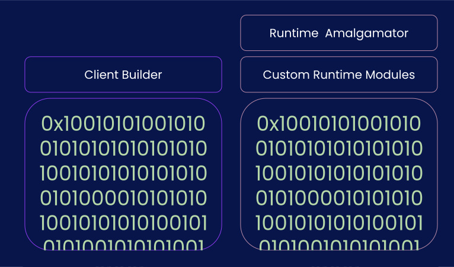

# Substrate Folder Structure

---

## Substrate Folder Structure

- How to look at substrate from **_within_**.
  - Mostly relevant when wanting to work on substrate itself.
- How to look at substrate from **_without_**.
  - Mostly relevant when wanting to build on top of substrate.

---

## Substrate Internally

Substrate is roughly composed of 3 parts:

- Client: `./client`: `sc-*`
- FRAME: `./frame`: `frame-*`, `pallet-*`
- Primitives: `./primitives`: `sp-*`

Primitives is the glue between the other two.

---v

### Substrate Internally: `./client`

- database
- consensus
  - finality
  - block-builder
- networking
- import-queue / tx-queue / mempool

---v

### Substrate Internally: `./primitives`

- crypto primitives
- runtime-api/host-functions
- ...

---v

### Substrate Internally: `./frame`

- modules that compose the runtime.
  - balances/currency (bitcoin)
  - WASM/Solidity smart contracts (Ethereum)
  - transaction-payment
  - staking
  - identity
  - proxy / (onchain) multisig
  - ...

---v

### Workshop

- Go search for some crates based on these prefixes in https://paritytech.github.io/substrate/.
- Look into the codebase as well.

---v

### Substrate Internally

- So what's the point in all of this? 🤨

- When looking for the code related to a given topic, this information should help you find it.

<br>
<hr>
<br>

- Networking? only on `sc-*`
- Database/Storage? Probably in `sc-*` and `sp-*`

---

## Substrate Externally

- How substrate is seen once used by a developer.
- Substrate can be used as a set of _libraries_ in a binary package.

---v

### Substrate Externally



---v

### Substrate Externally

- Remember this? This is the node-template or FRAME layer:


Notes:

A bit of code to build the CI, etc.
A bit of code to build the runtime, with maybe some custom modules.

And the rest is... MAGIC

---v

### Substrate Externally: Examples

- `bin/kitchensink-node`.
- `bin/node-template`.
- low and behold, the entire `polkadot` repo.
- Tomorrow, you will receive a template for your activity, which is a substrate node without FRAME.

---

## Activity: Exploring Substrate Node Template

- This is your de-facto "substrate starter pack".
  Clone it, and try and find all the main components of it,<br>based on the material you have learned so far.

<hr>

- Which set of functions the runtime is exposing (remember the thing called "**Runtime API**"? 😉)?
- Which modules from `frame` are used in the runtime?
- What is the version of the runtime? spec-name/version (you have not learned about this).
- Which RPC endpoints does this node have?
- Which consensus algorithm(s) is it using?
- You have 15 minutes!

Notes:

I can rephrase this exercise as: reading-alien-code challenge. You have not been taught most of
these.

In the runtime the answer is the top level amalgamator file. In the cli side, look for a
`service.rs` file.

---

## Activity: Compiling Rust to WASM

- Let's make a simple rust crate that compiles to WASM!

---v

### Activity: Compiling Rust to WASM

- A target triple consists of three strings separated by a hyphen, with a possible fourth string at the end preceded by a hyphen.
- The first is the **architecture**, the second is the **"vendor"**, the third is the **OS type**, and the optional fourth is environment type.

* `wasm32-unknown-emscripten`: Legacy, provides some kind of `std`-like environment
* `wasm32-unknown-unknown` ✓ WebAssembly: Can compile anywhere, can run anywhere, no `std`
* `wasm32-wasi` ✓ WebAssembly with WASI

---v

### Rust -> WASM Details

```rust
#[no_mangle] // don't re-name symbols while linking
pub extern "C" fn add_one() { // use C-style ABI
  ...
}
```

and if a library:

```
[lib]
crate-type = ["cdylib"]
```

---v

### Activity: Compiling Rust to WASM

- you can use `wasmtime-cli` to execute, and `wasm-gc` to trim your WASM files.
- For each step, try both `wasm32-unknown-unknown` and `wasm32-wasi`.

---v

### Activity: Compiling Rust to WASM

- First, write a WASM function that multiplies a number by 2.
- Then, write a WASM function that prints 42.
- Then, write a WASM function that prints or returns the current time.
- Then, write a WASM function that writes the result of the multiplication into a file called `output`.
- Finally, write a WASM function that multiplies two `f32` numbers.
- Then, really finally, make a WASM function that divides a number by 0.

> For this last one, you might want to transform your wasm-library crate into a wasm "bin" crate.

---

## Extra Activity: WASM Execution

- Substrate supports two types of WASM execution.
- Find the right crate in substrate repo to find the executors, then look them up online.
- Argue which type of executor should be used for runtimes, and which for smart contracts.
- You have less than 30 minutes!

Notes:

We want students to discover WASMI and Wasmtime, and research their differences.

So the key difference here is that the compilation of the code is unsafe because you can attack an
optimizing compiler.
You can input some code for compilation that just takes forever to compile
(compiler bombs).
There is no difference on safety in the actual execution apart from interpreters
being more simple and hence less likely to have bugs.

So compilation can be safe.
But only if you can do it in linear time.
And that prevents most optimizations which makes the produced code slow.
And it is questionable and surely depend on the contract in question whether the compilation time can be recuperated if you need to compile it every time it is run.
When we have fuel metering we could port the code generation of wasmtime to the runtime and cache the produced native code on-chain.
Cause with fuel metering we are immune against compiler bombs.

Then we could have near native speed for contracts.

Of course we could port the code generation of a linear time compiler to the runtime and have the same without fuel metering.
However, there is none except wasmer.
And they were acquired by NEAR.
It was always a shady project but now I don't want to rely on it at all.
Everything except wasmtime is a huge liability.

---

# Additional Resources! 😋

Check speaker notes (click "s" 😉).

NOTE:

- More on Rust target spec:

  - https://rust-lang.github.io/rfcs/0131-target-specification.html

- Lin Clark's awesome talks on WASI (not super relevant to our work though):

  - https://www.youtube.com/watch?v=fh9WXPu0hw8
  - https://www.youtube.com/watch?v=HktWin_LPf4

- wasm-unknown vs wasm-wasi:

  - https://users.rust-lang.org/t/wasm32-unknown-unknown-vs-wasm32-wasi/78325/5

- `extern "C"`:

  - https://doc.rust-lang.org/std/keyword.extern.html
  - https://doc.rust-lang.org/book/ch19-01-unsafe-rust.html#using-extern-functions-to-call-external-code

- Chapter 11 of this book is a great read: https://nostarch.com/rust-rustaceans

## Activity Hints (Post Lecture)

```
rustup target add wasm32-wasi
rustup target add wasm32-unknown-unknown

cargo init --lib
apply stuff (`cdylib`, `#[no_mangle]`)

cargo build --target wasm32-unknown-unknown --release
```

Install `wasmtime-cli`, maybe `cargo install wasmtime-cli`? figre it out based on the wasmtime-cli
docs!

wasmtime ./target/wasm32-unknown-unknow/release/wasm-crate.wasm --invoke <func_name> <arg1> <arg2> ...

DON OT USE WASM_BINDGEN! that's for compiling wasm to browser!

A rust `lib` crate can be executed via `wasmtime`, a rust `bin` crate can be executed itself with
`cargo run`, but there are caveats. USE LIB CRATE for now.

If you want to play with the de-compiled WAM file:

```
wasm-gc target/wasm32-unknown-unknown/release/wasm_crate.wasm out.wasm
wasm2wat out.wasm | grep export
```

Even with `wasi`, in order to create a file you need permission.

Note that functions like `std::time::now()` and such are available in `wam32-unknown-unknown`, but
simply panic. The point is that you probably won't get a compile error, but it won't work either.

the point of `f32` is to show that you we can use float, but float are un-deterministic, so YOU
SHOULD NOT USE THEM IN YOUR RUNTIME.

Try and use `Vec<_>` or other types that are dynamically allocated. Recall that `wasm32-unknow-unknow` does not have an allocator!

Further ideas:

- make print work in wasm32-unknown-unknown using "host functions" (https://docs.wasmtime.dev/wasm-rust.html#importing-host-functionality).
- try and bring an external dependency in your crate. You will probably run into `feature = std`.
