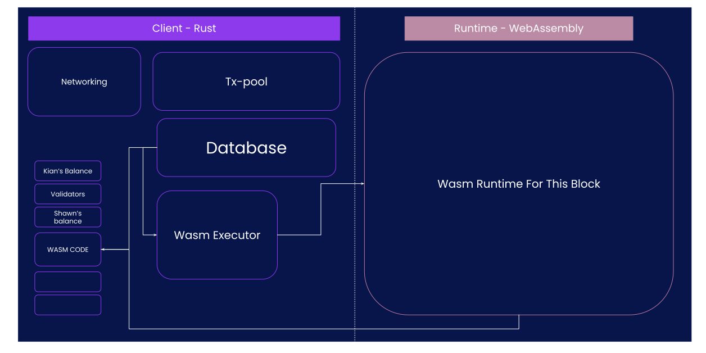
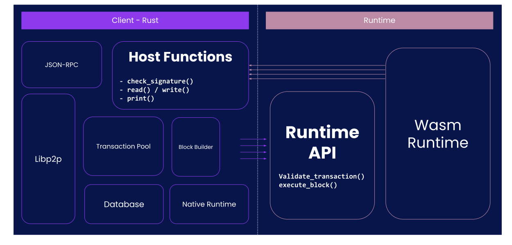

## Host/Runtime Interface

Lecture 4, Module 4

Instructor: Kian Paimani

---v

### Host/Runtime Interface

The Client / Runtime division is one of the most important design decisions in Substrate.

In this lecture:

Where the **boundary** is, and how the the two **communicate**.

---


## The Substrate Runtime


---v

### Boundary: Client

On the client side, you have:

- P2P networking
- Block database including block storage
- Consensus (Block authoring/Finality)
- Wasm executor
- Native runtime.
- Database


NOTE:

These are the normal P2P blockchain style tasks. Most chain developers will not want to customize this stuff at all. If you want to, you can. Especially consensus. But you typically won't need to.

All these element are directly (through host function) reachable from the runtime.
- Storage is, but behind a state-machine overlay.
- Wasm executor is, but not in real life usage (through the experimental worker api).
- Networking is but only in a limited form and only for offchain host function.

---v

### Boundary: Runtime

- Execute blocks.
- Transaction validity.
- Author blocks.

...

- Consensus-adjacent tasks like authority set management
- Provide data to the client upon request through accessor apis (eg Aura Api)

Notes:

The first three are really the core jobs. Constructing blocks is a job for miners or validators. It makes sense to do block construction with the runtime because much code will be shared and the runtime itself is what will validate the blocks anyway.
Consensus related tasks are really just part of the same state transition logic. Although they can feel "meta" they are equal with token transfers etc.
Jobs like accessing data might seem tangential and redundant. We will talk about them more shortly

---v

### Boundary: Runtime

Question: Based on these tasks, where is the boundary?

- State transition.

<!-- .element: class="fragment" -->

- Customization.

<!-- .element: class="fragment" -->

- Upgradable!

<!-- .element: class="fragment" -->

---v

### Runtime Upgrades!

The Runtime can _change_ through the life of the chain.




NOTE:

Explains how a CODE update works: The data is in the database, like everyone's balance. Among this data, we also have the code. this code is given to the wasm executor, and there you go, that's the runtime.

---v

### Boundary: Client and Runtime

Substrate as a whole is like an FPGAs

* The runtime is the HDL.
* The client is the hardware, i.e. the gate array.

> The wasm is the metaprotocol.

---

### Client - Runtime Communication

- The runtime uses **host functions** to get data from the client
- The client uses **runtime apis** to get data from the runtime




TODO: this should be partial figure.

---v

### Example: Block Execution

To execute a block, we need both host functions and runtime apis:

- Runtime API: for example `execute_block` - The client provides a block to the runtime, and expects
  the runtime to execute that block.

- Host Function - for example `storage_get` - To execute the block, the runtime will probably need
  to read storage, which only the client has access to. `storage_set` will update the storage based
  on executing the block.

---v

### Example: Block Execution

Critical to be aware that the runtime is not in charge of **storing state**...


..but knows **how to read, and update it**.

<!-- .element: class="fragment" -->

Why?

<!-- .element: class="fragment" -->

Upgrades!

<!-- .element: class="fragment" -->

---

## Examples

---v

### Examples: Runtime API

Some [existing runtime APIs](https://github.com/substrate-developer-hub/substrate-node-template/blob/main/runtime/src/lib.rs#L334) in Substrate include:

-  **Core** - most important - for executing blocks.
-  **TxQueue** - tells the offchain code whether a transaction is valid and how to prioritize it.
- **BlockBuilder** - critical for authoring nodes - for writing blocks.
- **Metadata** - we won't use it much today - to teach offchain tools the structure of your storage and extrinsics.
- **Consensus related**, aka - **Accessors**.
- **Testing**.

---v

### Examples: Host Function

See [some existing host functions](https://github.com/paritytech/substrate/blob/master/primitives/io/src/lib.rs) in Substrate:

- Cryptography operations and hashing.
- IO
  - storage
  - print
- storage root.
- allocating memory.
- threads (experimental).

Notes:

Extensible but with a lot of limitation when it comes to the polkadot system as will be seen in the
next modules.

ethereum got transaction of modified content embeded in the way thing works, we will see later that substrate simply use host function to reproduce this mechanism.

storage root: can spend time on it: explain the need to cache things, even go through state machine code a bit.

This is a good cost gain as using trie code on the hash function would be a LOT of host function calls.
Yet when using cumulus, that is what happen.

---

## Another Example: TransactionPool

Pool is in the client, receives transactions from the outer world, needs to validate them.

Where does this happen?

---

## Defining a Runtime API

---v

- conveniently a Rust trait
- always generic over `Block`.

For example:

```rust
// somewhere in common between client/runtime => substrate-primitive.
decl_runtime_apis! {
	pub trait Core {
		fn version() -> RuntimeVersion;
		fn execute_block(block: Block) -> bool;
		#[renamed("initialise_block", 2)]
		fn initialize_block(header: &<Block as BlockT>::Header);
	}
}

// somewhere in the runtime code.
impl_runtime_apis! {
	impl sp_api::Core<Block> for Runtime {
		fn version() -> RuntimeVersion {
      // ..
    }

		fn execute_block(block: Block) -> bool {
      // ..
		}

		fn initialize_block(header: &<Block as BlockT>::Header) {
			// ..
		}
	}
}

// somewhere in the client code..
let block_hash = "0xffff...";
let block = Block { ... };
let outcome: Vec<u8> = api.execute_block(block_hash, block).unwrap();
```

---v

Recap what we learn:

1. All runtime APIs are executed on top of a **specific block**. This is the implicit *at* parameter.

2. All runtime APIs return a `Result<Vec<u8>, _>`, where the inner `Vec<u8>` is the SCALE encoded
   value that we wanted to return. In some abstractions, they also auto-decode it, in some they
   don't.

  > Key takeaway is that when going through the runtime API, everything is encode/decode-ed.

3. Why do we need version? Native Runtime!

4. All runtime APIs are implicitely generic over `<Block>`
   1. Has to do with the `at` param and the opaque types.

---v

### Which Runtime APIs are "required"?

Depends on what you are doing.


- `Core` for any full node that wants to sync
- `TxPool` and `BlockBuilder` and a bunch more fore validators.

### Feature gated runtime APIs for development

There are ways to implement runtime interfaces for development purposes, such as:

- Testing and verification: `try_runtime`.
- Benchmarking: `frame_benchmarking`.

---

## Defining a Host Function

---v


* use the `#[runtime_interface]` attribute
* just like an ordinary Rust trait

For example:

```rust
#[runtime_interface]
pub trait Storage {
  /// Returns the data for `key` in the storage or `None` if the key can not be found.
  fn get(&self, key: &[u8]) -> Option<Vec<u8>> {
    self.storage(key).map(|s| s.to_vec())
  }
}
```


---

## Considerations

---v

### Considerations: Determinism

All about context, but generally crucial.

`Core` APIs must be ABSOLUTELY deterministic

Ergo all API calls from within then must also be.

`OffchainWorker` APIs, not so much.

Notes:

Wasm is not fully so some instruction are `forbidden` eg float,.

`sp_io` design containing both consensus and non-consensus host functions is probably not the best choice.


---v

### Considerations: Speed

Native is generally faster than WASM, had has access to more APIs..

But the it has a slow on-time delay.

- WASM call ~ IO ~ `memcopy`.

Notes:
- cost of calling is parameter passing: memory copy: one should strive to reduce the number of call to host function.
-
For instance in storage when calculating the root we do not build it in wasm and call the hash host
function multiple times: we just have a host function doing the root calculation and state trie kept
in client.

On the other hand things as `next_storage` are high cost (generally iteration on state from runtime
is expensive). This design is related to the memory location, there is alternative but this is
simple (simple as good design).

(iteration remains very costly: because each call to next is going through the host function boundaries (and historically caching is not supporting it : only get: trade off between code complexity and performance here)

- Question: we got host function for running computation intensive code in native, but when simd for
  wasm would be added, then will host function for a hashing be still usefull:

A: wait and see, but is possible that simd optim of the hash function in wasm is way faster.

Again using a host function for speed up needs to be reasoned, cost of transmitting parameter in
wasm can be bigger than the actual hashing cost.

---v

### Consideration: Types.

The runtime and the client basically only talk to each other in opaque types, i.e. `Vec<u8>`.


---v

### Consideration: Adding Host Function

- If you have a runtime which expects a host function which does not exist, the runtime will fail at instantiation.

- When the client has a host function the runtime doesn't know of or need, nothing happens.

- If your new runtime needs a new host function, all nodes must upgrade first.

<!-- .element: class="fragment" -->

- No more forkless upgrades.., but still better than coordinated hardfork.

<!-- .element: class="fragment" -->

---v

### Consideration: Versioning and Backwards compatibility

- Host functions are **FOREVER**: when finalizing a block that uses a specific host function, you
  always need to keep the same host functions in the client, in order to sync the chain again.

- Thus your client must be able to provide all the host functions expected in the past and for
  present/future blocks.

Notes:

Distinguish the implications of adding/removing host functions (and the lack of implications when adding runtime api).

https://github.com/w3f/polkadot-spec/tree/main/host-spec

Stress that a bug in a host function will need to stay (can point some), and worse will need to be implemented by all clients (eg gossamer).
Also the buggy or ill designed host function will need to be specified, you can check the polkadot spec and see some of those.


But still forever could end after a regenesis :)

Also stress that version are just different host function (nothing prevent from runing to different version in a runtime).


---

## Workshop: Expanding The Wasm Code

Notes:

- rg import
see the host function
Describe what is 'env' namespace (just a default no real need of namespace for substrate).
inkerc20 got host function that calls runtime, they are namespaced seal

talk about naming : ext_ prepended and a _version_x : don't forget versionning is just using a different name: we could have two version in parallel (but the macro do not expose them (also do some magic for swizzling)).

The macro choose which host function to include in runtime.

metadata!! insist on the fact that we sometime put a lot in the runtime just to benefit from its upgradability.

Also can spend some time describing Block builder runtime api and underline that when building block
we just run the extrinsic in a way that mimic the executeblock logic: in some case parachain may
need to for this logic.

Execute block calls initialize, and all extrinsic sequentially then finalize.
Block building build context (Core_initialize_block) and try extrinsic one by one
(BlockBuilder_apply_extrinsic).

(it is a bit of a digression but show how these host function are really relative to context, a question could rise: why not multiple runtime for each context: reduce size of runtime... Reply: runtime caching, shared code, generally a trade off).

Also external protocol get their info updated to the runtime logic this way.
- sometime to access state info
- but sometime could just have pure function that manage some logic (can imagine some thing as simple as decoding some encoded struct)

---

## Coding Activity - Flipper Runtime

In this activity, we will write a Substrate runtime together without using FRAME.

Avoiding FRAME allows us to focus on implementing the Runtime APIs as they are written and use the host functions directly.

As a bonus this sets us up well to say "look how much easier and nicer FRAME is" in module 6.

This code is working in https://github.com/substrate-developer-hub/substrate-node-template/pull/347

<!-- TODO: Although the code is working, I still need to decide the best order to write each part pedogogically. -->


---v

### Exercise: Adder

Make it an adder like in our toy example earlier.

Bonus points for adding any of the enhancements from earlier:
* make it an adder / multipler.
* make it so you have to add at least 10%
* make it both flipper and adder.

---v

Make this runtime upgradeable!

You just need to store the new wasm code at the special `b":code"` key

### Exercise: Custom Host Function

Write a custom host function for your runtime. A simple example would be to use a different crypto like RSA or SM2. For an example of using custom crypto host function see https://github.com/hammeWang/substrate-sm2

### Exercise: Custom Runtime Api

Write a custom Runtime Api that fetches the current value of the adder.

As a more realistic example: If you have added the add-at-least-10% feature, this runtime API could return the minimum amount needed to be added next.

---v

## Coding Exercise

<!-- TODO: create the example starter code and work through the entire example. Link both starting point and example solutions. -->

Instructor has pre-written a basic minimal (toy) application that calls into a simple runtime using
a simplified interface.

It creates a handful of blocks and tracks the state at each block. The initial example runtime does
nothing.

Together we write a second runtime that acts as a flipper Then we write one that acts as an adder.

---v

Exercise: make it so you can only add if you are adding at least 10% of the current accumulated value.

---v

Exercise: Write one that acts as an adder and subtracter. Add more operations as well like multiply, mod, whatever you want. This introduces the idea of transaction types.

---v

Exercise: Write one that has both the flipper and adder functionality. They should be orthogonal. Now you must keep track of multiple pieces of state.

---v

## Regroup after the Exercises

Instructor demonstrates how we can swap the runtime part way through.

Discussion points:

- Are these runtimes economically secure? <!-- no, there are no fees at all, nor prioritization -->
- Is the adder secure other than the fee part? <!-- no, it can overflow -->
