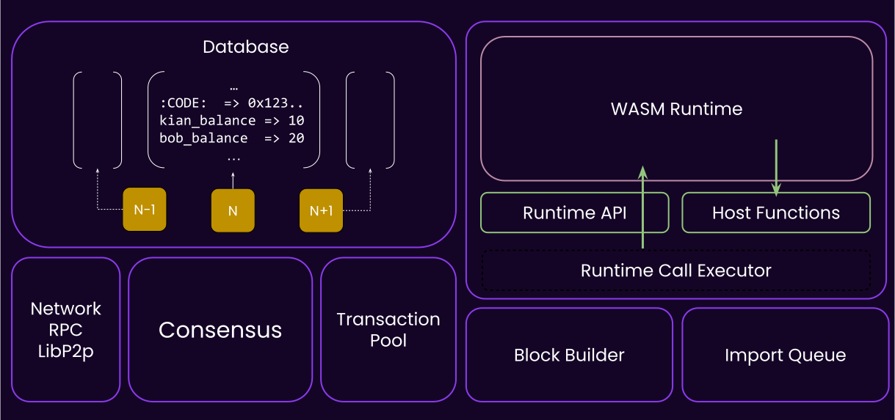
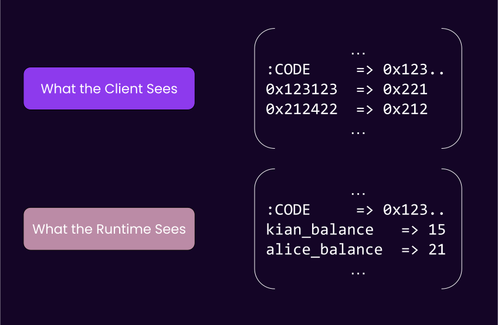
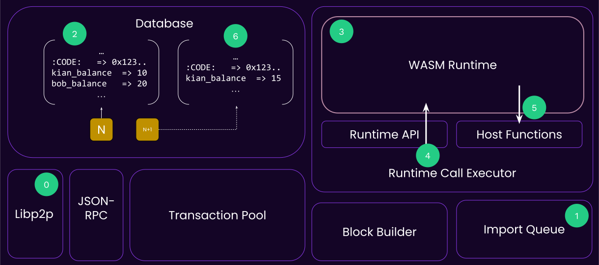
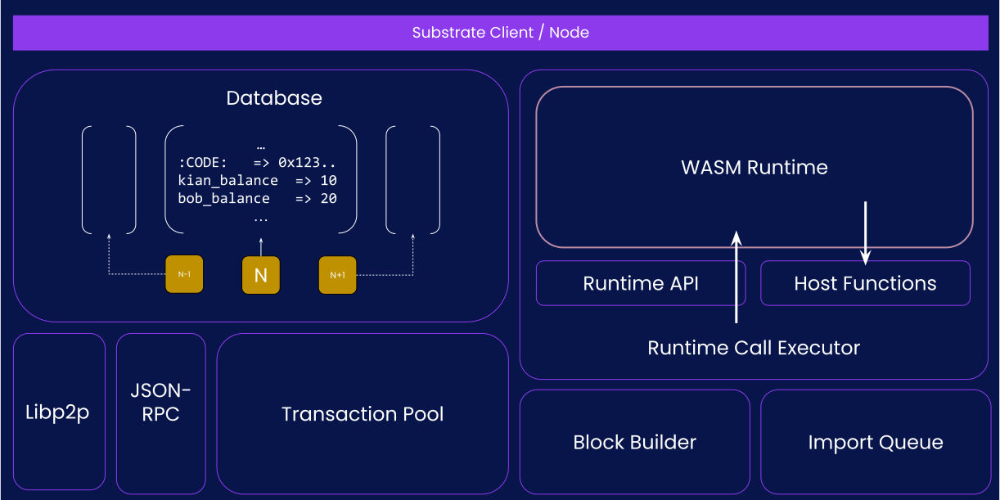
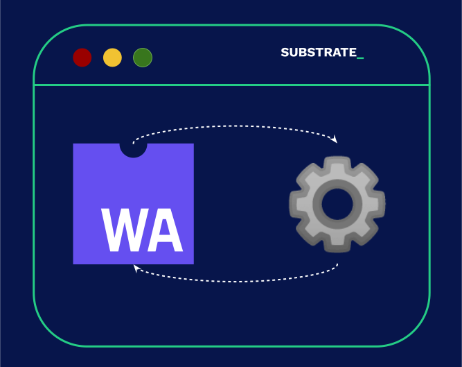
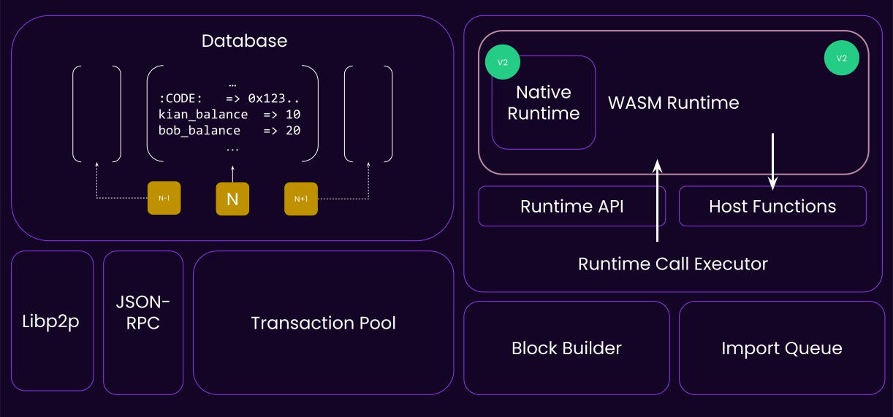
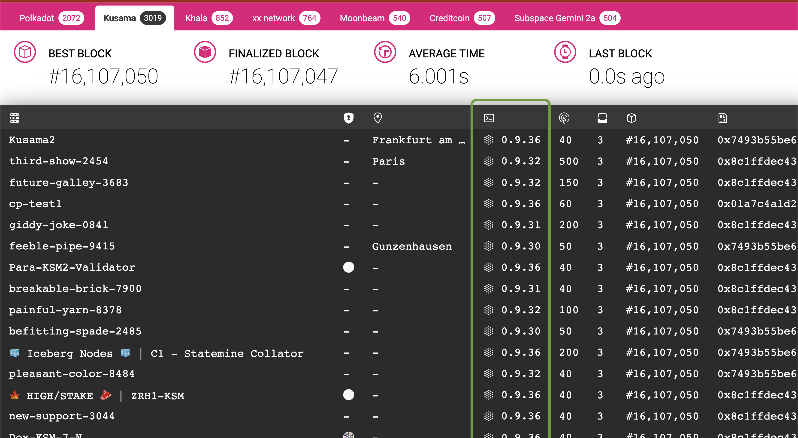

# Substrate Wasm Meta Protocol

---

# Part 1

- This is a big lecture, so I divided it into two small parts, that's all 🫵🏻

---

## It All Began With a Runtime..

- The Client / Runtime division is one of the most important design decisions in Substrate.
  - 👿 Bad: Fixed opinion.
  - 😇 Good: Enables countless other things to **not be fixed**.

---v

## It All Began With a Runtime..

- Recall that the boundary for this division is the **state transition**.

> Anything dictating how your state transitions is the runtime.

---v

## It All Began With a Runtime..

- Personal opinion:

> Substrate technology stack will put "Wasm stored onchain" on the map,<br/>
> the same way Ethereum put "smart contracts stored onchain" on the map.

- Bold claim:

> It is only a matter of time until every blockchain is doing the same thing.

---v

## It All Began With a Runtime..


---

## Substrate: a short recap



---v

### Substrate: a short recap

- **Host Functions**: Means of a runtime communicating with its host environment, i.e. the Substrate client.

---v

### Substrate: a short recap

- **Runtime API**: The well-defined functions that a Wasm substrate runtime is providing.

Notes:

Building a WASM module's activity was building something akin to runtime-apis

---v

### Substrate: a short recap

- Database is a _untyped_, _opaque_, **key-value** storage, stored **per-block**, on the **client side**.

---v

### Substrate: a short recap

- Communication language of client/runtime is SCALE:

```rust
let bytes: Vec<u8> = 42u128.encode();
let magic: u128 = vec![1, 2, 3, 4, 5, 6, 7, 8].decode();
```

---

## Learning with Examples

and some pseudo-code..

note:

During each example, we deduce what host functions and/or runtime APIs are needed.

---

## Example #1: State

- The runtime wants to add 10 units to Kian's balance.

---v

### Example #1: State

```rust [1-100|1-2|4,5|7,8|10,11|13,14|1-100]
// the runtime decides what key stores kian's balance.
key: Vec<u8> = b"kian_balance".to_vec();

// the runtime reads the raw bytes form that key.
let current_kian_balance_raw: Vec<u8> = host_functions::get(key);

// and needs to know to which type it should be decoded, u128.
let mut current_kian_balance: u128 = current_kian_balance_raw.decode();

// actual logic.
current_kian_balance += 10;

// encode this again into an opaque byte-array.
let new_balance_encoded: Vec<u8> = current_kian_balance.encode();

// write the encoded bytes again.
host_functions::set(key, new_balance_encoded);
```

---v

### Example #1: State

- 💡 The runtime needs host functions to read/write to state.

```rust
fn get(key: Vec<u8>) -> Vec<u8>;
fn set(key: Vec<u8>, value: Vec<u8>);
```

note:

ofc the IO to these functions is all opaque bytes, because the client does not know the state
layout.

---v

### Example #1: State

- could we have communicated with the client like this?

```rust
fn set_balance(who: AccountId, amount: u128)
```

note:

This would imply that the client would have to know, indefinitely, the types needed for account id
and balance. Also, it would have to know the final key for someone's balance.

---v

### Example #1: State

- Exceptions:

```rust
/// The keys known to the client.
mod well_known_keys {
  const CODE: &[u8] = ...;
}
```

note:

See https://paritytech.github.io/substrate/master/sp_storage/well_known_keys/index.html

---v

### Example #1: State



---

## Example #2: Block Import

---v

### Example #2: Block Import

- Client's view of the state -> Opaque.

> State layout is by definition part of the state transition function.

- Client's view of the transactions? 🤔

<!-- .element: class="fragment" -->

Notes:

The question is kinda answered in the previous lecture, but ask a student to rephrase.

On the second point, in order to transition the state, you need to know the previous state, so of
course the state layout is part of the state transition function. Ergo, the client cannot know it.

---v

### Example #2: Block Import

- transactions format is by definition part of the state transition function as well.

Notes:

as in, do we want to able to update our transactions format as well in a forkless manner?

we want the runtime to be able to change its transactions format as well, in a forkless manner.

---v

### Example #2: Block Import


---v

### Example #2: Block Import

```rust [1-100|1-2|4-6|8-9|1-100]
// fetch the block from the outer world.
let opaque_block: Vec<u8> = networking::import_queue::next_block();

// initialize a wasm runtime.
let code = database::get(well_known_keys::CODE);
let runtime = wasm::Executor::new(code);

// call into this runtime.
runtime.execute_block(opaque_block);
```

---v

### Example #2: Block Import

- 💡 The client needs a runtime API to ask the runtime to execute the block.

```rust
fn execute_block(opaque_block: Vec<u8>) -> Result<_, _> { .. }
```

note:

`execute_block` is the most basic, fundamental runtime API that any substrate based runtime has to
implement in order to be called a "blockchain runtime".

---

# Detour 🎬

- Previous slides used the term "transactions" in a simplified way. Let's correct it.

---v

### Detour: Extrinsic

<diagram class="mermaid" center>
  %%{init: {'theme': 'dark', 'themeVariables': { 'darkMode': true }}}%%
  flowchart TD
    E(Extrinsic) --> S(Signed);
    S --> SE(Signed Extrinsic aka Transaction)
    E --> U(Unsigned)
    U --> UE(Unsigned Extrinsic)
    U --> I(Inherent)
</diagram>

note:

- An Extrinsic is data that come from outside of the runtime.

- Yes, transactions are **a type of extrinsic**, but not all extrinsics are transactions.

---v

### Detour: Block, Header, Extrinsic

- Both the client and runtime have a concrete type about what each of these are.
- But they need a common understanding of them.

Which Rust abstraction is perfect for this?

---v

### Detour: Block, Header, Extrinsic

- The traits defining what each are in `sp-runtime/traits`
  - [Extrinsic](https://paritytech.github.io/substrate/master/sp_runtime/traits/trait.Extrinsic.html)
  - [Block](https://paritytech.github.io/substrate/master/sp_runtime/traits/trait.Block.html)
  - [Header](https://paritytech.github.io/substrate/master/sp_runtime/traits/trait.Header.html)
- One, somewhat opinionated set of types that implement these can be found in `sp-runtime/generic`.

Notes:

This will come into play more in your frame-less activity
https://paritytech.github.io/substrate/master/sp_runtime/generic/index.html

---v

### Detour: Client Block

```rust
// client's view on the block type.
struct ClientBlock<H: sp_runtime::traits::Header> {
    header: H,
    extrinsics: Vec<Vec<u8>>,
}

impl sp_runtime::traits::Block for ClientBlock { .. }
```

---v

### Example #2: Block Import

```rust
struct Header { .. }
struct Extrinsic = { .. }

struct RuntimeBlock {
  header: Header,
  extrinsics: Vec<Extrinsic>,
}

impl sp_runtime::traits::Block for RuntimeBlock { .. }
impl sp_runtime::traits::Header for Header { .. }
```

note:

note how the runtime has concrete types for Extrinsic, Header and such.

---

# Detour Ends Here 🎬

---

### Example #2: Block Import

- With the information gained from that, let's expand this snipped:

```rust
fn execute_block(opaque_block: Vec<u8>) -> Result<_, _> { .. }
```

- to

```rust
fn execute_block(client_block: ClientBlock) -> Result<_, _> {
  // The implementor will convert this internally to `RuntimeBlock`
}
```

---v

### Example #2: Block Import

```rust [1-2|1-100]
// fetch the block from the outer world.
let block: ClientBlock = networking::import_queue::next_block();

// initialize a wasm runtime
let code = database::get(well_known_keys::CODE);
let runtime = wasm::Executor::new(code);

// call into this runtime.
runtime.execute_block(block);
```

---v

### Example #2: Block Import

- But something's ambiguous about this code... 🤨

```rust
// 🤔
let code = database::get(well_known_keys::CODE);

// 🤔
runtime.execute_block(opaque_block);
```

Notes:

- From which block's state do we fetch the code??
- This probably calls into `host_functions::{get/set}` internally. What do we return

---v

### Example #2: Block Import

```rust [1-100|1-2|4-6|8-10|12-15|17-100]
// fetch the block from the outer world.
let block: ClientBlock = networking::import_queue::next_block();

// get the parent block's state.
let parent = block.header.parent_hash;
let mut state = database::state_at(parent);

// initialize a wasm runtime FROM THE PARENT `state`!
let code = state::get(well_known_keys::CODE);
let runtime = wasm::Executor::new(code);

// call into this runtime, updates `state`.
state.execute(|| {
  runtime.execute_block(block);
});

// create the state of the next_block
database::store_state(block.header.hash, state)
```

Notes:

- within these snippets, more or less, everything inside `state.execute` is executed within Wasm.
- hmm `block.header.parent_hash`, so the `trait Header` have this exposed!

---v

### Example #2: Block Import

- 💡 A runtime's existence is only meaningful **when executed at a give block**.

note:

- The same way that Alice's balance value is only meaningful when read at a given block.

- Based on that:

  - The correct runtime code is loaded.
  - The correct state (and other host functions) is provided.

- Similarly, almost all RPC operations that interact with the runtime have an `Option<Hash>`
  argument.

---v

### Example #2: Block Import

- I can add one more small touch to this to make it more accurate.. 🤌

---v

### Example #2: Block Import

```rust [14-20]
// fetch the block from the outer world.
let block: ClientBlock = networking::import_queue::next_block();

// get the parent hash. Note that `sp_runtime::traits::Header` provides this.
let parent = block.header.parent_hash;
let mut state = database::state_at(parent);

// initialize a wasm runtime FROM THE PARENT `state`!
let code = state::get(well_known_keys::CODE);
let runtime = wasm::Executor::new(code);

// call into this runtime, update `state`.
state.execute(|| {
  // within this, we probably call into `host_functions::set` a lot.
  runtime.execute_block(block);

  let new_state_root = host_functions::state_root();
  let claimed_state_root = block.header.state_root;
  assert_eq!(new_state_root, claimed_state_root);
});

// create the state of the next_block
database::store_state(block.header.hash, state)
```

---v

### Example #2: Block Import: Recap



---

## Example #3: Block Authoring

---v

### Example #3: Block Authoring

- Let's first talk about this over the figure!



Notes:

1. gossip
1. tx-pool (validation also happens, but that can be a different lecture)
1. block-builder
1. construct the runtime executor based on the best known existing block.
1. runtime-api to apply transactions until full.
1. put correct state-root/extrinsic root hash in header
1. propagate back to everyone else.

---v

### Example #3: Block Authoring

```rust [1-100|1-2|4-5|7-9|11-12|14-20|21-100]
// get the best-block, based on whatever consensus rule we have.
let (best_number, best_hash) = consensus::best_block();

// get the latest state.
let mut state = database::state_at(best_hash);

// initialize a wasm runtime.
let code = state::get(well_known_keys::CODE);
let runtime = wasm::Executor::new(code);

// get an empty client block.
let mut block: ClientBlock = Default::default();

// repeatedly apply transactions.
while let Some(next_ext) = transaction_pool_iter::next() {
  state.execute(|| {
    runtime.apply_extrinsic(next_ext);
  });
  block.extrinsics.push(next_ext);
}

// set the new state root.
block.header.state_root = state.root();
```

Notes:

- What is the type of `next_ext`? `Vec<u8>`
- Do we actually loop forever until the tx-pool is empty? probably not!

---v

### Example #3: Block Authoring

- Substrate based runtimes are allowed to perform some operations at the beginning and end of each block.

> And recall that a smart contract could not do this.

---v

### Example #3: Block Authoring

```rust [11-100|14-15,25-26]
// get the best-block, based on whatever consensus rule we have.
let (best_number, best_hash) = consensus::best_block();

// get the latest state.
let mut state = database::state_at(best_hash);

// initialize a wasm runtime.
let code = state::get(well_known_keys::CODE);
let runtime = wasm::Executor::new(code);

// get an empty client block.
let mut block: ClientBlock = Default::default();

// tell this runtime that you wish to start a new block.
runtime.initialize_block();

// repeatedly apply transactions.
while let Some(next_ext) = transaction_pool_iter::next() {
  state.execute(|| {
    runtime.apply_extrinsic(next_ext);
  });
  block.extrinsics.push(next_ext);
}

// tell the runtime that we are done.
runtime.finalize_block();

// set the new state root.
block.header.state_root = state.root();
```

---v

### Example #3: Block Authoring

```rust
fn initialize_block(..) { ... }
// note the opaque extrinsic type.
fn apply_extrinsic(extrinsic: Vec<u8>) { ... }
fn finalize_block(..) { ... }
```

---

## Example 4: Tx-Pool Validation

TODO: maybe add this, drop otherwise.

---

## Recap of Interactions Learned:

- State Update
- Block Import
- Block Authoring

- A few items that you have not learned about, but worth a moment of explanation:
  - Transaction Pool Validation
  - Version Check
  - Offchain Workers

---

## BUT WAIT A MINUTE 😱

- if the `code` changes, all the following can also change:

  - What state key is Kian's balance.
  - What block/extrinsic format is valid.

- How on earth is an application (i.e. a wallet) is supposed to survive?

---v

### BUT WAIT A MINUTE 😱

- Metadata 🎉

```rust
fn metadata() -> Vec<u8> { ... }
```

Notes:

- Metadata contains all the basic information to know about all storage items, all extrinsics, and so
  on. It will also help a client/app decode them into the right type.
- Substrate itself doesn't impose what the metadata should be. It is `Vec<u8>`.
- FRAME based runtime expose a certain format, which is extensively adopted in the ecosystem.

Some personal rant: radical upgrade-ability is the biggest advantage, and arguably one of the main
develop-ability problems of the substrate ecosystem. Writing clients, such as block explorers,
scanners, and even exchange integration are orders of magnitude harder than a blockchain that has a
fixed format and only changes every 18 months at most. That being said, this is a battle that is to
me obvious: we simply HAVE to win. When ethereum first introduced smart contracts, everyone
probably had the same class of issues. This is the same matter, on a a different level.

also, as noted in an earlier slide, once you make it work for one chain, it works for many chains.

---v

### BUT WAIT A MINUTE 😱

- Recall the fact that runtime is only meaningful at a certain block".

<div class="fragment">

- Two different runtimes at block `N` and `N+1` return different metadata ✅.

</div>

Notes:

By Applications/Clients I really mean anyone/anything. Substrate client doesn't really use metadata because it is dynamically typed, but if needed, it could.

---

## Oblivious Client 🙈🙉

- The underlying reason why the client is "**kept in the dark**" is so that it wouldn't need to care about the runtime upgrading from one block to the other.

---v

## Oblivious Client 🙈🙉

$$STF = F(block_{N}, state_{N}, code_{N}) > state_{N+1}$$

- Client does not know how **blocks are executed**. It can change!
- Client does not know **storage layout**. It can change!
- Client does not know the internal **extrinsic/block format**. It can change!

<!-- .element: class="fragment" -->

Notes:

In essence, all components of the STF must be opaque to the client. `Vec<u8>`.
Metadata is there to assist where needed.
This is why forkless upgrades are possible in substrate.

---

## Substrate: The Full Picture


note:

time to ask any missing questions.

---

## Activity: Haunting APIs and Host Functions

---v

### Runtime APIs: The Full List

- look for `impl_runtime_apis! {...}` and `decl_runtime_apis! {...}` macro calls.
  - Try and find the corresponding the client code calling a given api as well.
- Look for `#[runtime_interface]` macro.
- You have 30 minutes!

---v

### Runtime APIs: The Full List

- Runtime APIs
  - **Core**, **TxQueue**, **BlockBuilder**, **OffchainWorker**, **Metadata**.
  - Sky's the limit! A runtime can expose any more functions through APIs.

---v

### Runtime APIs: The Full List

- A blockchain node is more or less anything that implements the `Core` API.
- A blockchain validators implements `BlockBuilder` and `TxQueue` as well.
- A lot of other runtime APIs _could_ be optional depending on the context.

---

# Part 2

---

## Defining a Runtime API

```rust [1-7|9-15|17-100|1-100]
// somewhere in common between client/runtime => substrate-primitive.
decl_runtime_apis! {
	pub trait Core {
		fn version() -> RuntimeVersion;
		fn execute_block(block: Block) -> bool;
	}
}

// somewhere in the runtime code.
impl_runtime_apis! {
  impl sp_api::Core<Block> for Runtime {
    fn version() -> RuntimeVersion { /* stuff */ }
    fn execute_block(block: Block) -> bool { /* stuff */ }
  }
}

// somewhere in the client code..
let block_hash = "0xffff...";
let block = Block { ... };
let outcome: Vec<u8> = api.execute_block(block, block_hash).unwrap();
```

notes:

- All runtime APIs are generic over a `<Block>` by default.
- All runtime APIs are executed on top of a **specific block**. This is the implicit _at_ parameter.
- Going over the API, everything is SCALE encoded both ways, but abstractions like
  `impl_runtime_apis` hide that away from you.

---

## Defining a Host Function

```rust
// somewhere in substrate primitives, almost always `sp_io`.
#[runtime_interface]
pub trait Storage {
  fn get(&self, key: &[u8]) -> Option<Vec<u8>> {...}
  fn get(&self, key: &[u8], value: &[u8]) -> Option<Vec<u8>> {...}
  fn root() -> Vec<u8> {...}
}

#[runtime_interface]
pub trait Hashing {
	fn blake2_128(data: &[u8]) -> [u8; 16] {
		sp_core::hashing::blake2_128(data)
	}
}

// somewhere in substrate runtime
let hashed_value = sp_io::storage::get(b"key")
  .and_then(sp_io::hashing::blake2_128)
  .unwrap();
```

---

## Considerations

---

## Considerations: Speed

- (new) Wasmtime is near-native 🏎️.
- (old) `wasmi` is significantly slower 🐢.

note:

slower wasmi was one of the reasons to have native execution.
there are talks of exploring Risk-v ISA instead of wasm nowadays.

https://github.com/paritytech/substrate/issues/13640

---v

### Considerations: Speed

<pba-cols>
<pba-col center>

- Host is generally **faster** and **more capable**, but it has a one-time cost of getting there,
  and copying the data.

</pba-col>
<pba-col center>



</pba-col>
</pba-cols>

Notes:

We do hashing and crypto operations as host functions. Why? This is actually questionable. AFAIK
Smoldot does both in wasm and it is doing just fine.

- Going over the runtime boundary is analogous to your CPU needing to go to memory.

On the other hand things as `next_storage` are high cost (generally iteration on state from runtime
is expensive). This design is related to the memory location, there is alternative but this is
simple (simple as good design).

- Question: we got host function for running computation intensive code in native, but when simd for
  wasm would be added, then will host function for a hashing be still useful:
  A: wait and see, but is possible that simd optimization of the hash function in wasm is way faster.

Again using a host function for speed up needs to be reasoned, cost of transmitting parameter in
wasm can be bigger than the actual hashing cost.

---

### Consideration: Native Runtime



---v

### Consideration: Native Runtime

- Remember the `fn version()` in `Core` API!

```rust [1-100|4-5]
/// Runtime version.
#[sp_version::runtime_version]
pub const VERSION: RuntimeVersion = RuntimeVersion {
	spec_name: create_runtime_str!("node"),
	spec_version: 268,
	impl_name: create_runtime_str!("substrate-node"),
	impl_version: 0,
	authoring_version: 10,
	apis: RUNTIME_API_VERSIONS,
	transaction_version: 2,
	state_version: 1,
};
```

---v

### Consideration: Native Runtime

- Native is only an option if spec versions match!

```rust
fn execute_native_else_wasm() {
  let native_version = runtime::native::api::version();
  let wasm_version = runtime::wasm::api::version();

  // if spec name and version match.
  if native_version == wasm_version {
    runtime::native::execute();
  } else {
    runtime::wasm::execute();
  }
}
```

---v

### Consideration: Native Runtime

- The days of native runtime are numbered 💀.
- Question: what happens if you upgrade your runtime, but forget to bump the spec version?

Notes:

If everyone is executing wasm, technically nothing, but that's super confusing, don't do it.
But, if some are executing native, then you will have a consensus error.

---v

## Speaking of Versions..

- Make sure you understand the difference! 👍
  - Node/Client Version
  - Runtime Version

---v

### Speaking of Versions..



---v

### Speaking of Versions..


---

## Considerations: Panic

- What if any of the runtime calls, like `execute_block` or `apply_extrinsic` panics 😱?

Notes:

The rule of thumb is: A panic will cause the wasm execution environment to be immediately
terminated, and any state change is dropped aka. reverted.

While you might think the state revert is the good thing here, it is the main problem, and the main
reason you should not let a code-path that is accessible by arbitrary users to panic. Because, any
fees paid for the wasted execution of that runtime API call is also reverted.

In other words, a panic in the runtime typically allows everyone's time to be wasted, for free,
indefinitely. In other words, a DOS vector.

> A panic in `initialize_block` and `finalize_block` have even more catastrophic effects, which will
> be discussed further in the FRAME section.

workshop idea: make a panicing runtime, and DoS it out.
workshop idea for FRAME: find all instances where the runtime actually correctly panics (wrong timestamp, disabled validator)

---v

### Considerations: Panic

- Panic in a user-callable code path is _typically_ abusable 😠.
- Panic on "automatic" part of your blockchain like `initialize_block` are deadly 💀.

- Once you get to FRAME, you can find some examples where panics are expected.

---

### Consideration: Adding Host Function

- A runtime upgrade now requires a new `sp_io::new_stuff::foo()`. Can we do a normal runtime upgrade?

<div>

- Clients need to upgrade first. No more fully forkless upgrade 😢

</div>

<!-- .element: class="fragment" -->

---v

### Consideration: Breaking a Host Function

- Here's another example, from substrate:

```rust
// old
fn root(&mut self) -> Vec<u8> { .. }

// new
fn root(&mut self, version: StateVersion) -> Vec<u8> { .. }
```

<div>

- For some period of time, the client needs to support both..🤔

</div>

<!-- .element: class="fragment" -->

<div>

- When can the old host function be deleted?

</div>

<!-- .element: class="fragment" -->

---v

### Host Functions..

## NEED TO BE KEPT FOREVER 😈

<!-- .element: class="fragment" -->

- Optional activity: Go to the substrate repo, and find PRs that have altered host functions, and see the PR discussion. There are a few labels that help you find such PRs 😉.
<!-- .element: class="fragment" -->

---

## Workshop: Inspecting Wasm Code

---v

`wasm2wat polkadot_runtime.wasm > dump | rg import`

```
  (import "env" "memory" (memory (;0;) 22))
  (import "env" "ext_offchain_index_set_version_1" (func $ext_offchain_index_set_version_1 (type 16)))
  (import "env" "ext_allocator_free_version_1" (func $ext_allocator_free_version_1 (type 1)))
  (import "env" "ext_allocator_malloc_version_1" (func $ext_allocator_malloc_version_1 (type 0)))
  (import "env" "ext_default_child_storage_clear_version_1" (func $ext_default_child_storage_clear_version_1 (type 16)))
  (import "env" "ext_default_child_storage_get_version_1" (func $ext_default_child_storage_get_version_1 (type 17)))
  (import "env" "ext_default_child_storage_next_key_version_1" (func $ext_default_child_storage_next_key_version_1 (type 17)))
  (import "env" "ext_default_child_storage_set_version_1" (func $ext_default_child_storage_set_version_1 (type 18)))
  (import "env" "ext_logging_log_version_1" (func $ext_logging_log_version_1 (type 19)))
  (import "env" "ext_logging_max_level_version_1" (func $ext_logging_max_level_version_1 (type 14)))
  (import "env" "ext_crypto_ed25519_generate_version_1" (func $ext_crypto_ed25519_generate_version_1 (type 20)))
  (import "env" "ext_crypto_ed25519_verify_version_1" (func $ext_crypto_ed25519_verify_version_1 (type 21)))
  (import "env" "ext_crypto_finish_batch_verify_version_1" (func $ext_crypto_finish_batch_verify_version_1 (type 14)))
  (import "env" "ext_crypto_secp256k1_ecdsa_recover_version_2" (func $ext_crypto_secp256k1_ecdsa_recover_version_2 (type 22)))
  (import "env" "ext_crypto_secp256k1_ecdsa_recover_compressed_version_2" (func $ext_crypto_secp256k1_ecdsa_recover_compressed_version_2 (type 22)))
  (import "env" "ext_crypto_sr25519_generate_version_1" (func $ext_crypto_sr25519_generate_version_1 (type 20)))
  (import "env" "ext_crypto_sr25519_public_keys_version_1" (func $ext_crypto_sr25519_public_keys_version_1 (type 4)))
  (import "env" "ext_crypto_sr25519_sign_version_1" (func $ext_crypto_sr25519_sign_version_1 (type 23)))
  (import "env" "ext_crypto_sr25519_verify_version_2" (func $ext_crypto_sr25519_verify_version_2 (type 21)))
  (import "env" "ext_crypto_start_batch_verify_version_1" (func $ext_crypto_start_batch_verify_version_1 (type 13)))
  (import "env" "ext_hashing_blake2_128_version_1" (func $ext_hashing_blake2_128_version_1 (type 24)))
  (import "env" "ext_hashing_blake2_256_version_1" (func $ext_hashing_blake2_256_version_1 (type 24)))
  (import "env" "ext_hashing_keccak_256_version_1" (func $ext_hashing_keccak_256_version_1 (type 24)))
  (import "env" "ext_hashing_twox_128_version_1" (func $ext_hashing_twox_128_version_1 (type 24)))
  (import "env" "ext_hashing_twox_64_version_1" (func $ext_hashing_twox_64_version_1 (type 24)))
  (import "env" "ext_storage_append_version_1" (func $ext_storage_append_version_1 (type 16)))
  (import "env" "ext_storage_clear_version_1" (func $ext_storage_clear_version_1 (type 25)))
  (import "env" "ext_storage_clear_prefix_version_2" (func $ext_storage_clear_prefix_version_2 (type 17)))
  (import "env" "ext_storage_commit_transaction_version_1" (func $ext_storage_commit_transaction_version_1 (type 13)))
  (import "env" "ext_storage_exists_version_1" (func $ext_storage_exists_version_1 (type 24)))
  (import "env" "ext_storage_get_version_1" (func $ext_storage_get_version_1 (type 26)))
  (import "env" "ext_storage_next_key_version_1" (func $ext_storage_next_key_version_1 (type 26)))
  (import "env" "ext_storage_read_version_1" (func $ext_storage_read_version_1 (type 27)))
  (import "env" "ext_storage_rollback_transaction_version_1" (func $ext_storage_rollback_transaction_version_1 (type 13)))
  (import "env" "ext_storage_root_version_2" (func $ext_storage_root_version_2 (type 4)))
  (import "env" "ext_storage_set_version_1" (func $ext_storage_set_version_1 (type 16)))
  (import "env" "ext_storage_start_transaction_version_1" (func $ext_storage_start_transaction_version_1 (type 13)))
  (import "env" "ext_misc_print_hex_version_1" (func $ext_misc_print_hex_version_1 (type 25)))
  (import "env" "ext_misc_print_utf8_version_1" (func $ext_misc_print_utf8_version_1 (type 25)))
  (import "env" "ext_misc_runtime_version_version_1" (func $ext_misc_runtime_version_version_1 (type 26)))
  (import "env" "ext_trie_blake2_256_ordered_root_version_2" (func $ext_trie_blake2_256_ordered_root_version_2 (type 28)))
  (import "env" "ext_offchain_is_validator_version_1" (func $ext_offchain_is_validator_version_1 (type 14)))
  (import "env" "ext_offchain_local_storage_clear_version_1" (func $ext_offchain_local_storage_clear_version_1 (type 29)))
  (import "env" "ext_offchain_local_storage_compare_and_set_version_1" (func $ext_offchain_local_storage_compare_and_set_version_1 (type 30)))
  (import "env" "ext_offchain_local_storage_get_version_1" (func $ext_offchain_local_storage_get_version_1 (type 11)))
  (import "env" "ext_offchain_local_storage_set_version_1" (func $ext_offchain_local_storage_set_version_1 (type 19)))
  (import "env" "ext_offchain_network_state_version_1" (func $ext_offchain_network_state_version_1 (type 15)))
  (import "env" "ext_offchain_random_seed_version_1" (func $ext_offchain_random_seed_version_1 (type 14)))
  (import "env" "ext_offchain_submit_transaction_version_1" (func $ext_offchain_submit_transaction_version_1 (type 26)))
  (import "env" "ext_offchain_timestamp_version_1" (func $ext_offchain_timestamp_version_1 (type 15)))
```

<!-- .element: class="fragment" -->

- Where's `ext_storage_root_version_1`? 🤨

<!-- .element: class="fragment" -->

---

`wasm2wat polkadot_runtime.wasm > dump | rg export`

```
  (export "__indirect_function_table" (table 0))
  (export "Core_version" (func $Core_version))
  (export "Core_execute_block" (func $Core_execute_block))
  (export "Core_initialize_block" (func $Core_initialize_block))
  (export "Metadata_metadata" (func $Metadata_metadata))
  (export "BlockBuilder_apply_extrinsic" (func $BlockBuilder_apply_extrinsic))
  (export "BlockBuilder_finalize_block" (func $BlockBuilder_finalize_block))
  (export "BlockBuilder_inherent_extrinsics" (func $BlockBuilder_inherent_extrinsics))
  (export "BlockBuilder_check_inherents" (func $BlockBuilder_check_inherents))
  (export "TaggedTransactionQueue_validate_transaction" (func $TaggedTransactionQueue_validate_transaction))
  (export "OffchainWorkerApi_offchain_worker" (func $OffchainWorkerApi_offchain_worker))
  (export "ParachainHost_validators" (func $ParachainHost_validators))
  (export "ParachainHost_validator_groups" (func $ParachainHost_validator_groups))
  (export "ParachainHost_availability_cores" (func $ParachainHost_availability_cores))
  (export "ParachainHost_persisted_validation_data" (func $ParachainHost_persisted_validation_data))
  (export "ParachainHost_assumed_validation_data" (func $ParachainHost_assumed_validation_data))
  (export "ParachainHost_check_validation_outputs" (func $ParachainHost_check_validation_outputs))
  (export "ParachainHost_session_index_for_child" (func $ParachainHost_session_index_for_child))
  (export "ParachainHost_validation_code" (func $ParachainHost_validation_code))
  (export "ParachainHost_candidate_pending_availability" (func $ParachainHost_candidate_pending_availability))
  (export "ParachainHost_candidate_events" (func $ParachainHost_candidate_events))
  (export "ParachainHost_session_info" (func $ParachainHost_session_info))
  (export "ParachainHost_dmq_contents" (func $ParachainHost_dmq_contents))
  (export "ParachainHost_inbound_hrmp_channels_contents" (func $ParachainHost_inbound_hrmp_channels_contents))
  (export "ParachainHost_validation_code_by_hash" (func $ParachainHost_validation_code_by_hash))
  (export "ParachainHost_on_chain_votes" (func $ParachainHost_on_chain_votes))
  (export "ParachainHost_submit_pvf_check_statement" (func $ParachainHost_submit_pvf_check_statement))
  (export "ParachainHost_pvfs_require_precheck" (func $ParachainHost_pvfs_require_precheck))
  (export "ParachainHost_validation_code_hash" (func $ParachainHost_validation_code_hash))
  (export "ParachainHost_staging_get_disputes" (func $ParachainHost_staging_get_disputes))
  (export "BeefyApi_validator_set" (func $BeefyApi_validator_set))
  (export "MmrApi_generate_proof" (func $MmrApi_generate_proof))
  (export "MmrApi_verify_proof" (func $MmrApi_verify_proof))
  (export "MmrApi_verify_proof_stateless" (func $MmrApi_verify_proof_stateless))
  (export "MmrApi_mmr_root" (func $MmrApi_mmr_root))
  (export "MmrApi_generate_batch_proof" (func $MmrApi_generate_batch_proof))
  (export "MmrApi_verify_batch_proof" (func $MmrApi_verify_batch_proof))
  (export "MmrApi_verify_batch_proof_stateless" (func $MmrApi_verify_batch_proof_stateless))
  (export "GrandpaApi_grandpa_authorities" (func $GrandpaApi_grandpa_authorities))
  (export "GrandpaApi_current_set_id" (func $GrandpaApi_current_set_id))
  (export "GrandpaApi_submit_report_equivocation_unsigned_extrinsic" (func $GrandpaApi_submit_report_equivocation_unsigned_extrinsic))
  (export "GrandpaApi_generate_key_ownership_proof" (func $GrandpaApi_generate_key_ownership_proof))
  (export "BabeApi_configuration" (func $BabeApi_configuration))
  (export "BabeApi_current_epoch_start" (func $BabeApi_current_epoch_start))
  (export "BabeApi_current_epoch" (func $BabeApi_current_epoch))
  (export "BabeApi_next_epoch" (func $BabeApi_next_epoch))
  (export "BabeApi_generate_key_ownership_proof" (func $BabeApi_generate_key_ownership_proof))
  (export "BabeApi_submit_report_equivocation_unsigned_extrinsic" (func $BabeApi_submit_report_equivocation_unsigned_extrinsic))
  (export "AuthorityDiscoveryApi_authorities" (func $AuthorityDiscoveryApi_authorities))
  (export "SessionKeys_generate_session_keys" (func $SessionKeys_generate_session_keys))
  (export "SessionKeys_decode_session_keys" (func $SessionKeys_decode_session_keys))
  (export "AccountNonceApi_account_nonce" (func $AccountNonceApi_account_nonce))
  (export "TransactionPaymentApi_query_info" (func $TransactionPaymentApi_query_info))
  (export "TransactionPaymentApi_query_fee_details" (func $TransactionPaymentApi_query_fee_details))
  (export "__data_end" (global 1))
  (export "__heap_base" (global 2))
```

<!-- .element: class="fragment" -->

---

## Activity: Frame-less Runtime:

See: https://github.com/Polkadot-Blockchain-Academy/frameless-node-template <!-- markdown-link-check-disable-line -->

Or:

https://github.com/Polkadot-Blockchain-Academy/frameless-node-template-PBA-BA-2023 <!-- markdown-link-check-disable-line -->

---

## Additional Resources! 😋

> Check speaker notes (click "s" 😉)

Notes:

- All Substrate PRs that have added new host functions: https://github.com/paritytech/substrate/issues?q=label%3AE4-newhostfunctions+is%3Aclosed

- All substrate PRs that have required the client to be update first: https://github.com/paritytech/substrate/issues?q=is%3Aclosed+label%3A%22E10-client-update-first+%F0%9F%91%80%22

- New metadata version, including types for the runtime API: https://github.com/paritytech/substrate/issues/12939

- Recent development on api versioning: https://github.com/paritytech/substrate/issues/13138

- In Substrate, a type needs to provide the environment in which host functions are provided, and
  can be executed.

> We call this an "externality environment", represented by `trait Externalities`.

```rust
SomeExternalities.execute_with(|| {
    let x = sp_io::storage::get(b"foo");
});
```

### Post Lecture Notes

- TODO: add a slide about XCM and XCQ being the community-led "standard" interface to write to and
  read from the underlying storage, without needing to make assumptions.

---

## Appendix

Content that is not covered, but is relevant.

### Consideration: Runtime API Versioning

- Same principle, but generally easier to deal with.
- Metadata is part of the runtime, known **per block**.
- Those written in a dynamically typed languages are usually fine 😎.

Notes:

Also, it is arguable to say that the runtime is the boss here. The client must serve the runtime
fully, but the runtime may or may not want to support certain APIs for certain applications.

Recall from another slide:

> - A lot of other runtime APIs _could_ be optional depending on the context.

---v

### Consideration: Runtime API Versioning

- The Rust code (which is **statically** typed) in substrate client does care if the change _is breaking_.
  - For example, input/output types change. Rust code cannot deal with that!

---v

### Consideration: Runtime API Versioning

```rust
sp_api::decl_runtime_apis! {
    // latest version
    fn foo() -> u32;

    // old version
    #[changed_in(4)]
    fn foo() -> u64;
}

let new_return_type = if api.version < 4 {
    // this weird function name is generated by decl_runtime_apis!
    let old_return_type = api.foo_before_version_4();
    // somehow convert it. don't care
    old_return_type.try_into().unwrap()
} else {
    api.foo()
}
```

---v

### Consideration: Runtime API Versioning

> Rule of thumb: Every time you change the signature of a host function / runtime API, i.e. change
> the input/output types, you need to think about this.

But what you have to do is dependent on the scenario.

### Activity: API Versioning

- Look into substrate and find all instances of `#[changed_in(_)]` macro to detect runtime api version.
- Then see if/how this is being used in the client code.

- Find all the `#[version]` macros in `sp-io` to find all the versioned host functions.

<hr>

- You have only 15 minutes!
