# Substrate Storage

---

## Substrate Storage: Key Value

</img>

---v

### Substrate Storage: Key Value

- Recall that at the `sp_io` layer, you have keys and values.

- `sp_io::storage::get(vec![8, 2])`;
- `sp_io::storage::set(vec![2, 9], vec![42, 33])`;

> Database is a _untyped_, _opaque_, **key-value** storage, stored **per-block**.

---v

### Substrate Storage: Key Value

- In Substrate, a type needs to provide the environment in which host functions are provided, and can be executed.

> We call this an "externality environment", represented by `trait Externalities`.

By convention, an externality has a "**backend**" that is in charge of dealing with storage.

---v

### Substrate Storage: Key Value

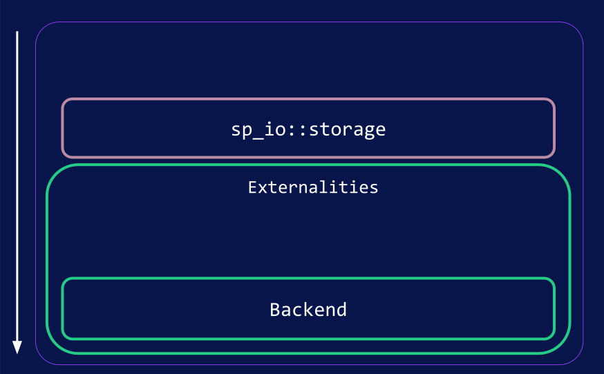</img>

---v

### Substrate Storage: Key Value

- How about a key-value storage externality? why not? 🙈

<br>

- O(1) Read and write.
- Hash all the data once to get a root.

---v

### Substrate Storage: Key Value

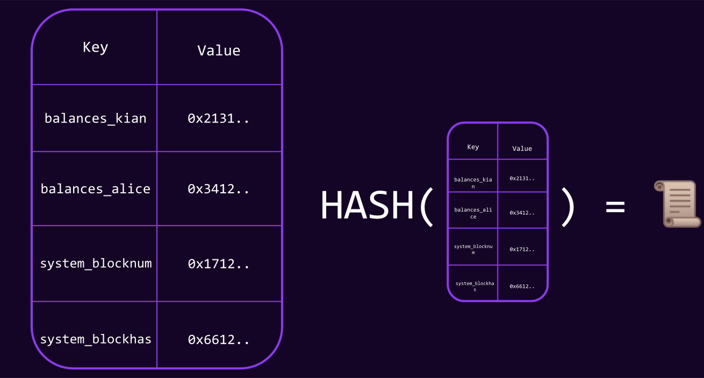</img>

---v

### Substrate Storage: Key Value

- If alice only has this root, how can I prove to her how much balance she has?

> Alice is representing a light client, I represent a full node.

THE WHOLE DATABASE 😱.

<!-- .element: class="fragment" -->

---v

### Substrate Storage: Key Value

- Moreover, if you change a single key-value, we need to re-hash the whole thing again.

---

## Substrate Storage: Merklized

- This brings us again to why we like to "merkelize" things.
- We take the key, and make it be the path on a trie.
- Some nodes contain value, some nodes are just "connectors".
- Then we store the nodes of this tree in a database by hashing them.

---v

### Substrate Storage: Merklized

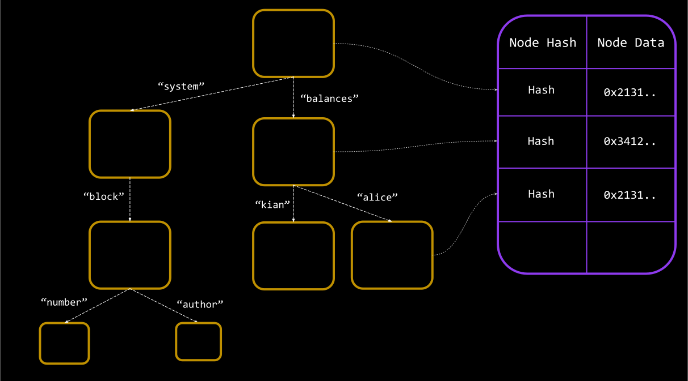</img>

---v

### Substrate Storage: Merklized

- Storage key: `balances_alice`. **1** operation in `sp-io`.
- **Multiple** Database key reads: Hash( `<trie-node>` ).

Notes:

how many do we mean by "multiple"? depends on how the trie is structured, and the radix order.

---v

### Substrate Storage: Merklized

- We know the state-root at a given block `n`.
- assume this is a radix-26, patricia trie. English alphabet is the key-scope.
- Let's see the steps needed to read `balances_alice` from the storage.

---v

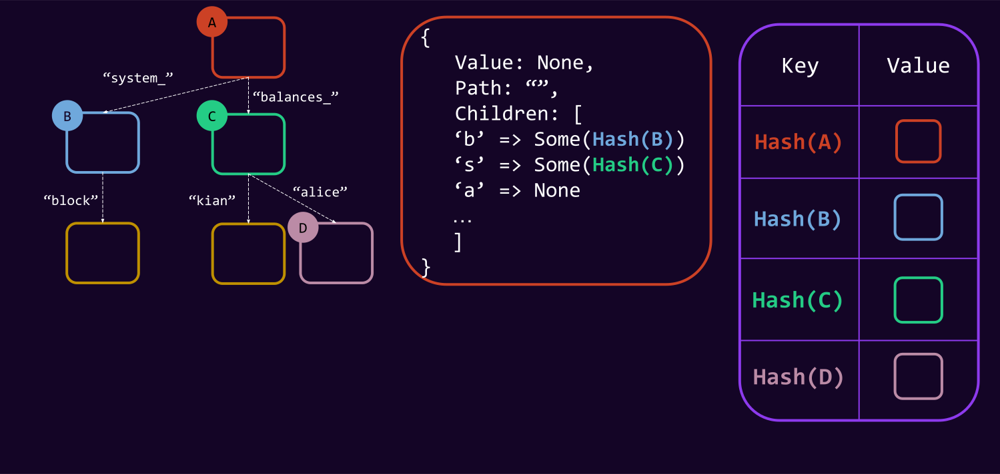</img>

---v

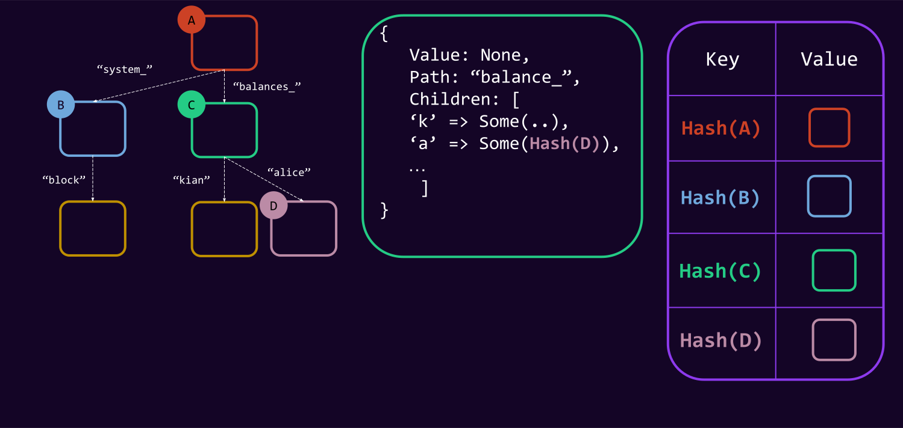</img>

---v

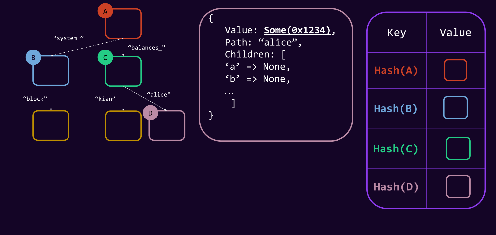</img>

---v

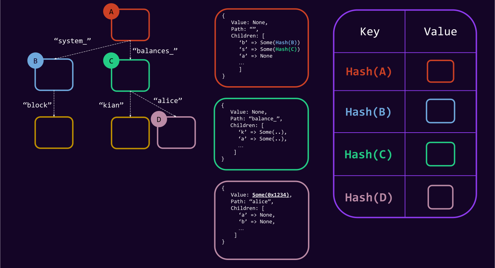</img>

---v

### Substrate Storage: Merklized

- If alice only has this root, how can I prove to her how much balance she has?

---v

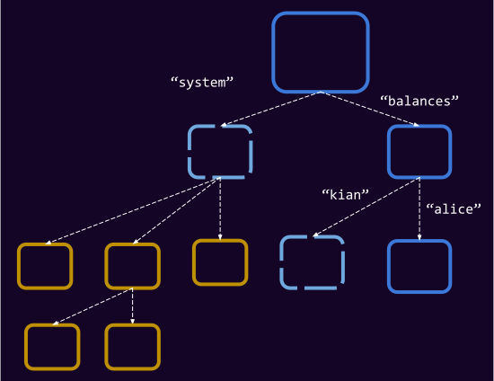</img>

Notes:

Dark blue are the proof, light blue's hashes are present.

---v

### Substrate Storage: Merklized Recap

- Storage key is the path on the trie.
- Storage key is arbitrary length.
  - Consequence of the former point.
- Intermediary (branch) nodes could contain values.
- Storage Key != Database Key.

---

## WAIT A MINUTE... 🤔

- Two common scenarios that merkle proofs are kinda unfair:
  - If the one of the parent nodes has large some data.
  - If you want to prove the deletion of a leaf node.

---v

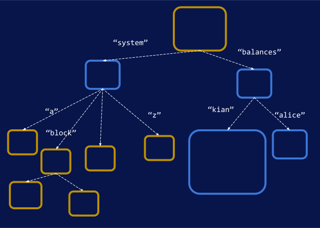</img>

---v

## WAIT A MINUTE... 🤔

- All solved by "`state-version = 1`".
- A new trie "format", in which:
  - All data containing more than 32 bytes are replaced with their hash.
  - Don't care about having big parents
  - And easier deletion proofs.

```rust
struct RuntimeVersion {
  ...
  state_version: 0,
}
```

---v

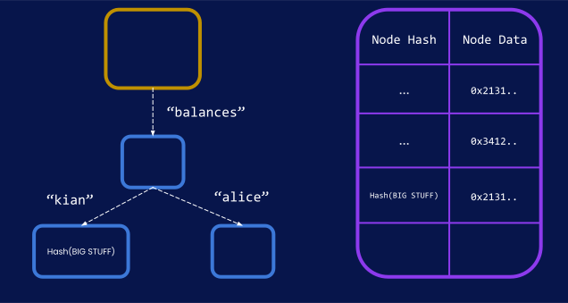</img>

---

### Substrate Storage: _Real_ Merklized

- The Trie-node format I showed is a massive simplification.
- Instead of alphabet, we use the base-16 representation of everything.

> Radix 16, Patricia Merkle Tree.

- `System` -> `73797374656d`
- `:code` -> `3a636f646500`

---v

### Substrate Storage: Base-16 Merklized

</img>

---v

### Substrate Storage: Base-16 Merklized

- radix-2: Proof contains less sibling hashes, but more intermediary nodes, more IO while read and write.
- radix-8: Proof has more sibling hashes, less intermediary nodes.

✅ 16 has been benchmarked and studies years ago as a good middle-ground

---

### Unbalanced Tree

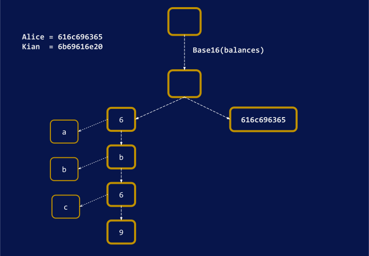</img>

---v

### Unbalanced Tree

- Unbalanced tree means unbalanced performance. An attack vector, if done right.
  - under-estimate weight/gas etc.
- You as the runtime developer must ensure that you use the right keys.
- This is particularly an issue if an end user can control where they can insert into the trie!

> More about this in FRAME storage, and how it is prevented there

Notes:

The main prevention is using a cryptographically secure hash function on the frame side.

---

## Substrate Storage: The Updated Picture

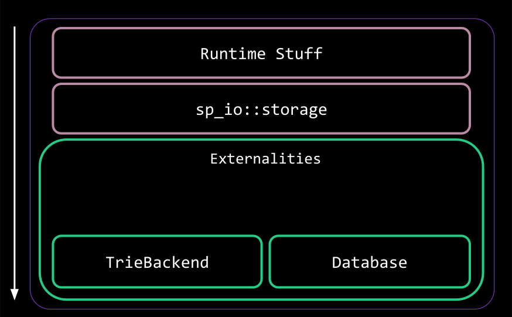</img>

---

## Substrate Storage: The Role of FRAME

- All FRAME does is hashing keys, really.
- No seriously, that's almost all it does.

- Done right, the tree should be balanced because of hashing.

---

## WAIT A MINUTE... 🤔

- We should of course think of caching...
- We rarely care about state root and all the trie shenanigans before the end of the block...

> A block-scoped cache for storage.

Notes:

I am pretty sure that when importing block, we have 1 runtime api call and it has one `Ext` and ergo
one one `Overlay`. When creating a block, I am not sure. Either way, that's not the main point.

---

## Substrate Storage: Overlay

- Is a cache layer.
- It works **based on key-values**, **not trie-format**.
  - Once you read a value, it stays here, and can be re-read for cheap.
  - Once you write a value, it will only be written here.
    - It can be read for cheap.
  - All writes are flushed at the end of the runtime api call.

---v

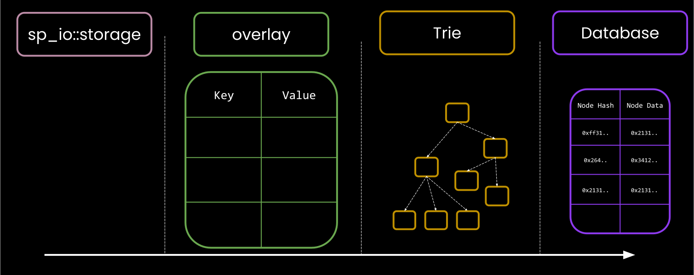</img>

Notes:

TODO: boundary of what is client/runtime

---v

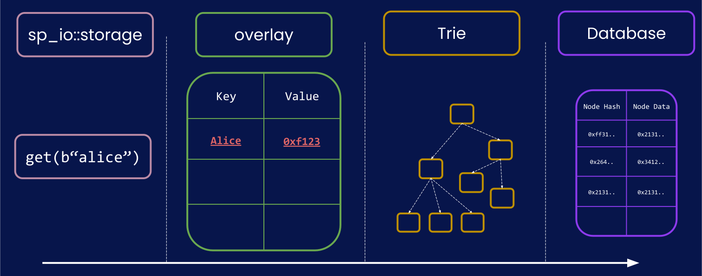</img>

---v

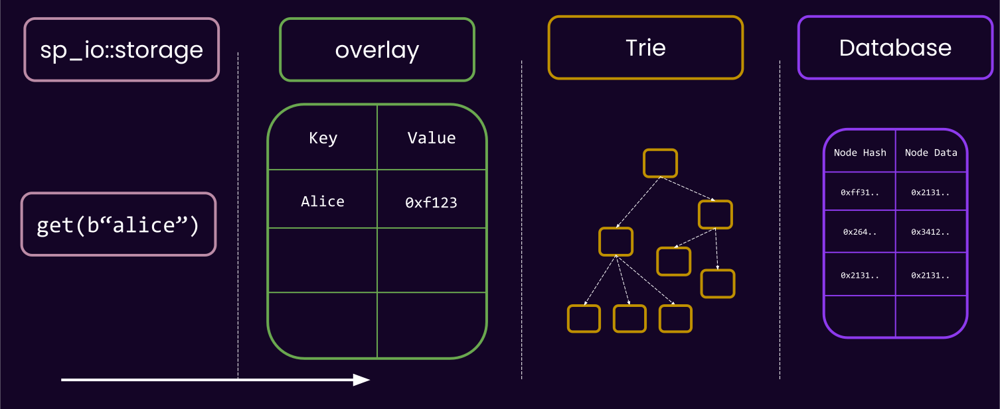</img>

---v

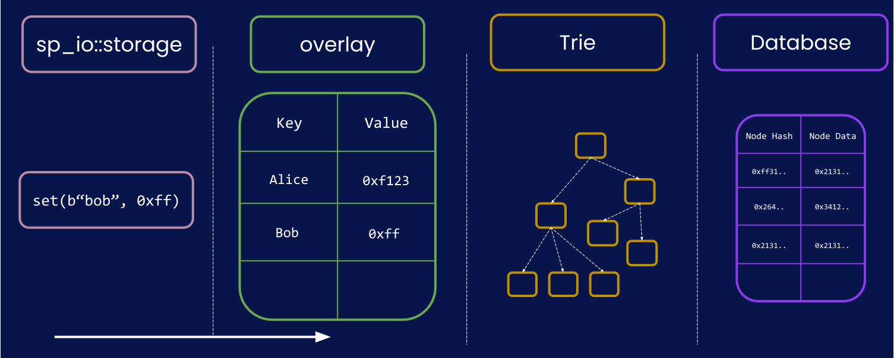</img>

---v

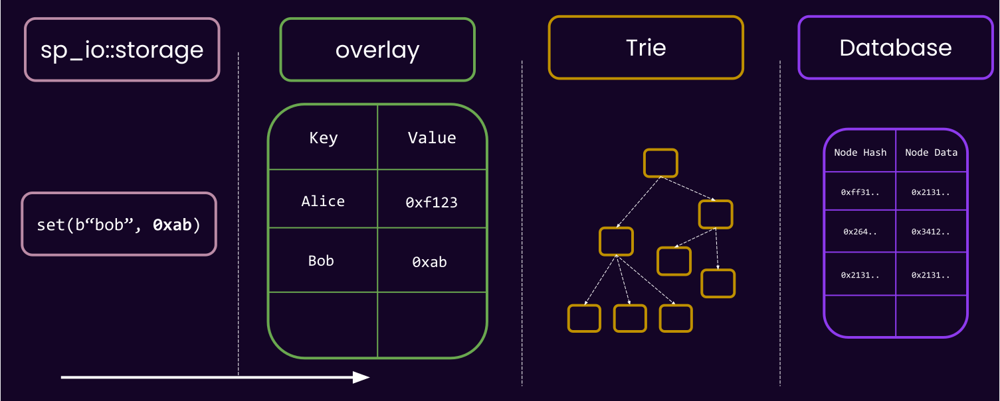</img>

---v

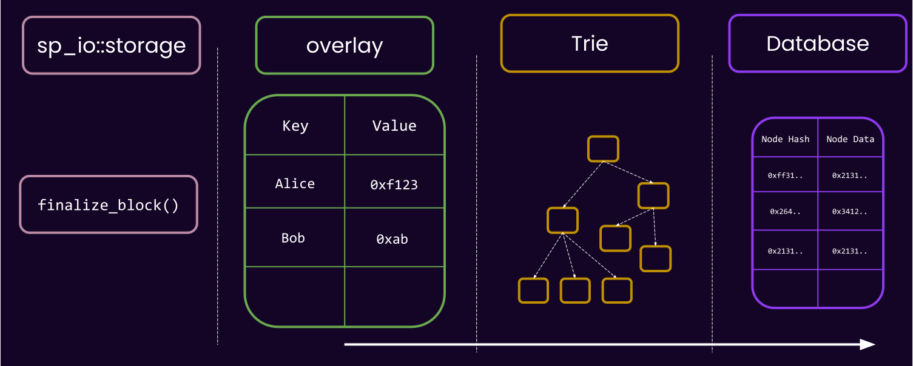</img>

---v

### Substrate Storage: Overlay

<pba-cols>

<pba-col>

- Cheap != Free

```rust
let temp = sp_io::storage::get(b"bar");

// is a lot faster!
let cached = sp_io::storage::get(b"bar");
// but not as fast as this!
let in_memory = temp;
```

</pba-col>
<pba-col>

</img>

</pba-col>

</pba-cols>

Notes:

- A deletion is basically a write.

---v

### Substrate Storage: Overlay

- The overlay is also able to spawn child-overlays, know as "_storage layer_".
- Useful for having a _transactional_ block of code.

```rust
// spawn a new layer.
with_storage_layer(|| {
    let foo = sp_io::storage::read(b"foo");
    sp_io::storage::set(b"bar", foo);

    if cond {
        Err("this will be reverted")
    } else {
        Ok("This will be commit to the top overlay")
    }
})
```

Notes:

- implement with zero-copy. So, the size of values is not so important, it is more about the number.

---v

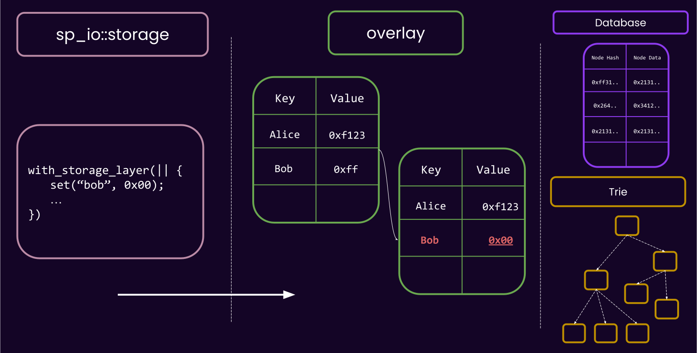</img>

---v

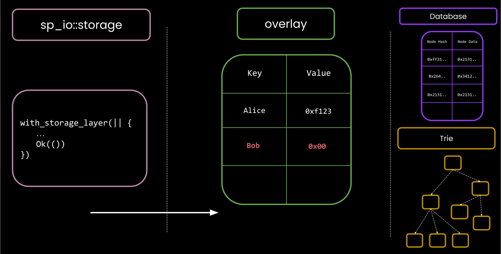</img>

---v

### Substrate Storage: Overlay

- There is a limit to how many nested layers you can spawn
- It is not free, thus it is attack-able.

```rust
with_storage_layer(|| {
    let foo = sp_io::storage::read(b"foo");
    with_storage_layer(|| {
        sp_io::storage::set(b"foo", b"foo");
        with_storage_layer(|| {
            sp_io::storage::set(b"bar", foo);
            with_storage_layer(|| {
                sp_io::storage::set(b"foo", "damn");
                Err("damn")
            })
            Ok("what")
        })
        Err("the")
    });
    Ok("hell")
})
```

---v

### Substrate Storage: Overlay

> What if I call `sp_io::storage::root()` in the middle of the block?

- Can the overlay respond to this?

Notes:

NO! overlay works on the level on key-values, ot knows nothing of trie nodes, and to compute the root we have to go to the trie layer and pull a whole lot of data back from the disk and build all the nodes etc. etc.

---v

### Substrate Storage: Word on Caches

- There are more caches in the trie layer as well.
- I am too afraid to talk about them though.

---v

### Substrate Storage: Word on Caches

- But this guy can:

<br>

<iframe width="1200" height="600" src="https://www.youtube.com/embed/OoMPlJKUULY" title="YouTube video player" frameborder="0" allow="accelerometer; autoplay; clipboard-write; encrypted-media; gyroscope; picture-in-picture; web-share" allowfullscreen></iframe>

---

### Substrate Storage: Final Figure

</img>

---v

### Substrate Storage

There are multiple implementations of `Externalities`:

- [`TestExternalities`](https://paritytech.github.io/substrate/master/sp_state_machine/struct.TestExternalities.html):
  - `Overlay`
  - `TrieDb` with `InMemoryBackend`
- [`Ext`](https://paritytech.github.io/substrate/master/sp_state_machine/struct.Ext.html) (the real thing 🫡)
  - `Overlay`
  - `TrieDb` with a real database being the backend

---v

### Substrate Storage

- Recall: Any code accessing host functions needs to wrapped in something that implements
  `Externalities`

```rust
// ❌
let x = sp_io::storage::get(b"foo");

// error:
// thread '..' panicked at '`get_version_1` called outside of an Externalities-provided environment.'
```

```rust
// ✅
SomeExternalities.execute_with(|| {
  let x = sp_io::storage::get(b"foo");
});
```

---

## Child Trees

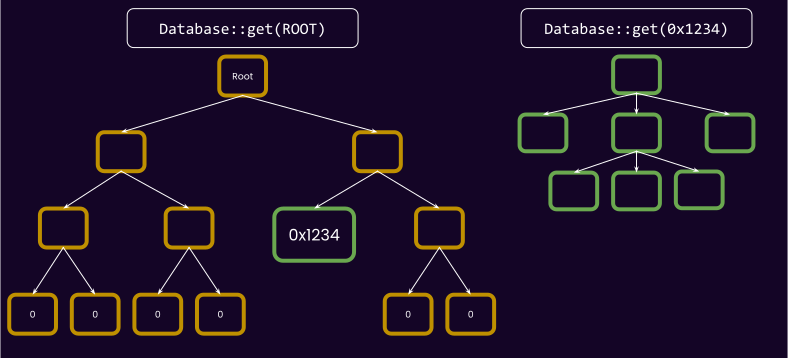</img>

---v

### Child Trees

- Stored on a different DB Column (async-ish bulk deletion).
- Most importantly, alternative trie formats.

---

## State Pruning

- Recall that each block has its own associated state.
- So, technically, each block has a full trie associated with it?

Surely not.

<!-- .element: class="fragment" -->

---v

## State Pruning

- Only trie nodes that are updated from one block to the other are created as new DB Keys.
- For the unchanged ones, we only reference the existing one.

---v

### State Pruning

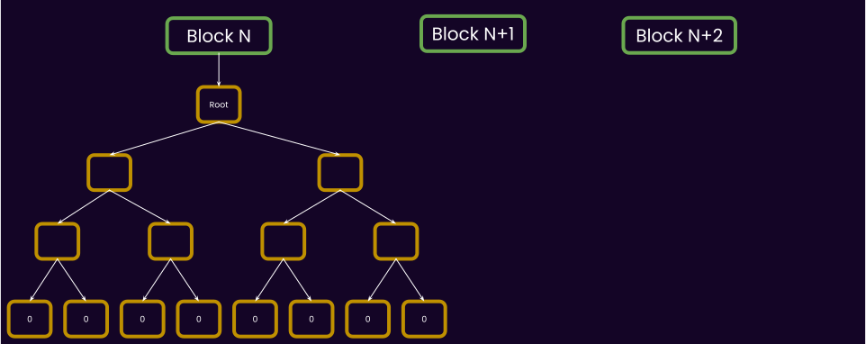</img>
---v

### State Pruning

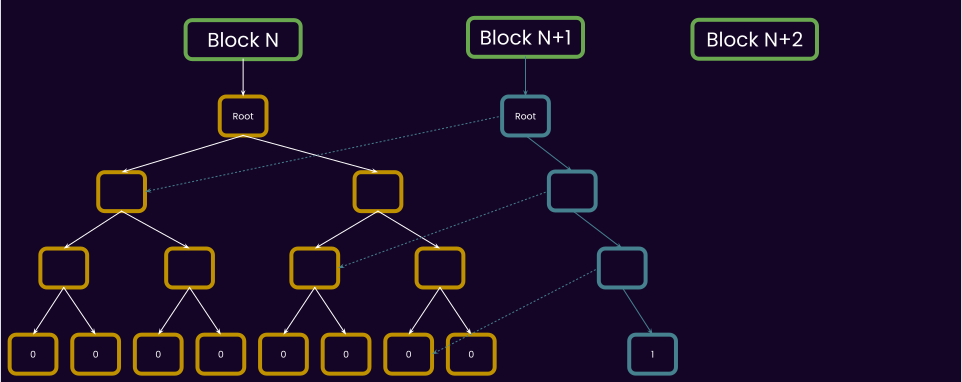</img>
---v

### State Pruning

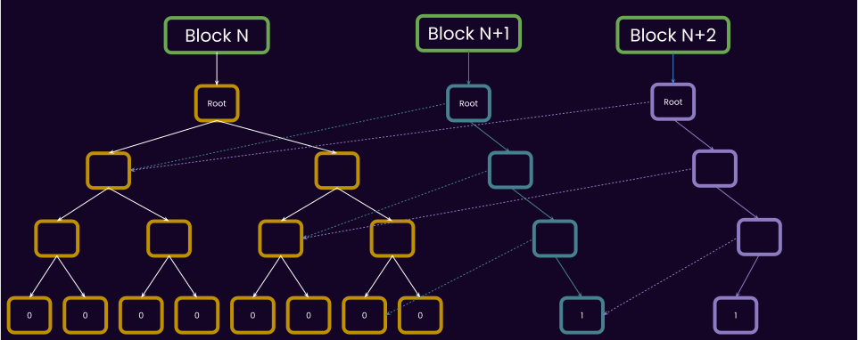</img>
---v

### State Pruning

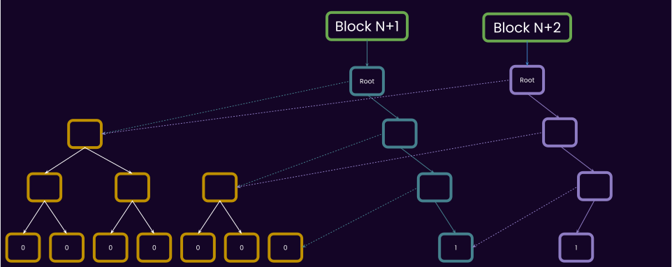</img>

---v

## State Pruning

- If you store some data onchain that does not change frequently, it is not much extra burden on the archive nodes of the network 🧠.

---

## Trie Format Matters!

- Recall that in our "trie walking", we took the state root, and got the root node from the DB.
- The state root of any substrate-based chain, including Polkadot, is the hash of the "Trie Node".

> Trie format matters! and therefore it is part of [the polkadot spec](https://spec.polkadot.network).

Notes:

Meaning, if another client wants to sync polkadot, it should know the details of the trie format.
