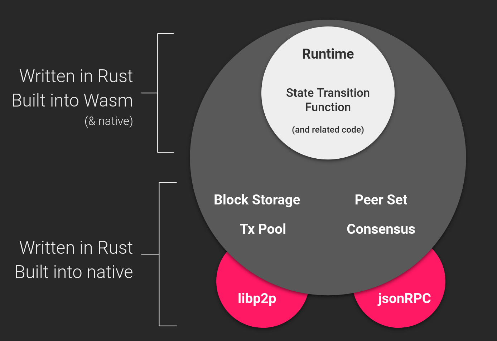
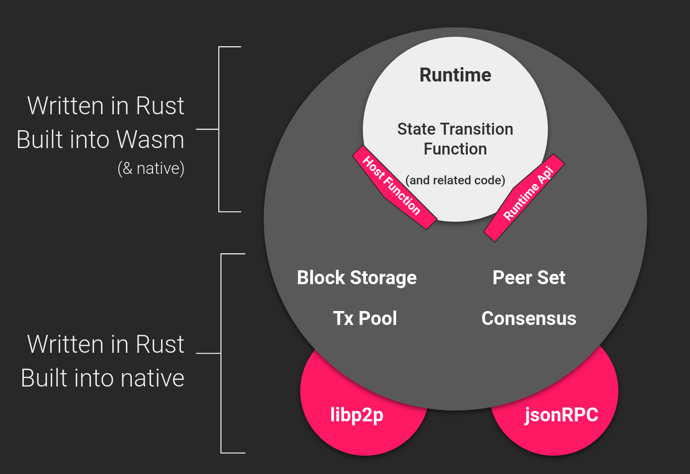
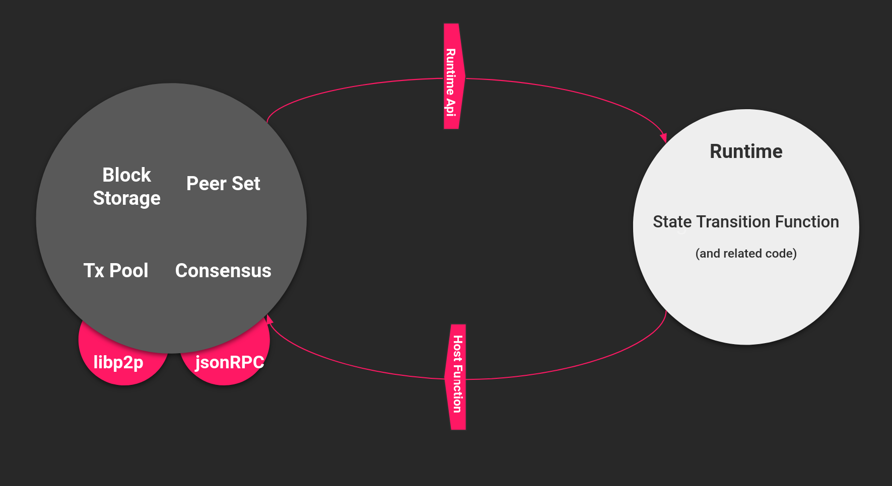
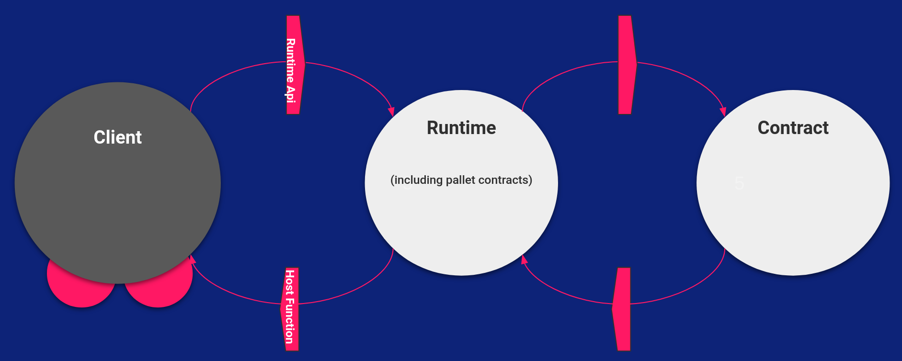
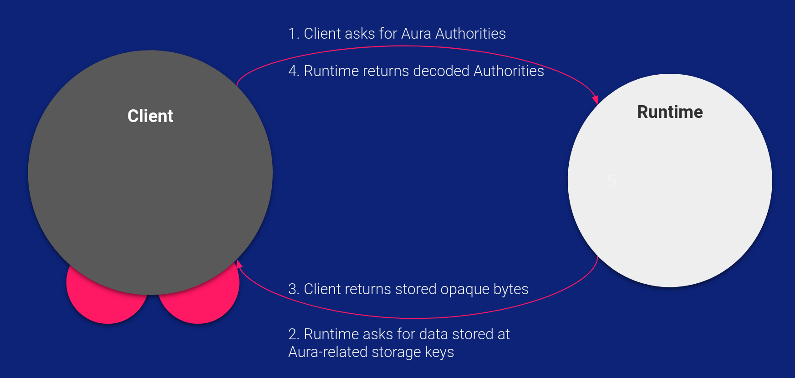
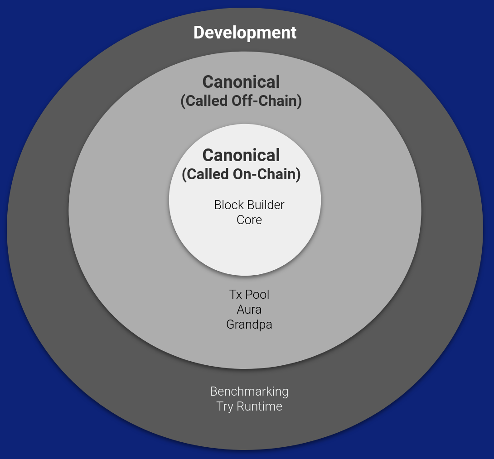

## Host/Runtime Interface

Lecture 4, Module 4

Instructor: Joshy Orndorff, Kian Paimani

---v

The Client / Runtime division is one of the most important design decisions in Substrate.

In this lesson:

- Where is the division (the "wasm boundary")?
- Why did we make this distinction?
- How the two parts communicate with each other

---


## The Substrate Runtime



- Inside the boundary, in wasm, is the runtime
- Outside the boundary, in Rust, is the client

Notes:

On the client side, you have:

- P2P networking
- Block database including block storage
- Consensus (Block authoring/Finality)
- Wasm executor
  These are the normal P2P blockchain style tasks. Most chain developers will not want to customize this stuff at all. If you want to, you can. Especially consensus. But you typically won't need to.

All these element are directly (through host function) reachable from the runtime.
- Storage is, but behind a state-machine overlay.
- Wasm executor is, but not in real life usage (through the experimental worker api).
- Networking is but only in a limited form and only for offchain host function

---v

### The Runtime _IS_ the STF

Its jobs are:

- Execute entire blocks
- Determine Transaction validity
- Dispatch state changes and transactions to the client state machine.
- Construct Blocks -- Only some nodes will call this API, but the runtime needs to support it.
- Consensus-adjacent tasks like authority set management
- Provide data to the client upon request through accessor apis (eg Aura Api)

Notes:
The first three are really the core jobs. Constructing blocks is a job for miners or validators. It makes sense to do block construction with the runtime because much code will be shared and the runtime itself is what will validate the blocks anyway.
Consensus related tasks are really just part of the same state transition logic. Although they can feel "meta" they are equal with token transfers etc.
Jobs like accessing data might seem tangential and redundant. We will talk about them more shortly

---v

### Why make the Runtime distinction?

Two reasons.

1. Separation of concerns
  * Runtime contains the chain's "business logic"
  * Most chains will only want to customize the Runtime
  * This is just good software engineering.

2. But the really compelling reason....

---v

### Runtime Upgrades!

The Runtime can _change_ through the life of the chain.

Analogy you can flash a new program on to your micro-controller. It can even use the same data that is stored on disk and same peripheral hardware. Likewise, you can deploy a new runtime to the blockchain.

This will be covered in much more detail later on. For now, know that it can happen.

---

### Wasm

- Standard portable instruction set
- ethereum evm instructions very blockchain specific
				- SSTORE, SLOAD, CODESIZE, ORIGIN, ADDRESS, SHA3...
- Wasm module just uses imports (and exports)

Note:

purpose here is to mention that wasm is a good choice for being generic and blockchain specific are just using standard wasm export and imports.

wasm instruction : good enough generic set of instruction for general deterministic computation as soon as you disable/forbid certain things (float mostly).

eth storage opcode are not what you expect from a general language, they are more a kind of std/external call.
It fits storage, it fits small computation

we can see two reason for these instruction:
- technical (speed) : eg SHA3  or ethereum Precompile (spending two minute on what they are can be good: actually could make sense
later in polkadot to show that this precompile model at a parachain level would work but it would not be available for pov verification
(as many optimization)).
- persistance. Chain state modification.

With a general purpose computing instruction set like wasm how do we do that:
wasm for web, sandboxed, with clear imports definition (and exports).
So we open a window out of the wasm with these host function.

---

## Client - Runtime Communication

<div class="left">

- The runtime uses host functions to get data from the client
- The client uses runtime apis to get data from the runtime
</div>

<div class = "right">



</div>

Notes:
sometime 'host functions' are refered as 'host api' eg in polkadot spec

So the wasm run sandboxed in an executor: it can trap
(native execution too but it will be removed long term)

Client side, host function cannot fail or the program does (eg unresponsive db).

---v

## An Alternate Visualization




---v

## Example: Block Execution

To execute a block, we need both host functions and runtime apis:

- Runtime API: for example `execute_block` - The client provides a block to the runtime, and expects the runtime
  to execute that block.

- Host Function - for example `storage_get` - To execute the block, the runtime will probably need to read
  storage, which only the client has access to.

---v

## Smart Contracts use the same technique



We'll learn more in Lesson 6.5 about pallet contracts

---

## Coding Exercise

<!-- TODO: create the example starter code and work through the entire example. Link both starting point and example solutions. -->

Instructor has pre-written a basic minimal (toy) application that calls into a simple runtime using a simplified interface.
It creates a handful of blocks and tracks the state at each block. The initial example runtime does nothing.
Together we write a second runtime that acts as a flipper
Then we write one that acts as an adder.

---v

Exercise: make it so you can only add if you are adding at least 10% of the current accumulated value.

---v

Exercise: Write one that acts as an adder and subtracter. Add more operations as well like multiply, mod, whatever you want. This introduces the idea of transaction types.

---v

Exercise: Write one that has both the flipper and adder functionality. They should be orthogonal. Now you must keep track of multiple pieces of state.

---v

## Regroup after the Exercises

Instructor demonstrates how we can swap the runtime part way through.

Discussion points:

- Are these runtimes economically secure? <!-- no, there are no fees at all, nor prioritization -->
- Is the adder secure other than the fee part? <!-- no, it can overflow -->

---

## Substrate Runtime APIs

Some [existing runtime APIs](https://github.com/substrate-developer-hub/substrate-node-template/blob/main/runtime/src/lib.rs#L334) in Substrate include:

-  **Core** - most important - for executing blocks
-  **TxQueue** - tells the offchain code whether a transaction is valid and how to prioritize it.
- **BlockBuilder** - critical for authoring nodes - for writing blocks
- **Metadata** - we won't use it much today - to teach offchain tools the structure of your storage and extrinsics
- **Session Keys** - allow the runtime to generate cryptographic keys that will be used on the client side
- **Consensus related** - Aura, Babe, Grandpa, PoW all have their own - allows fetching consensus info from the runtime
- Accessors - many pallets will provide simple "getters" to obtain storage data. One example is the Aura API that just returns the authorities from storage. Any pallet author can write their own, and often some post-processing is included.

---

## Substrate Host functions

See [some existing host functions](https://github.com/paritytech/substrate/blob/master/primitives/io/src/lib.rs) in Substrate:

- crypto and hashing
- io
  - storage
  - print
- allocating memory
- also extensible

Notes:

Extensible but with a lot of limitation when it comes to the polkadot system as will be seen in the next modules.

---v

## Examples

- transaction (state machine transactional overlay)
- threads
- storage root

Note:

ethereum got transaction of modified content embeded in the way thing works, we will see later that substrate simply use host function to reproduce this mechanism.

storage root: can spend time on it: explain the need to cache things, even go through state machine code a bit.

This is a good cost gain as using trie code on the hash function would be a LOT of host function calls.
Yet when using cumulus, that is what happen.

---

### Opaque Types (and round trips)
Question: Why make a roundtrip through the runtime instead of fetching the data directly from storage?



Notes:
Consider this design which is common in Pallets (for example, frontier).
The client calls a runtime API accessor to request some data. The runtime calls a host function to get the data from storage, then returns it.
TODO: locally the image did not show  for me

---v

First answer: You don't _have_ to make the round trip. There is the StorageBackend. (Frontier occasionally uses this _as an optimization_). But you should make the trip because...

---v

### Opaque Types

If the Runtime can change mid-flight, so can its data types, and storage keys.

Typical types that the client can't interpret:

- `Extrinsic`
- `Block`
- `AcccountId` - if you even have such a type
- Any data structures you store in storage
  - Token values
  - NFT data

Notes:
Since The substrate runtime is upgradeable, the data types it uses can change at any time
The client-side can't make any assumptions about what data types the runtime uses.
When the client is passing around and handling runtime data, it uses scale-encoded data. Just `Vec<u8>`. The client can't interpret the data at all.
Because the client can't interpret even basic data types like transaction, we have to call into the runtime for such things.
This is why we make a round trip through the runtime.

---

### TransactionPoolApi

Did you ever wonder why the transaction pool logic is in the runtime? The TxPool is offchain. It is not part of the STF. If the runtime is the STF, why wrap TxPool logic into it.

Hopefully you can explain the answer based on the past few slides. Someone volunteer to explain it in your own words.

Notes:
Even the transaction type can change at any time. To the client it is just `Vec<u8>`. In order to validate them and prioritize them, we call into the runtime. The runtime just tells whether it is valid, and assigns a priority. Plus the whole tagged part which you covered in the previous lesson.

---

## More Subtle Considerations

Here are some practical tips and gotchas when extending Runtime APIs and Host Functions

---v

## Determinism

- For host function call from runtime all implement MUST be deterministic
- For host function call from offchain worker, no need too


Notes:

Wasm is not fully so some instruction are `forbidden` eg float,.

Move to the conclusion that offchain worker host function being in sp_io crate can be a big foot gun:
if you got a runtime you can try to use it (eg call http) and have a broken consensus.

---v

## Speed

- Difference of speed between Wasm and native.
- How much slower is using the Wasm implementation than executing a native function
- Cost of calling a host function.
- Analogy: when contacting host function from Wasm, its like your OS contacting IO buffer

Notes:
- cost of calling is parameter passing: memory copy: one should strive to reduce the number of call to host function.
For instance in storage when calculating the root we do not build it in wasm and call the hash host function multiple times: we just have a host function doing the root calculation and state trie kept in client.
On the other hand things as `next_storage` are high cost (generally iteration on state from runtime is expensive). This design is related to the memory location, there is alternative but this is simple (simple as good design).
(iteration remains very costy: because each call to next is going through the host function boundaries (and historically caching is not supporting it : only get: trade off between code complexity and performance here)
note that with cumulus we do build the trie in wasm but it is a different use case.
- Question: we got host function for runing computation intensive code in native, but when simd for wasm would be added, then
will host function for a hashing be still usefull: wait and see, but is possible that simd optim of the hash function in wasm is way faster.
Again using a host function for speed up needs to be reasoned, cost of transmitting parameter in wasm can be bigger than the actual hashing
cost.

- one can notice that such host function in the context of cumulus pvf, only make sense if both in relay chain and para. Still a para can use custom host function for speed and pvf on a wasm implementation of it.

---v

## Missing Host Function

- If you have a runtime which expects a host function which does not exist, the runtime will fail at instantiation.
- When the client has a host function the runtime doesn't know of or need, nothing happens.
- If your new runtime needs a new host function, all nodes must upgrade first.

Notes:
First point, can talk about the memory passing and the fact that some types pass natively, while others are just scale encoded (actually this is something that need to be in the presentation: TODO maybe a slide for it) with obviously an even higher hast function call price.
This is handled by macros, this kind of linkage is very important: maybe word a bit about component proposal and WIT (and the fact that we don't use them).

Third point really need to be stressed: host function change require client upgrade not just runtime update.


---v

## Versioning and backwards compatibility

- Host functions are **FOREVER**: when finalizing a block that uses a specific host function, you always need to keep the same host functions.
- Imagine syncing your chain from scratch, every version of your blockchain's runtime will be needed to sync and get to the latest block.
- Thus your client must be able to provide all the host functions expected in the past and for
  present/future blocks.
- What level of specification?

Notes:

Distinguish the implications of adding/removing host functions (and the lack of implications when adding runtime api).

https://github.com/w3f/polkadot-spec/tree/main/host-spec

Stress that a bug in a host function will need to stay (can point some), and worse will need to be implemented by all clients (eg gossamer).
Also the buggy or ill designed host function will need to be specified, you can check the polkadot spec and see some of those.


But still forever could end after a regenesis :)

Also stress that version are just different host function (nothing prevent from runing to different version in a runtime).

---

## Defining a Runtime API

- Use the `impl_runtime_api!` macro.
- No matter the return type, client sees the outcome as `Vec<u8>`.
- Client can always provide extra `at: Option<BlockNumber>`.


Note:

client side storage host function directly it a 'environmental' context that correspond to a backend at a given block.
Probably no need to go in architecture here.

---v

<div class="left">

- conveniently a Rust trait
- always generic over `Block`.

</div>

<div class="right">

For example:

<pre><code style="font-size: 0.5em !important" data-trim data-noescape data-line-numbers="0-13" class="rust">
/// The `Metadata` api trait that returns metadata for the runtime.
pub trait Metadata {
  /// Returns the metadata of a runtime.
  fn metadata() -> OpaqueMetadata;
}

impl_runtime_api! {
  impl sp_api::Metadata<Block> for Runtime {
    fn metadata() -> OpaqueMetadata {
      OpaqueMetadata::new(Runtime::metadata().into())
    }
  }
}

</prev></code>

</div> 

---

## Which Runtime APIs are "required"?

Depends on what you are doing.



## Cannonical Runtime APIs

These runtime APIs are needed by nodes to operate the live network. They are compiled into the on-chain wasm binary, and the chain breaks without them.

* On-chain ones are called in the block creation or execution flow. Consensus is reached over their results.
* Off-chain ones are called from off-chain contexts and are critical but consensus is not reached over their result.

## Feature gated runtime APIs for development

There are ways to implement runtime interfaces for development purposes, such as:

- Testing and verification: `try_runtime`
- Benchmarking: `frame_benchmarking`

---

## Defining a Host Function

<div class="left">

* use the `#[runtime_interface]` attribute
* just like an ordinary Rust trait

</div>

<div class="right">

For example:

<pre><code style="font-size: 0.5em !important" data-trim data-noescape class="rust">
  #[runtime_interface]
  pub trait Storage {
    /// Returns the data for `key` in the storage or `None` if the key can not be found.
    fn get(&self, key: &[u8]) -> Option<Vec<u8>> {
      self.storage(key).map(|s| s.to_vec())
    }

</prev></code>

</div>

---

## Looking at it

Best source of information is:

```
cd substrate
fd .wasm
wasm2wat client/executor/benches/kusama_runtime.wasm | less
```

and sp_io module for the host functions
(alternatively https://spec.polkadot.network/).

---v
```
  (import "env" "memory" (memory (;0;) 22))
  (import "env" "ext_crypto_ed25519_generate_version_1" (func $ext_crypto_ed25519_generate_version_1 (type 18)))
  (import "env" "ext_crypto_ed25519_verify_version_1" (func $ext_crypto_ed25519_verify_version_1 (type 19)))
  (import "env" "ext_crypto_finish_batch_verify_version_1" (func $ext_crypto_finish_batch_verify_version_1 (type 12)))
  (import "env" "ext_crypto_secp256k1_ecdsa_recover_version_2" (func $ext_crypto_secp256k1_ecdsa_recover_version_2 (type 7)))
  (import "env" "ext_crypto_secp256k1_ecdsa_recover_compressed_version_2" (func $ext_crypto_secp256k1_ecdsa_recover_compressed_version_2 (type 7)))
  (import "env" "ext_crypto_sr25519_generate_version_1" (func $ext_crypto_sr25519_generate_version_1 (type 18)))
  (import "env" "ext_crypto_sr25519_public_keys_version_1" (func $ext_crypto_sr25519_public_keys_version_1 (type 4)))
  (import "env" "ext_crypto_sr25519_sign_version_1" (func $ext_crypto_sr25519_sign_version_1 (type 20)))
  (import "env" "ext_crypto_sr25519_verify_version_2" (func $ext_crypto_sr25519_verify_version_2 (type 19)))
  (import "env" "ext_crypto_start_batch_verify_version_1" (func $ext_crypto_start_batch_verify_version_1 (type 14)))
  (import "env" "ext_default_child_storage_clear_version_1" (func $ext_default_child_storage_clear_version_1 (type 21)))
  (import "env" "ext_default_child_storage_get_version_1" (func $ext_default_child_storage_get_version_1 (type 22)))
  (import "env" "ext_default_child_storage_next_key_version_1" (func $ext_default_child_storage_next_key_version_1 (type 22)))
  (import "env" "ext_default_child_storage_set_version_1" (func $ext_default_child_storage_set_version_1 (type 23)))
  (import "env" "ext_trie_blake2_256_ordered_root_version_2" (func $ext_trie_blake2_256_ordered_root_version_2 (type 24)))
  (import "env" "ext_misc_print_hex_version_1" (func $ext_misc_print_hex_version_1 (type 17)))
  (import "env" "ext_misc_print_num_version_1" (func $ext_misc_print_num_version_1 (type 17)))
  (import "env" "ext_misc_print_utf8_version_1" (func $ext_misc_print_utf8_version_1 (type 17)))
  (import "env" "ext_misc_runtime_version_version_1" (func $ext_misc_runtime_version_version_1 (type 25)))
  (import "env" "ext_hashing_blake2_128_version_1" (func $ext_hashing_blake2_128_version_1 (type 26)))
  (import "env" "ext_hashing_blake2_256_version_1" (func $ext_hashing_blake2_256_version_1 (type 26)))
  (import "env" "ext_hashing_keccak_256_version_1" (func $ext_hashing_keccak_256_version_1 (type 26)))
  (import "env" "ext_hashing_twox_128_version_1" (func $ext_hashing_twox_128_version_1 (type 26)))
  (import "env" "ext_hashing_twox_64_version_1" (func $ext_hashing_twox_64_version_1 (type 26)))
  (import "env" "ext_storage_append_version_1" (func $ext_storage_append_version_1 (type 21)))
  (import "env" "ext_storage_clear_version_1" (func $ext_storage_clear_version_1 (type 17)))
  (import "env" "ext_storage_clear_prefix_version_2" (func $ext_storage_clear_prefix_version_2 (type 22)))
  (import "env" "ext_storage_commit_transaction_version_1" (func $ext_storage_commit_transaction_version_1 (type 14)))
  (import "env" "ext_storage_exists_version_1" (func $ext_storage_exists_version_1 (type 26)))
  (import "env" "ext_storage_get_version_1" (func $ext_storage_get_version_1 (type 25)))
  (import "env" "ext_storage_next_key_version_1" (func $ext_storage_next_key_version_1 (type 25)))
  (import "env" "ext_storage_read_version_1" (func $ext_storage_read_version_1 (type 27)))
  (import "env" "ext_storage_rollback_transaction_version_1" (func $ext_storage_rollback_transaction_version_1 (type 14)))
  (import "env" "ext_storage_root_version_2" (func $ext_storage_root_version_2 (type 4)))
  (import "env" "ext_storage_set_version_1" (func $ext_storage_set_version_1 (type 21)))
  (import "env" "ext_storage_start_transaction_version_1" (func $ext_storage_start_transaction_version_1 (type 14)))
  (import "env" "ext_allocator_free_version_1" (func $ext_allocator_free_version_1 (type 1)))
  (import "env" "ext_allocator_malloc_version_1" (func $ext_allocator_malloc_version_1 (type 0)))
  (import "env" "ext_offchain_is_validator_version_1" (func $ext_offchain_is_validator_version_1 (type 12)))
  (import "env" "ext_offchain_local_storage_clear_version_1" (func $ext_offchain_local_storage_clear_version_1 (type 28)))
  (import "env" "ext_offchain_local_storage_compare_and_set_version_1" (func $ext_offchain_local_storage_compare_and_set_version_1 (type 29)))
  (import "env" "ext_offchain_local_storage_get_version_1" (func $ext_offchain_local_storage_get_version_1 (type 11)))
  (import "env" "ext_offchain_local_storage_set_version_1" (func $ext_offchain_local_storage_set_version_1 (type 30)))
  (import "env" "ext_offchain_network_state_version_1" (func $ext_offchain_network_state_version_1 (type 16)))
  (import "env" "ext_offchain_random_seed_version_1" (func $ext_offchain_random_seed_version_1 (type 12)))
  (import "env" "ext_offchain_submit_transaction_version_1" (func $ext_offchain_submit_transaction_version_1 (type 25)))
  (import "env" "ext_offchain_timestamp_version_1" (func $ext_offchain_timestamp_version_1 (type 16)))
  (import "env" "ext_offchain_index_set_version_1" (func $ext_offchain_index_set_version_1 (type 21)))
  (import "env" "ext_logging_log_version_1" (func $ext_logging_log_version_1 (type 30)))
  (import "env" "ext_logging_max_level_version_1" (func $ext_logging_max_level_version_1 (type 12)))
 
```
Notes: 
- rg import
see the host function
Describe what is 'env' namespace (just a default no real need of namespace for substrate).
inkerc20 got host function that calls runtime, they are namespaced seal

talk about naming : ext_ prepended and a _version_x : don't forget versionning is just using a different name: we could have two version in parallel (but the macro do not expose them (also do some magic for swizzling)).

The macro choose which host function to include in runtime.

---v

```
  (export "__indirect_function_table" (table 0))
  (export "test_empty_return" (func $test_empty_return))
  (export "test_dirty_plenty_memory" (func $test_dirty_plenty_memory))
  (export "Core_version" (func $Core_version))
  (export "Core_execute_block" (func $Core_execute_block))
  (export "Core_initialize_block" (func $Core_initialize_block))
  (export "Metadata_metadata" (func $Metadata_metadata))
  (export "BlockBuilder_apply_extrinsic" (func $BlockBuilder_apply_extrinsic))
  (export "BlockBuilder_finalize_block" (func $BlockBuilder_finalize_block))
  (export "BlockBuilder_inherent_extrinsics" (func $BlockBuilder_inherent_extrinsics))
  (export "BlockBuilder_check_inherents" (func $BlockBuilder_check_inherents))
  (export "TaggedTransactionQueue_validate_transaction" (func $TaggedTransactionQueue_validate_transaction))
  (export "OffchainWorkerApi_offchain_worker" (func $OffchainWorkerApi_offchain_worker))
  (export "ParachainHost_validators" (func $ParachainHost_validators))
  (export "ParachainHost_validator_groups" (func $ParachainHost_validator_groups))
  (export "ParachainHost_availability_cores" (func $ParachainHost_availability_cores))
  (export "ParachainHost_persisted_validation_data" (func $ParachainHost_persisted_validation_data))
  (export "ParachainHost_assumed_validation_data" (func $ParachainHost_assumed_validation_data))
  (export "ParachainHost_check_validation_outputs" (func $ParachainHost_check_validation_outputs))
  (export "ParachainHost_session_index_for_child" (func $ParachainHost_session_index_for_child))
  (export "ParachainHost_validation_code" (func $ParachainHost_validation_code))
  (export "ParachainHost_candidate_pending_availability" (func $ParachainHost_candidate_pending_availability))
  (export "ParachainHost_candidate_events" (func $ParachainHost_candidate_events))
  (export "ParachainHost_session_info" (func $ParachainHost_session_info))
  (export "ParachainHost_dmq_contents" (func $ParachainHost_dmq_contents))
  (export "ParachainHost_inbound_hrmp_channels_contents" (func $ParachainHost_inbound_hrmp_channels_contents))
  (export "ParachainHost_validation_code_by_hash" (func $ParachainHost_validation_code_by_hash))
  (export "ParachainHost_on_chain_votes" (func $ParachainHost_on_chain_votes))
  (export "ParachainHost_submit_pvf_check_statement" (func $ParachainHost_submit_pvf_check_statement))
  (export "ParachainHost_pvfs_require_precheck" (func $ParachainHost_pvfs_require_precheck))
  (export "ParachainHost_validation_code_hash" (func $ParachainHost_validation_code_hash))
  (export "ParachainHost_staging_get_disputes" (func $ParachainHost_staging_get_disputes))
  (export "BeefyApi_validator_set" (func $BeefyApi_validator_set))
  (export "MmrApi_generate_proof" (func $MmrApi_generate_proof))
  (export "MmrApi_verify_proof" (func $MmrApi_verify_proof))
  (export "MmrApi_verify_proof_stateless" (func $MmrApi_verify_proof_stateless))
  (export "MmrApi_mmr_root" (func $MmrApi_mmr_root))
  (export "GrandpaApi_grandpa_authorities" (func $GrandpaApi_grandpa_authorities))
  (export "GrandpaApi_current_set_id" (func $GrandpaApi_current_set_id))
  (export "GrandpaApi_submit_report_equivocation_unsigned_extrinsic" (func $GrandpaApi_submit_report_equivocation_unsigned_extrinsic))
  (export "GrandpaApi_generate_key_ownership_proof" (func $GrandpaApi_generate_key_ownership_proof))
  (export "BabeApi_configuration" (func $BabeApi_configuration))
  (export "BabeApi_current_epoch_start" (func $BabeApi_current_epoch_start))
  (export "BabeApi_current_epoch" (func $BabeApi_current_epoch))
  (export "BabeApi_next_epoch" (func $BabeApi_next_epoch))
  (export "BabeApi_generate_key_ownership_proof" (func $BabeApi_generate_key_ownership_proof))
  (export "BabeApi_submit_report_equivocation_unsigned_extrinsic" (func $BabeApi_submit_report_equivocation_unsigned_extrinsic))
  (export "AuthorityDiscoveryApi_authorities" (func $AuthorityDiscoveryApi_authorities))
  (export "SessionKeys_generate_session_keys" (func $SessionKeys_generate_session_keys))
  (export "SessionKeys_decode_session_keys" (func $SessionKeys_decode_session_keys))
  (export "AccountNonceApi_account_nonce" (func $AccountNonceApi_account_nonce))
  (export "TransactionPaymentApi_query_info" (func $TransactionPaymentApi_query_info))
  (export "TransactionPaymentApi_query_fee_details" (func $TransactionPaymentApi_query_fee_details))
  (export "__data_end" (global 1))
  (export "__heap_base" (global 2))
```

Notes:

- rg export
- rg execute_block

metadata!! insist on the fact that we sometime put a lot in the runtime just to benefit from its upgradability.

Also can spend some time describing Block builder runtime api and underline that when building block we just run the extrinsic in a way
that mimic the executeblock logic: in some case parachain may need to for this logic.
Execute block calls initialize, and all extrinsic sequentiall then finalize.
Block building build context (Core_initialize_block) and try extrinsic one by one (BlockBuilder_apply_extrinsic).
But ultimately block building need to call Core_execute_block over their extrinsic choice.
(it is a bit of a digression but show how these host function are really relative to context, a question could rise: why not multiple runtime for each context: reduce size of runtime... Reply: runtime caching, shared code, generally a trade off).

Also external protocol get their info updated to the runtime logic this way.
- sometime to access state info
- but sometime could just have pure function that manage some logic (can imagine some thing as simple as decoding some encoded struct)


---

## Coding Activity - Flipper Runtime

In this activity, we will write a Substrate runtime together without using FRAME.

Avoiding FRAME allows us to focus on implementing the Runtime APIs as they are written and use the host functions directly.

As a bonus this sets us up well to say "look how much easier and nicer FRAME is" in module 6.

This code is working in https://github.com/substrate-developer-hub/substrate-node-template/pull/347

<!-- TODO: Although the code is working, I still need to decide the best order to write each part pedogogically. -->


---v

### Exercise: Adder

Make it an adder like in our toy example earlier.

Bonus points for adding any of the enhancements from earlier:
* make it an adder / multipler.
* make it so you have to add at least 10%
* make it both flipper and adder.

---v

Make this runtime upgradeable!

You just need to store the new wasm code at the special `b":code"` key

### Exercise: Custom Host Function

Write a custom host function for your runtime. A simple example would be to use a different crypto like RSA or SM2. For an example of using custom crypto host function see https://github.com/hammeWang/substrate-sm2

### Exercise: Custom Runtime Api

Write a custom Runtime Api that fetches the current value of the adder.

As a more realistic example: If you have added the add-at-least-10% feature, this runtime API could return the minimum amount needed to be added next.

### Deterministism question

In state we have 5u32 LE stored at key ":counter".
This value will be increase in a block by extrinsic 1.

case 1: value is read by extrinsic 1 stored in state machine overlay and written end of block
case 2: "increment :counter by one" operation is written in state machine and actual update and read is done end of block

What is the issue?

Notes:

Both implementation sounds equivalent, but if you consider that your change may be drop, things are
very different: if the change ends up being drop, in case 1 the original counter value got accessed and
not in case 2, so the foot prints are very differnt and proofs needed are.
So case 2 is always better but it is not how it is implemented, and this kind of interaction ultimately
would need to be reflected by the specification (not the case probably).

This kind of logic are really sensitive and sometime, implementation of host function needs to be so similar to ensure determinism.
(project such as gossamer tend to suffer for specification being a bit to shallow in some area, in the end tests/fuzzing are all eg ethereum json test suite, alas for substrate we are not there yet).
