Lecture 5, Module 4

Instructor: Shawn Tabrizi

----
# Database and Merklized Storage

In this section, we will learn about how the underlying storage layers in Substrate work and their behavior.

---

### Why is this topic important?

* To understand the main components of Substrate's storage system and how it serves the runtime.
* To make correct decisions when designing new runtime modules.

---

<div class="flex-container">

<div class="left-small">
	<table class="storage-layer-table">
	<tr><td class="ends">Developer</td></tr>
	<tr><td>Runtime Storage API</td></tr>
	<tr><td>Storage Overlays</td></tr>
	<tr><td>Patricia-Merkle Trie</td></tr>
	<tr><td>Key-Value Database</td></tr>
	<tr><td class="ends">Computer</td></tr>
	</table>
</div>
<div class="right">

### Storage layers

There are four core layers to Substrate's storage system.

</div>
</div>

---

<div class="flex-container">

<div class="left-small">
	<table class="storage-layer-table">
	<tr><td class="active">Runtime Storage API</td></tr>
	<tr><td>Storage Overlays</td></tr>
	<tr><td>Patricia-Merkle Trie</td></tr>
	<tr><td>Key-Value Database</td></tr>
	</table>
</div>

<div class="right">

### Runtime Storage API

* Exposed to the runtime via `sp-io` crate.
* Can write to storage with a given key + value.
* Substrate has macros that generate APIs to create different storage items as well as read/write to them.
	- This is one of the things FRAME does for you.

</div>
</div>

---

<div class="flex-container">

<div class="left-small">
	<table class="storage-layer-table">
	<tr><td>Runtime Storage API</td></tr>
	<tr><td class="active">Storage Overlays</td></tr>
	<tr><td>Patricia-Merkle Trie</td></tr>
	<tr><td>Key-Value Database</td></tr>
	</table>
</div>

<div class="right">

### Storage Overlays

* Think of Storage Overlay as an in-memory representation of the changes that should be made to the underlying database.
	* Like a cache; used for optimizations.

* There are currently two kinds of storage overlay:
	* Overlay Change Set
	* "Transactional" Overlay

</div>
</div>

---

<div class="flex-container">

<div class="left-small">
	<table class="storage-layer-table">
	<tr><td>Runtime Storage API</td></tr>
	<tr><td class="active">Storage Overlays</td></tr>
	<tr><td>Patricia-Merkle Trie</td></tr>
	<tr><td>Key-Value Database</td></tr>
	</table>
</div>

<div class="right">

### Overlay Change Set

* Stages changes to the underlying DB.
* Overlay changes are committed once per block.
* Once a change gets here, it will be committed to the DB.

</div>
</div>

---

<div class="flex-container">

<div class="left-small">
	<table class="storage-layer-table">
	<tr><td>Runtime Storage API</td></tr>
	<tr><td class="active">Storage Overlays</td></tr>
	<tr><td>Patricia-Merkle Trie</td></tr>
	<tr><td>Key-Value Database</td></tr>
	</table>
</div>

<div class="right">

### "Transactional" Overlay

* Additional overlay layers than can be spawned by the runtime developer.
* Allows a set of prospective changes to be dropped or committed to the layer below.
* Thus, a change here may not always make it to the final DB. Depends on logic.

</div>
</div>

---

<div class="flex-container">

<div class="left-small">
	<table class="storage-layer-table">
	<tr><td>Runtime Storage API</td></tr>
	<tr><td>Storage Overlays</td></tr>
	<tr><td class="active">Patricia-Merkle Trie</td></tr>
	<tr><td>Key-Value Database</td></tr>
	</table>
</div>

<div class="right">

### Patricia-Merkle Trie

* [paritytech/trie](https://github.com/paritytech/trie)
* Data structure on top of KVDB
* Arbitrary Key and Value length
* Nodes are Branches or Leaves

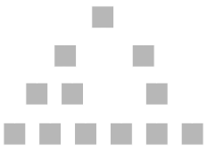


</div>
</div>

---

<div class="flex-container">

<div class="left-small">
	<table class="storage-layer-table">
	<tr><td>Runtime Storage API</td></tr>
	<tr><td>Storage Overlays</td></tr>
	<tr><td>Patricia-Merkle Trie</td></tr>
	<tr><td class="active">Key-Value Database</td></tr>
	</table>
</div>

<div class="right">

### Key-Value Database

* a.k.a. KVDB
* Implemented with RocksDB and ParityDB
* Just KV mapping: `Hash -> Vec<u8>`
* Substrate: Blake2 256

<br />

<table>
<th>Key (Hash 256)</th>
<th>

Value (`Vec<u8>`)

</th>
<tr><td>0x0fd923ca5e7...</td><td>[00]</td></tr>
<tr><td>0x92cdf578c47...</td><td>[01]</td></tr>
<tr><td>0x31237cdb79...</td><td>[02]</td></tr>
<tr><td>0x581348337b...</td><td>[03]</td></tr>
</table>

Note: There could also be some in-memory KVDB layer for testing purposes.

Memory kvdb is also notably used as a triedb backend during proof verification.

---

### Substrate Uses a Base-16 Patricia Merkle Trie

(hopefully you remember these key terms)

https://github.com/paritytech/trie

---

### Merkle Tree


---

### Patricia Trie

<div class="flex-container">
<div class="left-small">


</div>

<div class="right">

* Position in the tree defines the associated key.
* Space optimized for elements which share a prefix.

</div>
</div>

---

### Base 16

<div class="flex-container">
<div class="left">


</div>

<div class="right">

- We will mostly show binary trees for simplicity.
- But everything scales up as you add more nodes.
- 16 is a nice choice because it is 1/2 of a byte (two hex characters)
	- one hex character is a "nibble"

</div>
</div>

---

### Two Kinds of Keys

The next slides will try to have you understand the difference and existence of:

<br />

<div class="text-center">

1. Trie key path
2. KVDB key hash

</div>

<br />

It can be very confusing to mix these up, so lets make it clear the difference!


Note:

Storage access path (corresponding to the `Runtime Api` level of the overview slide) can be seen as a third kind (module, storage structure and possibly key in strorage structure) (translate to trie key that then query kvdb hash).

---

### What You Will See


---

### Navigating Substrate Storage


---

### Navigating Substrate Storage


---

### Navigating Substrate Storage

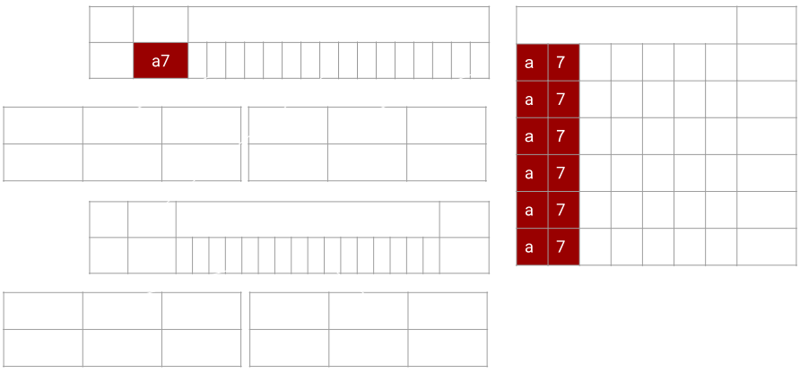

---

### Navigating Substrate Storage

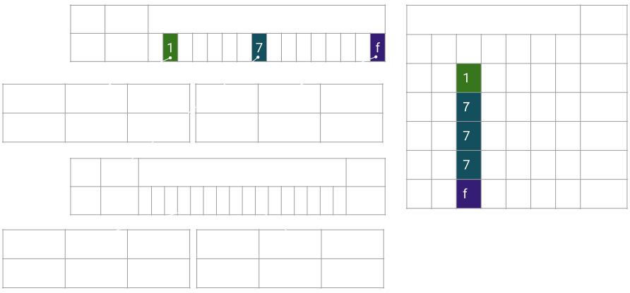

---

### Navigating Substrate Storage


---

### Navigating Substrate Storage


---

### Navigating Substrate Storage


---

### What You Just Saw

<div class="flex-container">
<div class="left">

<div>

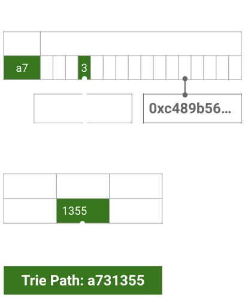

</div>

<br />

Patricia provides the **trie path**.

</div>

<div class="right">

<div>


</div>

<br />

Merkle provides the recursive **hashing** of children nodes into the parent.

</div>
</div>

---

<table style="background-color: white; color: black; width: 80%;" class="text-center">
	<tr><td style="background-color: lightgrey;" colspan="4">Trie Node</td></tr>
	<tr>
		<td style="background-color: red;">header</td>
		<td style="background-color: orange;">key</td>
		<td style="background-color: yellow;">children</td>
		<td style="background-color: green;">value</td>
	</tr>
</table>

<br />

* The Trie key path is set by you, for e.g. `:CODE`.
	* Arbitrary Length!
* Trie Node:
	* header
	* key
	* possible children
	* possible value
* KVDB key = Hash([Trie Node])

---

### Anatomy of a node

Radix tree node:
```
  [partialkey ++ n children ++ maybe_value]
```

Merklized:
```
  [partialkey ++ n children hash ++ maybe_value]
```
Node encoding variants:
```
- [Header branch ++ partialkey ++ maybe_value
  ++ n children hash]
- [Header leaf ++ partially ++ value hash]
- [Value]
```

Notes:
- radix

Add constraint that terminal node always contains a value

- merklized

Note that merklizing this pretty common datastructure just means replacing/enriching the pointers to child with a hash.

Then of course persisting nodes in some way and lazy loading by hash (unless keeping all in memory or rebuilding on flight: not substrate).

variant should be as compact as possible.

Additional subtleties that if content under hash is smaller than it s hash, then it is written in the parent node instead of hash
-> for either value or children

---

### But wait... there's more!

---

### Child Trie

<div class="image-container">


<div class="bottom-left black-box">

* Allows us to get a merkle root for some subset of data.
* We aim to allow child tries to be a different trie format in the future.

</div>
</div>

---

### Pruning

<div class="image-container">


<div class="top-right" style="width: 40%">

* For holding older block states, and then cleaning up.
* Let’s update two values in this trie.
</div>
</div>

---

### Pruning

<div class="image-container">

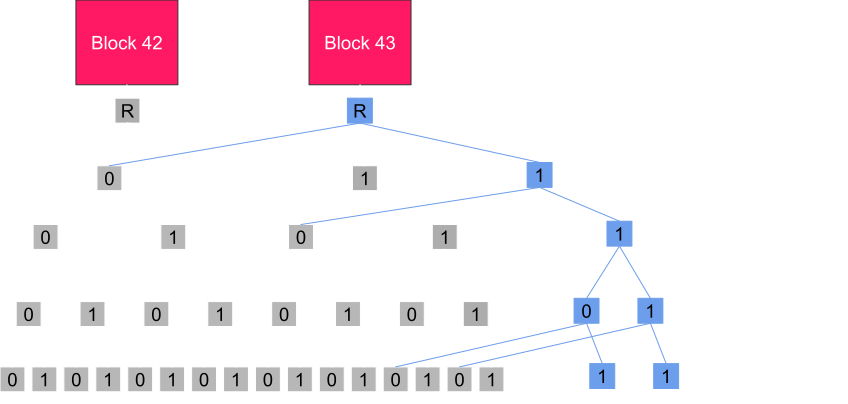

<div class="top-right" style="width: 40%">

* We create new database entries, but keep the old ones too!

</div>
</div>

---

### Pruning

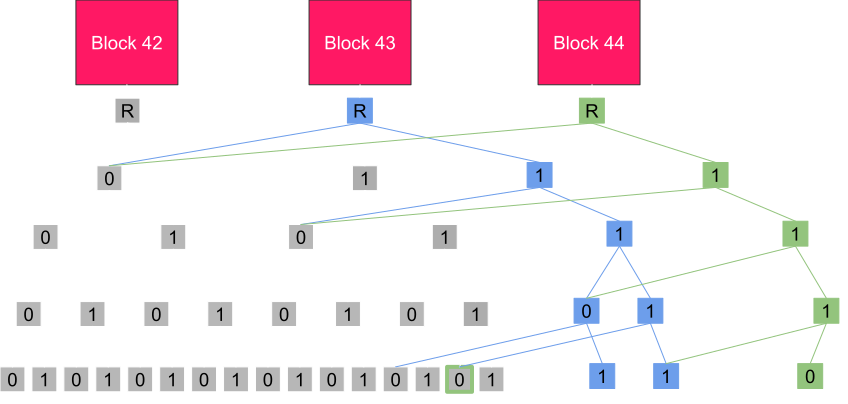

---

### Pruning

<div class="image-container">

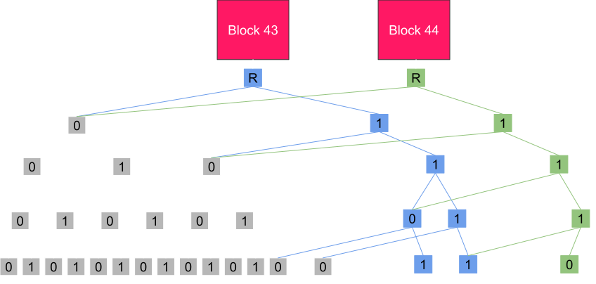

<div class="top-left" style="width: 30%">

* Eventually, we prune the old data.

</div>
</div>

---

### Unbalanced Tree

<div class="flex-container">
<div class="left-small">

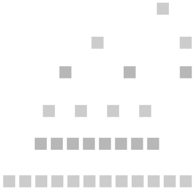

</div>

<div class="right">

* Can happen if the user can influence the trie path.
* Operations are no longer O(log n)
* This can lead to DoS attacks.
* In FRAME we will talk about how we prevent this.

</div>
</div>

---

### Database Backend

* Trie DB
* Trie Root
* Storage Proofs

---

### Merkle Trie Complexity

* Reading
* Writing
* Proofs

---

### Merkle Read

<div class="image-container">

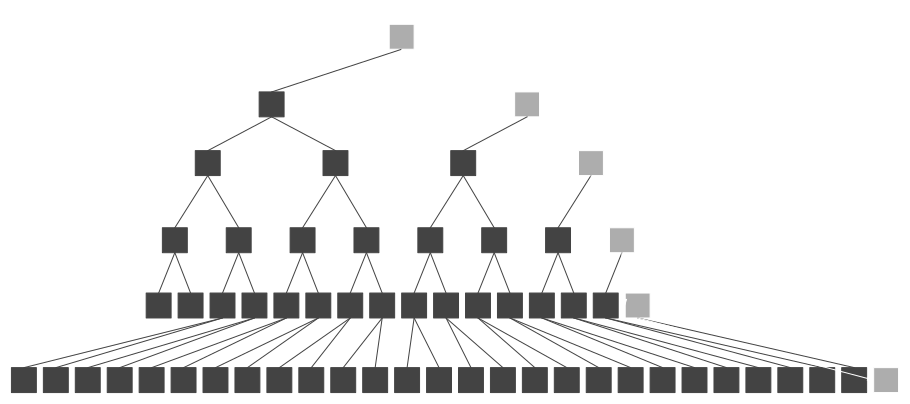

<div class="top-right">

* O(log n) reads
* Not so great.

</div>

</div>

---

### Merkle Write

<div class="image-container">

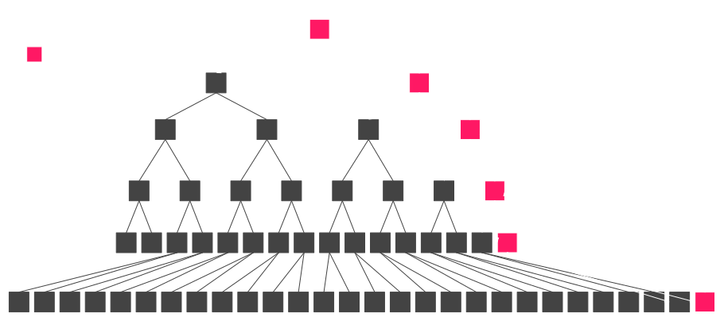

<div class="top-right">

* Very expensive for a database
* O(log n) reads, hashes and writes

</div>

<div class="bottom-left black-box">

1. Follow the trie path to the value: O(log n) reads
2. Write the new value: 1 write
3. Calculate new hash: 1 hash
4. Repeat (2) + (3) up the trie path: O(log n) times

</div>
</div>

---

### Merkle Proof

<div class="image-container">

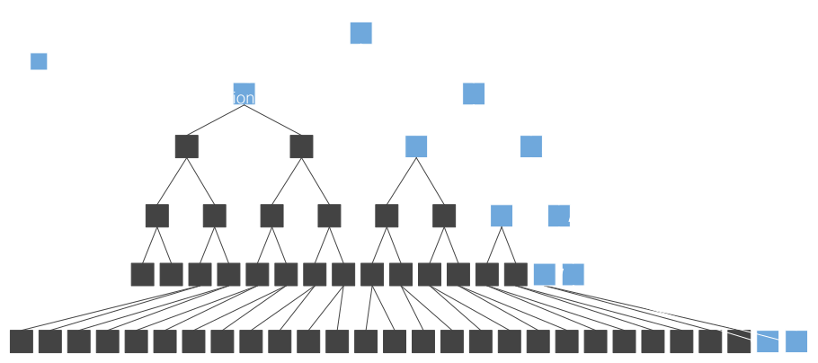

<div class="top-right">

* O(log n)
* Great for light clients!
* Low bandwidth, low computation!

</div>

<div class="bottom-left black-box">

1. Full Node: Follow the trie path to the value: O(log n) reads.
2. Full Node: Upload data of trie nodes read.
3. Light Client: Download trie node data.
4. Light Client: Verify by hashing: O(log n) hashes.

</div>
</div>

Notes:

- Message is that proof is just enough trie content (can be a bag of node or some ordered node that needs to be complete with hashing as in compact proof TODO should we make a slide for compact proof and generally proof serialization?) to build a subset/subpart of the full state trie.

This incomplete trie will then be accessed and used identically as the full state trie, but if access is not part of the proof, then the action is not finishing: Proof Incomplete case.

Invalid proof are proof where the hashing don't match (can be see as multiple trie).

TODO Could have some schema with the full state, then the proof and then two query on the proof: one that access data available and one that fail because incomplete : Probably already exists in storage deep dive

---

### Heavy Trie Node Problem

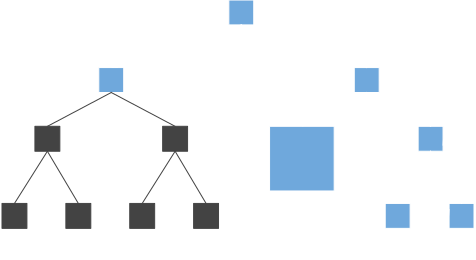

---

### Fixing The Heavy Trie Node Problem

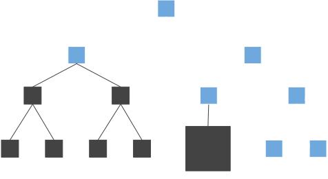

---

### Compact Proof

TODO create

---

### Recording proof

- Simple footprint of the node accessed
- Plus removing redundant hashes (compact proof)
- Read access, write access, iteration
- Beware of cache

Notes:

Another message to convey is that producing proof is really only recording all access made during some actions (key access, value insert, value change, trie iteration...).
Any kind of changes work.

This could be extended by the idea that key value caching should be disable for the first action otherwhise trie node would not be access and we would not register proof correctly.
-> can extend to basti pr where there is two kind of cache: trie node level cache that is safe to use and key value cache that
Not sure it is worth going to far on cache strategy, but may be relevant to mention that by its structure trie node cache is shared between block.


---

### Storage and proof size.

- Hexary trie good for disk storage
- Binary trie smaller foot print in proof
- Both concerns could be separated

Notes:

The trie structure (hexary) is mostly related to the storage model and do not produce the more compact proofs. One direction would be to decorelate storage from merklization. eg hexary node in storage but merklization over binary node. But the model get more complex.

A final message to it should be that (eth see it), the storage model is still not the most efficient: we use merkle trie index to access node that are stored under a btree index (rocksdb), a true state db would have it's inner indexing directly using the merkle structure.
Paritydb in this sense in a good middle ground as it implement a hash map access directly so the merkle trie index is over a hash map rather than a btree map: that is a huge gain.

What works in memory as simple data structure, also work as a db over disk and also extend to being merklized. Usually things can be mapped or reffered to rather naturally. For instance an optimisation of radix trie is not storing the full merkle path in each node and get the key with the value: this work in memory (not a huge gain), this work on disk (huge gain as you can have fix len node which is big gain for disk access), can work with merkle proof (but tricky if codec still store the full partial key).


---
### Exercise: discuss performance optimizations

TODO: ask questions that relate to the work done here: https://github.com/paritytech/trie/pull/157 and https://github.com/paritytech/trie/pull/142 for students and lecturer to engage about optimizing state reads. Then look over the PR's motive.

---

### Overlay Deep Dive

The overlay stages changes to the underlying database.

<table class="overlay-table">
<tr><td style="background-color: red;">Runtime Logic</td></tr>
<tr><td style="background-color: darkred;">Runtime Memory</td></tr>
</table>

<br />

<table class="overlay-table" style="background-color: green;">
<tr><td>Runtime Storage API</td></tr>
</table>

<br />

<table class="overlay-table">
<tr><td colspan=4>Overlay Change Set</td></tr>
<tr>
	<td>&nbsp;</td>
	<td>&nbsp;</td>
	<td>&nbsp;</td>
	<td>&nbsp;</td>
</tr>
</table>

<br />

<table class="overlay-table" style="background-color: blue;">
<tr><td>Memory / Database Interface</td></tr>
</table>

<br />

<table class="overlay-table">
<tr><td colspan=4>Database</td></tr>
<tr>
	<td>Alice: 10</td>
	<td>Bob: 20</td>
	<td>Cindy: 30</td>
	<td>Dave: 40</td>
</tr>
</table>

---

### Overlay: Balance Transfer

<br />

<div class="flex-container">
<div class="left-small">

1. Runtime Logic Initiates.
2. Calls the Runtime Storage API.
3. First we query the Overlay Change Set.
	* Unfortunately it's not there.
4. Then we query the underlying Database.
	* Very slow as you have learned so far.

</div>

<div class="right">

<table class="overlay-table">
<tr><td style="background-color: red;">Runtime Logic</td></tr>
<tr><td style="background-color: darkred;">Runtime Memory</td></tr>
</table>

<br />

<table class="overlay-table" style="background-color: green;">
<tr><td>Runtime Storage API</td></tr>
</table>

<br />

<table class="overlay-table">
<tr><td colspan=4>Overlay Change Set</td></tr>
<tr>
	<td>&nbsp;</td>
	<td>&nbsp;</td>
	<td>&nbsp;</td>
	<td>&nbsp;</td>
</tr>
</table>

<br />

<table class="overlay-table" style="background-color: blue;">
<tr><td>Memory / Database Interface</td></tr>
</table>

<br />

<table class="overlay-table">
<tr><td colspan=4>Database</td></tr>
<tr>
	<td>Alice: 10</td>
	<td>Bob: 20</td>
	<td>Cindy: 30</td>
	<td>Dave: 40</td>
</tr>
</table>

</div>

---

### Overlay: Balance Transfer

<br />

<div class="flex-container">
<div class="left-small">

* As we return the data back to the runtime, we cache the values in the overlay.
* Subsequent reads and writes happen in the overlay, since the data is there.

</div>

<div class="right">

<table class="overlay-table">
<tr><td style="background-color: red;">Runtime Logic</td></tr>
<tr><td style="background-color: darkred;">Runtime Memory</td></tr>
</table>

<br />

<table class="overlay-table" style="background-color: green;">
<tr><td>Runtime Storage API</td></tr>
</table>

<br />

<table class="overlay-table">
<tr><td colspan=4>Overlay Change Set</td></tr>
<tr>
	<td>Alice: 10</td>
	<td>Bob: 20</td>
	<td>&nbsp;</td>
	<td>&nbsp;</td>
</tr>
</table>

<br />

<table class="overlay-table" style="background-color: blue;">
<tr><td>Memory / Database Interface</td></tr>
</table>

<br />

<table class="overlay-table">
<tr><td colspan=4>Database</td></tr>
<tr>
	<td>Alice: 10</td>
	<td>Bob: 20</td>
	<td>Cindy: 30</td>
	<td>Dave: 40</td>
</tr>
</table>

</div>

---

### Overlay: Balance Transfer

<br />

<div class="flex-container">
<div class="left-small">

* The actual transfer logic happens in the runtime memory.
* At some point, the runtime logic writes the new balances to storage, this updates the overlay cache.
* The underlying database is not updated yet.

</div>

<div class="right">

<table class="overlay-table">
<tr><td style="background-color: red;">Runtime Logic</td></tr>
<tr><td style="background-color: darkred;">Runtime Memory</td></tr>
</table>

<br />

<table class="overlay-table" style="background-color: green;">
<tr><td>Runtime Storage API</td></tr>
</table>

<br />

<table class="overlay-table">
<tr><td colspan=4>Overlay Change Set</td></tr>
<tr>
	<td style="color: yellow;">Alice: 15</td>
	<td style="color: yellow;">Bob: 15</td>
	<td>&nbsp;</td>
	<td>&nbsp;</td>
</tr>
</table>

<br />

<table class="overlay-table" style="background-color: blue;">
<tr><td>Memory / Database Interface</td></tr>
</table>

<br />

<table class="overlay-table">
<tr><td colspan=4>Database</td></tr>
<tr>
	<td>Alice: 10</td>
	<td>Bob: 20</td>
	<td>Cindy: 30</td>
	<td>Dave: 40</td>
</tr>
</table>

</div>

---

### Overlay: Balance Transfer

<br />

<div class="flex-container">
<div class="left-small">

* At the end of the block, staged changes are committed to the database all at once.
* Then storage root is recomputed a single time for the final block state.

</div>

<div class="right">

<table class="overlay-table">
<tr><td style="background-color: red;">Runtime Logic</td></tr>
<tr><td style="background-color: darkred;">Runtime Memory</td></tr>
</table>

<br />

<table class="overlay-table" style="background-color: green;">
<tr><td>Runtime Storage API</td></tr>
</table>

<br />

<table class="overlay-table">
<tr><td colspan=4>Overlay Change Set</td></tr>
<tr>
	<td>&nbsp;</td>
	<td>&nbsp;</td>
	<td>&nbsp;</td>
	<td>&nbsp;</td>
</tr>
</table>

<br />

<table class="overlay-table" style="background-color: blue;">
<tr><td>Memory / Database Interface</td></tr>
</table>

<br />

<table class="overlay-table">
<tr><td colspan=4>Database</td></tr>
<tr>
	<td style="color: lightgreen;">Alice: 15</td>
	<td style="color: lightgreen;">Bob: 15</td>
	<td>Cindy: 30</td>
	<td>Dave: 40</td>
</tr>
</table>

</div>

---

### Overlay: Implications

<br />

<div class="flex-container">
<div class="left-small">

* Reading the same storage a second or more time is faster (not free) than the initial read.
* Writing the same value multiple times is fast (not free), and only results in a single final Database write.
* Everything in the overlay change set will be committed to the database at the end of the block, so once you call the Runtime API to write some value, you cannot undo it.
	* This is the source of "verify first; write last".

</div>

<div class="right">

<table class="overlay-table">
<tr><td style="background-color: red;">Runtime Logic</td></tr>
<tr><td style="background-color: darkred;">Runtime Memory</td></tr>
</table>

<br />

<table class="overlay-table" style="background-color: green;">
<tr><td>Runtime Storage API</td></tr>
</table>

<br />

<table class="overlay-table">
<tr><td colspan=4>Overlay Change Set</td></tr>
<tr>
	<td>&nbsp;</td>
	<td>&nbsp;</td>
	<td>&nbsp;</td>
	<td>&nbsp;</td>
</tr>
</table>

<br />

<table class="overlay-table" style="background-color: blue;">
<tr><td>Memory / Database Interface</td></tr>
</table>

<br />

<table class="overlay-table">
<tr><td colspan=4>Database</td></tr>
<tr>
	<td>Alice: 15</td>
	<td>Bob: 15</td>
	<td>Cindy: 30</td>
	<td>Dave: 40</td>
</tr>
</table>

</div>

---

### Additional Storage Overlays (Transactional)

<br />

<div class="flex-container">
<div class="left-small">

* The runtime has the ability to spawn additional storage layers, called "transactional layers".
* This can allow you to commit changes through the Runtime Storage API, but then drop the changes if you want before they get to the overlay change set.
* The runtime can spawn multiple transactional layers, each at different times, allowing the runtime developer to logically separate when they want to commit or rollback changes.

</div>

<div class="right">

<table class="overlay-table">
<tr><td style="background-color: red;">Runtime Logic</td></tr>
<tr><td style="background-color: darkred;">Runtime Memory</td></tr>
</table>

<br />

<table class="overlay-table" style="background-color: green;">
<tr><td>Runtime Storage API</td></tr>
</table>

<br />

<table class="overlay-table">
<tr><td colspan=4>Transactional Layer</td></tr>
<tr>
	<td style="color: yellow;">Alice: 25</td>
	<td>&nbsp;</td>
	<td style="color: yellow;">Cindy: 20</td>
	<td>&nbsp;</td>
</tr>
</table>

<br />

<table class="overlay-table">
<tr><td colspan=4>Overlay Change Set</td></tr>
<tr>
	<td>Alice: 15</td>
	<td>&nbsp;</td>
	<td>Cindy: 30</td>
	<td>&nbsp;</td>
</tr>
</table>

<br />

<table class="overlay-table" style="background-color: blue;">
<tr><td>Memory / Database Interface</td></tr>
</table>

<br />

<table class="overlay-table">
<tr><td colspan=4>Database</td></tr>
<tr>
	<td>Alice: 15</td>
	<td>Bob: 15</td>
	<td>Cindy: 30</td>
	<td>Dave: 40</td>
</tr>
</table>

</div>

---

### Transactional Implementation Details

* Non-Zero Overhead (but quite small)
	* 0.15% overhead per key written, per storage layer.
* Values are not copied between layers.
	* Values are stored in heap, and we just move pointers around.
	* So overhead has nothing to do with storage size, just the number of storage items in a layer.
* Storage layers use client memory, so practically no upper limit.

<br />

For more details see:

https://github.com/paritytech/substrate/issues/10806

https://github.com/paritytech/substrate/pull/10809

Note:

In module 6, we can take a closer look at how this functionality is exposed in FRAME.

See: https://github.com/paritytech/substrate/pull/11431

---

### Transactional Layer Attack

Transactional layers can be used to attack your chain:

<br />

* Allow a user to spawn a lot of transactional layers.
* On the top layer, make a bunch of changes.
* All of those changes will need to propagate down each time.

**Solution:**

* Do not allow the user to create an unbounded number of layers within your runtime logic.

---

### Optimizations

* Minimize backend writes
* Minimize calculating storage root
* Only store consensus critical data in your runtime storage

---

### Balancing trie

- Needed for contract
- Not needed for runtime

Notes:

Here (or somewhere else) it must be evoked that trie path (key for values) are whatever the runtime want.
This is a very important design consideration:
in ethereum for instance everything is stored under hash(key), which makes the trie balanced amongst all value.
in substrate we allow random length key (there is a limit but very high in the trie impl), because the runtime
can be responsible of trie unbalance.
A slide showing an unbalance trie could be nice:
- a branch with module balance prefix and a lot of balance behind: making the query cost like 2 nodes for prefix and let's say 100_000 account so 16^5 -> ~ 5 nodes (accounts are hash and under the prefix things are balanced). -> 7 nodes to access
- a branch with some random
odule and a constant in it : 2 nodes for prefix, + 2 nodes to access the constant. -> 4 nodes to access
- the wasm runtime at :code -> only 2 nodes

So choice of key (even if mainly made for you by the runtime storage macro) is very important.
And having an unbalance may sound like a bad thing, but it is not.

TODO could be moved as a slide before.

---

### How does the Runtime sees state?

* `root()`, `get()`, `set()`, `next_key()`
* runtime sees state as a ordered Key-Value
* this Key-Value in the client is a Merkle tree

---

### RocksDB

A Persistent Key-Value Store for Flash and RAM Storage.

* Keys and values are arbitrary byte arrays
* Fast
* Secure

Note:
See http://rocksdb.org/.
Big project, can be very tricky to configure properly. (also a big part of substrate compilation time).

---

### ParityDB

An Embedded Persistent Key-Value Store Optimized for Blockchain Applications.

* Designed for efficiently storing Patricia-Merkle trie nodes.
	* Mostly Fixed Size Keys
	* Uniform Distribution
	* Designed for mostly small values.
		* Values over 16kb is rare.
* Optimized read performance versus write performance.

---

### ParityDB Deep Dive

* The database can of course store any kind of data, but is optimized for Patricia-Merkle trie nodes.
* Blockchains also store:
	*

But

Note:

Main point is that paritydb suit the triedb model.
Indeed triedb store encoded key by their hash.
So we don't need rocksdb indexing, no need to order data.
Parity db index its content by hash of key (by default), which makes access faster (hitting entry of two file generally instead of possibly multiple btree indexing node).
Iteration on state value is done over the trie structure: having a kvdb with iteration support isn't needed.

Both rocksdb and paritydb uses "Transactions" as "writes done in batches".
We typically run a transaction per block (all in memory before), things are fast (that's probably what you meant).
In blockchains, writes are typically performed in large batches, when the new block is imported and must be done atomically.
See: https://github.com/paritytech/parity-db

Concurrency does not matter in this, paritydb lock access to single writer (no concurrency).
Similarily code strive at being simple and avoid redundant feature: no cache in parity db (there is plenty in substrate).

'Quick commit' : all changes are stored in memory on commit , and actual writing in the WriteAheadLog is done in an asynchronous way.

---

### Practical Benchmarks and Considerations

Let's now step away from concepts and talk about cold hard data.

---

### Common Data Size and Performance

<div class="flex-container">
<div class="left">

* Most keys are 80 bytes, which are user accounts.
	* Of course depends on your chain what the most common s

</div>

<div class="right">

<div class="r-stack">
	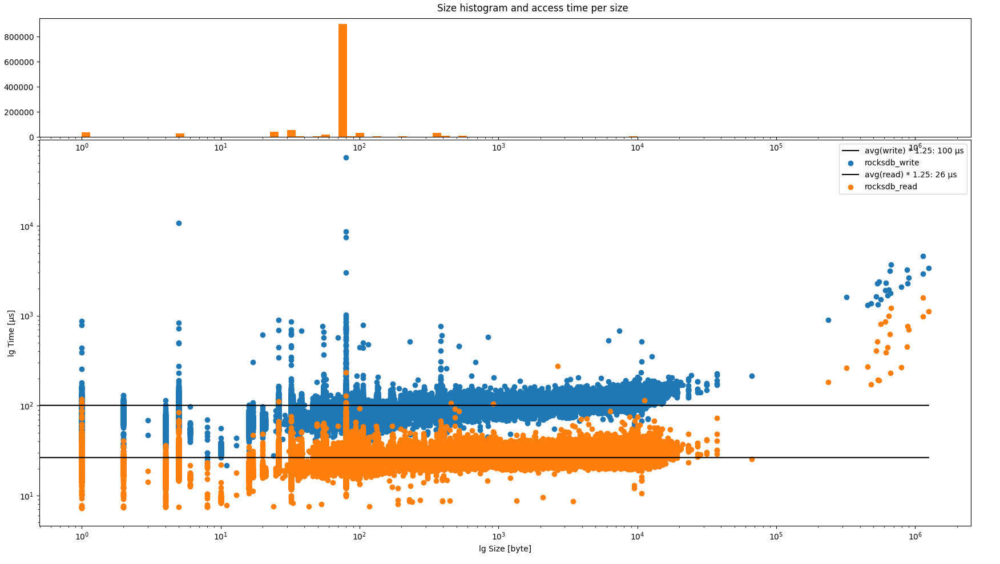
	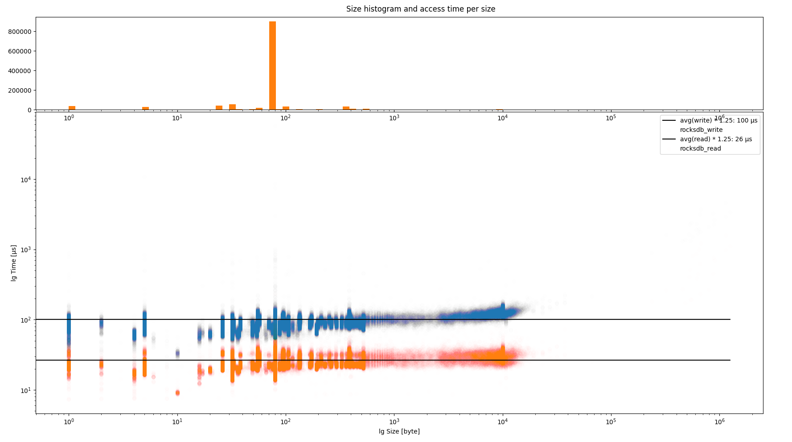
</div>
</div>

---

### Rocks DB vs Parity DB Performance

<div class="flex-container">
<div class="left">

*

</div>

<div class="right">


</div>
---

### RocksDB Inconsistency

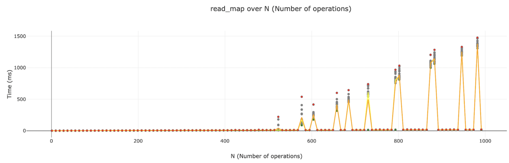

When doing benchmarking, we saw some really bizarre, but reproducible problems with RocksDB.

---

### Workshop and Activity

* [Database and Merklized Storage Workshop](./4.5-Workshops_and_Activities/4.5-Db_and_Merklized_Storage_Workshop.md)
* [Database and Merklized Storage Activity](./4.5-Workshops_and_Activities/4.5-Db_and_Merklized_Storage_Activities.md)
