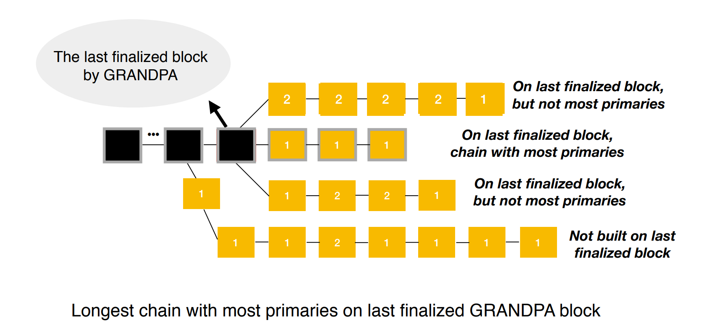
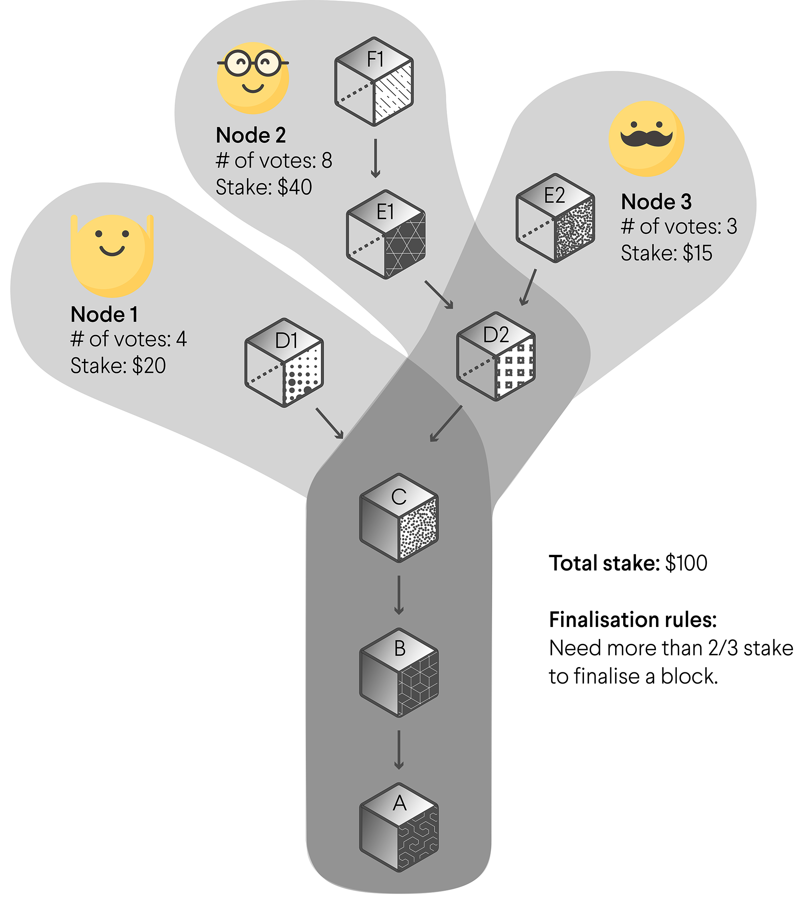

Lecture 6, Module 4

Instructor: André Silva

---

# Consensus

## Block authoring and Finality

In this lecture, we will learn about the consensus protocols implemented in Substrate for block authoring (PoW, Aura and BABE) and finality (GRANDPA)

---

## What is consensus

- The blockchain has a state which is updated by executing the state transition function
- We run the STF by creating new blocks (block execution)

<br/>

- How do we decide who gets to author the next block?
- How do we reconcile diverging views of the current state?
- How can we be sure that a certain state is canonical and will never be reverted?

---

## What do we come to consensus on?

- Consensus is a method for coming to agreement over a shared state
- We want to come to agreement on what is the current canonical block


<!-- TODO DESIGN: this image is a draft -->

Note: the consensus protocols don't care about what the blocks are actually doing, it doesn't care about the STF other than knowing whether it succeeded or not.
The protocol is just "blindly" coming to consensus on what block hashes are canonical.

---

## You are Here


<!-- TODO: this image is a bit shitty but it conveys the right information, that consensus sits below the runtime and its mostly native code -->

---

## Fork choice

- Given two (or more) different diverging states
- How do we choose which is the canonical fork

Note: we might need to follow multiple forks temporarily, but the fork choice rule also affects immediately the decision on which block to build on top of.

---

## Finality

- Given a certain state / block how certain can we be that it is canonical
  - ... and that it will stay canonical
- If we're certain that a block is canonical we consider it to be **finalized**
- This property can be either:
  - Probabilistic
  - Definite / Provable

Note: the practical notion we're trying to solve here is whether a given block is canonical or not, if it's not canonical it is possible that it might be reverted in the future. Probabilistic finality is akin to eventual consistency, different nodes in the network might have different views of the canonical state at different times, but given enough time (unbound) they should all come to the same conclusion.

---

## CAP Theorem


---

## Proof of work

<blockquote>
Proof of work (PoW) is a form of cryptographic proof in which one party proves to others that a certain amount of a specific computational effort has been expended.
</blockquote>

- Hard to generate the proof
- But cheap to verify
- Not a consensus mechanism by itself

---

## Nakamoto consensus

- Anyone can extend the blockchain
- To do so requires a proof that a certain amount of work has been completed
- Given a fork always follows the longest chain

---

## Nakamoto consensus

- The PoW is a Sybil deterrence mechanism
  - It is a stochastic process weighted by the relative computational power of participants
- The fork choice rule allows the participants to eventually reach consensus
- Finality is only probabilistic

Note: Nakamoto consensus is eventually consistent so we don't have any definite notion of finality, only probabilistic. As a certain block gets deeper in the history, the probability that it can be reverted gets lower and lower as doing so would require an enormous accumulated amount of computation. Still, it's non-zero.

---

## PoW in Substrate

- Substrate ships with a "nakamoto consensus" implementation
- It doesn't implement any specific PoW algorithm
  - Users of the framework can plug their own
- [Kulupu](https://github.com/kulupu/kulupu) is a project built on Substrate that uses PoW-based consensus

Note: https://github.com/paritytech/substrate/tree/master/client/consensus/pow

---

## Moving away from PoW

- PoW-based is very energy intensive
- The work / computation being performed is in itself useless
- We are achieving Sybil resistance by wasting a real-world resource (i.e. energy)

---

## Slot-based block authoring

- Unlike PoW we must have a closed set of authorities with known identities
- We discretize time into slots
- At each slot we have a protocol to decide which of the authorities is entitled to author a block

---

### Aura (authority-round)

- At each slot the authorities are chosen in a round-robin fashion

```
authority(slot) = authorities[slot % authorities.len()];
```

- The chosen authority is allowed to issue no more than one block during that slot
- The longest chain is followed

---

### Aura (authority-round)

- Pros: no wasted energy, simple to implement and to reason about
- Cons: attackable since the full schedule of block production is known in advance
  - You can preemptively attack the next block author to censor it

Note: we can setup a DoS attack on all the authorities as they move from slot to slot preventing them from successfully broadcasting their blocks to the network.

---

### How can we make it behave more like PoW?

- We want to have a slot-based block authoring protocol that has similar properties to PoW
  - Namely that we don't know who the next block author will be
- We want the slot assignment to be a stochastic process
  - ... but without the wasted energy

---

### If we squint we can see an RNG

```
threshold = 1 / number_of_authorities

should_author = rng(seed) < threshold
```

<br/>

- This is similar to what is happening with PoW
  - The threshold is weighted by computation power (unlike in this example)

<br/>

- How can we make sure that the random number generated by an authority was legitimate?
- How can we use randomness in the face of a deterministic execution environment?

---

### Verifiable Randomness Function

<blockquote>
A verifiable random function (VRF) is a public-key pseudorandom function that provides proofs that its outputs were calculated correctly.
The owner of the secret key can compute the function value as well as an associated proof for any input value. 
Everyone else, using the proof and the associated public key can check that this value was indeed calculated correctly.
</blockquote>

<br/>

- Can we use this primitive to assign slots to authorities?

---

### BABE

BABE is a block production mechanism inspired by the [Ouroboros Praos protocol](<https://en.wikipedia.org/wiki/Ouroboros_(protocol)>)

<br/>

- A slot-based block authoring algorithm using a VRF for assignment
  - Nobody knows who the slot author is until they prove it
- A deterministic fallback mechanism
  - Ensuring there will always be a valid slot author

Note: Read the original Ouroboros Praos paper [here](https://eprint.iacr.org/2017/573.pdf)

---

### BABE

- As with Aura we start with a closed set of known authorities
- Time is discritzed into slots, and sets of slots are grouped into epochs

<br/>

- Each slot can have a primary and secondary author (or "slot leader")
  - Primary slots are assigned randomly (using a VRF)
  - Secondary slots are assigned deterministically (with a similar mechanism as in Aura)
- The current slot is a function of "real-world" time
  - `current_slot = current_unix_time / slot_duration`

<div class="right">


</div>

Note: In Polkadot, one epoch is 4 hours and on Kusama one epoch is only 1 hour.

---

### Primary slots

- At each slot authorities evaluate the VRF
- VRFs generate a pseudo-random output along with a proof that it was properly generated

```
slot_author(slot, private_key) = vrf(seed, slot, private_key).output < threshold

threshold = 2 ^ vrf_output_length * (1 - (1 - c)) ^ (1 / number_if_authorities)

c is a constant 0 <= c < 1
```

Note: c must be chosen in accordance to the expected maximum network latency and slot duration.
It is part of the security model of BABE and outside the scope of this presentation.
See: https://research.web3.foundation/en/latest/polkadot/block-production/Babe.html

---

### Primary slots


---

### Seeding the VRF

- As with any RNG the VRF needs to take as input some random material (the seed)
- We need to generate random material in a deterministic manner such that all participants agree on the seed
- We will collect entropy from every VRF output

---

### Seeding the VRF

- As an epoch progresses every VRF output used by a primary slot is stored
- At the end of the epoch the stored data is concatenated
- We hash this data and use it as the seed for a future epoch

<br/>

- TODO - add pseudo-code?

---

### Using the VRF seed

- The randomness computed at epoch N:
  - is announced at the beginning of epoch N + 1 (along with the authorities)
  - and used on epoch N + 2


<!-- TODO: this image is a draft -->

<br/>

- This guarantees that by the time an authority has registered their intention to validate they don't know what the randomness for the epoch in which they'll be active is

---

### Primary slots

- As with PoW the process of slot attribution is stochastic
- Any slot can be assigned to 0, 1 or more validators
- Having unassigned slots leads to variability in block times
  - Since no authority will be able to produce a block on that slot

---

### Secondary slots

- In order to avoid empty slots we assign all slots to a secondary validator

```
secondary_slot_author = hash(epoch_randomness ++ slot_number) % authorities_len
```

<br/>

- This mechanism guarantees a consistent block time

---

### Block predigest

* A piece of data created by the consensus protocol and added to the block **before** it gets executed
  * This is mainly used to pass consensus-related information into the runtime

```rust
pub enum BabePreDigest {
	/// A primary VRF-based slot assignment.
	Primary(PreDigest),
	/// A secondary deterministic slot assignment.
	Secondary(PreDigest),
}

pub struct PreDigest {
	/// Authority index
	pub authority_index: AuthorityIndex,
	/// Slot
	pub slot: Slot,
	/// VRF output
	pub vrf_output: VRFOutput,
	/// VRF proof
	pub vrf_proof: VRFProof,
}
```

---

### Block seal

* A digest that gets added to the block **after** execution
* It should serve as an extra proof that the given validator in fact created that block
* It's usually just a signature of the hash of the block header


---

### Fork choice rule for BABE

- Instead of just following the longest chain
- We want to follow the chain that has the most primary slots
  - Since these are the most secure slots
  - Secondary slots can easily be censored (as in Aura)

<br/>

- TODO - Add diagram showing different forks with different number of primary slot blocks

---

## Provable finality

* All consensus protocols presented so far only provide probabilistic finality

* A BFT consensus protocol will achieve provably / instant finality as it is strongly consistent
  * Given `N` validators it requires `2/3 * N + 1` validators to come to agreement
  * `O(n^2)` communication complexity

Note: the key thing to stress here is that BFT agreement is much slower as it requires a lot more communication. also it sacrifices liveness since 1/3 of validators going offline halts the protocol.

---

## Hybrid consensus

* Instead of making the block authoring protocol BFT tolerant

- [Instant Seal](https://docs.substrate.io/rustdocs/latest/sc_consensus_manual_seal/fn.run_instant_seal.html): creates a new block for every transaction imported into the transaction pool.
- [Manual Seal](https://docs.substrate.io/rustdocs/latest/sc_consensus_manual_seal/fn.run_manual_seal.html): listens for rpc calls to seal blocks and create forks.

TODO: cc @SME - Not sure where to leave this slide - perhaps this can be followed by a quick exercise demonstrating manual and instant seal in action?

---

## BABE vs. PoW

In Proof of Work systems:

- Block authoring is neither slot-based nor requires a known authority set.
- Any mining node with the capacity of solving a computationally complex problem can produce a block at any time.
- The difficulty of this problem can be tuned to provide an statistical target block time.

---

## GRANDPA

**G**HOST-based **R**ecursive **AN**cestor **D**eriving **P**refix **A**greement

---

## Block finality

* The protocol progresses in rounds
* Every round the validators are required to do two rounds of voting: "prevote" and "precommit"
* At the end of every round participants are guaranteed to reach consensus on what block is finalized
  * Potentially the same block that had been previously finalized

---

## A GRANDPA round (1)

* (A node that is designated as the "primary" broadcasts the highest block that it thinks could be final from the previous round)
* After waiting for a network delay, each validator broadcasts a "prevote" for the highest block that it thinks should be finalized
  * If the supermajority of validators are honest, this block should extend the chain that the primary broadcast
  * This new chain could be several blocks longer than the last finalized chain
* Each validator computes the highest block that can be finalized based on the set of "prevotes"
  * i.e. we find the common ancestor of all votes that has support from more than `2/3 * N + 1` validators
  * We refer to this block as the "prevote ghost"

---

## A GRANDPA round (2)

- Fast: it reaches agreements on _chains_ rather than blocks, speeding up the finalization process, even after long-term network partitioning or other networking failures.

- Ensures block finality: as soon as more than 2/3 of validators attest to a chain containing a certain block, all blocks leading up to that one are finalized at once.

- Secured economically: if an attacker wants to take over the chain, they could try, resulting in over 66% of all network tokens getting slashed.

Note: See the original paper for GRANDPA [here](https://arxiv.org/pdf/2007.01560.pdf)

---


- Finds the highest block number with a sufficient number of votes to be considered final.

  - A node that is designated as the “primary” broadcasts the highest block that it thinks could be final from the previous round.
  - After waiting for a network delay, each validator broadcasts a “pre-vote” for the highest block that it thinks should be finalized.

- Chains with the most primary blocks are considered final.
  - If 2/3 of validators are honest, this block should extend the chain that the primary broadcasts.
    This new chain could be several blocks longer than the last finalized chain.

---

How GRANDPA works (continued):

- Each validator computes the highest block that can be finalized based on the set of pre-votes.
  If the set of pre-votes extends the last finalized chain, then each validator will cast a “pre-commit” to that chain.

- Each validator waits to receive enough pre-commits to form a commit message on the newly finalized chain.

- GRANDPA supports weighted voting. For example, you could implement GRANDPA on your chain where validators with more stake get more votes.

/// A protocol message or vote.
pub enum Message<Hash, Number> {
	/// A prevote message.
	Prevote(Prevote<Hash, Number>),
	/// A precommit message.
	Precommit(Precommit<Hash, Number>),
	/// A primary proposal message.
	PrimaryPropose(PrimaryPropose<Hash, Number>),
}

---

<div class="left">

The black blocks are finalized, and the yellow blocks are not.
Blocks marked with a "1" are primary blocks; those marked with a "2" are secondary blocks.
Even though the topmost chain is the longest chain on the latest finalized block, it does not qualify because it has fewer primaries at the time of evaluation than the one below it.

</div>

<div class="col">

```rust
/// A prevote for a block and its ancestors.
pub struct Prevote<Hash, Number> {
	/// The target block's hash.
	pub target_hash: Hash,
	/// The target block's number.
	pub target_number: Number,
}

/// A precommit for a block and its ancestors.
pub struct Precommit<Hash, Number> {
	/// The target block's hash.
	pub target_hash: Hash,
	/// The target block's number
	pub target_number: N,
}
```

</div>

</div>

---

## Extending BABE's fork choice rule



Note: The black blocks are finalized, and the yellow blocks are not.
Blocks marked with a "1" are primary blocks; those marked with a "2" are secondary blocks.
Even though the topmost chain is the longest chain on the latest finalized block, it does not qualify because it has fewer primaries at the time of evaluation than the one below it.

---

## Updating the Validator Sets

* So far we have assumed that the validator set is static
* How do we go about updating the validator set?
* Where does the information about new validators come from?

---

## Updating the Validator Sets

* The information about new validators comes from the runtime
* It is decided by some external process (usually staking)
* The runtime exposes this information to external observers through header digests
  * All consensus protocols provide a pallet to manage runtime state (e.g. validator sets)
* The client-side consensus code is responsible for scraping those digests as new blocks are imported and react accordingly

Note: one of the main reasons this process is done through header digests is to make sure it is light client friendly, since light clients do not execute the runtime

---

## Validator Set Changes - BABE

```rust
/// Information about the next epoch. This is broadcast in the first block
/// of the epoch.
pub struct NextEpochDescriptor {
	/// The authorities.
	pub authorities: Vec<AuthorityId>,

	/// The value of randomness to use for the slot-assignment.
	pub randomness: Randomness,
}
```

```rust
let next_epoch = NextEpochDescriptor {
	authorities: ...,
	randomness: ...,
};

// Create the digest that will go in the header. A consensus engine id
// is used to be able to identify the source of a given consensus digest.
let log = DigestItem::Consensus(BABE_ENGINE_ID, next_epoch.encode());
<frame_system::Pallet<T>>::deposit_log(log)
```

---

## Validator Set Changes - BABE

* Validator set changes are applied on block import
* They are announced one epoch in advance
  * When epoch N starts we announce what the authorities for epoch N+1 will be
* We need to keep track of the current authorities per fork
  * In principle different forks could rotate to different validator sets
  * We can discard this information as forks get finalized

---

## Validator Set Changes - GRANDPA

```rust
/// A scheduled change of authority set.
pub struct ScheduledChange<Number> {
	/// The new authorities after the change, along with their respective weights.
	pub next_authorities: AuthorityList,
	/// The number of blocks to delay.
	pub delay: Number,
}
```

```rust
let log = ConsensusLog::ScheduledChange(ScheduledChange {
	delay: 0,
	next_authorities: ...,
});

let log = DigestItem::Consensus(GRANDPA_ENGINE_ID, log.encode());
<frame_system::Pallet<T>>::deposit_log(log);
```

---

## Validator Set Changes - GRANDPA

* Validator set changes are applied on finality
  * This is how we guarantee that the handoffs are secure
  * At least `2 / 3 * N + 1` validators signed off on it
* They are announced for the immediate next session
* We also need to keep track of forks
  * Even though they are only enacted on finality
  * They are announced through a forkfull protocol

---

## Validator Set Changes - GRANDPA

* Validator set changes applied on finality have some non-obvious implications
* If more than `1 / 3` of authorities go offline, BABE will still keep making progress
  * While GRANDPA will stall
* Which means that validator set changes will still keep being signaled
  * But they won't be applied because no blocks are being finalized
* GRANDPA voters will need to finalize all the signaled validator set changes in-order
  * Honest GRANDPA voters always limit their votes to the first pending validator set change

<!-- TODO: add a diagram showing multiple pending validator set changes -->

---

## Equivocations

* We assume that at most `1 / 3` of validators are byzantine
  * If that threshold is passed GRANDPA breaks (i.e. we can finalize conflicting blocks)
* But we still want to detect such faults / equivocations before we reach that threshold
* And punish those validators
  * At the very least we may want to remove them from the validator set
  * Assuming that we are in a Proof-of-Stake system we might want to slash their deposits as well

---

## What is an equivocation in BABE or GRANDPA

* Being offline / unresponsive
  * Hard to detect and prove effectively

* Double voting
  * Signing two conflicting statements
  * Potentially distributing them to distinct sets of peers
  * **BABE** - a validator produces two distinct blocks at the same slot
  * **GRANDPA** - a validator sends two distinct prevote / precommit messages on the same round

---

## Double vote equivocations

* Proving this equivocation is easy
* We just need to observe the two (or more) conflicting statements
* The statements themselves are the proof since they require cryptographic signatures
  * Could not have been forged by some attacker


<div class="container">

<div class="col">

```rust
/// Represents a GRANDPA equivocation proof. The proof
/// of equivocation are the given distinct votes that
/// were signed by the validator and which include the
/// round number.
pub struct GrandpaEquivocation<Id, Vote, Signature> {
	/// The round number equivocated in.
	pub round_number: u64,
	/// The identity of the equivocator.
	pub identity: Id,
	/// The first vote in the equivocation.
	pub first: (Vote, Signature),
	/// The second vote in the equivocation.
	pub second: (Vote, Signature),
}
```

</div>

Note: Introduce GRANDPA's fork choice rule.
Source of image [here](https://wiki.polkadot.network/docs/learn-consensus#fork-choice).

---



* Both BABE and GRANDPA runtime pallets include an API for reporting equivocations
* Whenever validators observe an equivocation they create a proof and send an extrinsic to call into `report_equivocation` API

---

## GRANDPA vs. PoW

- PoW gives us probabilistic finality: a block in the past is only as safe as the number of blocks that have been built on top of it.
- As more blocks are built on top of a specific block in a Proof of Work chain, more computational work has been expended behind this particular chain.
- This does not guarantee that the chain containing the block will always remain the agreed-upon chain.

Note: An actor with unlimited resources could potentially build a competing chain and expend enough computational resources to create a chain that did not contain a specific block.
In such a situation, the longest chain rule employed in Bitcoin and other PoW chains would move to this new chain as the canonical one.

---

## Conflict resolution

- A **safety violation** may occur when two blocks that are in different chains are finalized.
- This implies that at least 1/3 of the validators voted on these two chains.
- GRANDPA has a feature called _accountable safety_ to hold validators accountable for safety violations.

---

## Finality stalls

GRANDPA detects these "faulty validators" by asking validators the following questions:

1. Why didn’t you consider that one block is final when you voted to finalize the second block?

- Honest validators should answer this with a set of pre-votes or pre-commits for the second round that have a super-majority for the second block.

2. _(assuming that (1) is answered)_ Which pre-votes for the first round have you seen?

- Honest validators basically rat on other validators and reveal all the votes they received from peers.
  Somewhere in the union of both sets you will discover the validators who voted for the two conflicting chains.

While the _client_ only runs the GRANDPA algorithm, the _runtime_ defines the rules for punishing faulty validators (i.e. when >1/3 of the validators have equivocated).

Note: Specifications for punishing nodes is protocol-specific - Substrates doesn't care - it's in the chain’s business logic, not in the consensus layer.

---

### How can we recover from equivocation?

Scenario: Two different distinct forks have been finalized.

- Some validator casts a double vote (out of incompetence rather than malice).
- Other validators can collect this double vote and report it to the runtime.
- The offending validator will be slashed and the reporting validator will be rewarded.

---

## Common developer interactions and errors

TODO: cc @SME - not sure where we want to go here and in following slides. Please add more content.

---

## How do we decide who the authorities are?

TODO: the authorities are dictated by the runtime (usually through staking). include information about the interaction between the runtime and consensus code, namely that it reads this information through digest data added to the block

---

### Finality Stalls

What happens when more than 1/3rd are offline ?

TODO

---

### Minimum validator requirements

What are the minimum validator requirements ?

TODO

---

### Node Template vs Node vs Parachain Template

TODO

---

## Workshops and Activities

- [Running into common errors (workshop)](./4.6-Workshops_and_Activities/4.6-Consensus_Block_Authoring_and_Finality_Workshop.md)
- [Illustrate block finality and set-up a private network with block authoring](./4.6-Workshops_and_Activities/4.6-Consensus_Block_Authoring_and_Finality_Activities.md)

---

### Why separate block production and finality?

- **Efficiency**. Consensus systems that make block production part of the finality process make validators send messages with O(n²) complexity for every single authored block:
  - By isolating block production in a separate module, we can produce blocks in a much more efficient manner.
  - O(n) for BABE and finalize several blocks in one round.

---

- **No constraints on blocks imports.** GRANDPA only requires that the block production system has:
  - Eventual finalization.
  - Follows the fork choice rule of GRANDPA.
  - Block headers have a pointer to its parent block (ensures that light clients can follow the chain).
  - Different failure bounds.

Note:
On "different failure bounds": With BFT agreement (GRANDPA) you need 2/3 of the validators to be working in order to make progress, if 1/3 of the validators go offline the system will halt.
With BABE you only need to have 1 validator online to eventually make progress (although at a slower rate).

---
