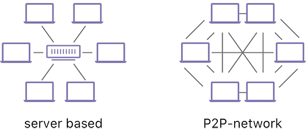

# Networking

---

## Objective

After this lecture, you will gain a basic understanding of what goes on in Substrate's networking layer, how it works at a high level, what subprotocols exist and features that are provided to extend the default usage of libp2p.

---

## Why P2P

- Peer-to-peer (P2P) networks enable communication without relying on centralized servers
- Peers can share consensus critical information, broadcast transactions or enable other nodes to connect to them

---

## libp2p

- Substrate uses [libp2p](https://libp2p.io/), an open source, modular P2P networking stack by the IPFS community
- [Implemented in Rust](https://github.com/libp2p/rust-libp2p)

---

## Why libp2p

- Generalized
- Upgradable and backwards compatible
- Plug-and-play

Note: Like Substrate, libp2p is modular and extensible: with it, you can implement different transports ontop of any Substrate chain.
It's designed so that you can upgrade any element you want, all while remaining backwards compatible.
Enables plug-and-play networking for any distributed application

---

## Modularity

- Not all projects need to support all protocols
- You can extend libp2p with other protocols
- Libp2p's concept of a "multiaddress" makes this possible

---

## Multiaddress examples: IP address

`/ip4/90.46.231.22/udp/25000`

- Node with IP address `90.46.231.22`
- Listening on UDP port 25000

---

## Multiaddress examples: WebSocket

`/dnsaddr/example.com/tcp/80/ws`

- Requires using the [WebSocket protocol](https://en.wikipedia.org/wiki/WebSocket) on top of TCP port 80
- Using DNS to resolve the hostname example.com.

---

- Nodes are _encouraged_ to support a set of common protocols
- ... But not required.

Note: Supporting a set of common protocols is not technically mandatory. This makes it possible to easily experiment with new protocols or new ideas, and to deploy new versions of protocols while still supporting old versions without adding technical debt.

---

## The main libp2p subprotocols

- [secio](https://docs.rs/libp2p/0.2.1/libp2p/secio/index.html) - responsible for encrypting communications.
- [mplex](https://docs.rs/libp2p/0.2.1/libp2p/mplex/index.html) or [yamux](https://docs.rs/libp2p/0.2.1/libp2p/yamux/index.html) - protocols on top of _secio_ that are responsible for [multiplexing](https://en.wikipedia.org/wiki/Multiplexing).

---

## What is multiplexing?

- Multiple signals can be sent to multiple devices over a single connection.
- The bandwidth of a single connection can be utilized effectively.
- The signal is then "demultiplexed" to arrive to the target device.

TODO: Redo diagram or add in source: https://www.tutorialspoint.com/analog_communication/analog_communication_multiplexing.htm

---

## Other protocols

- Projects are able to define their own networking protocol.

- Common networking protocols include (also used in Substrate):
  - [identify](https://github.com/libp2p/rust-libp2p/tree/master/protocols/identify/src) - allows peers to exchange information about each other (e.g. public keys and known network addresses)
  - [ping](https://github.com/libp2p/rust-libp2p/blob/master/protocols/ping/src/lib.rs) - a liveness check for peers to quickly see if another peer is online.
  - [Kademlia](https://en.wikipedia.org/wiki/Kademlia): a DHT that specifies the structure of the network and the exchange of information through node lookups.

---

## Versioning

TODO

---

## libp2p notification stream API

TODO

Note: demo this with code.

---

## Untrusted P2P networking models

- You can’t trust your peers
- Network synchrony assumptions
- Asynchrony assumptions

Note: discuss things you need to consider when writing networking code and different types of attacks at the network level, e.g. DoS, Eclipse attacks (for chain synchronization).

---

### Substrate-specific networking protocols

Two main crates:

- [`sc_network`](https://docs.substrate.io/rustdocs/latest/sc_network/index.html)
- [`sc_consenus`](https://paritytech.github.io/substrate/latest/sc_consensus/)

---

- Block announces
- Transactions gossip
- Grandpa gossiping
- Block requests
- Merkle proof requests

- Storage requests
- Collation gossiping
- Collation request
- Availability distribution
- Availability retrieval
- Statement distribution

Note: Here's a list of what the various Substrate-specific networking protocols do.
Show the various non-libp2p standard protocols (sync, light, transactions, block announces).

---

## Transport layer

Mechanisms for establishing a connection:

- UDP
- TCP
- QUIC

Note: Discuss how QUIC can enable more peers but introduces some fairness issues.

---

## Peers

- A node’s identity is represented with the `PeerId` struct
- It uniquely identifies a machine on the network

---

## Peer Behaviors

- Discovery
- Banning

Note: A peer in Substrate has two main types of behavior: discovery and banning.

---

## Node discovery

- Nodes need to know a list of nodes to join (identities and their address)
- Building this list is called the **discovery mechanism**

Note: In order for our node to join a peer-to-peer network, it has to know a list of nodes that are part of said network.

---

## Substrate peer-set manager

PSM: Contains the strategy for choosing which nodes the network should be connected to.

Note: See: https://crates.parity.io/sc_peerset/index.html.
Briefly go over API.

---

## Discovery mechanism

- Bootstrap nodes: hard-coded node identities for other peers to connect to.
- mDNS: performs a [UDP](https://en.wikipedia.org/wiki/User_Datagram_Protocol) broadcast on the local network for listening nodes to respond with their identity.
- Kademlia random walk: performs random [Kademlia](https://en.wikipedia.org/wiki/Kademlia) `FIND_NODE` requests on the configured Kademlia DHTs (one per configured chain protocol) in order for nodes to propagate to us their view of the network.

Note:
Bootstrap nodes are hard-coded node identities and addresses passed alongside with the network configuration.

---

## Gossip example

- “Polite” gossip protocol
- See: `sc_network`

Note: Code walkthrough.
This is not traditional gossip where TTLs are guaranteed.
Instead, we have peers periodically inform each other of their opinion protocol state and then impose some rules about what peers are allowed to send each other as a result.
This is a gossip model secure in a p2p environment where some peers are untrustworthy.

---

## Protocol version upgrade example

TODO: prepare demo.

Note: how how to use `sc-network` to configure peers to attempt to connect on a protocol but negotiate a fallback protocol (typically the old version).
Show how to detect when the peer is connected on the fallback protocol and trigger different behavior as a result.

---

## Workshop

1. Implement a polite gossip protocol
2. Create a protocol version upgrade example

Note: Have a look at https://github.com/paritytech/polkadot/tree/master/node/network

---

Readings:

- [Why Libp2p](https://www.parity.io/blog/why-libp2p)
- [Overseer](https://w3f.github.io/parachain-implementers-guide/node/overseer.html) (from the Polkadot Parachain Host Implementer's Guide)
