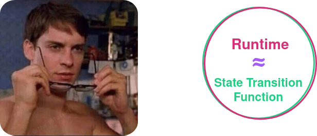

# Transaction Extensions

---v

# Transaction Extensions

## Or: Lifecycle of a Transaction

---v

## Motivation

We want to handle different aspects of executing a transaction for every transaction coming into the pool, but want to

1. have the node know as little about the transaction format as is possible
2. while allowing the runtime to customize the behavior as much as is possible.

---v

## Summary

- In this lecture you will learn above one of the more advanced FRAME concepts, [_Transaction Extensions_](https://paritytech.github.io/polkadot-sdk/master/polkadot_sdk_frame/traits/trait.TransactionExtension.html).

  - The goal is to gain a deeper understanding of the transaction lifecycle and when, whether & how to use transaction extensions.

- Transaction extensions allow for a multitude of custom features to be added to FRAME transactions.

- They allow hooking into and configuring the transaction lifecycle in the transaction pool and the block execution.

---

## Recap: Transaction Pool

The transaction pool has two jobs:

1. Transaction Validation
2. Transaction Ordering

---v

### 1. Transaction Validation

Moving transactions from one list to the other.

<diagram class="mermaid" style="display: flex; width: 80%">
graph LR
    W["🤠 Wild West"] --"😈"--> T["🗑️"]
    W --"😇 ⌛️"--> R["✅ Ready"]
    W --"😇 ⏳"--> F["⏰ Future"]
</diagram>

Notes:
Greatly simplified from the actual tx pool of course. Feel free to check it out.

---v

### 1. Transaction Validation

- Transaction validity is exclusively outside of the transaction pool, and is **100% determined by the Runtime**.
- Transaction validation should be **cheap** to perform.
- Transaction pool is entirely an **offchain operation**.
  - → No state change

Notes:

Important, must pause and ask!

- Why is it from the runtime? because the transaction format is opaque and the node doesn't even know what to do with it.
- Why does it have to be cheap? wild west, unpaid, DoS!
- Pesky question: but be aware that from the runtime's perspective, the node could be malicious. The runtime cannot trust the node to obey.
  ** THE RUNTIME MUST RE-VALIDATE TRANSACTIONS LATER in block building and import as well **

---v

### Shower Thought: Runtime vs STF



---v

### Shower Thought: Runtime vs STF


---v

### 1. Transaction Validation

```rust[1-100|5-6|8-9|11-12|14-100|1-100]
pub type TransactionValidity = Result<ValidTransaction, TransactionValidityError>;

/// This is going into `Ready` or `Future`
pub struct ValidTransaction {
  /// If in "Ready", what is the priority?
  pub priority: u64,

  /// For how long is this valid?
  pub longevity: u64,

  /// Should we propagate it?
  pub propagate: bool,

  /// Does this require any other tag to be present in ready?
  ///
  /// This determines "Ready" or "Future".
  pub requires: Vec<Tag>,
  /// Does this provide any tags?
  pub provides: Vec<Tag>,
}

type Tag = Vec<u8>
```

Notes:

So some code in our Runtime will have to provide this data!

---v

### 2. Transaction Ordering

- `provides` and `requires` is a very flexible mechanism; it allows you to:
  - Specify if a transaction is "Ready" or "Future"
  - Within each, what transactions should ge before which.

<diagram class="mermaid" style="display: flex; width: 40%">
graph LR
    W["🤠 Wild West"] --"😈"--> T["🗑️"]
    W --"😇 ⌛️"--> R["✅ Ready"]
    W --"😇 ⏳"--> F["⏰ Future"]
</diagram>

Note: it essentially forms a graph.

---v

### 2. Transaction Ordering: `priority`

From the **Ready pool**, when all requirements are met, then `priority` dictates the order.

Further tie breakers:

2. ttl: shortest `longevity` goes first
3. time in the queue: longest to have waited goes first

<!-- .element: class="fragment" -->

Note:

https://github.com/paritytech/polkadot-sdk/blob/bc53b9a03a742f8b658806a01a7bf853cb9a86cd/substrate/client/transaction-pool/src/graph/ready.rs#L146

---

## History

- Transaction Extensions are an evolution of Signed Extensions.
  - See [the introducing PR](https://github.com/paritytech/polkadot-sdk/pull/3685).
- In essence, they are
  - used to provide ordering and validity information for a transaction (as discussed earlier).
  - a generic way to **extend** the logic executed for every transaction.

---

## Flow

There are two flows with respect to the transaction extensions:

1. The flow of execution of a transaction through the whole lifecycle.
2. The flow of the transaction _within_ one stage through the different implementations of that stage.

Notes:
Big Picture: Pipeline of Extensions

- Transaction extensions remind me of other pipelines in computer graphics or data processing where you pass data from one stage to another.

---v

## Flow: Transaction Lifecycle

The flow of data through the different stages of execution.

<diagram class="mermaid" style="display: flex">
%%{init: {'themeVariables': {'fontSize': '32px'}}}%%
graph LR
    subgraph " "
        A[implicit]
    end
    B[1. validate]
    C[2. prepare] 
    D[3. Call Dispatch]
    E[4. post_dispatch]

    A -.->|Implicit| B
    B --> C
    C --> D
    D --> E

    B -.->|Val + Origin\nValidTransaction| C
    C -.->|Pre + Origin| D
    C -.->|Pre| E
    D -.->|DispatchResult| E

    classDef phase fill:#4a148c,stroke:#fff,stroke-width:2px,color:#fff
    classDef data fill:#6a1b9a,stroke:#e1bee7,stroke-width:2px,color:#fff
    classDef flow fill:#7b1fa2,stroke:#ce93d8,stroke-width:2px,color:#fff
    classDef special fill:#ff6b35,stroke:#fff,stroke-width:3px,color:#fff

    class A flow
    class B,C,D,E phase

</diagram>

---v

## Flow: Within One Stage

As an example here is the flow of a pipeline of extensions through the `prepare` implementations.

<diagram class="mermaid" style="display: flex">
%%{init: {'themeVariables': {'fontSize': '32px'}}}%%
graph LR
    subgraph " "
        A[Transaction Picked\nfor Dispatch]
    end
    A --> B[Extension 1:\nprepare]
    B --> C[Extension 2:\nprepare]
    C --> D[Extension N:\nprepare]
    D --> E[Call Dispatch]
    E --> F[Post Dispatch\nPipeline]
    
    A -.->|Origin0| B
    B -.->|Origin1| C
    C -.->|Origin2| D
    D -.->|OriginN| E
    D -.->|Pre1, Pre2, PreN| F

    classDef pipeline fill:#4a148c,stroke:#fff,stroke-width:3px,color:#fff
    classDef flow fill:#7b1fa2,stroke:#ce93d8,stroke-width:3px,color:#fff

    class B,C,D,E,F pipeline
    class A flow

</diagram>

---

## Anatomy

A transaction extension can be either or both of the following things:

- Some additional data that is attached to the transaction.
  - The tip!

<!-- .element: class="fragment" -->

- Some hooks that are executed before and after the transaction is executed.
  - Before each transaction is executed, it must pay its fee upfront.
  - Perhaps refund the fee partially 🤑.

<!-- .element: class="fragment" -->

---v

### Anatomy

- Some additional validation logic that is used to validate the transaction, and give feedback to the pool.
  - Set priority of the transaction based on some metric!

<!-- .element: class="fragment" -->

- Some additional data that must be present in the signed payload of each transaction.
  - Data that the sender has, the chain also has, it is not communicated itself, but it is part of the signature payload.
  - Spec version and genesis hash is part of all transactions' signature payload!

<!-- .element: class="fragment" -->

---v

### Anatomy: Let's Peek at the Trait

```rust [1-100|4-6|11|12-21|22-29|32-38]
pub trait TransactionExtension<Call>: /* snip required traits */
where Call: Dispatchable,
{
    type Implicit: Codec + StaticTypeInfo;
    type Val;
    type Pre;

    const IDENTIFIER: &'static str;

    // Required methods
    fn weight(&self, call: &Call) -> Weight;
    fn validate(
        &self,
        origin: <Call as Dispatchable>::RuntimeOrigin,
        call: &Call,
        info: &<Call as Dispatchable>::Info,
        len: usize,
        self_implicit: Self::Implicit,
        inherited_implication: &impl Implication,
        source: TransactionSource,
    ) -> Result<(ValidTransaction, Self::Val, <Call as Dispatchable>::RuntimeOrigin), TransactionValidityError>;
    fn prepare(
        self,
        val: Self::Val,
        origin: &<Call as Dispatchable>::RuntimeOrigin,
        call: &Call,
        info: &<Call as Dispatchable>::Info,
        len: usize,
    ) -> Result<Self::Pre, TransactionValidityError>;

	// Provided (but might implement)
	fn post_dispatch(
        pre: Self::Pre,
        info: &<Call as Dispatchable>::Info,
        post_info: &mut <Call as Dispatchable>::PostInfo,
        len: usize,
        result: &Result<(), DispatchError>,
    ) -> Result<(), TransactionValidityError> { ... }

    // Provided methods
    fn implicit(&self) -> Result<Self::Implicit, TransactionValidityError> { ... }
    fn metadata() -> Vec<TransactionExtensionMetadata> { ... }
    /* snip */
}
```

---v

### Anatomy: The Functions

- `validate` does not mutate state.
  - → writing to storage in here will be reverted and wastes resources
- `prepare` does write, prepares the state to exectue with.
- `post_dispatch` cleans up (e.g refunds).

---v

### Anatomy: Example Implementation

```rust
// A minimal example showing the trait implementation
#[derive(Clone, PartialEq, Eq, Debug, Encode, Decode, TypeInfo)]
pub struct SimpleLogging;

impl<Call> TransactionExtension<Call> for SimpleLogging
where Call: Dispatchable,
{
    type Implicit = ();
    type Val = ();
    type Pre = ();

    const IDENTIFIER: &'static str = "SimpleLogging";

    fn weight(&self, _call: &Call) -> Weight {
        Weight::from_parts(1000, 0) // minimal weight
    }

    fn validate(/* params */) -> Result<(ValidTransaction, Self::Val, Origin), TransactionValidityError> {
        log::info!("Transaction validated");
        Ok((Default::default(), (), origin))
    }

    fn prepare(/* params */) -> Result<Self::Pre, TransactionValidityError> {
        log::info!("Transaction prepared");
        Ok(())
    }

    fn post_dispatch(/* params */) -> Result<(), TransactionValidityError> {
        log::info!("Transaction executed");
        Ok(())
    }
}
```

---

## Grouping Transaction Extensions

- A tuple of extensions is also a transaction extension itself!
- You can look at the implementation yourself.. but the TLDR is:
  - Executes each individually
  - Passes resulting `Origin` from one to the next
  - Combines results

Notes:

TODO: how `TransactionValidity` is `combined_with` is super important here, but probably something to cover more somewhere else and recap here.

---v

## Usage In The Runtime

- Each runtime has a bunch of signed extensions. They can be grouped as a tuple

```rust
pub type TxExtension = (
	frame_system::CheckNonZeroSender<Runtime>,
	frame_system::CheckSpecVersion<Runtime>,
	frame_system::CheckTxVersion<Runtime>,
	frame_system::CheckGenesis<Runtime>,
	pallet_asset_tx_payment::ChargeAssetTxPayment<Runtime>,
);

type UncheckedExt = generic::UncheckedExtrinsic<Address, Call, Signature, TxExtension>;
```

- Transaction extensions might originate from a pallet, but are applied to ALL EXTRINSICS 😮‍💨!

Notes:

We will get to this later as well, but recall that TransactionExtensions are not a _FRAME/Pallet_
concept per se. FRAME just implements them. This also implies that everything regarding transaction
extensions is applied to **all transactions**, throughout the runtime.

---

## Encoding

```rust
struct Foo(u32, u32);
impl TransactionExtension for Foo {
  type Implicit = u32;
  fn implicit(&self) -> Result<Self::Implicit, TransactionValidityError> {
    let (a, b) = self;
    ensure!(a + b == 42, IndeterminateImplicit);
    Ok(42u32)
  }
  /* snip */
}

pub struct UncheckedExtrinsic<Address, Call, Signature, (Foo)>
{
	pub preamble: Preamble<(Address, Signature, Extension)>,
	pub function: Call,
}
```

- Two `u32` are decoded as `self`, `42u32` is expected to be in the signature payload.

---v

## Encoding

Here's the `check` function of `CheckedExtrinsic` to hint at this:

```rust
// UncheckedExtrinsic::check
fn check(self, lookup: &Lookup) -> Result<Self::Checked, TransactionValidityError> {
  Ok(match self.preamble {
    Preamble::Signed(signed, signature, tx_ext) => {
      let signed = lookup.lookup(signed)?;
      // The `Implicit` is "implicitly" included in the payload.
      let raw_payload = SignedPayload::new(self.function, tx_ext)?;
      if !raw_payload.using_encoded(|payload| signature.verify(payload, &signed)) {
        return Err(InvalidTransaction::BadProof.into())
      }
      let (function, tx_ext, _) = raw_payload.deconstruct();
      CheckedExtrinsic { format: ExtrinsicFormat::Signed(signed, tx_ext), function }
    },
    /* snip */
  })
}
```

---

## Transaction Pool Validation

Notes on `ValidateUnsigned`:

- Each pallet also has `#[pallet::validate_unsigned]`.
- This kind of overlaps with creating a transaction extension and implementing `bare_validate`.
- Substrate is in the process of migrating to transaction extensions.

Notes:

https://github.com/paritytech/substrate/issues/6102
https://github.com/paritytech/substrate/issues/4419

---v

### Transaction Pool Validation

- Recall that transaction pool validation should be minimum effort and static.
- In `executive`, we only do the following:
  - check signature.
  - call `TransactionExtension::validate`/`TransactionExtension::bare_validate`
  - call `ValidateUnsigned::validate`, if unsigned.

Notes:

> Transaction queue is not part of the consensus system. Validation of transaction are _free_. Doing
> too much work in validation of transactions is essentially opening a door to be DOS-ed.

---

## Notable Transaction Extensions

- These are some of the default transaction extensions that come in FRAME.
- See if you can predict how they are made!

---v

### `ChargeAssetTxPayment`

Charge payments, refund if `Pays::No`.

```rust
pub enum Pre<T: Config> {
	Charge {
		tip: BalanceOf<T>,
		// who paid the fee
		who: T::AccountId,
		// imbalance resulting from withdrawing the fee
		initial_payment: InitialPayment<T>,
		// asset_id for the transaction payment
		asset_id: Option<ChargeAssetIdOf<T>>,
		// weight used by the extension
		weight: Weight,
	},
	NoCharge {
		// weight initially estimated by the extension, to be refunded
		refund: Weight,
	},
}
```

<!-- .element: class="fragment" -->

---v

### `CheckGenesis`

Wants to make sure you are signing against the right chain.

Put the genesis hash in `implicit`.

<!-- .element: class="fragment" -->

`CheckSpecVersion` and `CheckTxVersion` work very similarly.

<!-- .element: class="fragment" -->

---v

### `CheckNonZeroSender`

- interesting story: any account can sign on behalf of the `0x00` account.
- discovered by [@xlc](https://github.com/xlc). ([Fix PR](https://github.com/paritytech/substrate/issues/10413))
- uses `validate` to ensure the signing account is not `0x00`.
  - used to check in both `validate` and `pre_dispatch` in the old `SignedExtension`.

---v

### `CheckNonce`

- `validate`: check the nonce, DO NOT WRITE ANYTHING, returns `provides` and `requires`.
- `prepare`: check nonce and actually update it.

<!-- .element: class="fragment" -->

<div>

- remember that:
  - `validate` is only for lightweight checks, no read/write.
  - anything you write to storage is reverted anyhow.

</div>

<!-- .element: class="fragment" -->

---v

### `CheckNonce`

❌ Incorrect Ordering

```
TX                Account, Nonce
tx 2 -> requires: [alice,  2]       provides: [alice, 1]
tx 1 -> requires: [alice,  0]       provides: [alice, 1]
tx 3 -> requires: [bob,    0]       provides: [bob,   1]
```

✅ Correct Ordering

```
TX                Account, Nonce
tx 1 -> requires: [alice,  0]       provides: [alice, 1]
tx 3 -> requires: [bob,    0]       provides: [bob,   1]
tx 2 -> requires: [alice,  2]       provides: [alice, 1]
```

---v

### `CheckWeight`

- Check there is enough weight in `validate`.
- Calculate and update the consumed weight in `prepare`.
- Adjust consumed weight in `post_dispatch` based on unspent weight.

<!-- .element: class="fragment" -->

---v

## Feeless Transaction Extension

- Idea: If some condition meets, do not charge any fee.
- Motivation: Without this every pallet needs to define a new `TransactionExtension`.
- [Issue #1725](https://github.com/paritytech/polkadot-sdk/issues/1725)

```rust
#[pallet::feeless_if(|origin: &OriginFor<T>, ticket: &Ticket| -> bool {
    let account = ensure_signed(origin.clone())?;
    some_conditions_here(&account, &ticket)
})]
fn some_extrinsic() { ... }

pub type TxExtension = (
	pallet_skip_feeless_payment::SkipCheckIfFeeless<Runtime,
		pallet_asset_conversion_tx_payment::ChargeAssetTxPayment<Runtime>,
	>,
);
```

---

## Wrapping Up: Key Takeaways

**Transaction Extensions** are the runtime's way to customize transaction behavior while keeping the node agnostic about transaction format.

- **Four-Stage Lifecycle**: `validate` → `prepare` → call dispatch → `post_dispatch`

  - `validate`: Lightweight checks, no state writes, provides pool ordering info (`priority`, `requires`/`provides` tags)
  - `prepare`: State preparation before execution
  - `post_dispatch`: Cleanup and refunds after execution

- **Pipeline Architecture**: Extensions execute in sequence, passing data between stages
  - Tuple of extensions = combined extension
  - Stage data (`Pre`) and `Origin` flow from one extension to the next

---

## Exercises

- Walk over the notable transaction extensions above and riddle each other about how they work.
- TransactionExtensions are an important part of the transaction encoding. Try and encode a correct
  transaction against a template runtime in any language that you want, using only a scale-codec
  library.
- TransactionExtension that logs something on each transaction
- TransactionExtension that keeps a counter of all transactions
- TransactionExtension that keeps a counter of all successful/failed transactions
- TransactionExtension that tries to refund the transaction from each account as long as they submit less
  than 1tx/day.
