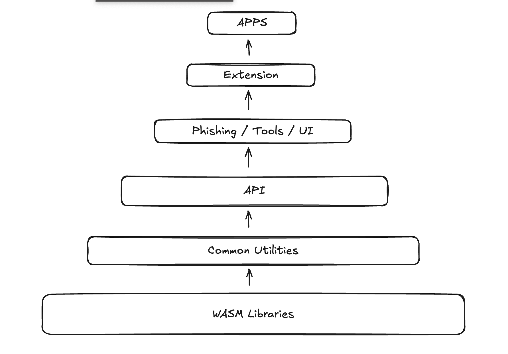

# 4a dApps Polkadot-js

---

## The Evolution of Polkadot-JS Tooling

---

### The Early Days: Why Polkadot-JS?


- It was the first one..
- Maintained a vibrant OSS community.
- The only tool that provided consistently up-to-date SDKs that mirrored the fast-paced changes in Substrate libraries

Notes:

The first commit to Polkadot-JS was made in November 2017 by a single developer who saw the need for a first-class JavaScript SDK for Substrate-based blockchains. Built organically, the project embraced open-source principles and eventually established its own GitHub organization.

Polkadot-JS was designed to support both browser-based and Node.js applications, leading to the creation of Polkadot.js Apps—a web-based interface that served as both a playground for experimenting with the API and a reference for using it in a live environment.

Initially a JavaScript library, it soon evolved into a TypeScript-based interface for blockchain interaction. At the time, it was the only tool that could consistently provide up-to-date SDKs that kept pace with Substrate's rapid development.

---

### What is Polkadot-JS?

<pba-flex center>

- Comprehensive JS/TS SDK
- Unified API for blockchain interaction
- Toolbox for JS/TS solutions development
- Development UI

</pba-flex>

Notes:

Polkadot-JS is a JS/TS SDK that allows developers to interact with Substrate-based blockchains, including Polkadot and Kusama. It serves as a way to connect the Polkadot blockchain and web-based applications, enabling developers to query nodes, send transactions, and interact with various features of the Polkadot and Substrate ecosystems directly using JavaScript or TypeScript.

It is fundamentally a unified API that simplifies blockchain interaction. This API allows developers to query blockchain data, manage accounts, construct transactions, and even send data to nodes without needing to deal with the nits and bits of the underlying blockchain protocol. Having a unified TS API expands the universe of users which can access and work on substrate-based chains. Substrate can be quite complex, and Rust has a steep learning curve, so Polkadot-JS leverages the popularity and ease of use of TS frameworks to encourage adoption.

Polkadot-JS offers a wide array of features and tools that cater a wide range of use cases, from simple scripts to more complex projects such as @acala-network/chopsticks. These tools include:

1. Transaction Construction and Decoding: Developers can easily construct transactions, sign them, and send them to the network. This is fundamental for any application that needs to interact with the blockchain, such as wallets or transaction-based applications such as block explorers.
2. Keyring Management: Polkadot-JS provides mechanisms for managing cryptographic keys and user accounts. This is particularly useful for applications that need to store or generate keys for users, such as wallets and dApps.
3. Staking: Polkadot-JS provides tools for interacting with the staking system, including nominating validators, managing staking preferences, and querying staking information. Staking is a core feature of Polkadot's consensus mechanism, and Polkadot-JS makes it easy for developers to integrate staking functionality into their applications.

Through Polkadot APPS, Polkadot-JS provides a fully featured UI for debugging and development. It has also set itself as the baseline for block explorers and many Polkadot based apps take a lot of inspiration from its design. It provides dedicated pages for transaction decoding and encoding, transaction submition, account management, governance, and all the most common blockchain interactions, such as staking.

Its advantages are best appreciated when it comes to interacting with a local development network, since it has an easy-to-use local network setting and can be readily connected to any local node we may be running.

---

### Comprehensive JS/TS SDK

- A complete toolkit for Substrate interactions
- Provides multiple modules for different functionalities:
  - @polkadot/api - Core RPC and chain interaction
  - @polkadot/keyring - Account management
  - @polkadot/util-crypto - Cryptographic utilities
  - @polkadot/extension-base - Browser extension integration

Notes:

The SDK offers a comprehensive set of tools for developers to interact with Substrate-based chains. The modular structure allows developers to import only what they need, making applications more efficient.

The API module provides the core functionality for connecting to nodes, querying chain state, and submitting transactions. The keyring module handles account management, including key generation, encryption, and signing. The util-crypto module provides cryptographic utilities like hashing, encryption, and signature verification. The extension module allows dApps to interact with browser wallet extensions.

This comprehensive ecosystem has made Polkadot-JS the go-to solution for developers building on Substrate chains for years.

---

### Polkadot-JS Dependency Tree



Notes:

This image shows the complex dependency structure of the Polkadot-JS ecosystem. The various packages are highly interconnected, with core utilities at the base and more specialized tools building on them.

This dependency structure illustrates both a strength and a weakness of Polkadot-JS. On one hand, it promotes code reuse and consistency across the ecosystem. On the other hand, it creates tight coupling that can make it difficult to use individual components without pulling in much of the entire system.

Understanding this dependency structure is important for developers working with Polkadot-JS, as it helps explain some of the challenges in bundle size optimization and maintenance that we'll discuss in the limitations section.

---

### Unified API for Blockchain Interaction

- Simplifies complex blockchain interactions
- Abstracts away low-level RPC calls
- Provides consistent interfaces across multiple chains
- Supports reactive programming with observables

Notes:

Polkadot-JS provides a unified API that simplifies blockchain interaction. This API allows developers to query blockchain data, manage accounts, construct transactions, and even send data to nodes without needing to deal with the low-level details of the underlying blockchain protocol.

Having a unified TypeScript API expands the universe of users who can access and work on substrate-based chains. Substrate can be quite complex, and Rust has a steep learning curve, so Polkadot-JS leverages the popularity and ease of use of TS frameworks to encourage adoption.

By abstracting away the nuances of each chain's specific implementation, Polkadot-JS allows developers to write scripts that can be used to retrieve data or send transactions across different chains, as long as those chains share similar functionality.

This reduces the friction of developing solutions in a multichain environment such as Polkadot or Kusama, and guarantees that as long as a solution meets a set of basic requirements, its range of application can be extremely wide.

---

### Example API Usage

```typescript
// Import the API
import { ApiPromise, WsProvider } from '@polkadot/api';

async function main() {  
    // Create the API instance
    const api = await ApiPromise.create({ provider: new WsProvider('wss://rpc.polkadot.io') });

    // Get chain information
    const [chain, nodeName, nodeVersion, blockHash] = await Promise.all([
      api.rpc.system.chain(),
      api.rpc.system.name(),
      api.rpc.system.version(),
      api.rpc.chain.getBlockHash(100000)
    ]);

    // Historic Api
    const apiAt = await api.at(blockHash);
    
    console.log(`Connected to ${chain} using ${nodeName} v${nodeVersion}`);
    
    // Query account balance
    const ADDR = '13UVJyLnbVp9RBZYFwFGyDvVd1y27Tt8tkntv6Q7JVPhFsTB';
    const { data: balance } = await api.query.system.account(ADDR);
    const oldBalance = await apiAt.query.balances.account(ADDR);

    console.log(`Treasury Balance Now: ${balance.free.toString()}`);
    console.log(`Treasury Balance at Block 100000: ${oldBalance.free.toString()}` );
  }
  
  main().catch(console.error);
```