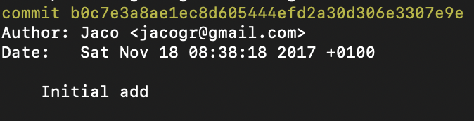

# dApps / Polkadot Hub

---v

## Module Overview

- Understand interaction with a chain
- Metadata in-depth
- JSON-RPC Interface
  - chainHead
  - storage
  - transactions
- Dealing with real-time data

---v

## Module Overview

- Polkadot-API
  - Sub-libraries
  - Subscriptions
  - Compatibility API
  - Signers
- PAPI SDKs
- Smart Contracts

---v

## Grading

- Assignment
  - dApp for specific chain feature <!-- .element: class="fragment" -->
  - Split in two deliverables <!-- .element: class="fragment" -->
    - Basics, core requirement <!-- .element: class="fragment" -->
    - Additional features or add-ons <!-- .element: class="fragment" -->
- Grading <!-- .element: class="fragment" -->
  - UI/UX is NOT graded
  - Business logic code
  - Research, considerations

---v

## Grading

- During class
  - Participation
  - Academic integrity
  - Cooperation
  - Overall engagement

Notes:

You MUST pay attention to class and do the assignment after and not in class.

For working with the assignment, we have office hours after lessons.

Depending on timeline, we might have days where we might have some extra class time for assignment Q&A, specially towards the end.

---v

## Today

- Context (why PJS didn't age well)
- Getting started - Polkadot-api
- Dev Tools
- Assignment description

Notes:

During this module we will go deep through Polkadot-API, from a low-level, interacting with a JSON-RPC endpoint to a higher level like polkadot-api and then its SDKs.

To unblock you from working on the assignment, here's a quick getting started with polkadot-api, which will let you connect with a chain and start interacting with it.

---

## Context (why PJS didn't age well)

---v

## The Genesis Story

- A personal side project before Polkadot existed
- Started when only the specification was available
- No actual blockchain to interact with initially
- Built on anticipation and vision

Notes:

Polkadot-JS began as a personal project by its core maintainer at a time when Polkadot itself was still just a specification on paper.

The developer started building the JavaScript implementation based purely on the specifications and their understanding of what would be needed for the future network. This forward-thinking approach allowed the tooling to evolve alongside the blockchain itself, rather than playing catch-up later.

This early start gave Polkadot-JS a unique advantage - it was able to grow and adapt organically with the protocol itself, incorporating feedback and adjusting to changes in real-time as the Polkadot vision materialized into working code.

---v

## The First Conversation

<pba-cols style="gap: 0;">
<pba-col>

</pba-col>
<pba-col style="text-align: left;">

> Cool, not sure how this fits in, but it helps the Polkadot ecosystem, so go on.

</pba-col>
</pba-cols>

Notes:

Source https://medium.com/paritytech/people-of-parity-jaco-greeff-ece32c116c5f

---v

## The Result

- Polkadot-JS grew organically with polkadot
  - Polkadot-JS API
  - Polkadot-JS UI
- JSON-RPC was created ad-hoc

---v

## Protocol was not ready

Before Metadata v14

- Had a description of different interaction
- No type definition
- Solution: Type Registry

Notes:

Pre metadata 14, each interaction (storage, tx, etc) was defined and had a "type" property.

But that type was just a string with a type name, which could be anything. This lead to the creation of the type registry.

---v

## Adhoc RPCs

> When Polkadot/Substrate was first started, the set of JSON-RPC functions was simply copy-pasted from Ethereum (given that their implementations already existed in the Parity Ethereum client), then expanded in a cowboy-y way without being given proper thoughts.

@tomaka - New JSON-RPC API mega Q&A - Forum post

---v

## PJS: the monolith

- Tightly coupled architecture <!-- .element: class="fragment" -->
- Leaky APIs at all levels: <!-- .element: class="fragment" -->
  - Convoluted JSON-RPC Provider <!-- .element: class="fragment" -->
  - Adhoc SignPayload interface, coupled to PJS internals <!-- .element: class="fragment" -->
  - PJS leaks its type-registry <!-- .element: class="fragment" -->
- Large bundle size

Notes:

---v

## PJS: Unable to evolve

- PJS type-registry should have vanished upon Metadata V14
- Virtually impossible to abandon legacy RPCs
- Treats parachains as second class citizens
- Probably won't be able to fully support extrinsic v5

---v

## Poorly designed APIs (Hands on)
