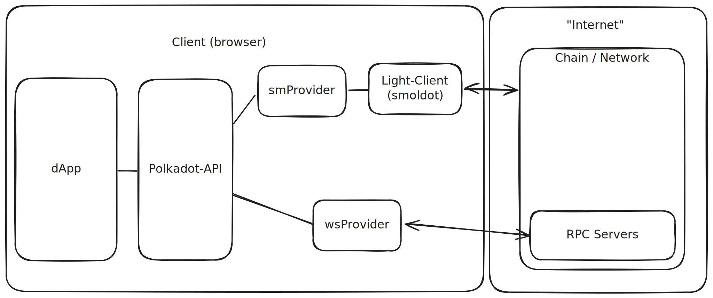

# Polkadot-API

## Getting Started

Notes:

During this module we will go deep through Polkadot-API, from a low-level, interacting with a JSON-RPC endpoint to a higher level like polkadot-api and then its SDKs.

To unblock people from working on the assignment, here's a quick getting started with polkadot-api, which will let you connect with a chain and start interacting with it.

---

## Polkadot-API

Typescript library to interact with Polkadot-based chains

https://papi.how/

---

## Polkadot-API

- 💡 Fully Typed
- 🪶 Light-client first
- 🚀 Performant and light-weight
- 🧩 Modular

Notes:

Full Typed: Not only the library itself, but the interactions with each chain. It even pulls the interaction docs as JSDocs to show them in intellisense.

---

## Concepts



Notes:

https://excalidraw.com/#json=SLLLnZdCrJdd1PYIurjGv,IwZlWHL0yw0GLMW6uMEnZw

---

## Polkadot-API

```sh
npm install polkadot-api

npx papi add dot -n polkadot
```

Notes:

Let's jump into live demo

- Basics
  - Installing papi
  - Connecting to a chain (westend, will be needed for sending tx)
- Operations
  - Query storage: System.account
  - Runtime call: estimate fees with TransactionPaymentApi.queryInfo
    - Create extrinsic System.remark
  - Constant: Balances.ExistentialDeposit
    - introduce compatibility token
- Transactions
  - Connect to pjs extension
  - Get signer from extension
  - Submit a System.remark to westend
- Compatibility
  - Remark the meaning of descriptors
  - Show example of connecting to a different chain (polkadot) with the same wnd descriptors
    - System.Remark => works, but throws a payment
    - Sudo => fails

---

## Devtools

https://dev.papi.how/
