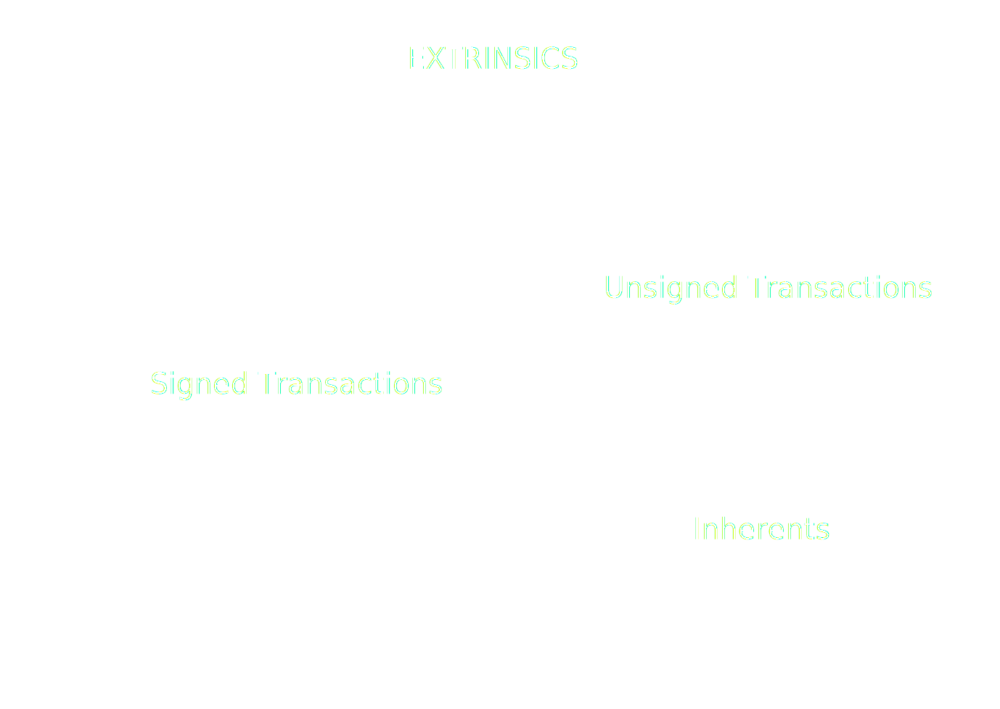
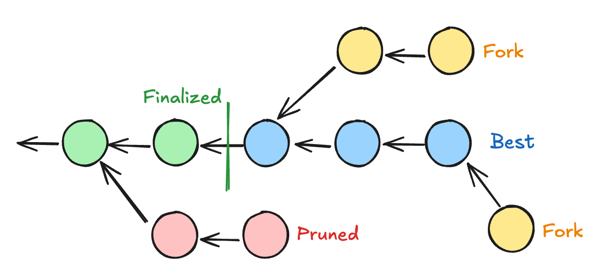

# JSON-RPC Spec

## Transactions

---

## JSON-RPC Transaction

- transaction_v1_broadcast(tx) -> id
- transaction_v1_stop(id)

Simple? <!-- .element: class="fragment" --->

Notes:

Not so much

---v

## Challenges

- Creating the transaction
  - Call data
  - Signed extensions
  - Signers
- Transaction validation
- Transaction states
- Tracking transactions

---

# Transactions

---v

## Transaction types

Notes:

https://excalidraw.com/#json=Mv0Y4f-NgpogwQkoTLHfq,JSVgtIc_-tbxSHfuDbZocA

---v

## Extrinsic V4

#### Signed

[0x84 | Address | Signature | Extra | CallData]

#### Unsigned

[0x04 | CallData]

---v

## Signed extensions

---v

## Call Data

---

# Transaction States

---v

## Transaction Validation

Notes:

- Go through different validation states, what they mean
- Transactions valid in a future

---v

## Transaction Result

Notes:

- Extrinsic Failed / Extrinsic success
- Difference between failed vs invalid

---v

## Broadcasting

Notes:

Explain what it means to broadcast - it's not cancellable

---v

## Putting it all together

---

# Transaction Tracking

---v

## Transaction Tracking

---v

## Transaction Tracking

Where do transactions live?

---v

## Transaction Tracking

- For each transaction:
  - Validate beforehand
  - Request all the new blocks
  - See if they are included
  - Get validation status
  - Get transaction result
- Keep track of best / finalized

---v

## Step-by-step

---v

## JSON-RPC TransactionWatch

<pba-cols>
<pba-col>

- submitAndWatch(tx) => subId
- unwatch(subId)

</pba-col>
<pba-col>

- validated
- bestChainBlockIncluded
- finalized
- error
- invalid
- dropped

</pba-col>
</pba-cols>

---v

## Problem

- TransactionWatch is detached from ChainHead
- Might receive blocks that
  - ChainHead hasn't received
  - ChainHead did receive but now unpinned
- Useful only to know if it has been included.
- But can't get any other info: events, storage, etc.
