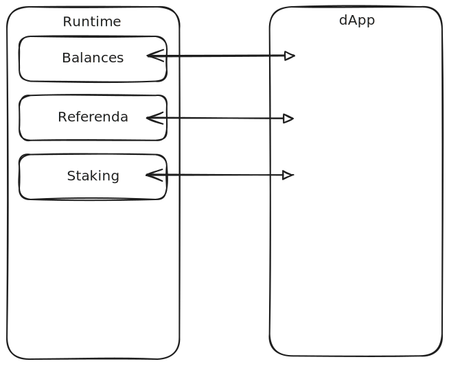
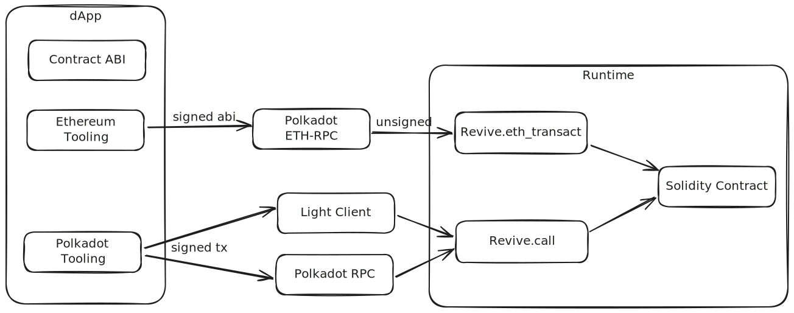

---

## ink!

- Smart contracts in Polkadot
- Implemented in Rust
- Exports PolkaVM + Metadata

---

## Smart Contracts



Notes:

https://excalidraw.com/#json=yQC2mtGUS-ngozXnv3LWY,_QUAy86R85h-16dNNVbhEQ

---

## Smart Contracts


---

## Smart Contracts

- Contract storage
- Constructor
- Transactions
  - Called "messages" instead
- Events

Notes:

There are deposits associated when instantiating a contract and adding more values to storage.

---

## Lifecycle


Notes:

https://excalidraw.com/#json=zKnc7S6Mm8gMyYf8leLGB,mP3Q22jaxfWu-SNsb9EIXQ

---

## Endpoints

- Runtime API: Dry-run
- Transaction: Perform some change

---

## ink! + PAPI

```ts
// pnpm papi ink add metadata.json

import { contracts } from "@polkadot-api/descriptors";

const inkClient = getInkClient(contracts.psp22);
```

Notes: At this level, PAPI inkClient only gives TS definitions for encoding/decoding messages

---

## ink! + PAPI

```ts
// Takes in the message name
const increaseAllowance = inkClient.message("PSP22::increase_allowance");

// Encode the data for that message
const messageData = increaseAllowance.encode({
  delta_value: 100_000_000n,
  spender: ADDRESS.bob,
});

const response = await typedApi.apis.ReviveApi.call(
  ADDRESS.alice, // Origin
  ADDRESS.psp22, // Contract address
  0n, // Value
  undefined, // GasLimit
  undefined, // StorageDepositLimit
  messageData
);
```

---

# Let's create our own!

Notes:

Ideas:

- Canvas
- Auction

---

# Revive

"Quasi-compatibility" with Solidity contracts

---

## Pre ink!v6

- ink!v5- contracts compiled to WASM
- Pallet Contracts was used to execute them
- They worked, but were isolated into specialized chains

---

<section data-background-image="./img/plaza.webp" data-background-size="contain" data-background-opacity="0.3">

## Plaza

Integrate everything into a single Hub

- Assets (USDC, USDT, WETH, WBTC, …)
- Balances
- Smart Contracts (ink! and solidity via PVM)
- Staking
- Governance
- Bridges

</section>

---

## Revive

- Main goal: Bring existing Ethereum contracts into Polkadot
- Contracts work with Ethereum-like addresses (H160)
  - 20 bytes (160 bits) represented as hex
- SS58 -> H160
  - Last 20 bytes of `Keccak(publicKey)`
  - SS58 Accounts must be mapped beforehand
- H160 -> SS58
  - Public key = `pad(H160, k, 32)`
  - Used for contract balance and supporting ETH signers.

---

## Precompiles


Notes:

https://excalidraw.com/#json=gK6duspahkkDb2ub3bU83,w-G5vKnDfAVMRv3RsYhVMQ

---

# Using a Precompile

Notes:

burn2play or similar

---

# Solidity on Polkadot

- `revive`: Solidity -> PolkaVM compiler
- Pallet Revive: Runs PVM Contracts, maps SS58 <-> H160 Addresses
  - New work to have REVM running in pallet revive.
- Tooling support
  - Existing Ethereum tooling through custom RPC
  - Polkadot tooling through regular pallet calls

---

# Solidity on Polkadot



Notes:

ABI uses a different encoding than SCALE. This also applies when interacting with a polkadot client: The transaction is SCALE-encoded, but the "data" parameter is of type "bytes". This is ABI-encoded data when interacting with a solidty contract, and SCALE-encoded data when interacting with an ink! contract.

https://excalidraw.com/#json=ij82a-at2IrUyRktTXL5U,aFzJN3KLP57kclPK2OVStw

---

# Let's play with Solidity
