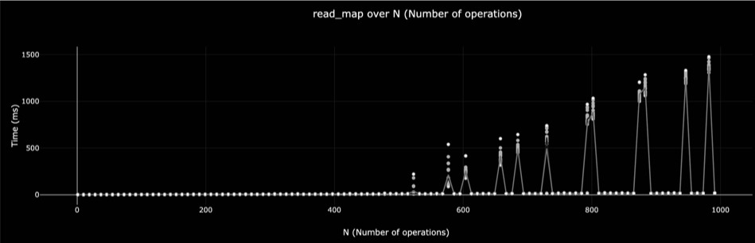
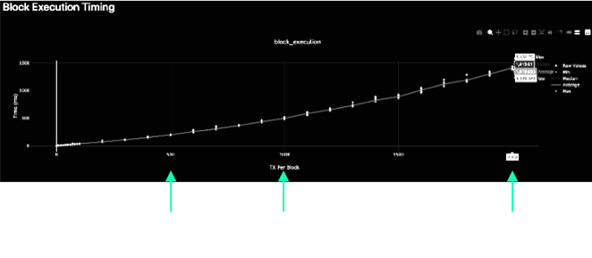

# More FRAME Benchmarking

---

## Overview

- Our Learnings Throughout Development
- Best Practices and Common Patterns

---

## Things we tried
## Things we learned

---

## Isolating DB Benchmarks (PR #5586)

<pba-cols>
<pba-col>

### We tried…

To benchmark the entire extrinsic, including the weight of DB operations directly in the benchmark. We wanted to:
- Populate the DB to be “full”
- Flush the DB cache
- Run the benchmark


</pba-col>
<pba-col>

### We learned…

RocksDB was too inconsistent to give reproducible results, and really slow to populate.
So we use an in-memory DB for benchmarking.




</pba-col>
</pba-cols>

---

## Fixing Nonlinear Events (PR #5795)

<pba-cols>
<pba-col>

### We tried…

Executing a whole block, increasing the number of txs in each block. We expected to get linear growth of execution time, but in fact it was superlinear!




</pba-col>
<pba-col>

### We learned…

Each time we appended a new event, we were passing the growing event object over the Wasm barrier.

We updated the append api so only new data is pushed.


</pba-col>
</pba-cols>

---

## Enabling Weight Refunds (PR #5584)

<pba-cols>
<pba-col>

### We tried…

To assign weights to all extrinsics for the absolute worst case scenario in order to be safe.

In many cases, we cannot know accurately what the weight of the extrinsic will be without reading storage… and this is not allowed!


</pba-col>
<pba-col>

### We learned…

That many extrinsics have a worst case weight much different than their average weight.

So we allow extrinsics to return the actual weight consumed and refund that weight and any weight fees.

</pba-col>
</pba-cols>

---

## Customizable Weight Info (PR #6575)

<pba-cols>
<pba-col>

### We tried…

To record weight information and benchmarking results directly in the pallet.

</pba-col>
<pba-col>

### We learned…

This was hard to update, not customizable, and not accurate for custom pallet configurations.

</pba-col>
</pba-cols>

So we moved the weight definition into customizable associated types configured in the runtime trait.

```rust
#[weight = 45_000_000 + T::DbWeight::get().reads_writes(1,1)]
```

turned into...

```rust
#[weight = T::WeightInfo::transfer()]
```

---

## Custom Benchmark Returns / Errors (PR #9517)


---

## Negative Y Intercept Handling (PR #11806)

---

## Multi-Dimensional Weight (Issue #12176)

---
