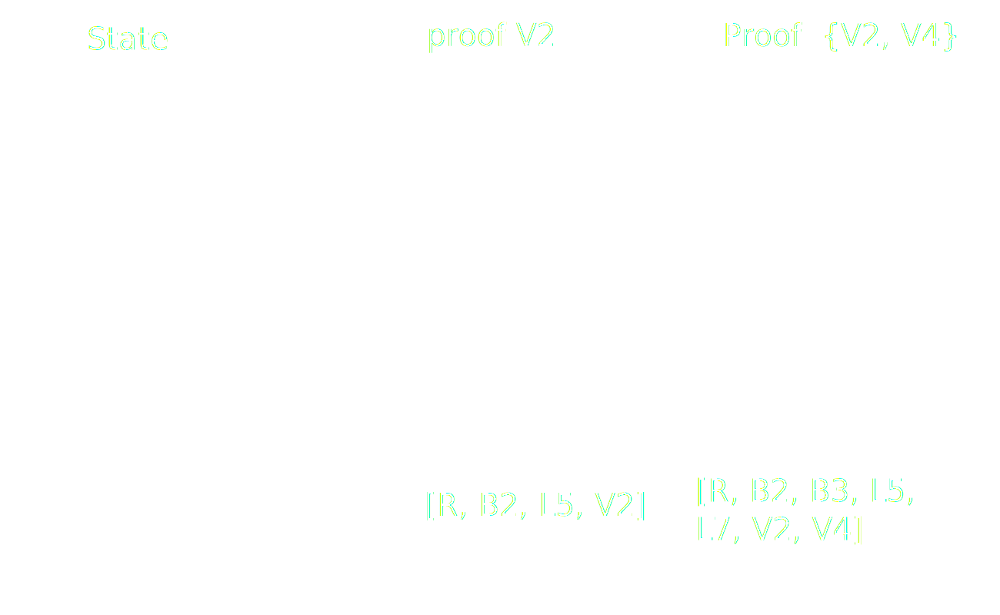
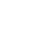

# The computational cost of hashing and how it drives polkadot design.

---

### Plan

- polkadot parachain Pvf and attached PoV data.
- Merkle proof
- Cumulus state transition proof
- Is hashing cost only computational?

Notes:

The idea of this session is, starting from general proof system of polkadot that was already seen (generic state transition proofs distributed
with the different polkadot actor and subsystem: collator availability, validator approval, further dispute).
focus progressively to the substrate/cumulus merkle trie proof system, and end on the actual
implication of such a model.

As focusing on the cumulus proof we will switch to the actual content of this lesson, ideas of the impact of using merkle trie for state and
proof in regard to the polkadot model.

Many things will be a bit redundant with previous session on trie, but here in the context of cumulus and polkadot.

Following workshop will allow seeing how things happen at low level and if all goes well, reach similar conclusion as what we will describe here.

---

### proof

- Polkadot: Assessing that a parachain state transition is correct. No proof assumed.
  - PvF wasm
  - Input data from availability
- Cumulus: trie state based parachain. Assume a merkle proof as PvF input data.

Notes:

In practice design of system is currently and was historically largely
driven by the merkle trie state ethereum like design targeting.

The main point is that we need pvf using pov data that can be checked in a pretty STATELESS way.

---

### Merkle trie and proof

Notes:

<!-- TODO schema from the db & merklized slide lesson?? -->

this was already evoked in length before. Just a reminder

Notice that there is no notion of order or sequence

Notice one value here 5 nodes, 2 value 7, but if I add V3 only 9 nodes.
5 -> 7 -> 9
5 -> 3 -> 2
generally get something more compact when adding nodes, that's a tree.

---

### State transition proof

- Prove initial state and execute until same root as next block (through a stateless validation function)
- Symmetry of production (on a full state db) and verification (on a state proof)
- Computational cost
- Proofs do not help scaling, polkadot validation system does
- Analogy (eg ZK rollup)

Notes:

<!-- TODO lot of notes, may need multiple slide -->

we see that proof are just foot print of a state.
We are only really proving the start of block state and it is no
different than previous key values proofs.

scalability from polkadot design not the proof system

When creating proof we run on the state trie db, and record accesses.
<!-- TODO if time speak about cache and proofs -->

Polkadot design is ok for these proofs, what would not be fine
is verification being longer than production (would work but would make
parachain block size limit ridicously small in comparison to others.

About production and verification, it is useful to keep in mind some interesting architectural points,
generally the limits of the wasm.
<!-- (TODO this can be a slide but probably already in other lessons) -->

- Synching: Runtime is running execute block that calls host function: all the state machine (notably overlay changes) is on the side of host function).
- block production: We run execute transaction from pool and actually part of execute block are run externally (on init, on finalize (on finalyze contains next block storage root calculation call: the call to storage root!!!)).
- pov check: All is in wasm; the whole state machine and calls to host function directly call this runtime state machine, the db call from the state machine is simply the merkle proof).
<!-- TODO can have a slide for it but probably already in other lessons. -->

One can notice that cumulus produce (or did produce) the same wasm for pvf and runtime (just need to expose both 'execute_block' and 'validate_block'). But from a polkadot point of view it could be split.

can see the validator voting system as rather close to an interactive zk proof system.

About pure computational cost: one can see that we want to have as less node as possible, it is faster to run a hashing function 1 time on the concatenation of N nodes than run the hashing function N time on the N nodes.
But the difference is not that big and generally the question is more about the size of data we are hashing, so the number of branch and their size.
All this ends up to what we will talk after the proof size.
Seing that we can also conclude having less branch involve is better, so radix 16 choice is better than binary trie, but really these days size is a bigger concern.

Joke here: the lesson is call computational cost but not much to say than size is often more relevant, even if cost is very important too.
So yes all is about size.
Size matter doubly: good hash function makes it less interesting (try to bench `blake` against `keccak`), but with polkadot size matter for network and pov data distribution a lot.
So size matter and 'smaller is better'.

Other Proofs
many are proposing very fast checking scaling the information level.
eg the eth ZK rollup.

In this case the parachains get a lot on his plate: heavy producing with
lot of implication, quite challenging and all.
But putting this on parachain model is ok, just the light part would be running
there: validator only check the zk proof.
So can think of it as a sub problem.

Merkle trie proofs are relatively simple to understand at a big cost though
but polkadot makes it acceptable

ZK rollup could fit, just it is less interesting due to small cost of checking proof
(actually not true but that is a general opinion/idea)

---

### Proof size

Polkadot limits size

Smaller is better

Can grow big

Compact proof

zlib compression

Notes:

<!-- TODO find size limit -->

Be clear that the size is limited for distribution (availability) question.

So out of the computational cost of running the wasm logic there is the merkle proof computational cost.
Depending on your runtime logic chances are smaller proof will allow more computation in a block: by
allowing more different data to be accessed and a bigger variety of extrinsic.
One can run a lot by doing send 10 token from account A to account B, then same thing but from B to A, then A to B and so on: clearly here the computation limiting factor will not be the size, but generally it can be and we should
strive to try to get small proofs.
(related to weight v2: both computation and size factor).

Compact are good, even if it costs to run the hashes again we really favor smaller proof.
But not that from a computational point of view it increase computation cost.

zlib compress mainly the value included in the nodes, generally non deterministic: hard to measure.
-> no way to bound it so it is a gain from availability view, but still not possible to consider for weight V2

As we will see after hashing here is not only a computational cost but a storage cost.

---

### Runtime update

Consider that runtime is in state.

If an extrinsic of the block is calling `set_code` through sudo.

What happen?

Notes:

this value runtime is big... usual issues around the question
chunk solution...
Old runtime in proof?
<!-- TODO add a slide on the new trie format or just show how old one was not proper. -->

---

### Runtime storage design

Balanced or Unbalanced trie

Runtime eg StorageMap

Custom eg `:code`

Module prefix

Child trie

Db storage

Notes:

<!-- TODO lot to say here, could be split -->

balancing trie always have been very important for security reason, deterministic weight calculation.
In ethereum for instance all key are hash of key. -> this way key length is constant and well distributed -> leading to a balanced trie

Though substrate runtime allows any length of key: meaning we can have unbalanced trie.

There is design concern: a smart contract will use as ethereum. :code will use this short key with few parent branch involve.
Modules will use some prefixing so they don't interfere with each other: if ballance module store a lot, and your nft storage does not, then the proof accessing nft only will not be impacted by the ballance module storage.

Child trie can be seen as prefix, but with their own root (very convenient to extract some state eg state of a given crowdloan/contract storage only).

Quick word on db storage, pov is in memory but db can access disk, which makes some choice a tradeoff. Think about the impact of using a binary trie against a radix 16 trie against a 256 trie? this goes a bit out of the consideration
of this lession. But my take on it is hex trie was a trade of related to the db number and size of node, but ultimately one should be looking to use different indexing structure between storage and merkle proof. Eg: store radix 16 but use binary in memory when hashing and have binary proof.

---

### Reducing number of keys

Substrate value size is unbounded and can be rather large

But polkadot got a limit

Less key by serializing values together

Depends on usage, always safe to keep value small

Notes:

if using all values usually then serializing them together is good.
using all values together or having a seldom read scenario: eg events
events are read a lot, but not from runtime. So write a single value containing
all events of a block.

Reduce proof size by requiring to include less parent branches.
Note state machine allows rather low cost update by having an `append` function.

if querying individual values, then storing individually is better:
higher write cost
accesses are done on individual values: individuals item.
Then please use different storage item, even in case of a list of item

A third consideration is clearly proof size: we want the PoV to be small: gaining a few branch is a good thing. But including big value in proof makes it worthless.

Conclusion do serialize values together, but carefully.
eg events are not read from runtime, but some proof, for light client notably may use a thiner storage (eg attaching event to a given extrinsic index).

Note earlier said polkadot limit size, but we could have write only value (eg event) that go over this size: by simple not being read.
Though all value should be unbounded, because in this scenario such big event value will become a liability when migrating (runtime could not migrate it easily as value is too big).

---

### Wrapping up

- State choices:
  - chains performance
  - Proofs size
- similar execution
- still room for improvement

Notes:

- chains performance:
  hex 16 makes is ok for
  proofs size
  bin proof better, higher computation

- chain in synch: access a cache & on disk db.
  btree in state machine
  chain for block building: good state machine and cache big impact

cumulus: access in memory proof: overhead of loading it
also btree of state machine

-

improvement through different storage/state:
Full parachain: requires forking substrate cumulus significantly
Some child state only: there is something to do in this direction but also not easy with current codebase.

today we only got hex16 child trie

using a binary child trie will reduce size of proofs for computation storage.

Bounded size child trie could also be interesting.

Things can really be custom

But not an easy task, cumulus really is a great tool.

Just substrate/cumulus does not allow it.

but generally as we polkadot allows any change and a lot of freedom.

---

### Questions

---

### bin vs hex example

Notes:

should just be done on a whiteboard if interest in the statement that bin produce more compact proof than hex.
