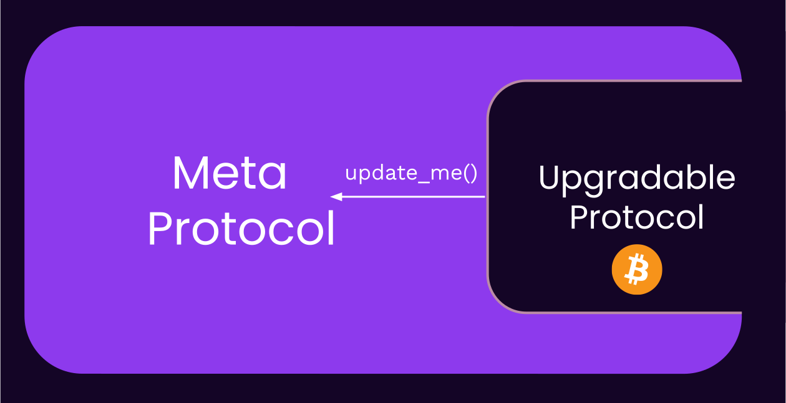
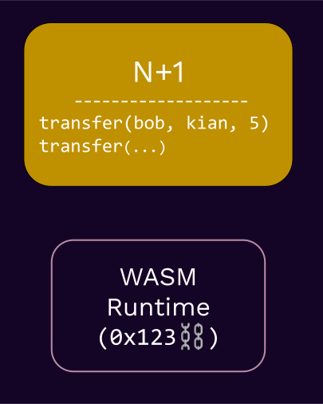
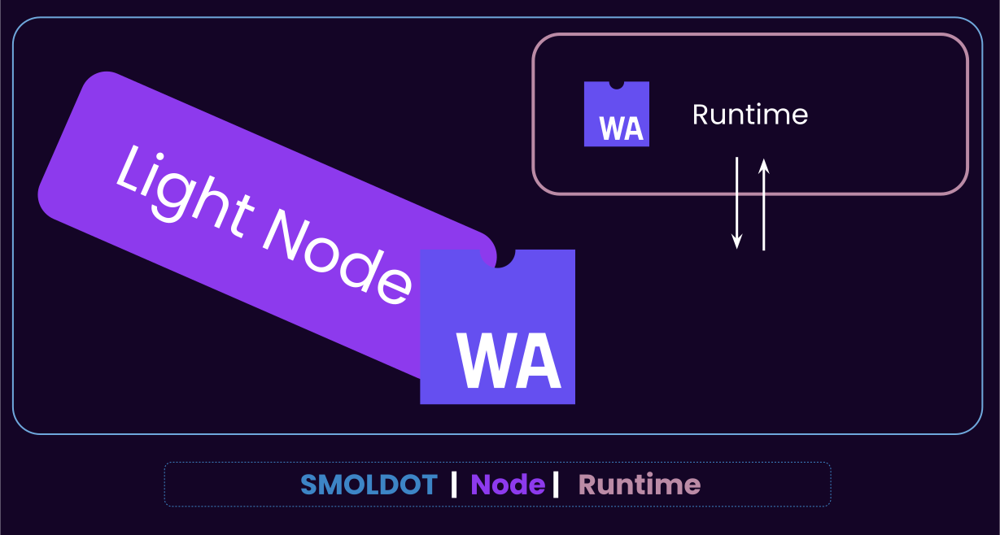
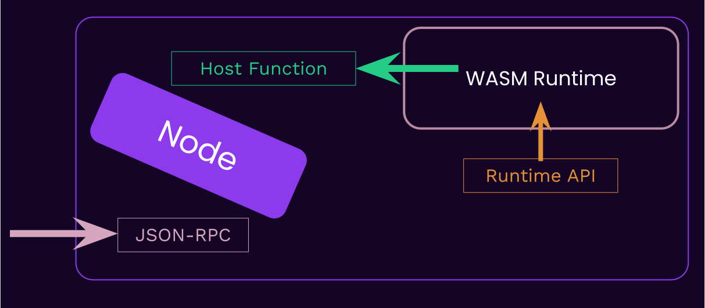
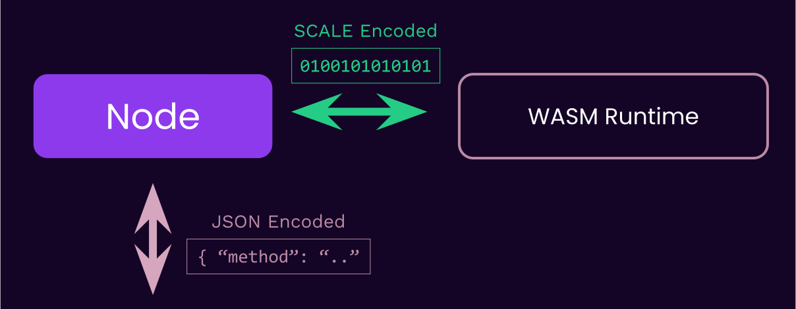
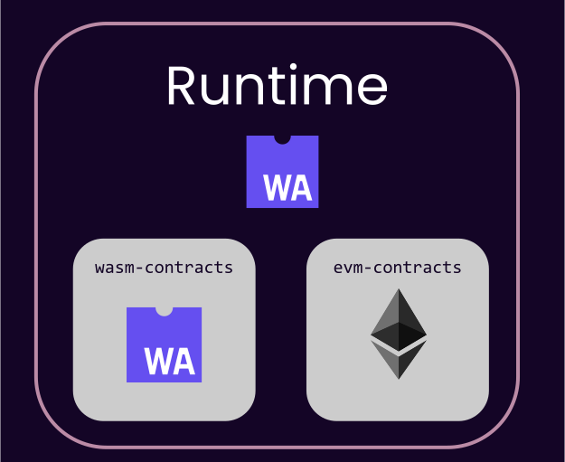
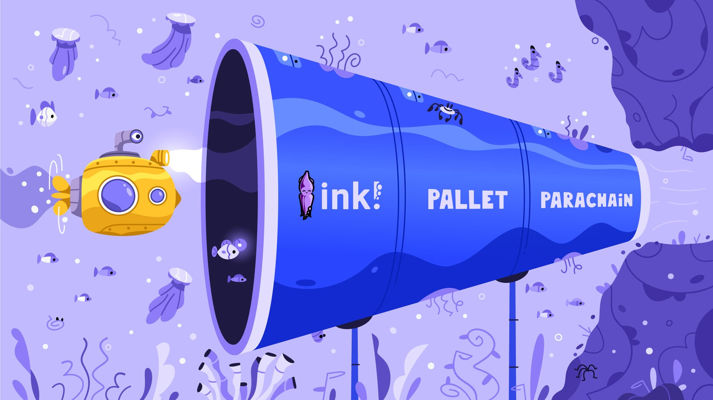
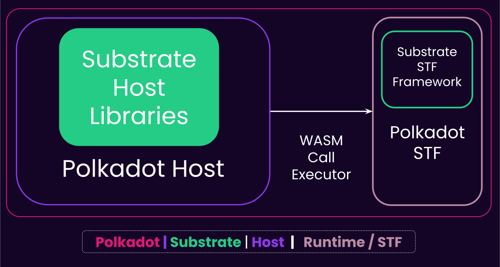
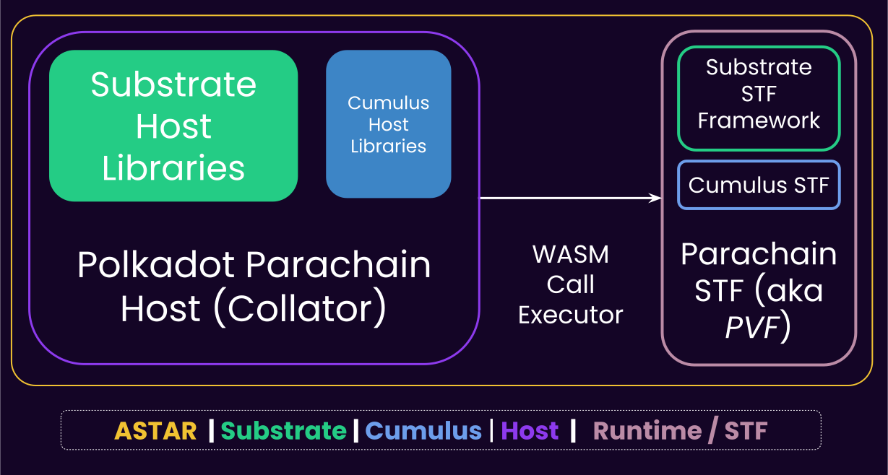

# Introduction to Substrate

---

## What is Substrate?

Substrate is a **Rust framework** for **building blockchains**.

---v

### Why Substrate?


Notes:

Highlight the multi-chain part.

---v

### Why Substrate?


Notes:

Polkadot is the biggest bet in this ecosystem against chain maximalism, and Substrate plays a big
role in this scenario.

---v

### Why Substrate?

- ⛓️ Future is multi-chain.
<!-- .element: class="fragment" -->
- 😭 Building a blockchain is hard. Upgrading it even harder.
<!-- .element: class="fragment" -->
- 💡 Framework!
<!-- .element: class="fragment" -->

---

## Core Philosophies of Substrate 💭

The **pre-substrate** way of thinking:

- 😭 _Building a blockchain is hard. Upgrading it even harder_.
- 💪🏻 We are going to spend maximal resources at making sure we get it right.
<!-- .element: class="fragment" -->

---v

### Core Philosophies of Substrate 💭

But has this worked?

- 😭 Bitcoin block size debate
<!-- .element: class="fragment" -->
- 2️⃣ L2s and beyond
<!-- .element: class="fragment" -->
- 📈 Ethereum gas price
<!-- .element: class="fragment" -->

note:

Bitcoin block size has never been and is an ongoing debate.

I am not against L2s per se, but it is truth that they mostly exist because the underlying protocol
is too hard/slow to upgrade itself. ETH Gas prices is also shows that the underlying protocol cannot
meet the demands of today.

https://en.wikipedia.org/wiki/Bitcoin_scalability_problem
https://ycharts.com/indicators/ethereum_average_gas_price

---v

### Core Philosophies of Substrate 💭

The **Substrate** way of thinking:

- ☯️ Society and technology evolve
<!-- .element: class="fragment" -->
- 🦸 Humans are fallible
<!-- .element: class="fragment" -->
- 🧠 Best decision of today -> mistake of tomorrow
<!-- .element: class="fragment" -->

---v

### Core Philosophies of Substrate 💭

Outcomes of this:

- 🦀 Rust
- 🤩 Generic, Modular and Extensible Design
- 🏦 Governance + Upgradeability

Notes:

Think about how each of these links back to "whatever you decide today will be a mistake soon".

---

## 🦀 Rust

- First line of defense: prevent human error when possible.
- Safe language, no memory safety issues.

note:

So at least we don't want to deal with human error, and only deal with the fact that we cannot
predict the future.

Memory safety is a fundamental issue in most major system-level programming languages.

Some such mistakes are impossible to make in Rust.

TODO: example to showcase this.

---v

### 🦀 Rust

```c
int main() {
    int* x = malloc(sizeof(int));
    *x = 10;
    int* y = x;
    free(x);
    printf("%d\n", *y);  // Accessing memory after it's been freed
}
```

<br>

```rust
fn main() {
    let x = Box::new(10);
    let y = x;
    println!("{}", *y); // ❌
}
```

<!-- .element: class="fragment" -->

---v

### 🦀 Rust

```c
int* foo() {
    int x = 10;
    return &x;
}

int main() {
    int* y = foo();
    printf("%d\n", *y); // Accessing memory out of its scope
}

```

<br>

```rust
fn foo() -> &'static i32 {
    let x = 10;
    &x
}

fn main() {
    let y = foo();
    println!("{}", y); // ❌
}
```

<!-- .element: class="fragment" -->

---v

### 🦀 Rust

> Microsoft and Google have each stated that software memory safety issues are behind around 70 percent of their vulnerabilities.

note:

https://www.nsa.gov/Press-Room/News-Highlights/Article/Article/3215760/nsa-releases-guidance-on-how-to-protect-against-software-memory-safety-issues/#:~:text=Microsoft%20and%20Google%20have%20each,70%20percent%20of%20their%20vulnerabilities.

---v

### 🦀 Rust

- 🏎️ Most Rust abstractions are **zero-cost**.
- ⏰ Rust has (almost) no "runtime".


Notes:

this is not 100% accurate though, rust has a small runtime that is the panic handler etc. Rust for
Rustacean's chapter on `no_std` covers this very well.

Also, this is a good time to talk about how we use "Runtime" in a different way.

---

### 🤩 Generic, Modular and Extensible Design

- Second line of defense.
- Our *execution* (possibly thanks to Rust) is perfect, but we can't predict the future.

note:

this is where a module, generic design is useful. You can change components easily based on the
needs of the future.

---

### 🤩 Generic, Modular and Extensible Design

- Multiple consensus engines (BABE/Grandpa/AURA/PoW/Sassafras)
<!-- .element: class="fragment" -->
- Multiple network protocols (QUIC, TCP)
<!-- .element: class="fragment" -->
- Multiple database implementations (ParityDB, RocksDB)
<!-- .element: class="fragment" -->
- Multiple ledger-state formats (UTXO, Account-based)
<!-- .element: class="fragment" -->
- Highly configurable, graph-based transaction-pool.
<!-- .element: class="fragment" -->
- Easy to change primitives: AccountId, Signature, BlockNumber, Header, Hash, and many more.
<!-- .element: class="fragment" -->

note:

These are all examples of being generic, modular and extensible at the Substrate level. FRAME takes
these even further, but more on that later.

---v

### 🤩 Generic, Modular and Extensible Design

- **AlephZero**: Custom finality, DAG-based, 1s block time.
- **Moonbeam**: Ethereum compatible, build with substrate.
- **HydraDX**: Custom transaction pool logic to match DEX orders.
- **Kulupu**: Proof of work, custom hashing.

Notes:

Substrate has been coded, from the ground up, such that it is easy to have multiple implementations
for certain functions. Heavy use of traits and generics is the key to achieve this. As noted,
Substrate has a lot of APIs, and optional implementations. You are bound to the API, but not the
particular implementation.

---

## 🏦 Governance + Upgradeability

- What use is a generic code, it we cannot agree on how to utilize that modularity/extensibility?
- Governance!
<!-- .element: class="fragment" -->
- What use is governance, if the upgrade cannot be enacted?
<!-- .element: class="fragment" -->
- (trustlessly) Upgradeability!
<!-- .element: class="fragment" -->

note:

Even if we are governable, but we still need "trust" to enact the upgrade, it is hardly any better.
In essence, if an upgrade mechanism is not self-enacting, it might as well just reside offchain and
be a signaling mechanism.

---v

### 🏦 Governance + Upgradeability

- ✅ Governance: Easy
- 😢 Upgradeability: Not so much

---v

### 🏦 Governance + Upgradeability

- How does a typical blockchain upgrade itself?

notes:

1. Discussion, offchain signaling
2. Possibly onchain voting
3. Hard(ish) Fork

---v

### 🏦 Governance + Upgradeability


---v

### 🏦 Governance + Upgradeability


note:

the problem is that the system is one big monolith protocol. Updating any part of it requires the
whole thing to be updated.

---v


### 🏦 Governance + Upgradeability

*The way to make a protocol truly upgradeable is to design a meta-protocol that is not upgradeable.*

---v

### 🏦 Governance + Upgradeability



---v

### 🏦 Governance + Upgradeability

- Fixed meta-protocol?
<!-- .element: class="fragment" -->
- Substrate Client
<!-- .element: class="fragment" -->
- inherently upgradeable meta-protocol?
<!-- .element: class="fragment" -->
- Substrate Runtime
<!-- .element: class="fragment" -->


---

### Substrate Architecture


---v

#### Substrate (simplified) Architecture

<pba-cols>

<pba-col center>
<h3 style="color: var(--substrate-runtime); top: 0"> Runtime (Protocol) </h3>

- Application logic
- Wasm (maybe **FRAME**)
- Stored as a part of your chain state
- Also known as: STF

</pba-col>

<pba-col center>
<h3 style="color: var(--substrate-host); top: 0"> Client (Meta-protocol) </h3>

- Native Binary
- Executes the Wasm runtime
- Everything else: Database, Networking, Mempool, Consensus..
- Also known as: Host

</pba-col>

</pba-cols>

---

## The Runtime

<div>

- Runtime -> **Application Logic**.

</div>
<!-- .element: class="fragment" -->
<div>

- A _fancy_ term: Runtime -> **State Transition Function**.

</div>
<!-- .element: class="fragment" -->
<div>

- A _technical_ term: Runtime -> **how to execute blocks**.

</div>
<!-- .element: class="fragment" -->

Notes:

- I would personally call the runtime STF to avoid confusion with the "runtime" that is the general
  programming runtime, but kinda too late for that now.
- Among the definitions of the Wasm runtime, let's recap what the state transition is.
- The block execution definition will be described more in the Wasm-meta lecture.

---

## State Transition Function

**State**


note:
entire set of data upon which we want to maintain a consensus.
key value.
associated with each block.

---v

### State Transition Function

**Transition Function**



---v

### State Transition Function

$$STF = F(block_{N}, state_{N}, code_{N}): state_{N+1}$$

---v

### State Transition Function


note:

The Wasm runtime in this figure is in fact obtained from the state (see `0x123`)

---v

### State Transition Function


---v

### State Transition Function


note:

could we have updated the code in N+1? By default, no because we load the wasm before you even look
into the block.

IMPORTANT: State is not IN THE BLOCK, each state has AN ASSOCIATED BLOCK.

Keeping the state is 100% optional. You can always re-create the state of block `N` by re-executing
block `[0, .., N-1]`.

ofc, changing the Wasm code cannot be done by anyone. That's up to governance.

---

## Full Substrate Architecture


---

## Positive Consequences of _Wasm_ Runtime 🔥


---v

### 🤖 Deterministic Execution

- Portable, yet deterministic.

note:

Wasm's instruction set is deterministic, so all good.

---v

### 🧱 Sandboxing

- Useful when executing untrusted code.

1. Smart contracts
2. Parachain runtime

note:

howe can we guarantee that neither enter an infinite loop, or try to access the filesystem?

---v

### 🌈 Easier (light)Client Development

note:

for the case of client, your client only needs to implement a set of host environments, and NOT
re-implement the business logic.

Simply compare the process to create an alternative client for Ethereum, where you need to
re-implement the EVM.

Same applies to light client, as they do not need to deal with the state transition function.

---v

### 😎 Forkless Upgrade


---v

### 😎 Forkless Upgrade


---v

### 😎 Forkless Upgrade


This update was:

1. Forkless
2. Self-enacting

note:

take a moment to establish that this upgrade is forkless. The runtime is upgraded, but the client is
not. In fact, the client didn't need to know about this at all.

This is what the meta-protocol achieves.

---

## Negative Consequences of _Wasm_ Runtime

- 😩 Constrained resources (memory, speed, host access).
- 🌈 Client diversification != state-transition diversification

Notes:

- 4GB of memory, which we limit even further.
- Wasm has no allocator+panic handler of its own
- Can be slower than native, depending on the executor/execution method.
- Limited access to the host host env, all needs to be done through syscalls.

Less state-transition diversification, because the runtime is the same for all clients. If there a
bug in it, everyone is affected.

---

## Consensus <> Runtime 🤔

- Yes, consensus is not a core part of a blockchain runtime. Why?
- Not often customized.
<!-- .element: class="fragment" -->
- Not part of your STF!
<!-- .element: class="fragment" -->
- The consensus protocol is to your runtime what HTTP is to Facebook.
<!-- .element: class="fragment" -->

Notes:

comments from Joshy:

I think this is important. The runtime is the application you want to run.

Consensus is outside of this application helping us agree what the official state of this runtime
is. Last wave I used this analogy.

Imagine a writers room for some TV show. Writers are sitting around coming up with potential plot
points for future episodes. Any of their ideas could work. But eventually they need to agree what
the next episode to air actually will be.

---

## Database <> Runtime 🤔

- Yes, data is stored outside of the runtime. Why?
- Wasm runtime does not have the means to store it.
<!-- .element: class="fragment" -->
- Yet, the interpretation of the data is up to the runtime.
<!-- .element: class="fragment" -->

---v


### Database <> Runtime 🤔


---v

## The Client: Database 🤔

- The database, from the client's PoV, is a _untyped_, key-value storage.
- The runtime knows which key/value means what.

> Can you think of an exception to the above?

---

## State of Light Clients

<pba-cols>
<pba-col>

- Not only possible, but they can also run as Wasm, in the browser!
- "Substrate Connect" / SMOLDOT

</pba-col>
<pba-col>



</pba-col>
</pba-cols>

note:

SMOLDOT is not exactly a substrate client. It is mainly designed to work with Polkadot. But with
minimal tweaks, you could make it work for more substrate based chains.

This has to do with the fact that consensus and a few other bits of the client and runtime are not
100% independent. For example, GRANDPA has a pallet on the runtime side, but is mostly in the
client. Now, a client that is configured with GRANDPA can only work with runtimes that are also
configured with GRANDPA.

---

## Communication Paths



---v

### Communication Paths



---v

### Example: SCALE vs JSON

- SCALE is an efficient, non-descriptive, binary encoding format, used EXTENSIVELY in the Substrate ecosystem.

---v

### Example: SCALE vs JSON

```rust
use parity_scale_codec::{Encode};

#[derive(Encode)]
struct Example {
	number: u8,
	is_cool: bool,
	optional: Option<u32>,
}

fn main() {
	let my_struct = Example {
		number: 42,
		is_cool: true,
		optional: Some(69),
	};
	println!("{:?}", my_struct.encode());
	// [42, 1, 1, 69, 0, 0, 0]
	println!("{:?}", my_struct.encode().len());
	// 7
}
```

---v

### Example: SCALE vs JSON

```rust
use serde::{Serialize};

#[derive(Serialize)]
struct Example {
	number: u8,
	is_cool: bool,
	optional: Option<u32>,
}

fn main() {
	let my_struct = Example {
		number: 42,
		is_cool: true,
		optional: Some(69),
	};
	println!("{:?}", serde_json::to_string(&my_struct).unwrap());
	// "{\"number\":42,\"is_cool\":true,\"optional\":69}"
	println!("{:?}", serde_json::to_string(&my_struct).unwrap().len());
	// 42
}
```

---

### Substrate: The Gaming Console of Blockchains!

<pba-cols>
<pba-col>


Substrate Client

</pba-col>
<pba-col>


Substrate's Wasm Runtime

</pba-col>
</pba-cols>

Notes:

Another good analogy: Client is the FPGA, and FRAME/Wasm is the VHDL.

---

## Substrate and Polkadot


---

## Substrate and Smart Contracts



---v

### Substrate and Smart Contracts

> A Substrate-Connect extension is syncing a chain who's runtime is executing wasm contracts.

Question: How many nested WASM blobs are executing one another in the following

---v

### Substrate and Smart Contracts

<pba-cols>
<pba-col center>


</pba-col>
<pba-col>

- The browser is executing:
- a Wasm blob (substrate-connect)
- that executes a Wasm blob (runtime)
- that executes a Wasm blob (contract)

</pba-col>
</pba-cols>

---v

### Substrate and Smart Contracts



---v

### Substrate and Smart Contracts

- So when should you write with a smart contract (Ink!) and when a Runtime (FRAME)?

Notes:
I was asked this yesterday as well. My latest answer is: if you don't need any of the customizations
that a blockchain client/runtime gives to you, and the performance of a shared platform is okay for
you, then go with a smart contract. If you need more, you need a "runtime" (some kind of chian,
parachain or solo)

An example of customization is that a runtime has access to `on_initialize` etc.

Also, a contract can not have fee-less transactions.

Also, a contract usually depends on a token for gas, while a runtime can be in principle token-less
fee-less.

---

## Technical Freedom vs Ease


---

## Lecture Recap

- Substrate's design stems from 3 core principles:
  - **Rust**, **Generic Design**, **Upgradeability/Governance**
- Client / Runtime archteicture
- State Transition
- Positive and negative consequences of Wasm
- Substrate next to Polkadot and other chains.
- Substrate for Smart Contracts.

---v

### Recap: Substrate Architecture


note:

TODO: could use a new version of this.

---v

## Recap: 🏦 Governance and Upgradeability

A timeless system must be:

1. Generic
2. Governable
3. Trust-less-ly Upgradeable.

Substrate's Wasm meta-protocol exactly enables all 3 ✅.

note:

Question: how would you put the meta-protocol of Substrate into words?

The client is basically a wasm meta-protocol that does only one thing. This meta-protocol is
hardcoded, but the protocol itself is flexible.

---

## Documentation Resources

- paritytech.github.io
- `substrate` crate
- `frame` crate
- Substrate Folder Structure
- Substrate CLI

NOTE:

These used to be lectures, but we have moved them to be up to date docs.

TODO: complete this by EOW based on what I can get merged.
TODO: possible workshop in the afternoon where we talk about these.

Things to cover:

- Substrate intro crate, and walk over it.
- how to navigate rust-docs

---

## Rest of This Module! 😈
#### Day 0

- Introduction ✅ (60m)
- Learning Resources (60m)
- Wasm Meta Protocol (90m)
  - Activity: Haunting Runtime APIs and Host Functions in Substrate
- 🌭 *Lunch Break*
- SCALE (30m)
- JSON-RPC (30m)
- FRAME-Less Activity (60m)

---v

## Rest of This Module! 😈

#### Day 1

- (Wasm Meta Protocol)?
- Substrate Storage (90m)
- Transaction Pool (60m)
- 🌭 *Lunch Break*
- FRAME-Less Activity


---v

## Rest of This Module! 😈

#### Day 2


- Substrate/FRAME Tips and Tricks
- FRAME-Less Activity
- 🌭 *Lunch Break*
- End of Module 🎉

---

## Appendix: What is Wasm Anyways?

> WebAssembly (abbreviated Wasm) is a _binary instruction format_ for a _stack-based virtual
> machine_. Wasm is designed as a _portable compilation_ target for programming languages, enabling
> deployment on the web for client and server applications.

---v

### What is Wasm Anyways?


---v

### What is Wasm Anyways?

<pba-cols>
<pba-col>

- Wasm ❤️ Web
- Streaming and rapid compilation.
- Designed with the concept of host in mind.
  Sandboxed, permissioned sys-calls.

> Anyone remember "Java Applets"?

</pba-col>
<pba-col>


</pba-col>
</pba-cols>

Notes:
People actually tried sticking things like JVM into the browser (_Java Applets_), but it didn't work.

---v

### How to Write a Wasm Runtime?

- Any language that can compile to Wasm and exposes a fixed set of functions, to be used by the client.
- ... But, of course, Substrate comes with a framework to make this developer-friendly, **FRAME™️**.

---

## Appendix: More Diagrams of Substrate and Polkadot

note:

I made these figures recently to explain the relationship between Substrate, Cumulus and Polkadot.
They use the most generic term for client and runtime, namely "Host" and "STF" respectively.

---v

Substrate


---v

Polkadot


---v

A Parachain




---

## Additional Resources! 😋

> Check speaker notes (click "s" 😉)

Notes:

- Read more about why we use Rust at Parity: https://www.parity.io/blog/why-rust

- An interesting question on JVM/Wasm: https://stackoverflow.com/questions/58131892/why-the-jvm-cannot-be-used-in-place-of-webassembly

- Rust safety: https://stanford-cs242.github.io/f18/lectures/05-1-rust-memory-safety.html
- https://www.reddit.com/r/rust/comments/5y3cxb/how_many_security_exploits_would_rust_prevent/

- The substrate clients should still have some level of _determinism in their performance_. If
  authority nodes have extremely varied performances, they could start finalizing different forks.

- There have been attempts at writing FRAME alternatives, namely assemblyscript. https://github.com/LimeChain/as-substrate-runtime

- Think about the differences between a runtime and a smart contract.

  - A runtime is in some sense a smart contract as well, but not a user-deployed one.
  - https://en.wikipedia.org/wiki/Smart_contract
  - https://www.futurelearn.com/info/courses/defi-exploring-decentralised-finance-with-blockchain-technologies/0/steps/251885#:~:text=to%20the%201990s.-,Writing%20in%201994%2C%20the%20computer%20scientist%20Nick%20Szabo%20defined%20a,of%20artificial%20intelligence%20is%20implied.

- Substrate Primitives (`sp-*`), Frame (`frame-*`) and the pallets (`pallets-*`), binaries (`/bin`)
  and all other utilities are licensed under [Apache
  2.0](https://www.apache.org/licenses/LICENSE-2.0.html).

Substrate Client (`/client/*` / `sc-*`) is licensed under [GPL
v3.0](https://www.gnu.org/licenses/gpl-3.0.html) with a [classpath linking
exception](https://www.gnu.org/software/classpath/license.html).

- Apache2 allows teams full freedom over what and how they release, and giving licensing clarity to
  commercial teams.

- GPL3 ensures any deeper improvements made to Substrate's core logic (e.g. Substrate's internal
  consensus, crypto or database code) to be contributed back so everyone can benefit.

- Currently, the Wasm binary spec v1 is used, read more about the new version here: https://webassembly.github.io/spec/core/binary/index.html

### Post Lecture Notes
