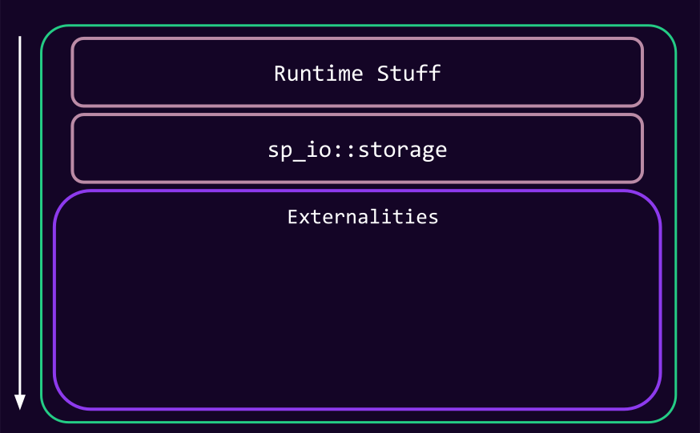
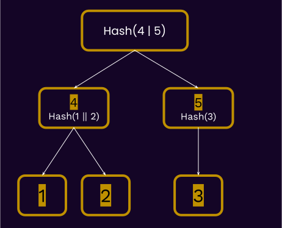
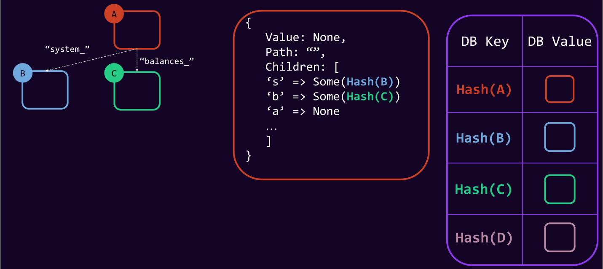
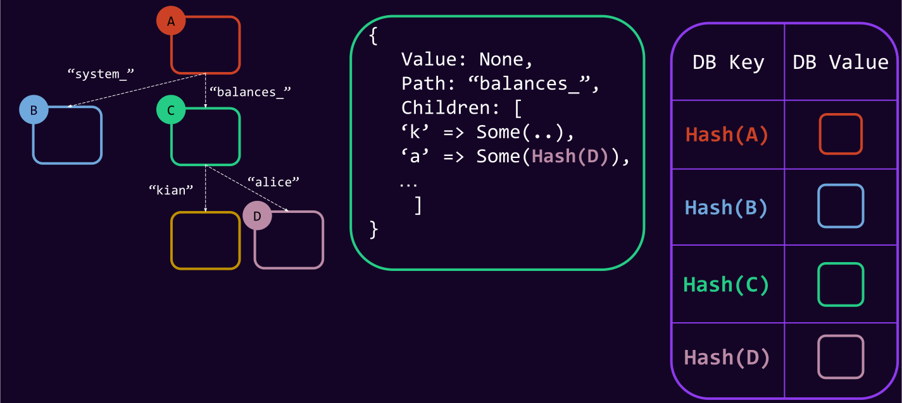
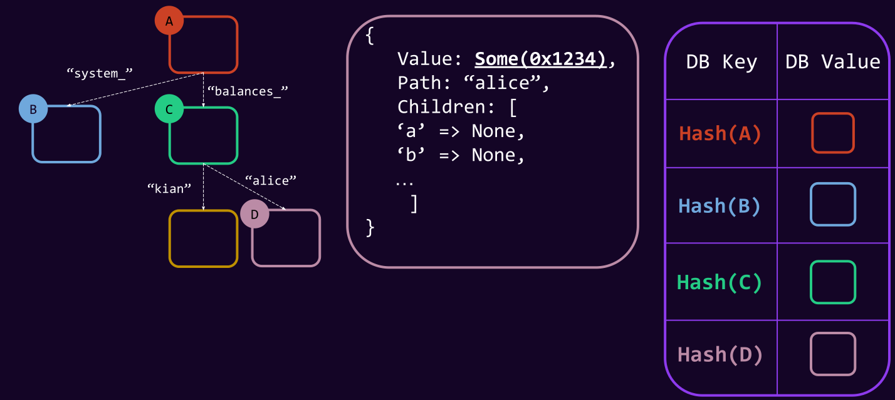
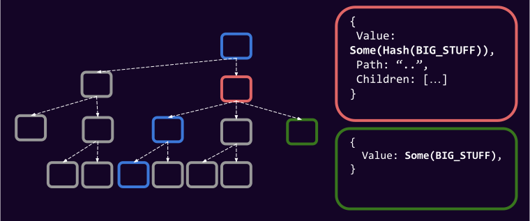
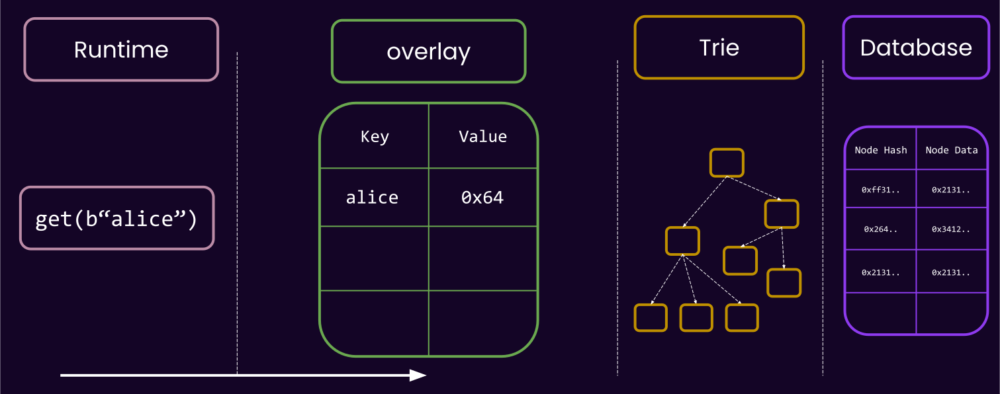
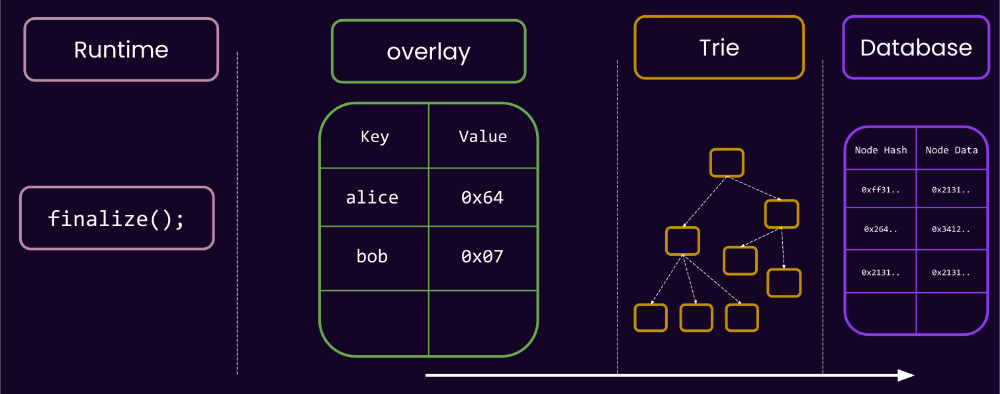
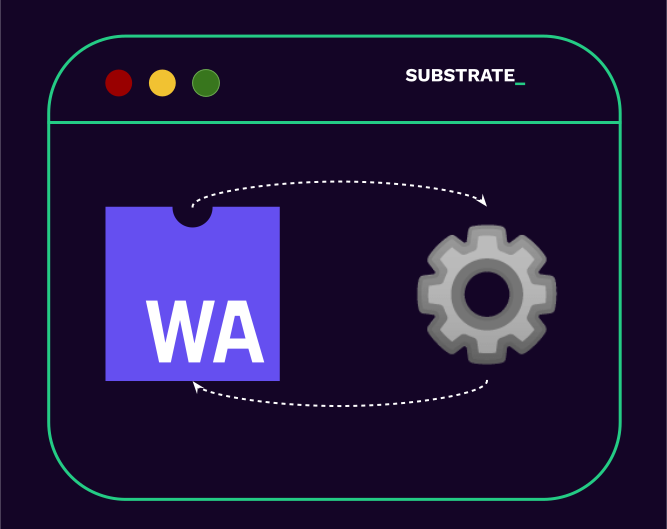
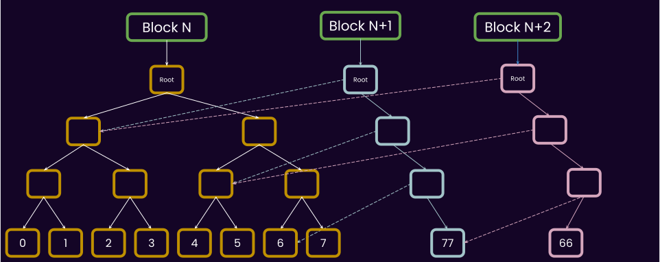

# Substrate Storage

---

## Substrate Storage: Key Value


---v

### Substrate Storage: Key Value

- Recall that at the `sp_io` layer, you have keys and values.

- `sp_io::storage::get(vec![8, 2])`;
- `sp_io::storage::set(vec![2, 9], vec![42, 33])`;

> Database is a _untyped_, _opaque_, **key-value** storage, stored **per-block**.

---v

### Substrate Storage: Key Value

- In Substrate, a type needs to provide the environment in which host functions are provided, and can be executed.

> We call this an "externality environment", represented by [`trait Externalities`](https://paritytech.github.io/substrate/master/sp_externalities/trait.Externalities.html).

By convention, an externality has a "**backend**" that is in charge of dealing with storage.

---v

### Substrate Storage: Key Value

```rust
sp_io::TestExternalities::new_empty().execute_with(|| {
  sp_io::storage::get(..);
});
```

---v

### Substrate Storage: Key Value



---v

### Substrate Storage: Key Value

- How about a key-value storage externality? why not? 🙈

- "_Storage keys_" directly map to _database keys_.
- O(1) Read and write.
- Hash all the data once to get a root.

---v

### Substrate Storage: Key Value


---v

### Substrate Storage: Key Value

- "_Storage keys_" (whatever you pass to `sp_io::storage`) directly maps to "_database keys_".
- O(1) read and write.
- Hash all the data once to get a root.

Notes:

Good time to hammer down what you mean by storage key and what you mean by database key.

literally imagine that in the implementation of `sp_io::storage::set`, we write it to a key-value database.

---v

### Substrate Storage: Key Value

- If alice only has this root, how can I prove to her how much balance she has?

> Alice is representing a light client, I represent a full node.

THE WHOLE DATABASE 😱.

<!-- .element: class="fragment" -->

---v

### Substrate Storage: Key Value

- Moreover, if you change a single key-value, we need to re-hash the whole thing again to get the updated state root 🤦.

---

## Substrate Storage: Merklized

- This brings us again to why we like to "merkelize" things.
- But before going further, a recap of merkle trees and other keywords

---v

### Substrate Storage: Merklized

> Substrate uses a base-16, patricia (radix) merkle trie.

---v

<pba-cols>
<pba-col>



</pba-col>
<pba-col>

- Merkle tree.
- Typically contains values at leafs.

</pba-col>
</pba-cols>

---v

<pba-cols>
<pba-col>


</pba-col>
<pba-col>

- Trie.
- Assuming only leafs have data, this is encoding:

<table>
<tr>
  <td> "ac" => 0x1234</td>
</tr>
<tr>
  <td> "ad" => 0x1234</td>
</tr>
<tr>
  <td> "be" => 0x1234</td>
</tr>
</table>

</pba-col>
</pba-cols>

---v

<pba-cols>
<pba-col>


</pba-col>
<pba-col>

- Radix Tree.
- Less nodes to encode the same data.

<table>
<tr>
  <td> "ac" => 0x1234</td>
</tr>
<tr>
  <td> "ad" => 0x1234</td>
</tr>
<tr>
  <td> "be" => 0x1234</td>
</tr>
</table>

</pba-col>
</pba-cols>

---v

### Substrate Storage: Merklized

> Substrate uses a base-16, patricia (radix) merkle trie.

---v

### Substrate Storage: Merklized

- We take the **storage key**, and make it be the path on a trie.
- Then we store the **trie nodes**, referenced by **their hash**, in the main database.

<br/>

- Some nodes contain value, some nodes are just "connectors".
- Storage key: whatever you pass to `sp_io`.

Notes:

- https://en.wikipedia.org/wiki/Merkle_tree
- https://en.wikipedia.org/wiki/Radix_tree
- https://en.wikipedia.org/wiki/Trie

Namely:

> The data structure was invented in 1968 by Donald R. Morrison, with whom it is primarily associated, and by Gernot Gwehenberger.

> Donald Knuth, pages 498-500 in Volume III of The Art of Computer Programming, calls these "Patricia's trees", presumably after the acronym in the title of Morrison's paper: "PATRICIA - Practical Algorithm to Retrieve Information Coded in Alphanumeric". Today, Patricia tries are seen as radix trees with radix equals 2, which means that each bit of the key is compared individually and each node is a two-way (i.e., left versus right) branch.

---v

### Substrate Storage: Merklized


---v

### Substrate Storage: Merklized

- Storage key: `balances_alice`. **1** operation in `sp-io`.
- **Multiple** Database key reads: Hash( `<trie-node>` ).

Notes:

how many do we mean by "multiple"? depends on how the trie is structured, and the radix order.

---v

### Substrate Storage: Merklized

- We know the state-root at a given block `n`.
- assume this is a base-26, patricia trie. English alphabet is the key-scope.
- Let's see the steps needed to read `balances_alice` from the storage.

---v



---v



---v



---v


---v

### Substrate Storage: Merklized

- If alice only has this root, how can I prove to her how much balance she has?

---v


Notes:

Dark blue are the proof, light blue's hashes are present.

---v

### Substrate Storage: Merklized Recap

<div>

- Storage key (whatever you pass to `sp_io`) is the path on the trie.

</div>
<!-- .element: class="fragment" -->

<div>

- Storage key is arbitrary length.
</div>
<!-- .element: class="fragment" -->

<div>

- Intermediary (branch) nodes could contain values.
  - `:code` contains some value, `:code:more` can also contain value.

</div>

<!-- .element: class="fragment" -->

<div>

- Storage Key != Database Key. `Hash<Trie Nodes>` are the keys in the database.

</div>
<!-- .element: class="fragment" -->

---

## WAIT A MINUTE... 🤔

- Two common scenarios that merkle proofs are kinda unfair:
  - If the one of the parent nodes has some large data.
  - If you want to prove the deletion of a leaf node.

---v


---v

## WAIT A MINUTE... 🤔

- All solved by "`state-version = 1`".

```rust
struct RuntimeVersion {
  ...
  state_version: 0,
}
```

---v

## WAIT A MINUTE... 🤔

New "tie format" 🌈:

- All data containing more than 32 bytes are replaced with their hash.
- The (larger than 32 bytes) value itself stored in the database under this hash.

---v



Notes:

What is the ramification of this?

Both read and write have an extra step now, but proof are easier.

---

### Substrate Storage: _Real_ Merklized

- The Trie-node format I showed is a massive simplification.
- Instead of alphabet, we use the base-16 representation of everything.

> Base-16 (Patricia) Merkle Trie.

- `System` -> `73797374656d`
- `:code` -> `3a636f646500`

---v

### Substrate Storage: Base-16 Merklized


Which one is better for read/write, proof, and node size?

Notes:

First glance, the radix-8 seems better: you will typically have less DB access to reach a key.
For example, with binary, with 3 IO, we can reach only 8 items, but with radix-8 512.

So why should not chose a very wide tree? because the wider you make the tree, the bigger each node gets, because it has to store more hashes. At some point, this start to screw with both the proof size and the cost of reading/writing/encoding/decoding all these nodes.

---v

### Substrate Storage: Base-16 Merklized

- base-2: Proof contains less sibling hashes, but more intermediary nodes, more IO while read and write.
- base-8: Proof has more sibling hashes, less intermediary nodes.

✅ 16 has been benchmarked and studies years ago as a good middle-ground.

Notes:

Anyone interested in blockchain and research stuff should look into this.

---

### Unbalanced Tree


---v

### Unbalanced Tree

- Unbalanced tree means unbalanced performance. An attack vector, if done right.
  - under-estimate weight/gas etc.
- You as the runtime developer must ensure that you use the right keys.
- This is particularly an issue if an end user can control where they can insert into the trie!

> More about this in FRAME storage, and how it is prevented there

Notes:

The main prevention is using a cryptographically secure hash function on the frame side.

---

## Substrate Storage: The Updated Picture


---

## Substrate Storage: The Role of FRAME

- All FRAME does is hashing keys, really.
- Done right, the tree should be balanced because of hashing.

---

## WAIT A MINUTE... 🤔

- We should of course think of caching...
- We rarely care about state root and all the trie shenanigans before the end of the block...

> A block-scoped cache for storage.

<!-- .element: class="fragment" -->

Notes:

I am pretty sure that when importing block, we have 1 runtime api call and it has one `Ext` and ergo
one one `Overlay`. When creating a block, I am not sure. Either way, that's not the main point.

---

## Substrate Storage: Overlay

- Is a cache layer outside of the Runtime.
- It works **based on key-values**, **not trie-format**.

---v

## Substrate Storage: Overlay

- Almost identical semantic to your CPU cache:
  - Once you read a value, it stays here, and can be re-read for cheap.
  - Once you write a value, it will only be written here.
    - It can be read for cheap.
  - All writes are flushed at the end of the runtime api call.

---v


---v


---v



---v


---v


---v



---v

### Substrate Storage: Overlay

<pba-cols>

<pba-col>

- Cheap != Free

```rust
let temp = sp_io::storage::get(b"bar");

// is a lot faster!
let cached = sp_io::storage::get(b"bar");
// but not as fast as this!
let in_memory = temp;
```

</pba-col>
<pba-col>



</pba-col>

</pba-cols>

Notes:

- A deletion is basically a write.

---v

### Substrate Storage: Overlay

- The overlay is also able to spawn child-overlays, know as "_storage layer_".
- Useful for having a _transactional_ block of code.

```rust
// spawn a new layer.
with_storage_layer(|| {
    let foo = sp_io::storage::read(b"foo");
    sp_io::storage::set(b"bar", foo);

    if cond {
        Err("this will be reverted")
    } else {
        Ok("This will be commit to the top overlay")
    }
})
```

Notes:

- implement with zero-copy. So, the size of values is not so important, it is more about the number.

---v


---v


---v

### Substrate Storage: Overlay

- There is a limit to how many nested layers you can spawn
- It is not free, thus it is attack-able.

```rust
with_storage_layer(|| {
    let foo = sp_io::storage::read(b"foo");
    with_storage_layer(|| {
        sp_io::storage::set(b"foo", b"foo");
        with_storage_layer(|| {
            sp_io::storage::set(b"bar", foo);
            with_storage_layer(|| {
                sp_io::storage::set(b"foo", "damn");
                Err("damn")
            })
            Ok("what")
        })
        Err("the")
    });
    Ok("hell")
})
```

---v

### Substrate Storage: Overlay

> What if I call `sp_io::storage::root()` in the middle of the block?

- Can the overlay respond to this?

Notes:

NO! overlay works on the level on key-values, ot knows nothing of trie nodes, and to compute the root we have to go to the trie layer and pull a whole lot of data back from the disk and build all the nodes etc. etc.

---v

### Substrate Storage: Word on Caches

- There are more caches in the trie layer as well.
- I am too afraid to talk about them though 😱.

````rust
./substrate --help | grep cache

### Substrate Storage: Word on Caches

- But this guy can:

<iframe width="1200" height="600" src="https://www.youtube.com/embed/OoMPlJKUULY" title="YouTube video player" frameborder="0" allow="accelerometer; autoplay; clipboard-write; encrypted-media; gyroscope; picture-in-picture; web-share" allowfullscreen></iframe>

---

### Substrate Storage: Final Figure


---v

### Substrate Storage

There are multiple implementations of `Externalities`:

- [`TestExternalities`](https://paritytech.github.io/substrate/master/sp_state_machine/struct.TestExternalities.html):
  - `Overlay`
  - `TrieDb` with `InMemoryBackend`
- [`Ext`](https://paritytech.github.io/substrate/master/sp_state_machine/struct.Ext.html) (the real thing 🫡)
  - `Overlay`
  - `TrieDb` with a real database being the backend

---v

### Substrate Storage

- Recall: Any code accessing host functions needs to wrapped in something that implements
  `Externalities`

```rust
// ❌
let x = sp_io::storage::get(b"foo");

// error:
// thread '..' panicked at '`get_version_1` called outside of an Externalities-provided environment.'
````

```rust
// ✅
SomeExternalities.execute_with(|| {
  let x = sp_io::storage::get(b"foo");
});
```

---

## State Pruning

- Recall that each block has its own associated state.
- So, technically, each block has a full trie associated with it?

Surely not.

<!-- .element: class="fragment" -->

---v

## State Pruning

- Only trie nodes that are updated from one block to the other are created as new DB Keys.
- For the unchanged ones, we only reference the existing one.

---v

### State Pruning


---v

### State Pruning


---v

### State Pruning


---v

### State Pruning


---v

## State Pruning

- If you store some data onchain that does not change frequently, it is not much extra burden on the archive nodes of the network 🧠.

---

## Child Trees


---v

### Child Trees

- Stored on a different DB Column (async-ish bulk deletion).
- Most importantly, alternative trie formats.

---

## Trie Format Matters!

- Recall that in our "trie walking", we took the state root, and got the root node from the DB.
- The state root of any substrate-based chain, including Polkadot, is the hash of the "Trie Node".

> Trie format matters! and therefore it is part of [the polkadot spec](https://spec.polkadot.network).

Notes:

Meaning, if another client wants to sync polkadot, it should know the details of the trie format.

---

## Additional Resources! 😋

> Check speaker notes (click "s" 😉)

Notes:

- Shawn's deep dive: https://www.shawntabrizi.com/substrate/substrate-storage-deep-dive/

- Basti's talk on Trie caching: https://www.youtube.com/watch?v=OoMPlJKUULY

- About state version:

  - https://github.com/paritytech/substrate/pull/9732
  - https://github.com/paritytech/substrate/discussions/11824

- An "old but gold" read about trie in Ethereum: https://medium.com/shyft-network/understanding-trie-databases-in-ethereum-9f03d2c3325d

- On optimizing substrate storage proofs: https://github.com/paritytech/substrate/issues/3782
- Underlying trie library maintained by Parity: https://github.com/paritytech/trie

- https://github.com/paritytech/trie/

## Post Lecture

- Deletion proofs is a big confusion. Explain it better.
- A typical merkle proof tutorial in the internet will show different nodes than the path that we
  show here as the proof. They are the same things, but different perspective. Explain better.
- Perhaps talk a bit more about the fact that small proof size is also relevant in Polkadot for PoV.
- There was some small mistakes in the tree-walking figures
- Double check if the inner hashing will move the big_stuff just to db, or to a new trie node that's
  stored at the hash?
