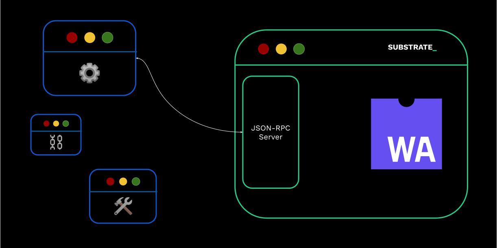

# Interacting With a Substrate Blockchain

---

## Interacting With a Substrate Blockchain



note: almost all external communication happens over JSPN-RPC, so let's take a closer look.

---

## JSON-RPC

> JSON-RPC is a remote procedure call protocol encoded in JSON. It is similar to the XML-RPC
> protocol, defining only a few data types and commands.

---v

### JSON-RPC

- Nowadays, mostly version 2 is used.
- Request

```json
{ "jsonrpc": "2.0", "method": "subtract", "params": { "minuend": 42, "subtrahend": 23 }, "id": 3 }
```

- Response, if `id` is provided

```json
{ "jsonrpc": "2.0", "result": 19, "id": 3 }
```

---v

### JSON-RPC

- Entirely transport agnostic.
- Substrate based chains expose both `ws` and `http` (or `wss` and `https`, if desired).

> with `--ws-port` and `--rpc-port`, 9944 and 9934 respectively.

Notes:

```sh
# Kusama endpoint
echo '{ "jsonrpc":"2.0", "id":1,  "method":"system_chain" }' | websocat -B 99999999 ws://34.79.74.54:9924
```

---v

### JSON-RPC

- JSON-RPC methods are conventionally written as `scope_method`

  - e.g. `rpc_methods`, `state_call`

- <!-- .element: class="fragment" --> `author`: for submitting stuff to the chain.
- <!-- .element: class="fragment" --> `chain`: for retrieving information about the _blockchain_ data.
- <!-- .element: class="fragment" --> `state`: for retrieving information about the _state_ data.
- <!-- .element: class="fragment" --> `system`: information about the chain, not to be confused with `frame-system`.
- <!-- .element: class="fragment" --> `rpc`: information about the RPC endpoints.

note:

recall:

https://paritytech.github.io/substrate/master/sc_rpc_api/index.html
https://paritytech.github.io/substrate/master/sc_rpc/index.html

The full list can also be seen here: https://polkadot.js.org/docs/substrate/rpc/

---vs

### JSON-RPC

- Let's look at a few examples:

- `system_name`, `system_chain`, `system_chainType`, `system_health`, `system_version`, `system_nodeRoles`, `rpc_methods`, `state_getRuntimeVersion`, `state_getMetadata`

NOTES

```sh
# Polkadot public endpoint
wscat -c wss://rpc.polkadot.io  -x '{"jsonrpc":"2.0", "id": 42, "method":"rpc_methods" }' | jq
```

---v

### JSON-RPC: Runtime Agnostic

- Needless to say, RPC methods are runtime agnostic. Nothing in the above tells you if FRAME is
  being used or not.
- <!-- .element: class="fragment" --> Except... metadata, to some extent.

---v

### JSON-RPC: Runtime API

- While agnostic, many RPC calls land in a runtime API.
- <!-- .element: class="fragment" -->  RPC Endpoints have an `at: Option<hash>`, runtime APIs do too, what a coincidence! 🌈
- <!-- .element: class="fragment" -->  The runtime can extend more custom RPC methods, but the new trend is to move toward using
  `state_call`.

---v

### JSON-RPC

- Some PRC methods are unsafe 😱.

---v

### JSON-RPC

RPC-Server vs. Light Client

---

### JSON-RPC: Application

- On top of `SCALE` and `JSON-RPC`, a large array of libraries have been built.
- `PJS-API` / `PJS-APPS`
- `capi`
- `SubXT`
- Any many more!

note:

https://github.com/JFJun/go-substrate-rpc-client
https://github.com/polkascan/py-substrate-interface
more here: https://project-awesome.org/substrate-developer-hub/awesome-substrate

---

### JSON-RPC: Mini Activity

- But the simplest application of any JSON-RPC Library is `curl` and `wscat`/`websocat`!

1. Find the genesis hash of Kusama via RPC.
2. Find the first 4 bytes of the current code of Kusama.
3. Find the first 4 bytes of the code Kusama at block 1 million.
4. The block number is stored under `twox(System) ++ twox(Number)`.

You have 10 minutes!

Notes:

```sh
# Kusama
echo '{"jsonrpc":"2.0", "id":72, "method":"chain_getBlockHash", "params": ["0x0"] }' | websocat -B 99999999 ws://34.79.74.54:9944 | jq
echo '{"jsonrpc":"2.0", "id":72, "method":"chain_getBlock", "params": ["0x91b171bb158e2d3848fa23a9f1c25182fb8e20313b2c1eb49219da7a70ce90c3"] }' | websocat -B 99999999 ws://34.79.74.54:9944 | jq

echo '{"jsonrpc":"2.0", "id":72, "method":"state_getStorage", "params": ["0x3a636f6465"] }' | websocat -B 99999999  ws://34.79.74.54:9944 | head -c 100

System: 0x26aa394eea5630e07c48ae0c9558cef7
Number: 0x02a5c1b19ab7a04f536c519aca4983ac
Key: 0x26aa394eea5630e07c48ae0c9558cef702a5c1b19ab7a04f536c519aca4983ac
```

---

## Polkadot JS API

A brief introduction.

Excellent tutorial at: http://polkadot.js.org/docs

---v

## Polkadot JS API


---v

### PJS: Overview

- `api.registry`
- `api.rpc`

---v

### PJS: Overview

Almost everything else basically builds on top of `api.rpc`.

- `api.tx`
- `api.query`
- `api.consts`
- `api.derive`

Please revise this while you learn FRAME, and they will make perfect sense!

---v

### PJS: Workshop 🧑‍💻

note:

TODO: double check this.

```ts
import { ApiPromise, WsProvider } from "@polkadot/api";
const provider = new WsProvider("wss://rpc.polkadot.io");
const api = await ApiPromise.create({ provider });

api.stats;
api.isConnected;
 // where doe this come from?
api.runtimeVersion;

// where does this come from?
api.registry.chainDecimals;
api.registry.chainTokens;
api.registry.chainSS58;

// where does this come from?
api.registry.metadata;
api.registry.metadata.pallets.map(p => p.toHuman());

api.registry.createType();

api.rpc.chain.getBlock()

api.rpc.system.health()
await api.rpc.system.version()

await api.rpc.state.getRuntimeVersion()
await api.rpc.state.getPairs("0x")

await api.rpc.state.getKeysPaged("0x", 100)
await api.rpc.state.getStorage()
https://polkadot.js.org/docs/substrate/rpc#getstoragekey-storagekey-at-blockhash-storagedata
await api.rpc.state.getStorageSize("0x3A636F6465"),
```

A few random other things:

```ts
import * as BN from "bn.js";
api.createType("Balance", new Uint8Array([1, 2, 3, 4]));

import { blake2AsHex, xxHashAsHex } from "@polkadot/util-crypto";
blake2AsHex("Foo");
xxHashAsHex("Foo");
```

---

## Light Client

BOOM, Simple as that:

```ts
import { ScProvider, WellKnownChain } from "@polkadot/rpc-provider/substrate-connect";
import { ApiPromise } from "@polkadot/api";

const provider = new ScProvider(WellKnownChain.polkadot);
await provider.connect();
const api = await ApiPromise.create({ provider });
```

---

## SubXT


---

## Additional Resources! 😋

> Check speaker notes (click "s" 😉)

Notes:

- see "Client Libraries" here: https://project-awesome.org/substrate-developer-hub/awesome-substrate
- https://paritytech.github.io/json-rpc-interface-spec/introduction.html
- Full subxt guide: https://docs.rs/subxt/latest/subxt/book/index.html


TODO: further assignment idea:

- build a custom chain spec, then run it

- Use `curl` and such to interact.
- Connect PJS apps.
- Write a few simple lines of TS to interact.
- Write a few lines of Rust with SubXT to interact.

Tricky, as we would be using a FRAME based runtime in order to get some metadata out of it.
