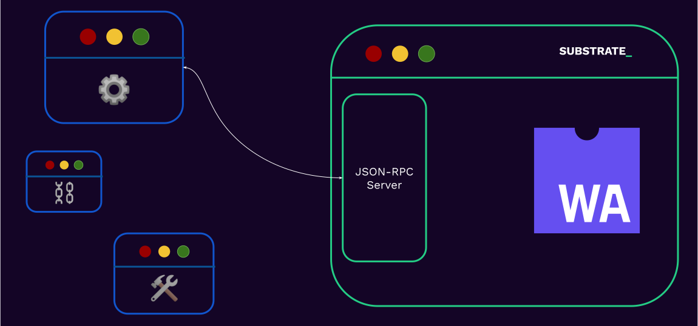

# Interacting With a Substrate Blockchain

---

## Before we start

- Clone substrate node template

```sh
git clone https://github.com/substrate-developer-hub/substrate-node-template`
```

<br/>

- Compile your node

```sh
cargo build --release
```

---

## Interacting With a Substrate Blockchain

> How does a user or an application interact with a blockchain?

---v

## Interacting With a Substrate Blockchain

- Usually they connect to a public RPC server, i.e. a substrate node that exposes its RPC interface publicly.

<br/>

- Run your own node.

<!-- .element: class="fragment" -->

---v

## Interacting With a Substrate Blockchain



---

## JSON-RPC

> JSON-RPC is a remote procedure call protocol encoded in JSON. It is similar to the XML-RPC
> protocol, defining only a few data types and commands.

---v

### JSON-RPC

```json
{
  "jsonrpc": "2.0",
  "method": "subtract",
  "params": {
    "minuend": 42,
    "subtrahend": 23
  },
  "id": 3
}
```

<br/>

```json
{
  "jsonrpc": "2.0",
  "result": 19,
  "id": 3
}
```

<!-- .element: class="fragment" -->

---v

### JSON-RPC

- Entirely transport agnostic.
- Substrate based chains expose both `websocket` and `http` (or `wss` and `https`, if desired).

Notes:

- You could choose which port to run the ws or http server on by using the flags `--ws-port` and `--rpc-port`
  respectively. By default, port 9944 is used.

---v

### JSON-RPC

The RPC methods that a substrate node exposes are scoped and has the pattern `"<scope>_<method>"`.

```sh
 wscat \
  -c ws://localhost:9944 \
  -x '{"jsonrpc":"2.0", "id": 42, "method":"rpc_methods" }' \
  | jq
```

---v

### JSON-RPC: Scopes

- &shy;<!-- .element: class="fragment" --> `author`: for submitting extrinsic to the chain.
- &shy;<!-- .element: class="fragment" --> `chain`: for retrieving information about the _blockchain_ data.
- &shy;<!-- .element: class="fragment" --> `state`: for retrieving information about the _state_ data.
- &shy;<!-- .element: class="fragment" --> `system`: information about the chain.
- &shy;<!-- .element: class="fragment" --> `rpc`: information about the RPC endpoints.

Notes:
recall:

https://paritytech.github.io/substrate/master/sc_rpc_api/index.html
https://paritytech.github.io/substrate/master/sc_rpc/index.html

The full list can also be seen here: https://polkadot.js.org/docs/substrate/rpc/

---

### Workshop: Intro

- Transfer some tokens from Alice to Charlie.

<br/>

- We will cheat a bit and take help sometimes from [Polkadot.js app](https://polkadot.js.org/apps/#/explorer).

<!-- .element: class="fragment" -->

Notes:

- When we start up a dev chain, some well known accounts are already minted some balance at genesis. Alice and Charlie
  are well known accounts.
- The parts we cheat is because we will need to know more about FRAME to be able to calculate some storage keys.

---v

### Workshop: Spin up your node

- Check out cli docs

```sh
./target/release/node-template --help
```

<br/>

- Spin up your dev node.

```sh
./target/release/node-template --chain=dev --force-authoring --alice --tmp
```

<!-- .element: class="fragment" -->

Notes:

- What does each flag do? What other flag can you use?

---v

### Workshop: Check balance

- Query current balance of Charlie.
- Storage key where Charlie's balance is stored

```
0x26aa394eea5630e07c48ae0c9558cef7b99d880ec681799c0cf30e8886371da9b0edae20838083f2cde1c4080db8cf8090b5ab205c6974c9ea841be688864633dc9ca8a357843eeacf2314649965fe22
```

- We will use `state_getStorage` to query balance.

```sh
wscat \
  -c ws://localhost:9944 \
  -x '{"jsonrpc":"2.0", "id": 42, "method":"state_getStorage", "params": [""] }' \
  | jq
```

Notes:
You will learn how the storage key is calculated in FRAME based substrate chains in the FRAME module.

---v

### Workshop: Transfer some tokens

- Take PJS help to get the signed extrinsic.
- Use the following command to submit the extrinsic.

```sh
wscat \
  -c ws://localhost:9944 \
  -x '{"jsonrpc":"2.0", "id": 42, "method":"author_submitExtrinsic", "params": [""] }' \
  | jq
```

<br/>

- Check balance now.
- What happens if you execute the same payload again?

<!-- .element: class="fragment" -->

Notes:
Let students do the second part themselves.

---v

### Workshop: Metadata

- Substrate exposes type information using metadata.

```sh
wscat \
  -c ws://localhost:9944 \
  -x '{"jsonrpc":"2.0", "id": 42, "method":"state_getMetadata" }' \
  | jq
```

<br/>

- This itself is Scale Encoded. See [frame-metadata](https://github.com/paritytech/frame-metadata).
- Derive type of Balance using this metadata.

<!-- .element: class="fragment" -->

Notes:

- Metadata help users and apps understand the type information. Remember with SCALE, type information is lost.
- [Metadata](https://hackmd.io/@ak0n/rJUhmXmK6) with most details stripped off.
- Read more about
  metadata: https://docs.substrate.io/build/application-development/#exposing-runtime-information-as-metadata.
- Can also use https://www.shawntabrizi.com/substrate-js-utilities/codec/ to decode balance with the following custom
  type

```json
{
  "Balance": {
    "nonce": "u32",
    "consumers": "u32",
    "providers": "u32",
    "sufficients": "u32",
    "data": {
      "free": "u128",
      "reserved": "u128",
      "frozen": "u128",
      "flags": "u128"
    }
  }
}
```

---v

### Workshop: Decoding balance

- Use https://www.shawntabrizi.com/substrate-js-utilities/codec/ to decode balance.
- Use the following balance struct

```json
{
  "Balance": {
    "nonce": "u32",
    "consumers": "u32",
    "providers": "u32",
    "sufficients": "u32",
    "data": {
      "free": "u128",
      "reserved": "u128",
      "frozen": "u128",
      "flags": "u128"
    }
  }
}
```

---v

### Workshop: Versions

- Find runtime version of the polkadot and westend chain `state_getRuntimeVersion`.
- Find node version of the polkadot and westend chain `system_version`.
- Change RPC provider and see if any of the above value changes?

Notes:

- `wscat -c wss://polkadot-rpc.dwellir.com -x '{"jsonrpc":"2.0", "id":1, "method":"state_getRuntimeVersion"}' | jq`.
- `wscat -c wss://polkadot-rpc.dwellir.com -x '{"jsonrpc":"2.0", "id":1, "method":"system_version"}' | jq`.
- For runtime version, you read `specVersion` : `1,005,000` as `1.5.0`.
- Polkadot Telemetry: https://telemetry.polkadot.io/.

---

### JSON-RPC: Application

- On top of `SCALE` and `JSON-RPC`, a large array of libraries have been built.

- &shy;<!-- .element: class="fragment" --> `PJS-API` / `PJS-APPS`
- &shy;<!-- .element: class="fragment" --> `subxt`
- &shy;<!-- .element: class="fragment" --> Any many more!

Notes:

https://github.com/JFJun/go-substrate-rpc-client
https://github.com/polkascan/py-substrate-interface
more here: https://project-awesome.org/substrate-developer-hub/awesome-substrate

---

### JSON-RPC: Mini Activity

In Kusama:

- Find the genesis hash..
- Number of extrinsics at block 10,000,000.
- The block number is stored under `twox128("System") ++ twox128("Number")`.
    - Find it now, and at block 10,000,000.

<br/>

- Refer to the "Substrate; Show Me The Code" lecture to find the right RPC endpoints.
- You have 15 minutes!

Notes:

```sh
# 10,000,000 in hex
printf "%x\n" 10000000
# Genesis hash
wscat -c wss://kusama-rpc.polkadot.io -x '{"jsonrpc":"2.0", "id":72, "method":"chain_getBlockHash", "params": ["0x0"] }' | jq
# Hash of the block at height 10,000,000
wscat -c wss://kusama-rpc.polkadot.io -x '{"jsonrpc":"2.0", "id":72, "method":"chain_getBlockHash", "params": ["0x989680"] }' | jq
# The block at height 1,000,000
wscat -c wss://kusama-rpc.polkadot.io -x '{"jsonrpc":"2.0", "id":72, "method":"chain_getBlock", "params": ["0xdcbaa224ab080f2fbf3dfc85f3387ab21019355c392d79a143d7e50afba3c6e9"] }' | jq

# `0x26aa394eea5630e07c48ae0c9558cef702a5c1b19ab7a04f536c519aca4983ac` now.
wscat -c wss://kusama-rpc.polkadot.io -x '{"jsonrpc":"2.0", "id":72, "method":"state_getStorage", "params": ["0x26aa394eea5630e07c48ae0c9558cef702a5c1b19ab7a04f536c519aca4983ac"] }' | jq
# `0x26aa394eea5630e07c48ae0c9558cef702a5c1b19ab7a04f536c519aca4983ac` at block 1,000,000.
wscat -c wss://kusama-rpc.polkadot.io -x '{"jsonrpc":"2.0", "id":72, "method":"state_getStorage", "params": ["0x26aa394eea5630e07c48ae0c9558cef702a5c1b19ab7a04f536c519aca4983ac", "0xdcbaa224ab080f2fbf3dfc85f3387ab21019355c392d79a143d7e50afba3c6e9"] }' | jq
```

Notice that this number that we get back is the little endian (SCALE) encoded value that we passed in at first.

---

## `subxt`

- Something analogous to `PJS` for Rust.
- The real magic is that it generates the types by fetching the metadata at compile time, or linking
  it statically.
- ..It might need manual updates when the code, and therefore the metadata changes.

Notes:
Listen to James Wilson introducing subxt: https://www.youtube.com/watch?v=aFk6We_Ke1I
---

## Additional Resources! 😋

> Check speaker notes (click "s" 😉)

Notes:

- see "Client Libraries" here: https://project-awesome.org/substrate-developer-hub/awesome-substrate
- https://paritytech.github.io/json-rpc-interface-spec/introduction.html
- Full subxt guide: https://docs.rs/subxt/latest/subxt/book/index.html
