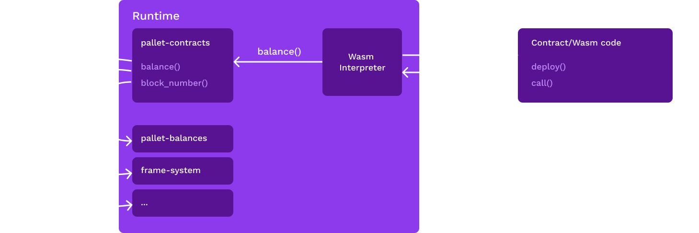
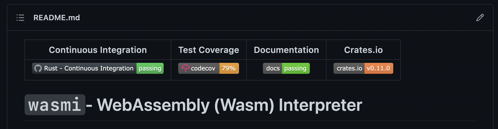

# `pallet-contracts`

## _Module 6, Lecture 5.2_

Notes:

- We have learned why smart contracts are useful and why we want to have them in out blockchain.
- In order to offer this functionality we need to have a piece of software in our runtime that executes them
- Substrate includes `pallet-contracts` which executes WebAssembly (wasm) based smart contracts
- WebAssebmly smart contracts only refer to the bytecode used to express the contracts
- There are a lot of different ways you could implement a wasm based smart contract platform
- `pallet-contracts` is one opiniated way of doing this. It stays purposefully close to the EVM way
    of doing this (synchronous cross contract calls) while differentiating itself in some key areas.
  - We will learn about this in the next chapter

---

<div class="flex-container">
<div class="left text-right"> <!-- Gotcha: You Need an empty line to render MD inside <div> -->

<!-- TODO: add a good circularly cropped headshot of ou to the `assets/profile` folder  -->


</div>
<div style="margin-top:130px" class="right text-left"> <!-- Gotcha: You Need an empty line to render MD inside <div> -->

### Alexander Theißen

<!-- .element: style="margin-bottom: -30px;" -->

#### _Core Developer @ Parity Technologies_

<!-- .element: style="margin-left: 20px;" -->

- With Parity since early 2020
- Leads the smart contract execution team
- Works on pallet-contracts

[Github](https://github.com/athei) // [LinkedIn](https://www.linkedin.com/in/athei/)

</div>
</div>

---

### Outline

1. [Pre-requisites](#pre-requisites)
2. [Architecture of pallet-contracts](#architecture-of-pallet-contracts)
3. [Exercise: Your first contract](#exercise-your-first-contract)
4. [Contract Execution](#contract-execution)
5. [Storage Bloat](#storage-bloat)
6. [Contracts on parachains](#contracts-on-parachains)
7. [Conclusion](#conclusion)
8. [Next Steps](#next-steps)
9. [References](#references)

---v

## Pre-requisites

No background in WebAssembly is necessary. However, the following are expected:

- General idea how a substrate blockchain and consensus works
- Knowledge of what a virtual machine is
- Familiarity with the concept of weight
- Knowledge of how smart contracts work on Ethereum

Notes:

In preperation for the exercise:

- Have 'wabt' installed so you have the wat2wasm command line util
  - macOS: `brew install wabt`
  - ubuntu: `apt install wabt`
- Download latest substrate-contracts-node from [here](https://github.com/paritytech/substrate-contracts-node/releases)

---v

### _At the end of this lecture, you will be able to:_

- Understand how WebAssembly is used to define smart contracts
- Handcode a contract in WebAssembly
- Understand how `pallet-contracts` executes smart contracts
- Understand how storage bloat can be tackled
- Understand why having smart contracts in a sharded environment is challenging
  
---

## WebAssembly


WebAssembly (sometimes abbreviated Wasm) defines a portable binary-code format and a corresponding text format for executable programs as well as software interfaces for facilitating interactions between such programs and their host environment.

[Easy to understand spec](https://webassembly.github.io/spec/core/intro/index.html)

Notes:

- In order to understand how WebAssembly (abbreviated Wasm) contracts are constructed we just
  need to understand the general concept. No detailed knowledge is required.
- However, because of its generality it can be used in other domains.
- It is usally not written by hand but generated by a compiler. In our case: Rust.
  - Other languages exist targeting `pallet-contracts` and hence Wasm
    - [Solidity](https://github.com/hyperledger-labs/solang)
    - [Assembly Script](https://github.com/ask-lang/ask)

---v

### Minimal example

```Rust
fn factorial(n: u64) -> u64 {
  if n == 0 {
    1
  } else {
    n * factorial(n - 1)
  }
}
```

```WebAssembly
(func (param i64) (result i64)
  local.get 0     ;; stack[0] := n
  i64.eqz         ;; stack[0] := stack[0] == 0 ? 1 : 0
  if (result i64)
    i64.const 1   ;; stack[0] := 1
  else
    local.get 0   ;; stack[0] := n
    local.get 0   ;; stack[0] := n
    i64.const 1   ;; stack[0] := 1
    i64.sub       ;; stack[0] := stack[1] - stack[0]
    call 0        ;; stack[0] := factorial(stack[0])
    i64.mul       ;; stack[0] := stack[1] * stack[0]
  end
)
```

Notes:

- This format is called 'wat' and is essentially a wasm assembler.
- It is compiled to a binary format like any asm would be compiled to machine code.
- As we can see here Wasm is a stack machine: Instructions push results to the stack and
  use values on the stack as arguments.
  - Register machines use registers for passing values to instructions as a primary mechanism.
- Entities within a Wasm code file (Wasm module) are enumrated by their appearence (starting with 0).
  - Calling the first defined function is accomplished via `call 0` for example
  - Parameters of functions are variables and are ordered before any variables of the function themself.
  - `local.get 0` fetches the first parameter of a function

---v

### Wat Syntax Sugar

```WebAssembly
(func (param i64) (result i64)
  local.get 0
  i64.eqz
  if (result i64)
    i64.const 1
  else
    local.get 0
    local.get 0
    i64.const 1
    i64.sub
    call 0
    i64.mul
  end
)
```

```WebAssembly
(func $factorial (param $n i64) (result i64)
  (if (result i64) (i64.eqz (local.get 0))
    (then
      (i64.const 1)
    )
    (else
      (i64.mul
        (local.get 0)
        (call $factorial (i64.sub (local.get $n) (i64.const 1)))
      )
    )
  ) 
)
```

Wat has some features that allow for better readability

Notes:

- Wat has some features that allow for better readability:
  - Stack push operations can be grouped to its consuming instruction.
  - Labels can be applied to elements.
  - Blocks can enclosed with parenthesis instead of explicit start/end instructions.
- When writing wat by hand these features are very welcome.
  - Hand written wat is mostly used for test fixtures.

---v

### Linear Memory

```Rust
fn write_to_mem(val: u64, address: &mut u64) {
    *address = val;
}
```

```WebAssembly
(func (param i64 i32)
  (i64.store (local.get 1) (local.get 0))
)
```

Wasm has byte addressable linear memory

Notes:

- In addition to the stack Wasm also has linear memory. This is byte addressable and can be manipulated
  using `x.store` and `x.load` which stored and loads primitives from and to the stack. Instructions
  never operate directly on linear memory.
  - The target address is taken from the stack and can be adjusted by passing an offset as immediate.
- The Rust compiler uses for dynamic/heap memory and to pass non primitives to functions by emulating
  an additional stack within the linear memory it allocates at some offset.
  - This emulated stack is what we would understand as stack in other architectures.
  - The Wasm stack on the other would be implemented using registers in other architectures.

---v

### Embedding Wasm

 <!-- TODO: An illustrator should prettify this  -->


- A blockchain's runtime takes the role of an "embedder"
- The embedder defines the functions a contract can call
- The embedder defines which functions need to be implemented by the contract

Notes:

- WebAssembly is meant to be embedded by other applications as a way to express logic in a platform
  independend way. The application including the WasmVM is called the "embedder". A programming
  language that is often used in a similar way is LUA. This is often called "scripting".
  "Embedder" is WebAssembly lingo and used in that way in the standard.
- The embedder here is our blockchain's runtime which wants to execute some logic defined in
  a platform independed way (contracts).
- Another popular embedder is a web browser.
- The embedder defines which functions can be called by the Wasm code and which functions it
  expects to be present in the Wasm code.

---v

### Anatomy of a Contract

```WebAssembly
(module
  ;; params: data_ptr, data_len_ptr
  (import "seal0" "seal_input" (func $seal_input (param i32 i32)))
  (import "env" "memory" (memory 1 1))

  (func (export "deploy")
    ;; execute some code on contract deployment (we do nothing)
  )

  (func (export "call")
    ;; execute some code on contract execution
    (i32.store (i32.store 4) (i32.const 256)) ;; store the length of our buffer at mem[4]
    (call $seal_input (i32.const 0) (i32.const 4)) ;; copy input buffer to mem[0]
  )
)
```

A contract is essentially a Wasm module with two exported functions

Notes:

- The standard does not only include the binary instruction set but also the way the code is
bundled for consumption.
- This bundle is called a Wasm module and is what an ELF file is to classical instruction sets. It is
  structured in that it contains different entities like functions, data and not only code that is to
  be run.
- Each embedder provides the environment. The most important properties of this environment are:
  - List of functions ("imported functions") which can be called by the Wasm blob to interact with
  the environment (e.G `seal_return`). The identifier of an import consists of a `module` and a `name`.
  Those don't have any meaning and can be chosen by the embedder completely arbitrarily. While
  any byte sequence can be used it is customary to make them human readable (ASCII). The `module`
  is usually used for namespacing.
  - List of entry points ("exported functions") the the embedder expects to be present in the Wasm
  module. The embedder would call these functions at pre-defined points in time. For example,
  `pallet-contracts` expects two functions to be present: `deploy` and `call`.
  - Input and output is passed through linear memory.
- `pallet-contracts` acts as such an embedder and hence contracts are defined in terms of a Wasm
module according to the environment defined by `pallet-contracts`.
- `seal_input` is used to copy the input buffer to local memory where it can be further processed.
  - Second argument is an in-out pointer which is used to pass in the buffer length and pass out
    the actual size of the input.
  - Execution ends with an error if the specified buffer can't fit the whole input.
  - Every function offered by pallet-contracts that the contract wants to use needs to be
    explicitly imported.

---

## Exercise: Your first contract

- You will compile a basic contract manually written in WebAssembly (wat)
- You will deploy this basic contract to a locally running node
- You will inspect the source code of this contract and try to make changes to it

---v

### Exercise instructions

```WebAssembly
(module
  (import "seal0" "seal_set_storage" (func $set_storage (param i32 i32 i32)))
  (import "seal0" "seal_get_storage" (func $get_storage (param i32 i32 i32) (result i32)))
  (import "seal0" "seal_input" (func $input (param i32 i32)))
  (import "seal0" "seal_return" (func $return (param i32 i32 i32)))
  (import "env" "memory" (memory 1 1)) ;; this gives us one page of memory (16KiB)

  ;; [0, 256)
  ;; we reserve this memory as buffer to receive data

  ;; [256, 260)
  ;; initialize memory with length of our buffer (256 in hex)
  (data (i32.const 256) "\00\00\01\00")

  (func (export "deploy")
    ;; we initialize our storage value on contract deployment to '99'
    (i32.store (i32.const 0) (i32.const 99))
    (call $set_storage
      (i32.const 512)   ;; key_ptr
      (i32.const 0)     ;; data_ptr
      (i32.const 4)     ;; data_len
    )
  )

  (func (export "call")
    ;; copy data passed to contract to mem[0]-mem[256]
    ;; it overwrites the data_len_ptr with the actual size of the buffer
    (call $input
      (i32.const 0)   ;; data_ptr
      (i32.const 256) ;; data_len_ptr
    )

    ;; The first four bytes are a 'selector' which is passed by a conforming client
    ;; according to the metadata.json. When writing contracts with ink! this metadata
    ;; file is generated automatically from the source code. The number is inversed because
    ;; wasm uses little endian.
    ;; The rest are the arguments passed.
    (if (i32.eq (i32.const 0xf2017f13) (i32.load (i32.const 0)))
      (then
        ;; this is our 'double' function

        ;; The arguments start after the selector (mem[4])
        (i32.store
          (i32.const 4) ;; overwrite value at mem[4]
          (i32.mul
            (i32.load (i32.const 4))
            (i32.const 2)
          )
        )
        ;; we just pass '512' as key ptr which is zero initialized.
        ;; hence we store our value at a key with all zeros (key is 32byte)
        (call $set_storage
          (i32.const 512)   ;; key_ptr
          (i32.const 4)     ;; data_ptr
          (i32.const 4)     ;; data_len
        )
      )
      (else
        ;; this is our 'get' function

        ;; $get_storage returns a status code which we ignore (drop)
        (drop
          (call $get_storage
            (i32.const 512) ;; key_ptr
            (i32.const 0)   ;; data_ptr
            (i32.const 256) ;; data_len_ptr
          )
        )
        ;; return the value pulled from storage to the caller
        (call $return
          (i32.const 0)   ;; flags (none needed)
          (i32.const 0)   ;; data_ptr
          (i32.const 4)   ;; data_len
        )
      )
    )
  )
)
```

Instructions in speaker notes

Try to make changes to the code when you are done

Notes:

- Make sure you have wat2wasm installed:
  - macOS: `brew install wabt`
  - ubuntu: `apt install wabt`
- Download latest substrate-contracts-node from [here](https://github.com/paritytech/substrate-contracts-node/releases)
- Fetch `doubler.wat` and `doubler.json` from the lecture material.
- Inspect `doubler.wat` (also on this slide) and try to understand what it does.
- Compile the wat file using `wat2wasm doubler.wat` (check speaker notes on how to install).
- Run `substrate-contracts-node --dev` (check speaker notes on where to get this binary).
- [Connect](https://polkadot.js.org/apps/?rpc=ws%3A%2F%2F127.0.0.1%3A9944#/contracts) to your local
  node using our contracts frontend.
- Deploy and interact with the contract. You will need two files for that:
  - `doubler.wasm`: You get that from compiling the wat file. This is the wasm code.
  - `doubler.json`: This file is provided and tells the UI how to interact with the contract.
    Auto generated when not handwriting the contract. It is like Solidities ABI file.

<!-- TODO: exercise indicator https://github.com/paritytech/polkadot-blockchain-academy/issues/67 -->

---

## Architecture of pallet-contracts

 <!-- TODO: An illustrator should prettify this  -->


---v

### Dispatchables

 <!-- TODO: An illustrator should prettify this  -->


Dispatchables are included into a block and executed by all nodes

Notes:

- Dispatchables are functions exposed by pallets than can be referenced in an signed extrinsic
  in order execute some code on-chain. For normal pallets this is fixed functionality.
  For contracts however, we can trigger execution of previously stored (also using dispatchables)
  Wasm code.
- Once it is included into the runtime it makes the following dispatchables available for
  a extrinsics (the argument list is shortened):
  - `upload_code(code: Vec<u8>)`: We differentiate between "code" and contract". This uploads a Wasm module that can be referenced by its hash in other extrinsics. It will validate, instrument and finally store the code on-chain. With code we just mean a Wasm module while a contract is an account that has state attached to it that is governed by some previously uploaded code instead of a
    private key.
  - `instantiate(code_hash: CodeHash, input: Vec<u8>, salt: Vec<u8>)`: Creates a new contract using the specified
  `code_hash`. It's state is initialized by the `deploy` function defined in its code. By branching
  on the `input` different contract instances can be instantiated from the same code.
  The contracts account id is derived deterministically:
  `hash(instantiating_account ++ code_hash ++ salt)`. Without the salt instantiating the same code
  from the same account would be impossible.
  - `call(account: AccountId, input: Vec<u8>)`: Call an existing contract. This will execute the
  `call` function exported by the contracts code.

---v

### RPCs

 <!-- TODO: An illustrator should prettify this  -->


Notes:

- RPCs are functions exposed by a node via network
- Some of them are general functions exposed by any node: (e.G `get_storage`)
- `pallet-contracts` adds additional RPC which are essentially mirrors of its dispatchables
  to allow clients (wallets, dapps) to dry-run any contract execution before submitting it
  as an extrinsic
- The main reason to do dry runs to estimate gas usage and to extract data from a contract
- For read-only contract executions a client would only call the RPC without submitting
  an extrinsic as extrinsics can't return any data
- RPCs do cannot mutate any state because they are only executed by one node as opposed to every
  node as in the case of an extrinsic submission

---v

### Configuration

```Rust
#[pallet::config]
pub trait Config: frame_system::Config {
    /// The generator used to supply randomness to contracts through `seal_random`.
    type Randomness: Randomness<Self::Hash, Self::BlockNumber>;

    /// The currency in which fees are paid and contract balances are held.
    type Currency: ReservableCurrency<Self::AccountId>;

    /// Filter that is applied to calls dispatched by contracts.
    ///
    /// Use this filter to control which dispatchables are callable by contracts.
    /// This is applied in **addition** to [`frame_system::Config::BaseCallFilter`].
    /// It is recommended to treat this as a whitelist.
    ///
    /// # Stability
    ///
    /// The runtime **must** make sure that all dispatchables that are callable by
    /// contracts remain stable. In addition [`Self::Call`] itself must remain stable.
    /// This means that no existing variants are allowed to switch their positions.
    ///
    /// # Note
    ///
    /// Note that dispatchables that are called via contracts do not spawn their
    /// own wasm instance for each call (as opposed to when called via a transaction).
    /// Therefore please make sure to be restrictive about which dispatchables are allowed
    /// in order to not introduce a new DoS vector like memory allocation patterns that can
    /// be exploited to drive the runtime into a panic.
    type CallFilter: Contains<<Self as frame_system::Config>::Call>;

    /// Used to answer contracts' queries regarding the current weight price. This is **not**
    /// used to calculate the actual fee and is only for informational purposes.
    type WeightPrice: Convert<Weight, BalanceOf<Self>>;

    /// Describes the weights of the dispatchables of this module and is also used to
    /// construct a default cost schedule.
    type WeightInfo: WeightInfo;

    /// Type that allows the runtime authors to add new host functions for a contract to call.
    type ChainExtension: chain_extension::ChainExtension<Self>;

    /// Cost schedule and limits.
    #[pallet::constant]
    type Schedule: Get<Schedule<Self>>;

    /// The type of the call stack determines the maximum nesting depth of contract calls.
    ///
    /// The allowed depth is `CallStack::size() + 1`.
    /// Therefore a size of `0` means that a contract cannot use call or instantiate.
    /// In other words only the origin called "root contract" is allowed to execute then.
    type CallStack: smallvec::Array<Item = Frame<Self>>;

    /// The maximum number of contracts that can be pending for deletion.
    ///
    /// When a contract is deleted by calling `seal_terminate` it becomes inaccessible
    /// immediately, but the deletion of the storage items it has accumulated is performed
    /// later. The contract is put into the deletion queue. This defines how many
    /// contracts can be queued up at the same time. If that limit is reached `seal_terminate`
    /// will fail. The action must be retried in a later block in that case.
    ///
    /// The reasons for limiting the queue depth are:
    ///
    /// 1. The queue is in storage in order to be persistent between blocks. We want to limit
    /// 	the amount of storage that can be consumed.
    /// 2. The queue is stored in a vector and needs to be decoded as a whole when reading
    ///		it at the end of each block. Longer queues take more weight to decode and hence
    ///		limit the amount of items that can be deleted per block.
    #[pallet::constant]
    type DeletionQueueDepth: Get<u32>;

    /// The maximum amount of weight that can be consumed per block for lazy trie removal.
    ///
    /// The amount of weight that is dedicated per block to work on the deletion queue. Larger
    /// values allow more trie keys to be deleted in each block but reduce the amount of
    /// weight that is left for transactions. See [`Self::DeletionQueueDepth`] for more
    /// information about the deletion queue.
    #[pallet::constant]
    type DeletionWeightLimit: Get<Weight>;

    /// The amount of balance a caller has to pay for each byte of storage.
    ///
    /// # Note
    ///
    /// Changing this value for an existing chain might need a storage migration.
    #[pallet::constant]
    type DepositPerByte: Get<BalanceOf<Self>>;

    /// The weight per byte of code that is charged when loading a contract from storage.
    ///
    /// Currently, FRAME only charges fees for computation incurred but not for PoV
    /// consumption caused for storage access. This is usually not exploitable because
    /// accessing storage carries some substantial weight costs, too. However in case
    /// of contract code very much PoV consumption can be caused while consuming very little
    /// computation. This could be used to keep the chain busy without paying the
    /// proper fee for it. Until this is resolved we charge from the weight meter for
    /// contract access.
    ///
    /// For more information check out: <https://github.com/paritytech/substrate/issues/10301>
    ///
    /// [`DefaultContractAccessWeight`] is a safe default to be used for Polkadot or Kusama
    /// parachains.
    ///
    /// # Note
    ///
    /// This is only relevant for parachains. Set to zero in case of a standalone chain.
    #[pallet::constant]
    type ContractAccessWeight: Get<Weight>;

    /// The amount of balance a caller has to pay for each storage item.
    ///
    /// # Note
    ///
    /// Changing this value for an existing chain might need a storage migration.
    #[pallet::constant]
    type DepositPerItem: Get<BalanceOf<Self>>;

    /// The address generator used to generate the addresses of contracts.
    type AddressGenerator: AddressGenerator<Self>;

    /// The maximum length of a contract code in bytes. This limit applies to the instrumented
    /// version of the code. Therefore `instantiate_with_code` can fail even when supplying
    /// a wasm binary below this maximum size.
    type MaxCodeLen: Get<u32>;

    /// The maximum length of a contract code after reinstrumentation.
    ///
    /// When uploading a new contract the size defined by [`Self::MaxCodeLen`] is used for both
    /// the pristine **and** the instrumented version. When a existing contract needs to be
    /// reinstrumented after a runtime upgrade we apply this bound. The reason is that if the
    /// new instrumentation increases the size beyond the limit it would make that contract
    /// inaccessible until rectified by another runtime upgrade.
    type RelaxedMaxCodeLen: Get<u32>;

    /// The maximum allowable length in bytes for storage keys.
    type MaxStorageKeyLen: Get<u32>;
}
```

- `pallet-contracts` has an extensive `Config` trait to adapt it to the runtimes use case
- The `Schedule` is a large struct that contains the weights for every instruction and
  imported function
  - Those are determined by a benchmark suite contained in `pallet-contracts`
  - It has a sane `Default` implementation but can be customized

Notes:

---v

### API Definition

```Rust
define_env!(Env, <E: Ext>,
  [seal0] gas(ctx, amount: u32) => { ... },

  [seal0] seal_set_storage(ctx, key_ptr: u32, value_ptr: u32, value_len: u32) => { ... },

  [seal1] seal_set_storage(ctx, key_ptr: u32, value_ptr: u32, value_len: u32) -> u32 => { ... },

  [seal0] seal_clear_storage(ctx, key_ptr: u32) => { ... },

  [__unstable__] seal_clear_storage(ctx, key_ptr: u32, key_len: u32) -> u32 => { ... },

  [seal1] seal_call(
    ctx,
    flags: u32,
    callee_ptr: u32,
    gas: u64,
    value_ptr: u32,
    input_data_ptr: u32,
    input_data_len: u32,
    output_ptr: u32,
    output_len_ptr: u32
  ) -> ReturnCode => { ... },
}
```

An extract of functions available to contracts (imported functions)

Notes:

- The set of functions a contract can call (imported functions in Wasm lingo) are defined in
  `wasm/runtime.rs` within the `define_env!` macro invocation.
- The macro generates a list of imports from its arguments: The identifier in square brackets
  becomes the `module` and the name of the functions becomes the `name`.
- We use the `module` for versioning: To stay backwards compatible we add new versions of a function
  instead of changing the existing one. We increment the number behind `seal` for every new version.
- The `__unstable__` module is for new functions whose API is not yet finalized. Functions start out
  in this module when they are added and can be changed because production deployments won't make this functions available.
- The body of the functions is what is executed within the embedder (`pallet-contracts` in this case).
- Only primitives (`i32`, `i64`) can be used as arguments or return tyoe. Larger types are passed by
  pointer and are serialized using SCALE.
- This list of function can be extended by the runtime by a mechanism called chain extension.
  - This is a type implementing `trait ChainExtension` passed in via the `Config` trait.
- `gas` is a special import that is only called injected code in order to meter executed instructions.

---v

### Gas / Weight

```Rust
#[pallet::weight(T::WeightInfo::call().saturating_add(*gas_limit))]
pub fn call(
  origin: OriginFor<T>,
  dest: <T::Lookup as StaticLookup>::Source,
  #[pallet::compact] value: BalanceOf<T>,
  #[pallet::compact] gas_limit: Weight,
  storage_deposit_limit: Option<<BalanceOf<T> as codec::HasCompact>::Type>,
  data: Vec<u8>,
) -> DispatchResultWithPostInfo
```

- Gas and weight are unified
- Pre-Dispatch weight depends on the user chosen `gas_limit`
- We meter gas usage and return the actual weight
- Fees are based soley on the actual weight
- Running the `call` as RPC first helps the Dapp to chose the correct `gas_limit`

Notes:

- Just as on ethereum we make use of gas metering in order to make sure a contract execution
  terminates and fee the sender accordingly.
- We don't need to do that for the runtime itself because that code is trusted to not use more
  computation that that it promises to. We can't trust contract code to do so because that code
  can be uploaded by users as opposed to the author of the chain's runtime.
- The concept of gas is unified with weight. The word gas is sometimes used when talking about
  smart contracts but it can be used interchangeably with weight.
- As a reminder: One weight is one picosecond of execution time on whatever hardware was defined
  as the reference for the runtime in question.
- Just as for any other pallet there is a weight value assigned to each dispatchable. However,
  we can't know the a-priori weight for arbitrary code execution and therefore we need to resort
  to metering:
  The pre-dispatch weight is set to whatever is passed as the `gas_limit`. After the execution we learn
  the exact weight (post-dispatch weight) through metering and refund the difference.
- We opt into that post-dispatch weight correcting by return `DispatchResultWithPostInfo`.
- Metering works by assigning a weight value to each Wasm instruction and each imported function
  and then dynamically keep track of what is used.

---

## Execution Engine

 <!-- TODO: An illustrator should prettify this  -->


- Wasm code can be either executed with an Interpreter or by a JIT
- It is an open question whether using a JIT for wasm is a net gain for typical contract workloads
- A JIT adds a lot of complexity due to its platform dependency and Substrate's architecture

Notes:

- After covering the structure of a contract and the pallet we have a look at the part which
  actually runs the Wasm code. Wasm is a virtual machine so we need some software to execute
  it on out real world computer.
- We call this part the "execution engine" and is the part that implements the Wasm instruction
  set and actually runs the code.
- Please note that this is often referred to as "VM" but this can be misleading because that
  definition is blurry: Often it also includes embedder which would be the whole `pallet-contracts`.
- We use the term "execution engine" to make this distinction clear.
- An open question is whether it is worth it to use a (JIT) compiler instead of a an interpreter
  for contracts. Reason is that it is hard to tell whether the compilation overhead can be
  recuperated by faster execution given the usually I/O heavy contract work loads. This is why
  we compare the two approaches in this chapter.

---v

### Tradeoffs

- Interpreters
  - Run through the code instruction by instruction
  - Slow to execute code when compared to a JIT compiler
  - Platform independend (can be included into runtime)
  - Immediate startup as no time is spent on compilation
- JIT
  - Emit native assembly and executes it
  - Only single pass compilers can be used for contracts as optimizing compilers use non
    linear algorithms which would be prone to DoS attacks.
  - Single pass compilers produce way slower code than optimizing compilers.
  - Cannot be included into the runtime

---v

### pallet-contracts uses wasmi for now

 <!-- TODO: An illustrator should prettify this  -->


- Wasmi is a pure Rust wasm interpreter focused on correctnes
- We stay flexible by including wasmi into the runtime until we know more
- Execution engine can be updated by only a forkless runtime upgrade this way
- We monitor performance and might switch to a different approach in the future

Notes:

- We use an interpreter for now as it allows us to stay flexible and iterate with only
  an runtime upgrade until it becomes clear whether a JIT brings a real word improvement
- We have experimental support for wasmer singlepass in Substrate but the performance
  measurement are inconclusive.
- The runtime itself uses wasmtime but we can't use this for contracts because it doesn't include
  a singlepass compiler.

---v

### Making gas meter independent of the executor

- During execution we need to make sure that the contract doesn't exhaust the `gas_limit`
- The execution engine could keep track of this but this would make gas depenended on
  the execution engine used
- Instead, pallet contracts injects the gas metering logic into the contracts wasm code

Notes:

- In order to make out gas metering independed of our choice of execution engine we don't
  require the engine to provide support for gas metering.
- Instead, we have an instrumentation step when uploading code that injects the metering
  logic as Wasm code. This way it works consistently across every Wasm conformant
  execution engine without any modification.

---v

### Making gas meter independent of the executor

```WebAssembly
(module
  (import "env" "gas" (func $gas (param i32)))

  (func $factorial (param $n i64) (result i64)
    (call $gas
      (i32.const 3)
    )
    (if (result i64) (i64.eqz (local.get 0))
      (then
        (call $gas
          (i32.const 1)
        )
        (i64.const 1)
      )
      (else
        (call $gas
          (i32.const 6)
        )
        (i64.mul
          (local.get 0)
          (call $factorial (i64.sub (local.get $n) (i64.const 1)))
        )
      )
    )
  )
)
```

- One call to `$gas` is injected per basic block (one chunk of uninterrupted execution)
- The `$gas` function is implemented within `pallet-contracts`
- It stops execution when the gas limit is exhausted
- Calling imported functions is slow (any ideas how to avoid calling the host?)

Notes:

- It works by injecting a call to the `gas` imported function for stream of uninterruptible
  instructions (basic block). This functionality is implemented by the `wasm-instrument`
  crate.
- We work on a [more performant solution](https://github.com/paritytech/wasm-instrument/issues/11) that doesn't call any imported functions as those carry significant overhead.

---

## Storage Bloat


- Contract hosting chains tend to be heavy on the state size
- The code itself is part of the state
- Contract authors if not properly incentivized have no reason to save storage
- This is a problem: Increases the cost to run a node for every network participant

---v

### Storage on Ethereum


- Ethereum doesn't set enough incentives to remove state
- No consequences keeping unused data around: The state grows faster than necessary
- Hard to retrofit a solution
- We want to do better when starting fresh

---v

### First try: Storage rent

- Continuously charge rent from a contract per block as long as it exists
- What to do when the contract cannot pay (not enough balance)?
- Puts the responsibility of coming up with a financing model on the contract author
- Turned out to be impractical

Notes:

- One way to deal with this situation is to charge rent from a contracts balance per block
and remove the contract's state from the chain when it isn't topped up. It can be
reactivated re-uploading the state.
- This leaves the contract in full control of its financing model because no assumptions
are made of wo pays for the storage: A contract could include logic to make users pays
for it or rely on some interested third party to keep it alive.
- However, it turned out that the logic required to implement this logic dominated
  the actual logic of the contract. Hence we switched to a more opiniated model.

---v

### What we have now: Automatic storage deposits

- Decide for a fixed financing model: Signed origins are responsible for paying
- A signed origin which creates storage puts down a deposit
- A signed origin which removes storage receives a deposit back
- Not necessarily the same origin but likely
  - Contracts usually don't allow to remove arbitrary storage
- Incentivizes contract authors to allow for unused storage removal
  - Who would use a contract which locks up your deposit forever?

Notes:

- Opiniated model where we dictate what whoever sends a transaction needs to pay for the
  storage it creates.
- `pallet-contracts` automatically charges a deposit from the sender of a transaction if that
  transaction creates storage. In case that transaction removes storage the sender will get
  a refund. This incentivizes developers to write contracts in way that users are able
  to remove unused storage.
- This model is not as flexible as the rent model but it frees contract authors from dealing
  with the potential threat of their contracts getting purged of their storage.
- Takeaway here is that the biggest difference is that **who** is reponsible for financing:
  - Storage Rent: The **contract** and hence code. The code could decide to make the user pay
    for storage and implement something like storage deposits, theoretically.
  - Storage Deposit: **Individual users**. A contract cannot change this. `pallet-contracts` takes
    care of this.

---

## Contracts on parachains

 <!-- TODO: An illustrator should prettify this  -->


- `pallet-contracts` predates parachains
- It wasn't designed for being deployed in a sharded system
- When parachains arrived we needed to tackle some challenges
- This is an ongoing process with open question

---v

### Where to put the execution engine

 <!-- TODO: An illustrator should prettify this  -->


- Wasmi used to be part of the client and offered to the runtime via a host interface
- Improving this interface would require validators to install new binary
- We were not ready to settle on this interface
- What to do?

---v

### Where to put the execution engine

 <!-- TODO: An illustrator should prettify this  -->


- Moved wasmi into the runtime
- Roughly 50% performance hit
- Able to iterate on wasmi with a forkless upgrade
- We can still move the execution engine to the client later

---v

### Code sizes suddenly matter a lot

 <!-- TODO: An illustrator should prettify this  -->


- Relaychain validators execute parachain blocks but don't have the required state (why not?)
- Any storage item touched in a block needs to be transmitted
- Contract code is in storage and tends to be big
- Panic (why?)
- Let's get to work

Notes:

- Every parachain block is re-excuted by a set of relaychain validators as part of
  the validation. This is necessary to learn the side effects (storage changes) of that
  block. Those validators do not hold any storage of the parachain hence all the required
  storage items needed for a block need to be sent to those validators along the block that
  is to be validated. We call that the storage proof or witness.
- If a parachain contains `pallet-contracts` then those contract executions
  (`call` extrinsics within a parachain block) also need to be re-executed by some
  relaychain validators. Those call extrinsics need the contract's code in order to be executed.
  This means that for every unique contract referenced by a `call` extrinsic in a parachain block
  this code needs to be send to the validator. This happens for every block. Wasm contracts tend
  to be much larger (in the range of kilobytes) than the usual storage items. This can make bandwith
  a bottleneck for the throughput of transactions: Sending around contract code during validation.
- Solving this seems to be hard problem: No other blockchain has true sharding and smart contract.
- We made a lot of progress with shrinking the contract sizes that ink! produces but it is still
  an open question how to address this issue. In the following we look into some planned solutions:

---v

### Shrink contract sizes


- Code size was never a priority during ink!'s development
- Rust makes it worse: Value oriented, Monomorphization
- It is a priority now: Replaced all storage primitives by a simple mapping
- ERC20 is 8.4KiB today (down from 32KiB when we started)
- OpenZeppelin ERC20 compiles to 3KiB EVM bytecode
- Still a lot of optimization potential: LLVM optimization passes, avoid monomorphization

Notes:

- Probably the most obvious solution: Reduce the code sizes that our in-house programmiung language
  (ink!) produces. We made some great progress but we are still actively working on this.
- The main contributor to contract size is doing storage management inside the contract. We had some
  complex storage types that are removed now. We rely on a simple mapping type for now.
  More storage functionality is build into `pallet-contracts` instead of the contracts itself
  to save logic inside the contracts.
- Another contributer to contract sizes are some properties of Rust:
  - Code monomorphization
  - Passing large types by value
- Those Rust issues are largely unaddressed by now but will be taken care of eventually:
  - We will integrate optimizations into LLVM that can help with fallout of monomorphization.
  - We will refactor the code to pass large types by reference and split large generic functions
    so that only a small generic part will be duplicated by monomorphization.

---v

### Prevent size regressions


- We need to make sure thats changes or new abstractions don't increase the size again
- Created CI tooling to catch regressions before a PR is merged

---v

### Code merkelization

 <!-- TODO: An illustrator should prettify this  -->
<div class="r-stack">
  
  
  
  
  
  
  
</div>

<div class="r-stack">
  <p class="fragment current-visible" data-fragment-index="1">
    Many contract calls use only a small part of the code (e.g getter calls)
  </p>
  <p class="fragment current-visible" data-fragment-index="2">
    Wouldn't it be nice to only transmit parts of the contract that are actually executed?
  </p>
  <p class="fragment current-visible" data-fragment-index="3">
    On deployment merkelize the contract in-memory by using each function as a node<br/>
    Could we split on other boundaries?
  </p>
  <p class="fragment current-visible" data-fragment-index="4">
    The trie root of the contract is persisted into the main state trie
  </p>
  <p class="fragment current-visible" data-fragment-index="5">
    Block build pulls whole contract from state and tracks which functions are executed
  </p>
  <p class="fragment current-visible" data-fragment-index="6">
   Transmit witnesses to the validator
  </p>
  <p class="fragment current-visible" data-fragment-index="7">
      The validator reconstructs a wasm module that only contains executed functions from the witnesses
  </p>
</div>

Notes:

- Many contract calls only touch a small part of a contracts call (think getter functions). Right
  now we still need to send the whole code to the validator in this case.
- Code merkelization will store the contract's code as a trie which will allow us to send
  only the parts of a contract that where actually used by a specific contract call.
- The idea is to split the Wasm module on the function boundary. This will push the responsiblity
  of creating useful blocks of code (i.e that minimize amount of touched functions code per `call`)
  to contract authors: It is in their interest to make their contracts cheap to execute.
- More granular units (chunks of basic blocks) while looking promising have drawbacks:
  - Tracking smaller units in the block builder incur a bigger performance overhead
  - The merkelized contract's trie will have more nodes and hence makes the witness larger
- Hard to pull of but it could yield massive speedups for certain use cases (contracts calling a lot of getters)
  It is still [in the planning phase](https://github.com/paritytech/substrate/issues/9431).

---

## Conclusion

- Substrate contains a module (`pallet-contracts`) that runs WebAssembly smart contracts
- Smart contract execution itself is compiled to wasm and can be updated with a runtime upgrade
- It is not clear cut whether a JIT for contracts makes sense (as opposed to for the runtime)
- Having smart contracts in a sharded environment is hard

---

## Next steps

- Inspect the [pallet-contracts code](https://github.com/paritytech/substrate/tree/master/frame/contracts)
- Have a look at the [pallet-contracts issue board](https://github.com/paritytech/substrate/projects/6) and pick something up if you feel up for it
- Check out the supporting crates for `pallet-contracts`: [wasm-instrument](https://github.com/paritytech/wasm-instrument) [wasmi](https://github.com/paritytech/wasmi)
- [The spec](https://webassembly.github.io/spec/core/) is a good place to learn about wasm and to look up specifics

---

## References

<!--
Compile an **annotated** list of URLs to source material referenced in making these lessons.
Ideally this is exhaustive, it can be cleaned up before delivery to students, but must include _why_ a reference is used.
For example:

- [ss58-registry](https://github.com/paritytech/ss58-registry) - A list of known SS58 account types as an enum, typically used by the Polkadot, Kusama or Substrate ecosystems.
- [wiki on parathreads](https://wiki.polkadot.network/docs/learn-parathreads) - A description of the parathread model.
-->
