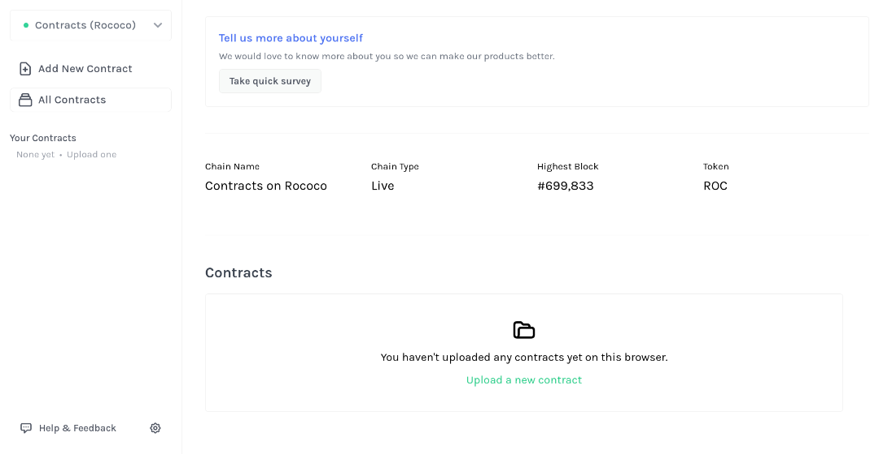
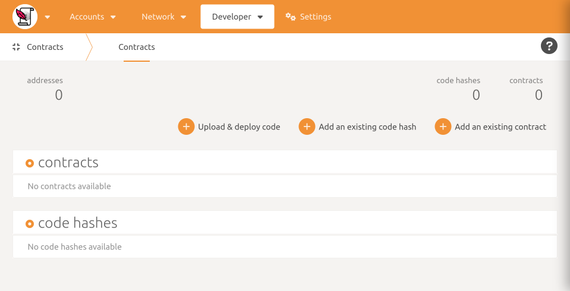
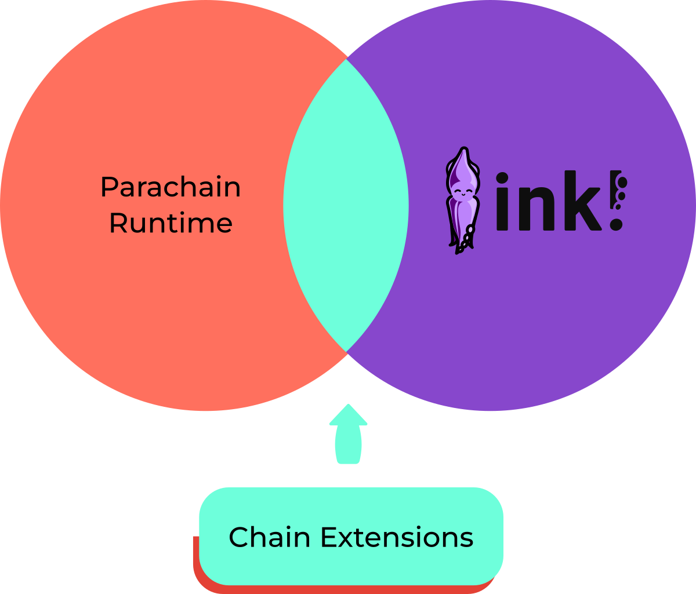
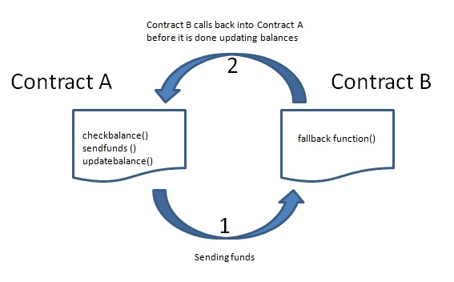
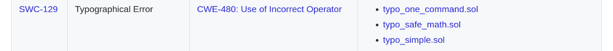

# 

---

<widget-speaker name="Michi" position="ink! Team Lead @ Parity " image="/assets/img/0-Shared/people/michi.png" github="cmichi" matrix="michi:matrix.parity.io"></widget-speaker>

---

## How does ink! tie into Substrate?


Note:
How does ink! tie into Substrate?

---

## How does ink! tie into Substrate?


---


---


---


---


---


---


---


Note:

Smart Contract vs. Parachain
Parachain:

- Only requirement: Minimal Polkadot API
- Trusted Code

Smart Contracts:

- Untrusted Code
- Requires Metering
- Fixed payment paradigm (gas fees)

---


Note:

- Motivation
- Use Case 1: Wrap Pallet
- Smart Contracts as “first class citizen”
  - ➜ Smart Contract Parachain + $UVP_for_Contracts

---


Note:

- Use Case 2: Expose Business Logic
- Smart Contracts as “second class citizen”
  - ➜ Parachain adding customizability for its business logic

---


Note:

- Use Case 3: Embrace Prototyping
- Prototyping before going for own parachain

---

# The ink! language

Note:
Just Rust
Debugging, Testing, Tooling, clippy, cargo fmt, fuzzing

---

```rust [1-48]
mod my_contract {

    struct MyContract {
        value: bool,
    }


    impl MyContract {

        fn new() ➜ Self {
            MyContract { value: true }
        }


        fn get(&self) ➜ bool {
            self.value
        }


        fn flip(&mut self) {
            self.value = !self.value;
        }
    }
}
```

Note:
Hello ink!

---

```rust [1-24|1-2|3-6|9-12|14-17|19-22]
#[ink::contract]
mod my_contract {
    #[ink(storage)]
    struct MyContract {
        value: bool,
    }

    impl MyContract {
        #[ink(constructor)]
        fn new() ➜ Self {
            MyContract { value: true }
        }

        #[ink(message)]
        fn get(&self) ➜ bool {
            self.value
        }

        #[ink(message)]
        fn flip(&mut self) {
            self.value = !self.value;
        }
    }
}
```

---

## Idiomatic Rust

```rust [1-6|8-11]
#[derive(scale::Encode, scale::Decode)]
#[cfg_attr(feature = "std", derive(scale_info::TypeInfo))]
pub enum Error {
    /// Error description.
    OhNo,
}

#[ink(message)]
pub fn do_it(&self) -> Result<(), Error> {
  Err(Error:OhNo)
}
```

---

## Trait Definitions

```rust [1-2,8|3-7]
#[ink::trait_definition]
pub trait BaseErc20 {
  #[ink(message)]
  fn total_supply(&self) -> Balance;

  #[ink(message)]
  fn transfer(&mut self, to: AccountId, amount: Balance) -> Result;
}
```

Note:
Can be implemented by multiple contracts.

---

## Unit Tests

```rust
#[cfg(test)]
mod tests {

    #[test]
    fn default_works() {
        let flipper = Flipper::default();
        assert_eq!(flipper.get(), true);
    }

}
```

---

## Integration Tests

```rust [1-5,17,19|6-9|11-13|15-16]
#[cfg(test)]
mod tests {

    #[ink::test]
    fn default_works() {
        // given
        let my_contract = MyContract::default();
        let accounts =
            ink_env::test::default_accounts::<ink_env::DefaultEnvironment>();

        // when
        ink_env::test::set_caller::<ink_env::DefaultEnvironment>(accounts.alice);
        ink_env::test::set_value_transferred::<ink_env::DefaultEnvironment>(10);

        // then
        assert!(my_contract.received_ten());
    }

}
```

---

# `$ cargo contract`

[https://crates.io/crates/cargo-contract](https://crates.io/crates/cargo-contract)

<!-- .element: class="fragment" data-fragment-index="1" -->

---

## Metadata?


---


Note:
Build Artifacts

---


---


---

# ink!-ternals


---

# ink!-ternals


---

# ink!-ternals


---

# ink!-ternals


---

# ink!-ternals


---

## Development Chains

<div class="flex-container">
<div class="left"> <!-- Gotcha: You Need an empty line to render MD inside <div> -->


[`substrate-contracts-node`](https://github.com/paritytech/substrate-contracts-node)

</div>
<div class="right"> <!-- Gotcha: You Need an empty line to render MD inside <div> -->


[Rococo Testnet](https://ink.substrate.io/testnet)

</div>
</div>

---

## Developer UIs

<div class="flex-container">
<div class="left"> <!-- Gotcha: You Need an empty line to render MD inside <div> -->



[https://contracts-ui.substrate.io](https://contracts-ui.substrate.io)

</div>
<div class="right"> <!-- Gotcha: You Need an empty line to render MD inside <div> -->



[https://polkadot.js.org/apps](https://polkadot.js.org/apps)

</div>
</div>

---

## Developer UIs


---

## Documentation


---

# Building a Dapp on ink!

---

## Reading Contract Values: RPC


---

## Reading Contract Values: Events


---



---

# Security Comparison Solidity

---

<div class="flex-container">
<div class="left fragment" data-fragment-index="1">


```solidity
pragma solidity 0.7.0;

contract ChangeBalance {
  uint8 public balance;

  function decrease() public {
    balance--;
  }

  function increase() public {
    balance++;
  }
}
```

</div>
<div class="right fragment" data-fragment-index="2" style="margin-left: 5%;">


- Build-in underflow/overflow protection
- `checked_add()`
- `saturating_add()`

</div>
</div>

Note:

- Build-in overflow/underflow protection
- Unless explicitly disabled by setting `overflow-checks = false` in `Cargo.toml`

---

<div class="flex-container">
<div class="left fragment" data-fragment-index="1">

<br/>

</div>
<div class="right fragment" data-fragment-index="2" style="margin-left: 5%;">


- Built-in reentrancy protection
- Fine-grained control

</div>
</div>

Note:
Re-entrancy Protection

---

<div class="flex-container">
<div class="left fragment" data-fragment-index="1">


```solidity
pragma solidity 0.7.0;

contract Lottery {

  function withdrawWinnings() {
    require(msg.sender = …);
    _sendWinnings(msg.sender);
  }

  function _sendWinnings() {
    msg.sender.transfer(this.balance);
  }
}
```

</div>
<div class="right fragment" data-fragment-index="2" style="margin-left: 5%;">


- Functions private by default
- Needs to be annotated explicitly
- Required: `pub` + `#[ink(message)]`

</div>
</div>

---


---




Note:

- Mutating values
- Ownership & Borrow checker

---


---


---

## References

- [ink! Repository](https://github.com/paritytech/ink)
- [ink! Documentation Portal](https://ink.substrate.io)
- [Beginners Tutorial to ink!](https://docs.substrate.io/tutorials/smart-contracts/)
- [Chain Extensions in ink!](https://ink.substrate.io/macros-attributes/chain-extension)<br/><br/>
- [SWC Registry](https://swcregistry.io) ‒ Smart Contract Weakness Classification and Test Cases.
- [Ethereum Smart Contract Best Practices](https://consensys.github.io/smart-contract-best-practices/attacks/reentrancy/)
