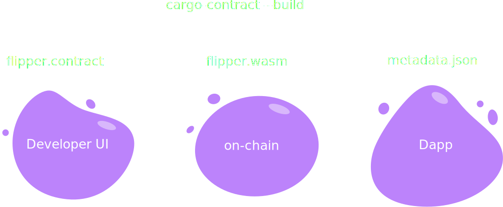

# 

### _Module 6, Lecture 5.3_

---

<widget-speaker name="Michi" position="ink! Team Lead @ Parity " image="/assets/img/0-Shared/people/michi.png" github="cmichi" matrix="michi:matrix.parity.io"></widget-speaker>

---

### Outline

<!--
You can reference slides within this presentation like [this other slide](#at-the-end-of-this-lecture-you-will-be-able-to) by use of the header title.

Please make your lecture precise.

- Limit the main points in a lecture to five or fewer.
- Create effective visuals, analogies, demonstrations, and examples to reinforce the main points.
  {TAs and the Parity design team can assist! Please let us know marking an item here as `TODO`}
- Emphasize your objectives and key points in the beginning, as you get to them, and as a summary at the end.

-->

1. [Pre-requisites](#pre-requisites)
1. [Motivation](#motivation)
1. [How does ink! tie into Substrate?](#how-does-ink-tie-into-substrate)
1. [The ink! language](#the-ink-language)
1. [Chain Extensions](#chain-extensions)
1. [Security Comparison Solidity](#security-comparison-solidity)
1. [Building a Dapp on ink!](#building-a-dapp-on-ink)
1. [Conclusion](#conclusion)
1. [References](#references)

---

## Pre-requisites

This lecture expects a basic understanding of…

- Rust.
- What a smart contract is.
- What the `pallet-contracts` is.
- What parachains are.

---

### _At the end of this lecture, you will be able to:_

- Understand where ink! ties into Substrate
- Understand when to use a smart contract and when not
- Be able to develop with ink!
- Be able to justify using ink! over Solidity

---

## Motivation

- Smart Contracts as “first class citizen”
  - ➜ Smart Contract Parachain + $UVP_for_Contracts
- Smart Contracts as “second class citizen”
  - ➜ Parachain adding customizability for its business logic
- Prototyping before going for own parachain

---

# How does ink! tie into Substrate?

---

## How does ink! tie into Substrate?


---

## How does ink! tie into Substrate?


---

## Smart Contract vs. Parachain


---

# The ink! language

---

### Hello ink!

```rust
mod my_contract {

    struct MyContract {
        value: bool,
    }


    impl MyContract {

        fn new() ➜ Self {
            MyContract { value: true }
        }


        fn get(&self) ➜ bool {
            self.value
        }


        fn flip(&mut self) {
            self.value = !self.value;
        }
    }
}
```

---

### Hello ink!

```rust
#[ink::contract]
mod my_contract {
    #[ink(storage)]
    struct MyContract {
        value: bool,
    }

    impl MyContract {
        #[ink(constructor)]
        fn new() ➜ Self {
            MyContract { value: true }
        }

        #[ink(message)]
        fn get(&self) ➜ bool {
            self.value
        }

        #[ink(message)]
        fn flip(&mut self) {
            self.value = !self.value;
        }
    }
}
```

---

# `cargo-expand`

---

## Idiomatic Rust

```rust
#[derive(scale::Encode, scale::Decode)]
#[cfg_attr(feature = "std", derive(scale_info::TypeInfo))]
pub enum Error {
    /// Error description.
    OhNo,
}

#[ink(message)]
pub fn do_it(&self) -> Result<(), Error> {
  Err(Error:OhNo)
}
```

---

## Unit Tests

```rust
#[cfg(test)]
mod tests {
    #[test]
    fn default_works() {
        let flipper = Flipper::default();
        assert_eq!(flipper.get(), true);
    }
}
```

---

## Integration Tests

```rust
#[cfg(test)]
mod tests {
    #[ink::test]
    fn default_works() {
        // given
        let my_contract = MyContract::default();
        let accounts =
            ink_env::test::default_accounts::<ink_env::DefaultEnvironment>();

        // when
        ink_env::test::set_caller::<ink_env::DefaultEnvironment>(accounts.alice);
        ink_env::test::set_value_transferred::<ink_env::DefaultEnvironment>(10);

        // then
        assert!(my_contract.received_ten());
    }
}
```

---

## Debugging

- Anything that goes in Rust
- Old-School:
  - `ink_env::debug_println!("balance: {}", self.env().balance());`
  - `substrate-contracts-node -lerror,runtime::contracts=debug`
  - `Developer UI + RPC Dry-Run`

---

# `cargo-contract`

---

## Build Artifacts



---

## Metadata?


---

## Development Chains


---

## Community


---

## Developer UIs


---

## Developer UIs


---

## Documentation


---

# Chain Extensions

---

# Building a Dapp on ink!

---

## Reading Contract Values: RPC


---

## Reading Contract Values: Events


---

# Security Comparison Solidity

---

## ink! vs. Solidity

- Integer overflow/underflow protection
- Re-entrancy protection
- Functions & variables private by default
- Ownership system & borrow checker

---

## Integer Overflow/Underflow Protection


---

## Re-entrancy Protection


---

## Functions & Variables private by default


---

## Ownership & Borrow checker


---

# Q&A

---

## Conclusion

<!-- Summarize what we just learned, and put it in the bigger picture of what the Academy and Web3 are all about. -->

---

## Next steps

<!--
Compile a list of:
- topics not covered here but students should consider learning about independently
- examples of the concepts covered in this lesson applied to a project, to case-study
- useful resources related to the lesson

- Reference other slides/materials by relative directory in this repo, like the [copy-paste slide templates](../../content-templates/slides/copy-paste-reveal-template-slides.md)
-->

1. <!-- TODO: fill this in  -->
1. <!-- TODO: fill this in  -->
1. <!-- TODO: fill this in  -->

---

## References

<!--
Compile an **annotated** list of URLs to source material referenced in making these lessons.
Ideally this is exhaustive, it can be cleaned up before delivery to students, but must include _why_ a reference is used.
For example:

- [ss58-registry](https://github.com/paritytech/ss58-registry) - A list of known SS58 account types as an enum, typically used by the Polkadot, Kusama or Substrate ecosystems.
- [wiki on parathreads](https://wiki.polkadot.network/docs/learn-parathreads) - A description of the parathread model.
-->
