# The World Computer

---

## What have we learned so far?

Through the PBA-X and PBA Campus, we have covered a lot!

---

## Blockchain Technology

A way for two or more untrusted parties to interact with each other in provable ways without relying on middlemen.

A tool for creating systems which are:

- Verifiable
- Public
- Distributed
- Open
- Resilient

---

## The Building Blocks of Blockchains

- Cryptography
- Peer-to-Peer Networking
- Merklized Database
- Data Availability
- Byzantine-Fault-Tolerant Consensus
- Economic Game Theory

---

## Scaling Blockchain Systems

- Shared Security
- Programmability Layers
	- Smart Contracts
	- Modular Runtime
- Execution Sharding
- Data Sharding
- Blockchain Rollups
- On-Chain Governance

---

## The Great Mistake

Blockchain is not a product in and of itself.

The world does not want or need "more blockchains".

It is simply a tool that can be used to create resilient products.

---

## So what should we build with this tool?

To understand this, we must tke all the knowledge we have, and rebuild our understanding of the problems at hand.

---

## Goals for this Presentation

Let’s completely reframe all of our thoughts about what it is we are building.

Let’s talk about:

1. Web3
1. The World Computer
1. Components of the World Computer
1. The Transition to Web3
1. Products for the World Computer

---

# Web3

---

## What is Web3?

It is hard to describe Web3 to new people with a single punchy line.

Here are a few tries:

- *Less trust, more truth.*
- *A more equitable version of the internet.*
- *Resilient public digital infrastructure.*

> The best way is to look at the problems Web3 is trying to solve...

---

## The Driving Force

The world we live in has problems:

- Financial Corruption
- Political Control
- Digital Servitude
- Erosion of Sovereignty
- Systemic Fragility
- and more…

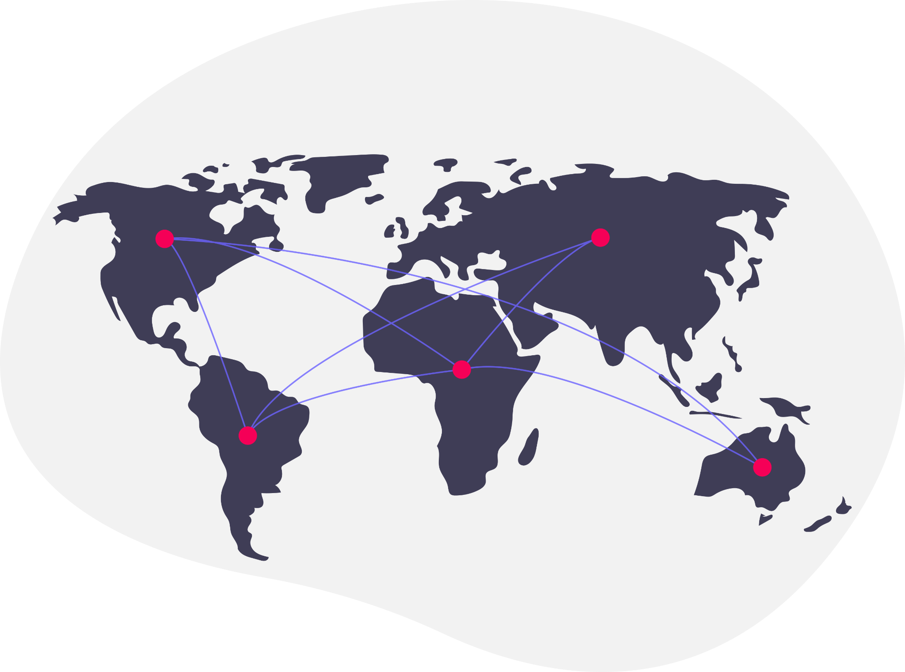

These problems all stem from the same place:

> **The growing power of central authorities.**

---

## History has shown us that we cannot trust centralized authorities.

<pba-cols class="text-small">
<pba-col>

### Global Financial Crisis (2008)

The collapse of major financial institutions like Lehman Brothers and the subsequent bailouts revealed the fragility of centralized banking systems and the risks of opaque financial practices.

</pba-col>
<pba-col>

### Wikileaks Censorship (2010)

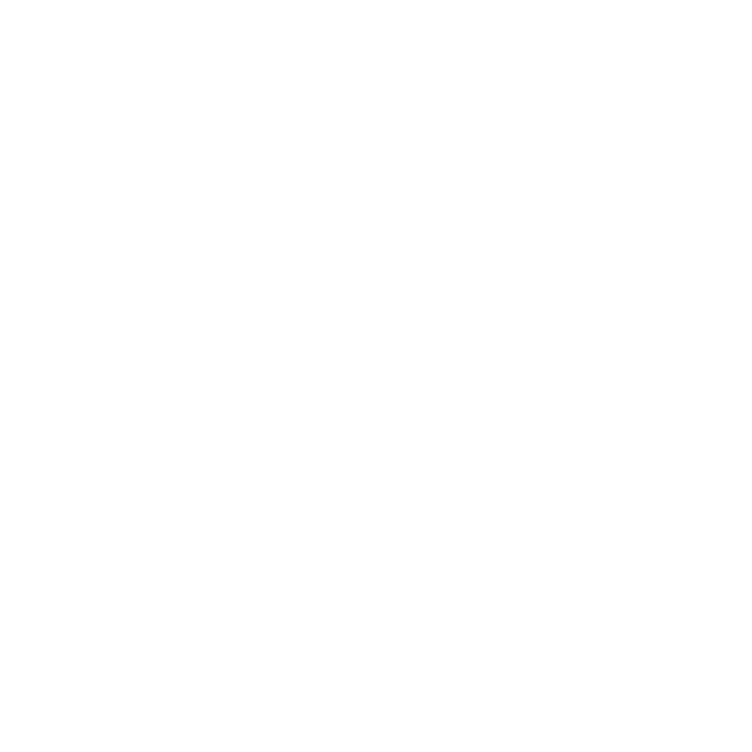

Governments and financial institutions cut off funding channels to WikiLeaks, blocking donations via traditional systems like PayPal and credit cards.

</pba-col>
<pba-col>

### Snowden Revelations (2013)

Exposed global surveillance programs conducted by the NSA and its allies, showing how governments and centralized entities were collecting and storing vast amounts of private data without consent.

</pba-col>
</pba-cols>

---

## History Will Repeat Itself

---

## ...and History is in the Making.

<iframe width="854" height="480" src="https://www.youtube.com/embed/dsl_sKYywEI?si=gR5NSOav9qlKW9uR?cc_load_policy=1&cc_lang_pref=en" title="YouTube video player" frameborder="0" allow="accelerometer; autoplay; clipboard-write; encrypted-media; gyroscope; picture-in-picture; web-share" referrerpolicy="strict-origin-when-cross-origin" allowfullscreen></iframe>

> Bill Gates (Microsoft), Sam Altman (OpenAI), Tim Cook (Apple), Mark Zuckerberg (Meta), Safra Catz (Oracle), and Sundar Pichai (Google) pander to United States President Donald Trump. (September 4, 2025)

---

## A Simple Set of Conjectures

- Central authorities will always (eventually) abuse their powers.
<!-- .element: class="fragment" -->
- With the increasing globalization caused by technology, the reach of central authorities is greater than ever.
<!-- .element: class="fragment" -->
- Computers play a critical role in providing public digital infrastructure.
<!-- .element: class="fragment" -->
- We could create a world more resilient from these powers, if the worlds public digital infrastructure were itself more decentralized and resilient.
<!-- .element: class="fragment" -->

> **Web3 describes that resilient public digital infrastructure.**
<!-- .element: class="fragment" -->

---

## Web3 Provides More Truth

Web3 is:

<pba-cols>
<pba-col>

- Decentralized
- Verifiable
- Self-Sovereign
- Interoperable
- Privacy-Preserving

> Properties of Web3

</pba-col>
<pba-col>

- Open
- Public
- Borderless
- Neutral
- Censorship Resistant

> Pillars of Blockchain by Andreas Antonopoulos

</pba-col>
<pba-col>

- Resilient
- General
- Performant
- Coherent
- Accessible

> Web3 Maxims by Gavin Wood

</pba-col>
</pba-cols>

---

# Origins of the World Computer

---

## What is the World Computer?

**The “World Computer” is a single, globally accessible, and trustless computing platform that is not owned or controlled by any single entity.**

It's a computer formed by a decentralized network of participants whose job is to agree on the state of the system and execute programs exactly as written, making the rules of an application algorithmically enforceable.

> It is the backbone of the resilient public digital infrastructure imagined by Web3.

---

## Origins of the World Computer

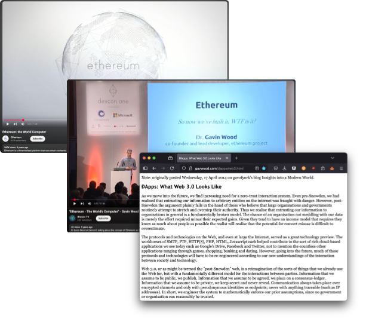

- The origins of Web3 and the World Computer come from the same place: **Dr. Gavin Wood**.
- Our ability to picture what exactly that looked like has changed as the tools and technology around us has matured.
- Likely it will continue to evolve.

> **Is Ethereum actually a good measure of what a World Computer would look like?**

---

## Turing Completeness

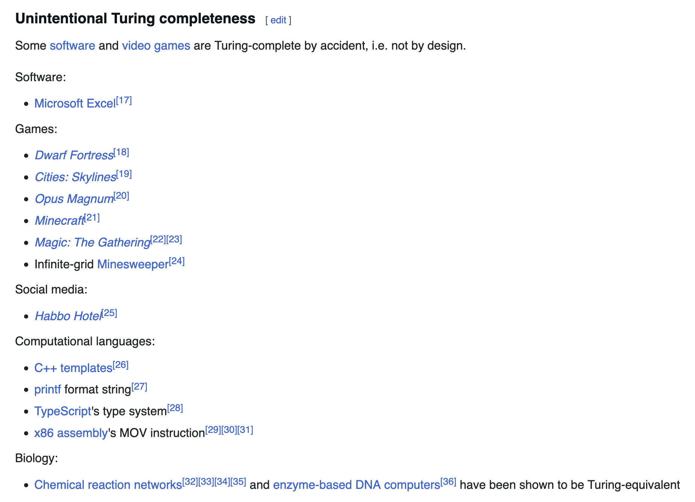

- Ethereum claimed to be a computer because it was “turing complete”.
- Turing completeness is a poor test of being a “useful computer”.
- Most smart contract blockchains have achieved turing completeness, but are not designed as a computer.
	- They are also arguably not very turing complete because of execution limits.
- So what are they?

---

## Distributed Ledger Technology

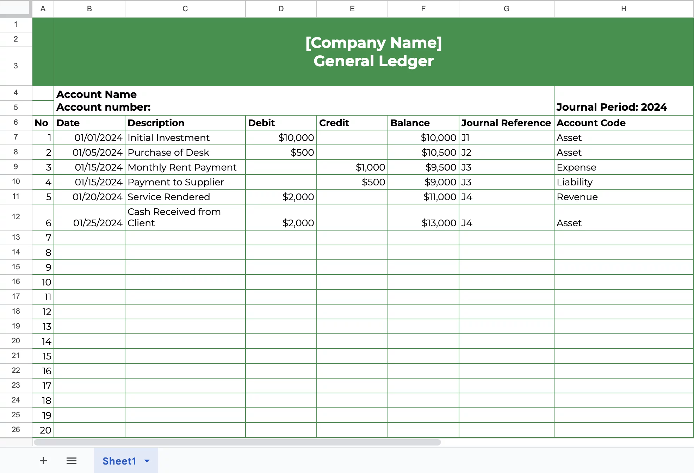

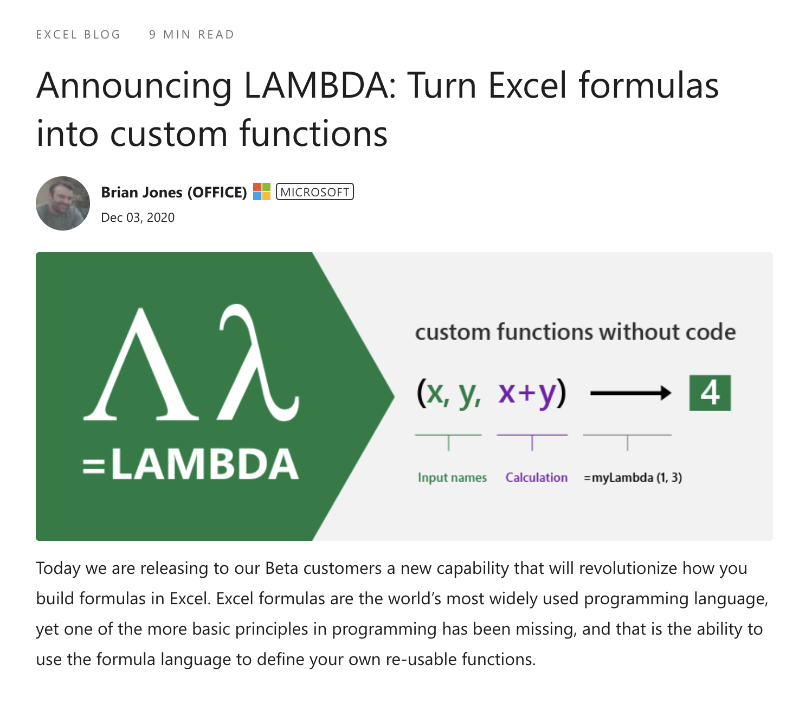

- Most blockchains are used to build DLTs.
	- Bitcoin, XRP, BNB, Solana, etc...
- The Web3 version of a spreadsheet.
	- Excel was designed for storing data.
	- Lambda functions gave Excel turing completeness and programmability.
		- Equivalent to Smart contracts.
- Can be scripted, and can emulate a computer, but is not designed for this.
- All intermediate state and functions result in updates to the ledger.
- Building apps for DLTs, feels like building apps in Excel: **you can do it, but it doesn’t feel right.**

---

## Two Different Products

Both Built Using Blockchain Technology

<pba-cols class="text-small">
<pba-col>

#### Distributed Ledger Technology

- The primary purpose is to **store** data.
- The primary part of this product is the blockchain state.
- The backbone of decentralized finance.
- A proven product, that has clear market demand.

</pba-col>
<pba-col>

#### Decentralized Computers

- The primary purpose is to **execute** computation.
- The primary part of this product is the decentralized computation bandwidth.
- The backbone of the decentralized internet.
- A speculative product, not necessarily focused on market demand, but on a future we need.

</pba-col>
</pba-cols>

Now we can start to see why some blockchain products seem so different.

---

## Two Different Mindsets

There is a **growing divide** in the mindset of blockchain development.

<pba-cols class="text-small">
<pba-col>

#### Long Term Thinking

- Scalable Decentralization
- Light Clients
- Trustless Bridges
- Utility Derived Tokens
- Sustainable Economics
- Changing the Status Quo
- Rich Metadata
- etc...

</pba-col>
<pba-col>

#### Short Term Results

- Small Validator Sets
- Expensive / High Powered Nodes
- N of M Multisigs
- Speculative Tokens / Gambling
- VC Controlled Dumps
- Pandering to Incumbents
- Blind Signing
- etc…

</pba-col>
</pba-cols>

---

# Components of the World Computer

---

## The World Computer is “Virtual”

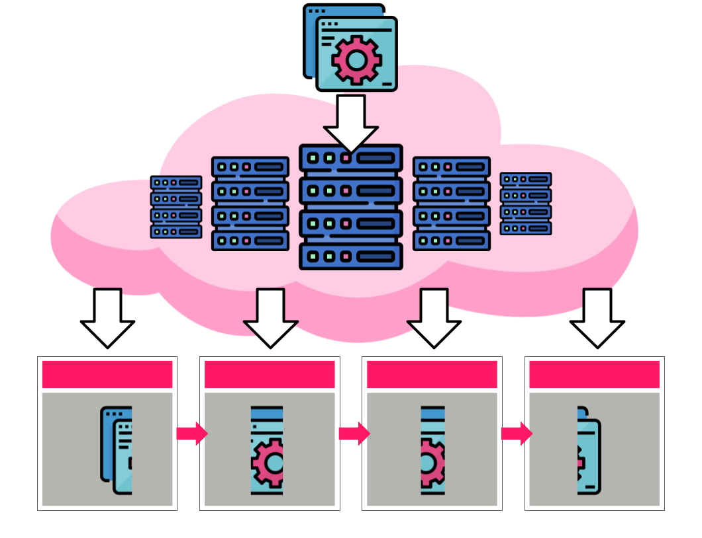

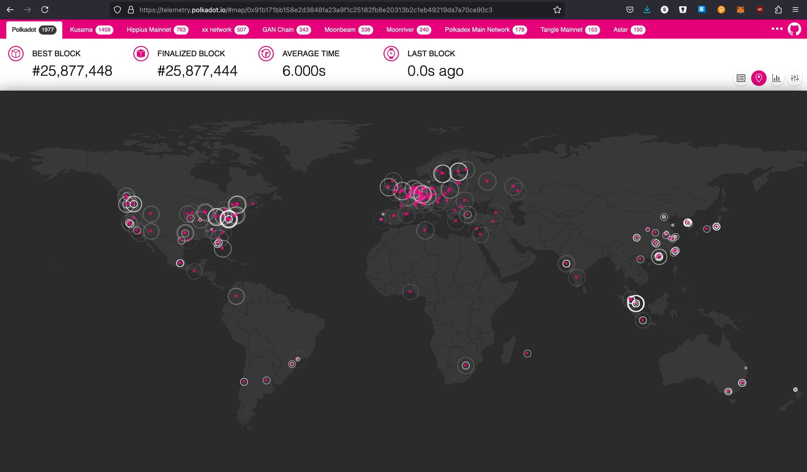

- It is important to remember we are discussing a “virtual machine” rather than a physical one.
- Applications generally do not have visibility of the decentralized/distributed nature of the computer.
- The fact that the World Computer runs across many real computers gives it many Web3 properties.
	- Even more when the network is permissionless, open, borderless, etc...
- The glue which turns many computers into one is the “Consensus algorithm”, which achieves byzantine fault tolerance.

---

## Decentralized Components

Many components of the decentralized computer can be compared to a physical computer.

- Distributed, Decentralized Hard Drive
	- Introduced by Bitcoin: Merklized Blockchain State
- Decentralized Single-Core Processor
	- Introduced by Ethereum: EVM
	- Other VM options exist today, as do other physical processor choices.
- Decentralized, Threaded, Single-Core Processor
	- Introduced(?) by Solana: Some parallel transactions, but not sharded execution.
- Decentralized Multi-Core Processor
	- Introduced by Polkadot: Execution Sharding
- Decentralized Memory (Non-Persistent Storage)
	- Introduced (naively) by Polkadot: PVF Data Availability, not easily accessible for general use.
	- Introduced (externally) by teams like Celestia: Very slow, like USB thumb drive as RAM.
	- Introduced (properly) by JAM: General purpose decentralized distributed data lake.

---

## Entirely New Components

Some components in the decentralized computer have no parallel to the physical computer.

- Consensus Layer
	- Required to achieve “consensus” across the computer.
		- Includes the properties of Economic Security and Finality / Canonicalization.
		- Proof of Work, ELVES, ZK Rollup, Optimistic Rollup.
- Economic / Incentives Layer
	- Used to allow the computer to access and influence the physical world.
- On-Chain Governance
	- Used to allow the physical world to access and influence the computer.

---

## Further Beyond

We can simply hypothesize about the other parts of a computing world which are useful today, but are only available via centralized solutions:

- Decentralized GPUs
	- highly parallel, optimized for performing many simple operations at once
- Privacy Solutions
	- Mixnets
	- ZK Privacy Layers
- Internet
	- Trustless Bridges
- Data Centers
	- The “Grid”: Omniledger + Bridges
- More?

---

## The building blocks of Blockchain, are simply the components of a Decentralized Computer.

---

## Who does the World Computer appeal to?

The World Computer has many properties, appealing to different audiences:

- **A Distributed Computer**
	- a distributed computer is one which has natural fallback, and can provide incredible uptime and replication guarantees.
- **A Verifiable Computer**
	- a verifiable computer is one where people need not require trust in the platform or the other users they interact with.
- **A Resilient Computer**
	- a resilient computer is one where applications and services need not worry about the restrictions / laws of any particular nation, and can launch unstoppable applications.
- **A Financial Computer**
	- a platform which natively integrates global finances into your platform, and enables direct integration between you and your customers.

---

## Costs of the World Computer

The World Computer will not replace your personal computer; it's a new type of machine for a different class of problems.

- **It is inherently slower and more expensive.**
	- Every calculation must be independently verified by thousands of nodes across the globe.
- **It is a finite public resource.**
	- Access isn't always guaranteed to everyone, and when there is competition, you need to pay.
	- However, we hope to scale to a point where everyone gets some amount of basic access.
- **It is permanent and immutable by design.**
	- The history of the computer will reflect all of the actions of the past.
- **It shifts the security burden entirely to the user.**
	- Full sovereignty.
	- There is no "forgot password" link, support hotline, etc...

---

# The Transition to Web3

---

## Web3: Evolution or Revolution?

Both!

- Web3 is a technological **evolution**.
	- We should not expect to rebuild or replace a majority of the Web 2.0 internet.
	- Most of it works, and works well!
	- Only fix what is broken.
- Web3 is a social **revolution**.
	- We should expect Web3 to fundamentally change the way people interact in our physical and digital world.
	- A shift in power, social structures, global access, etc...

---

## The heart of the difference between Web2 and Web3 lies in resilience.

Resilience against:

<pba-cols>
<pba-col>

- Censorship
- Single points of failure
- Hacks and security breaches
- Network outages
- Data manipulation

</pba-col>
<pba-col>

- Regulatory overreach
- Corruption or collusion
- Ownership disputes
- Monopolization
- and more…

</pba-col>
</pba-cols>

---

## History Will Repeat Itself!

---

## Web3 Does Not Replace Web2

- Likely most of the internet will continue to run on Web2 systems:
	- More cost efficient.
	- More scalable.
	- More corporate control.
- But there are ways Web3 systems can make the internet better...

---

## Companies Should Want Web3

Web3 should be appealing to most companies:

- Companies often do NOT want to be responsible for personally identifiable information.
<!-- .element: class="fragment" -->
	- Most use Federated Identity Management and Single Sign-On
- Companies want to maximize profits, often by reducing middlemen.
<!-- .element: class="fragment" -->
	- Payments, Subscriptions, Secondary-Sales, Global Access, etc...
- Companies want deeper integration with their customers.
<!-- .element: class="fragment" -->
- Companies want to provide verifiable guarantees to their customers.
<!-- .element: class="fragment" -->
- Companies want to use resilient infrastructure with 24/7 uptime.
<!-- .element: class="fragment" -->

---

## Users Should Want Web3

Web3 should be appealing to most users:

- Users want verifiable infrastructure.
<!-- .element: class="fragment" -->
- Users want resilient infrastructure.
<!-- .element: class="fragment" -->
- Users want privacy.
<!-- .element: class="fragment" -->
- Users want control of their data.
<!-- .element: class="fragment" -->
- Users want global, borderless access.
<!-- .element: class="fragment" -->
- Users don’t want to be censored.
<!-- .element: class="fragment" -->

---

## The World Should Want Web3

Web3 promises a pathway away from centralized governments and authorities which result in corruption.

1. Proof of Personhood
2. Publicly Verifiable Voting System
3. Network States

---

## Proof of Personhood

Open and resilient systems providing **Sybil Resistance**, while maintaining privacy and verifiability.

In this future, **basic transactions will be free.**

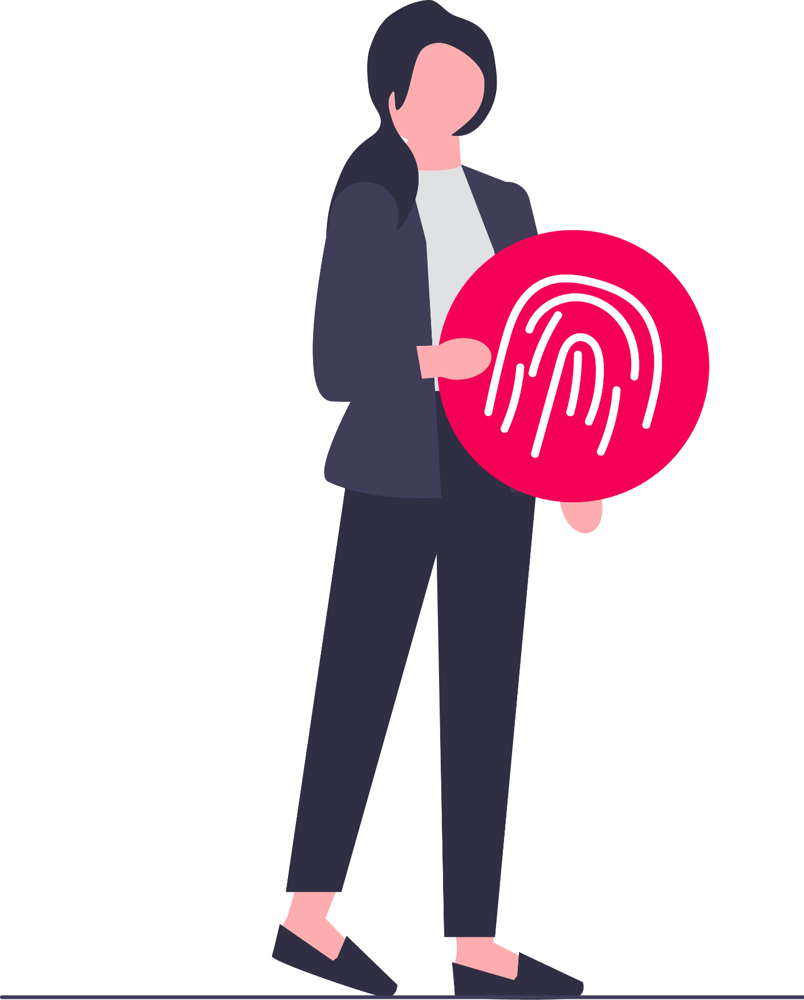

> “As More People Use AI, We'll Need Unique Proof of Personhood.”
>
> Eddy Lazzarin, CTO of a16z crypto (From a16z big ideas for 2025)

---

## Publicly Verifiable Voting Systems

Secure, direct-voting systems where anyone can verify the results without needing to trust a central authority.

 

Where decisions can be made for our **on-chain digital metaverse** and our **off-chain real world**.

 

Where results are secured by cryptography and math, rather than the existing incumbents.

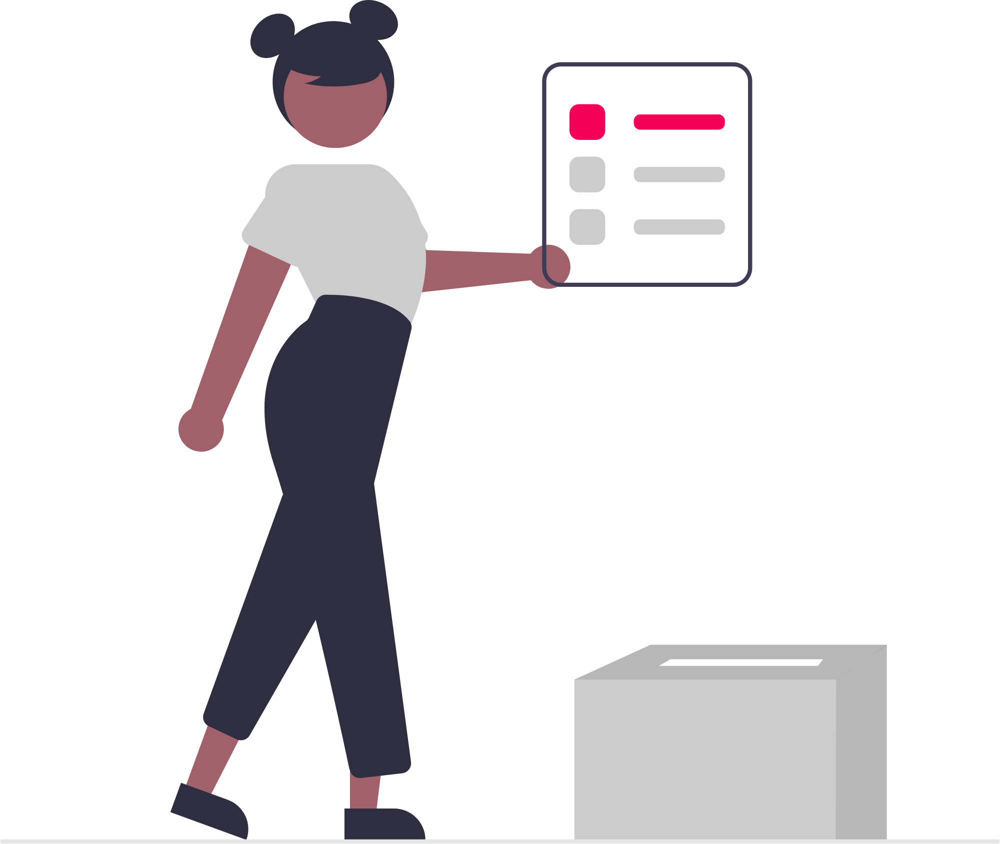

---

## Network States

Societies built without physical borders, united by shared values, digital coordination, and economic alignment.

 

Web3 will provide these groups **resilience**, as they organize, govern, and grow entirely online...

 

> **Then allow them to shape the real world.**

---

## The Biggest Risk to Global Web3 Adoption

- Web3 promises:
	- Self-Sovereignty
	- Self-Custody
	- Unstoppable Applications
	- Uncensorable Usage
- But in fact, do most people want this?

> The biggest risk to global Web3 adoption is the complacency and dependency of the average person on the exact centralized parties we hope to upend.

---

# Products for the Web3 Computer

---

## Can I run X on the World Computer?

I have been asked before:

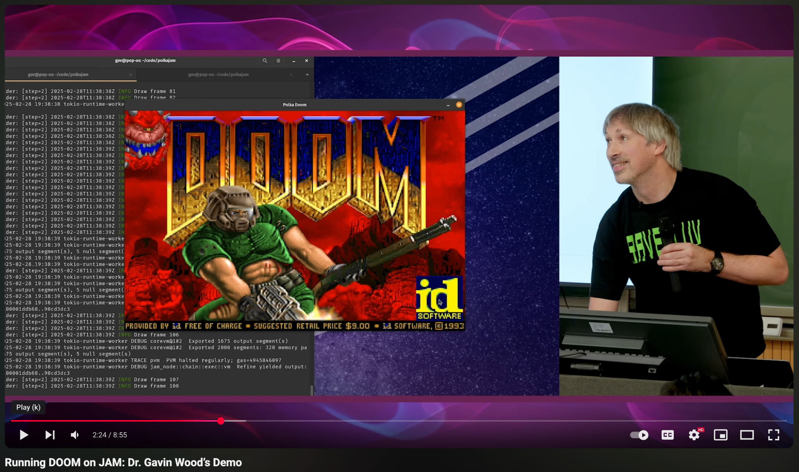

- Can I run Docker?
- Can I run Firefox?
- Can I run Doom?
- Can I run Photoshop?

**Yes!**

But should you? 🤔

---

## Create A Hammer, Everything Becomes a Nail

Things like the Substrate and Parachains really influenced how people thought about building applications for Web3.

> *Every application should have its own application specific chain!*

Unfortunately this was wrong.

---

## Realizations for the Web3 Future

- Many Web3 applications may not want to be a blockchain.
	- Instead, they want the **properties** that Web3 systems provide.
- Many blockchains aren’t really Web3.
	- Just people selling a token around centralization
- Many L2s should/would rather be Web3 applications.
	- They are looking for flexibility, scalability, and resilience.
	- They are just frustrated with directly accessing / using the L1.

---

## Resilient, Distributed Ledgers

- It’s kind of obvious in retrospect, the first natural product for a decentralized computer is the Distributed Leger.
- Many existing blockchains and DLTs, made a whole “application specific computer” to run their ledger.
- **A decentralized computer could host a ledger, and enable so much more.**
	- It is likely the Polkadot Relay Chain and Kusama Relay Chain will run on the World Computer.

---

## Let’s look at the existing web (top sites)

<pba-cols style="font-size: 18px;">
<pba-col>

1. Google (google.com): Search Engine
1. YouTube (youtube.com): Video Sharing
1. Facebook (facebook.com): Social Network
1. Instagram (instagram.com): Photo Sharing
1. ChatGPT (chatgpt.com): AI Assistant
1. X (x.com): Microblogging
1. WhatsApp (whatsapp.com): Messaging App
1. Wikipedia (wikipedia.org): Online Encyclopedia
1. Reddit (reddit.com): Discussion Forum
1. Yahoo Japan (yahoo.co.jp): Japanese Portal
1. Yahoo (yahoo.com): Web Portal
1. Yandex (yandex.ru): Russian Search
1. TikTok (tiktok.com): Short Videos
1. Amazon (amazon.com): Online Shopping
1. Baidu (baidu.com): Chinese Search
1. bet.br (bet.br): Sports Betting
1. Microsoft Online (microsoftonline.com): Cloud Services
1. LinkedIn (linkedin.com): Professional Network
1. Pornhub (pornhub.com): Adult Content
1. Netflix (netflix.com): Streaming Service

</pba-col>
<pba-col>

1. Naver (naver.com): Korean Portal
1. Live (live.com): Email Service
1. Zen News (dzen.ru): News Portal
1. Office (office.com): Productivity Suite
1. Bing (bing.com): Search Engine
1. Temu (temu.com): Online Shopping
1. Pinterest (pinterest.com): Image Sharing
1. Bilibili (bilibili.com): Anime Streaming
1. XVideos (xvideos.com): Adult Content
1. Microsoft (microsoft.com): Tech Company
1. Twitch (twitch.tv): Game Streaming
1. XHamster (xhamster.com): Adult Content
1. VK (vk.com): Russian Social
1. Mail.ru (mail.ru): Russian Email
1. Yahoo! News Japan (news.yahoo.co.jp): News Portal
1. SharePoint (sharepoint.com): Collaboration Tool
1. Fandom (fandom.com): Fan Communities
1. Globo (globo.com): Brazilian News
1. Canva (canva.com): Design Tool
1. Weather.com (weather.com): Weather Forecasts

</pba-col>
</pba-cols>

---

## Top Sites by Category

- AI Tooling
- Online Search
- Social Networks
- Video Streaming
- Online Shopping
- Online News
- Online Gambling

---

## The trivial case for everyone:
## Money, Payments, Finance

- For the purposes of these next slides, we will assume that it is obvious that finance on any of these platforms could be made decentralized and use Web3 technologies.
	- Subscription Payments
	- Purchases
	- Revenue Sharing
	- Cross-Border Payments
- This is basically a proven, and desired product.
- So let’s look beyond this.

---

## Example: AI Tooling with Web3

**Web2 Foundation:**

* The development of core AI models will likely remain in the hands of specialized, centralized teams.
* User-friendly interfaces will abstract away the underlying complexity.

**Web3 Enhancements:**

* **Verifiable Training Data:** Cryptographic proof of the exact data set used to train an AI model.
* **Provable Inference:** Proof that a specific AI model was run with specific inputs to generate a result.
* **DAO Governance:** Community ownership and control over the development and use of AI models.
* **Data Bounties:** A transparent market for users to be compensated for providing high-quality data.

---

## Example: Online Search with Web3

**Web2 Foundation:**

* The core infrastructure of crawling, indexing, and ranking remains largely centralized for efficiency.
* The shift continues toward AI models that understand user intent.

**Web3 Enhancements:**

* **Verifiable Index:** Cryptographic proof of the search index's contents and integrity.
* **Transparent Curation:** User control over the algorithms that rank and filter results.
* **DAO-Managed Registries:** Token-curated lists allow communities to govern what content is prioritized.
* **New Economic Model:** A shift from an ad-based model to direct micropayments for valuable content.
* **Verifiable AI:** Proof of the data used to train the AI models that power search.

---

## Example: Social Networks with Web3

**Web2 Foundation:**

* Sleek front-end applications and the hosting of non-controversial content will likely remain centralized for the best user experience.

**Web3 Enhancements:**

* **Own Your Identity & Graph:** Your profile and connections follow as you move between platforms.
* **Protocol-Agnostic:** A single social graph can be accessed by countless different apps and front-ends.
* **Direct Monetization:** No more platform cuts; the creator economy becomes a true p2p economy.
* **Community Empowerment:** Create and govern communities with real financial power and treasuries.

---

## Example: Video Streaming with Web3

**Web2 Foundation:**

* For performance / cost, most video content will likely remain hosted on traditional centralized servers.

**Web3 Enhancements:**

* **Sovereign Identity:** Users log in with their Web3 accounts, not corporate accounts.
* **Resilient Hosting:** Key videos can use decentralized storage for censorship resistance and global access.
* **Transparent Algorithms:** User-controlled curation and discovery, free from opaque corporate influence.
* **Value-Added Micropayments:** Reward users directly for quality comments, subtitles, or engagement.
* **Creator DAOs:** Tools for creators to build sovereign communities and economies with their audience.

---

## Example: Online Shopping with Web3

**Web2 Foundation:**

* The real-world logistics of delivery, warehousing, and physical supply chains will not be decentralized.

**Web3 Enhancements:**

* **Decentralized Marketplaces:** Curated product catalogs managed by communities or DAOs.
* **Verifiable Reputation:** Tamper-proof review systems for both buyers and sellers, across all platforms.
* **Digital Proof of Purchase:** NFTs that act as receipts for warranties, returns, and proof of ownership.
* **Supply Chain Verifiability:** Track a product from its origin to your doorstep, ensuring authenticity.
* **Direct-to-Consumer:** Brands can engage and sell directly to their audience with lower fees.

---

## Example: Online News with Web3

**Web2 Foundation:**

* Recognized journalists are still the ultimate source of news and oracles of new data.
* Most articles will still be hosted on performant Web2 servers.

**Web3 Enhancements:**

* **Verifiable Identity:** Cryptographically prove the identity and reputation of authors and publications.
* **Censorship Resistance:** Protect journalists / publications from de-platforming or government takedowns.
* **Immutable Record:** Prove an article's authenticity and prevent it from being silently edited or deleted.
* **New Funding Models:** Move beyond ads with article micropayments or reader-governed funding DAOs.
* **Transparent Fact-Checking:** On-chain systems for verifying sources and tracking corrections.

---

## Example: Online Gambling with Web3

**Web2 Foundation:**

* The front-end user experience will remain a sleek, centralized application for performance.
* Live elements, such as video streams for live dealers, will continue to use traditional web technologies.

**Web3 Enhancements:**

* **Provably Fair Games:** All game logic (card shuffles, dice rolls) is executed by verifiable random functions.
* **Self-Custody of Funds:** Users play directly from their wallets, ensuring sovereign control of their funds.
* **Instant & Automated Payouts:** Payments are executed automatically the moment a game concludes.
* **DAO-Governed House:** The "house" itself can be a DAO, allowing players to become stakeholders.
* **Permissionless Global Access:** Access to everyone, bypassing traditional geo-blocks and gatekeeping.

---

## All of the Basic “Blockchain Apps”

Things want to use a distributed ledger, but without needing their own blockchain.

- Decentralized Identity
- Decentralized Physical Infrastructure
- Decentralized Finance
- Metaverse
- Sustainability
- etc...

---

## Ephemeral Applications

JAM introduces a new set of applications which can be ephemeral, and only use the DA:

- Person-to-Person Sales
	- Temporary escrow before transfer, but doesn’t need permanent state.
- On-Chain Video Games
	- “Polkadot Plays Pokemon”.
- Disappearing Global Chat

---

# The Future for Polkadot

---

## Polkadot has always felt different

The goal to build a decentralized world computer has walked us along a path of blockchains and distributed ledger technology, but that path goes on, and beyond the technologies we are familiar with today.

- Distributed Ledger Technology
- Bitcoin
- Blockchain
- Ethereum
- Polkadot
- JAM
- Decentralized Computer
- And beyond...

---

## Polkadot as a Community, not a Product

- We are currently limiting ourselves in believing Polkadot is just for parachains.
	- Scaling for L2s
	- Hosting other blockchains / distributed ledgers
	- Building infra for the already small pool of people who are building blockchains
		- And are specifically willing to build entirely using our SDK
- Instead, we must look at Polkadot as a vision for the future, a mission to build that future, and community who can execute that mission.
	- Like our runtimes and governance, this community can evolve, and as we understand our own technology better, so can our mission and vision.
	- Polkadot was a blockchain-of-blockchains, the original ETH 2.0, a platform for ledgers.
	- Polkadot can become a decentralized, ubiquitous world computer.
		- Able to execute anything, and everything, with resilience.

---

## A World Computer Built with Polkadot

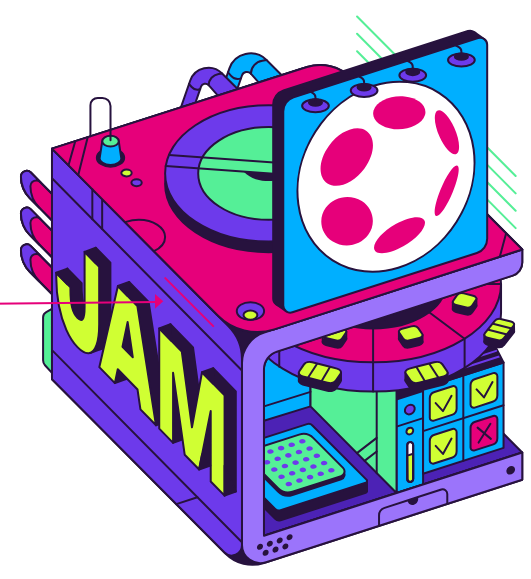

 

- **Decentralized Hardware: JAM**
	- **Decentralized CPU**
		- PolkaVM (Multi-Core w/ Execution Sharding)
	- **Decentralized Permanent Storage**
		- Merkelized Blockchain State (ParityDB/NOMT)
	- **Decentralized Memory**
		- Distributed Decentralized Data Lake
- **Operating System**
	- CoreVM
- **Consensus**
	- ELVES

---

## Polkadot’s Mission Does Not End with Blockchain Tech

- One can argue that JAM is mostly NOT a blockchain anymore.
	- Distributed Decentralized Data Lake
	- P2P Networking Stack
	- PolkaVM Computation Stack
- To achieve our vision, we need to keep building the different parts of the decentralized computer, and eventually scale to the decentralized cloud.

---

<!-- .slide: data-background-color="#4A2439" -->

# Questions
