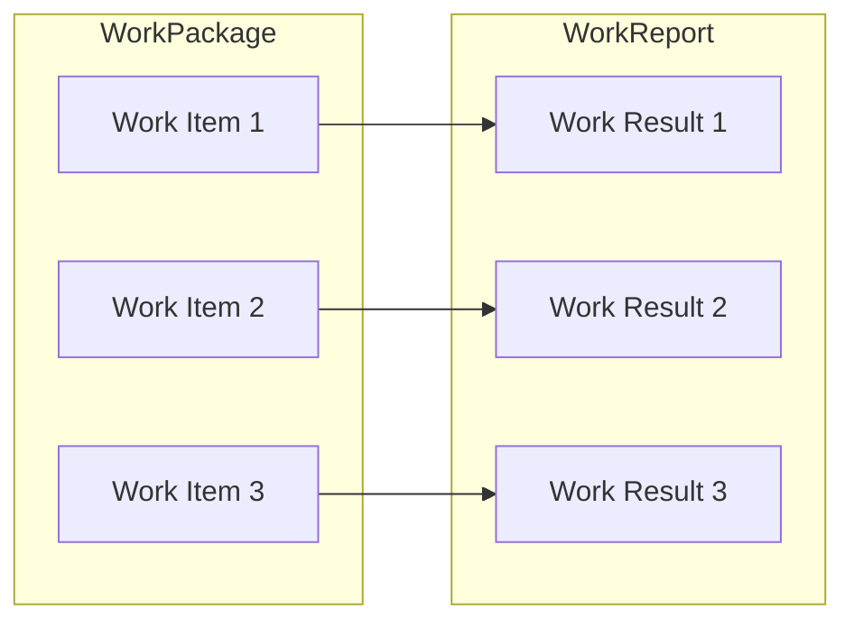

![[jam-white.png]]

- blog.kianenigma.com/posts/tech/demystifying-jam/

Note: 
- blog.kianenigma.com/posts/tech/demystifying-jam/presentation-pba
- https://blog.kianenigma.com/posts/tech/demystifying-jam/presentation/
- blog.kianenigma.com/posts/tech/demystifying-jam/

<iframe width="560" height="315" src="https://www.youtube.com/embed/eGLCedIT94U?si=bku3jyZfuTp7mojM" title="YouTube video player" frameborder="0" allow="accelerometer; autoplay; clipboard-write; encrypted-media; gyroscope; picture-in-picture; web-share" referrerpolicy="strict-origin-when-cross-origin" allowfullscreen></iframe>

---
### This Talk

1. Understand what JAM is
2. JAM's role in the broader Web3 vision

---
## Understanding What JAM Is 

> aka. Demystifying JAM 

---
### Polkadot 1

- Social 
	- OpenGov
	- DOT Token → Security
	- Fellowship 
- Technological
	- **Heterogeneous Execution Sharding, with Shared Security**

Note:
Sharding enabled by the use of ELVES, and heterogeneity enabled by the use of WASM. 
ELVES: [Efficient Execution Auditing for Blockchains under Byzantine Assumptions](https://eprint.iacr.org/2024/961)

---
### Heterogeneous Execution Sharding, with Shared Security

Let's break it down: 
1. Execution Sharding 
2. With Shared Security
3. Heterogeneous

--

### Sequential Blockchain

![[single-threaded 1.svg]]
Notes: 
- Opposite of execution sharding
- How blockchains usually work

--
### (Poorly) Execution Sharded 

![[multi-threaded.svg]]
- Sharding the validator set: less security

--
### Execution Sharded with Shared Security  

![[multi-threaded-dot.svg]]
- ELVES and Cynical Rollups
- Core Model

Note: 
Original vision of ETH 2 was to be this, with 64 shards. 

--
### Heterogeneous

![[dot-parachain.svg]]
- WASM bytecode

--
### Now You Get It? 

![[dot-parachain.svg|300px]]

Execution Sharding +  With Shared Security + Heterogeneous

--

### Evolution of Polkadot

... is all about flexible usage of cores

- &shy;<!-- element class="fragment" -->You need more to get more out of your core? [Async Backing](https://wiki.polkadot.network/maintain/maintain-guides-async-backing/)!
- &shy;<!-- element class="fragment" -->You need more cores? [Elastic scaling](https://wiki.polkadot.network/learn/learn-agile-coretime/)! 
- &shy;<!-- element class="fragment" -->You don't want to commit to 6m? [Agile-coretime](https://wiki.polkadot.network/learn/learn-agile-coretime/)!
- &shy;<!-- element class="fragment" -->You need less than one core? [On-demand coretime](https://wiki.polkadot.network/learn/learn-agile-coretime/)!
- &shy;<!-- element class="fragment" -->You want to do something other than a parachain in your core? **JAM**!

---

## Path of a Parachain Block

--
### Path of a Parachain Block

![[dot-parachain-block-path-0.svg]]

--
### Path of a Parachain Block

![[dot-parachain-block-path-1.svg]]

--
### Path of a Parachain Block

![[dot-parachain-block-path-2.svg]]
Note:

In the existing Polkadot, the block itself is put into the DA for further auditing.

--
### Path of a Parachain Block

![[dot-parachain-block-path-3.svg]]
Notes: 
- Execution by core validators + made available for further auditing 
- State root updated by all Polkadot validators 

--

### Polkadot's Primitives

- In-core execution, with access to DA
- On-chain execution, with access to the main Polkadot state

--

### Polkadot's Primitives 

* Polkadot currently allows you to do a limited thing in-core, and on-chain. What are they? 

- In-chain: Re-execute the PVF, make the PoV accessible to DA
- On-core:  Small signature updates

--
### Aside: Blockspace vs. Coretime 

> In-core, on-chain dualism is unique to execution sharding

Note: 
This is why the word blockspace, despite being wildly adopted, is not very sensible in Polkadot, because we have various modes of blockpsace. This is why the word *coretime* is sometimes used instead of blockspace. 

---

## JAM 

Now you know everything to understand JAM. 

--
### JAM (0)

Gutting of Polkadot such that the following are directly exposed to developers. 
1. What happens **In-core** 
2. What is placed in **Data Availability** from the core 
3. What happens **On-chain** 

Note:

A parachain can only control what happens in-core. It cannot really control what happens on-chain. It also cannot readily add any data to the Data availability layer (well, it can, using `remarks`, which is a hack)

--
### JAM (1)

- ..and removes a lot of parachain-centric opinions from Polkadot's core protocol. 

--

### JAM (2)

- ..and is therefore **an evolution for the Polkadot Relay Chain**. 
- Parachains, Governance, Staking, AssetHub and everything else remains intact.

---
### Removing Opinions 

- JAM is programmable via a ***Service*** (PVM Bytecode)
- Invocation of a service are called a ***Work Item***
	- A group of work Items are called ***Work Package***.

Note: 
[^1]: And depending on the context, *Work Package*, *Work Result* and *Work Report*. 

--
### In-core and On-chain 

- A ***Service*** is: 
	- `fn refine()`: What *happens **in-core***
	- `fn accumulate()`: What *happens **on-chain***
	- `fn on_transfer()`: Send messages to other services post accumulate
--
### Refine 
- Massive amounts of gas available (**5s PVM**)
- Can receive up to **12MB** of input data (from DA, or extrinsic data)
- Access to data availability
	- **1.5 PB** maximum size / **6s** propagation time 
- No direct access to the JAM state (stateless)

--
### Accumulate 
- Direct access to the JAM state (stateful)
- Less gas available (**10ms PVM**)
- Fully synchronous: Access the refine results of all other services, from possibly all other cores at once. 

--
### JAM (Recap) 

Allowing Services to program exactly how they want to use: 
1. In-core execution
2. On-chain execution
3. Data availability

---

## Path of a JAM Work Package

--

### Path of a JAM Work Package

![[jam-path-0.svg]]
--
### Path of a JAM Work Package

![[jam-path-1.svg]]
--
### Path of a JAM Work Package

![[jam-path-2.svg]]

--
### Path of a JAM Work Package

![[jam-path-3.svg]]

--
### Path of a JAM Work Package

![[jam-path-4.svg]]
---
### JAM 
![[jam.svg]]

---
## PVM 
- Metered (benchmarking 🤢)
- Very fast (45% native)
- PVM instance can invoke another instance
	- Service can invoke a parachain, or smart contract, or anything else
- Easy to pause and resume -> **Continuation**

---
## JAM Misc

* JAM offers a similar bulk coretime purchase model to that of Polkadot
	* No per-transaction purchase
	* Much greater **economic freedom** for services/applications!

--

## JAM Misc (1)

* JAM offers a much more flexible `Authorization` mechanism for core utilization
	* `authorize() -> refine() -> accumulate() -> on_transfer()` 

--

## JAM Misc (2)

![[Screenshot 2025-04-08 at 11.28.11.png]]
* JAM's data model: ***Mostly coherent with transient decoherence***

---
## JAM Envisioned Services
1. `CoreChains` 
2. `CoreVM` / `CoreBoot` / `JAMDocker`
3. `CorePlay`

--
### `CoreChains`
- Entire Polkadot 2 + Parachains is one service

Note: This is an example of JAM's low abstraction level

--
### `CoreVM`
- Running normal applications on JAM
- Demonstration of PVM's "**continuation**"
- Utilizes DA to store intermediate program state, such as the stack and registers
- 🎯 DOOM!

--
### `CorePlay`
- Ultimate actor based smart contract platform 
- Non-persistent state partitioning

Note: This is a prime example of JAM's transient decoherence in action

--
### `CorePlay`

![[jam-coreplay.png]]

---
### JAM Introduction Ends 

Questions? 

---
## The Web3 Vision and JAM 

1. Notes about blockchain/Web3 **technology**
2. Notes about blockcha in/Web3 **vision**

---
## Blockchain Technology

---
### Blockchain Mental Models 
- &shy;<!-- element class="fragment" -->🤮 Database 
- &shy;<!-- element class="fragment" -->♾️ State Machine 
- &shy;<!-- element class="fragment" --> 💻Computer 

--

### Blockchain Mental Models 
- A computer has two main primitives
	- ⚙️ Computation 
	- 💿 Storage

--

### Generic Blockchain Computer 
- A blockchain/Web3 computer has: 
	- ⚙️ + 👮‍♂️ Secure computation
		- Canonical ordering + auditability of  the said secure computation
	- Secure, public-by-default storage
--

### Sequential, Non-Sharded Blockchain Computer 

![[jam-computer-single-threaded.png]]

- Limited + Expensive computation
- Limited + Expensive storage
- Fully coherent environment, albeit kinda useless

--
### Sharded Blockchain Computer 

![[jam-computer-sharded.png]]

- Abundant computation
- Abundant storage 
	- Limited + Expensive coherent L1 storage 
	- Abundant incoherent rollup storage
- Fully incoherent environment, which still makes it kinda useless 
- Multi-core CPU, without any shared memory!

Note: 

This model is potentially useful, if you want a lot of throughput, high customization, and don't care much about interoperability

--

### JAM: Supercomputer

![[jam-super-computer.png]]
- Multi-core CPU with shared memory!
- JAM is a **supercomputer**. It is most performant Web3 computer one can build, without sacrificing security

--
### JAM: Supercomputer

- Abundant secure computation (ELVES)
- Abundant storage 
	- Limited coherent L1 storage (JAM State)
	- Abundant, mostly coherent DA storage ($D^3L$)
	- Fully incoherent service storage

--

### JAM: Web3 Cloud
- JAM is like supercomputer that takes the has the most high quality primitives of the Web3 computer, and exposes them all to developers 
- JAM is the (virtual) Web3 hardware **on top of which** we can build what we may dare call **Web3 Cloud**.

---

## Web3 Vision
- And this brings us to the billion dollar question of: What can we build with a Web3 cloud platform? 

--

### Web3 Vision 

> Personal opinion follows

* Not materialized
* Not understood by all in the same way, is evolving, industry is dividing into branches

--

### Web3 Vision: What Are We Lacking? 
- &shy;<!-- element class="fragment" -->Start with "*why*"? Resilience + centralization corrupts
- &shy;<!-- element class="fragment" -->Form your own "*why*": Based on *non-functional (moral)* and *functional (technical)* reasons 📚
- &shy;<!-- element class="fragment" -->The properties of the Web3 cloud is drastically different than that of Web2 cloud, even if they sound similar

Note: 
We as an industry, need to have a much better understanding of what task the tool which we are building is best fitted to solve

--
### Back to Basics: Secure Computation
- Secure computation. Why would we need this? 
- &shy;<!-- element class="fragment" -->Only social, multi-party contentious and/or value-bearing interactions can benefit from secure computation
- &shy;<!-- element class="fragment" -->My data, my interactions with it? Probably fine as self-hosted

Note: 
If only I am interacting with the system? doubtful
If someone else is interacting with it, but running it my own server is enough? doubtful
Example: 1Password on a blockchain? You got something wrong there bro 

--
### Back to Basics: Exercise

- Go over your list of applications in your phone, and name in which app your need to *interact with another humans*, and the app and platform is sitting in the middle?
- Name in which the platform is at a position where it can misuse its position?

Note: 
DocusSign, Donations, Petitions, AppStore, Youtube Monetization, Public-key-infrastructure

--

### Back To Basics: Other Examples

* &shy;<!-- element class="fragment" -->Not only social, but preferably *digital*: "The Oracle Problem"
* &shy;<!-- element class="fragment" -->Secure Computation != Blockchain. Consortium systems
* &shy;<!-- element class="fragment" -->Public data and computation, unless FHE/ZK/MPC is used

---
## Questions

---
## Appendix / Backup Slides 

--

### Kernel Update Analogy

![[dot-kernel-user.svg]]

Note: 

Hardware is what provides compute and bandwidth, and the kernel is part of the OS that moderates the hardware access. 
Current Polkadot. A lot of stuff is part of the "Kernel/OS".

--

![[dot-kernel-user-migration.svg]]

--

![[jam-kernel-user.svg]]

--

## Work Item 

