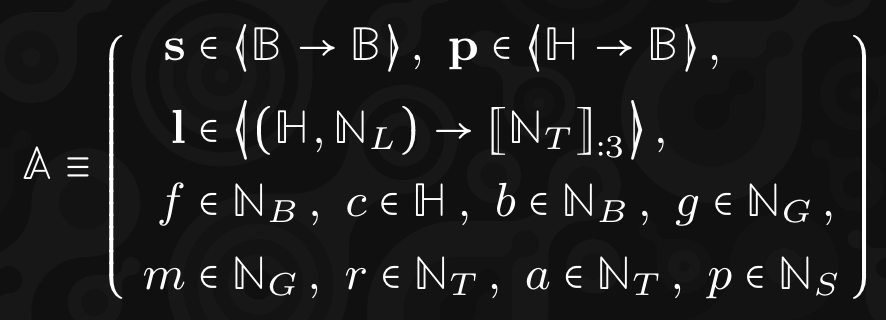
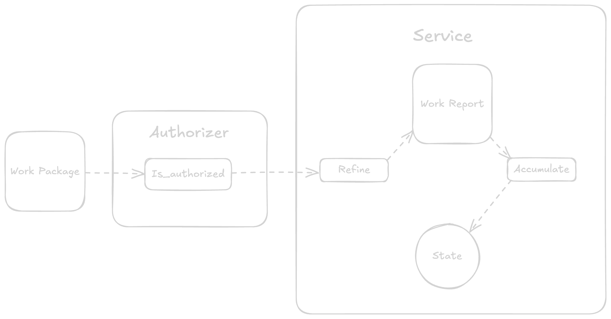

# JAM services

---

# What we'll learn

<pba-flex center>

- ❌ How to build a JAM client
- ✅ How to build JAM services

---v

<pba-flex center>

Not about **building JAM** but about building **ON TOP** of JAM.

---v

<pba-flex center>

"To understand how Jam breaks up its service code is to understand Jam’s fundamental proposition of generality and scalability."

---

# Services

What can we build on JAM?

---v

## The service account



Notes:

Explain each symbol:

- `s` is the storage, from bytes to bytes.
- `p` are the preimages, from hash to bytes.
- `l` are the preimage requests, from hash and length to times when they have been requested/provided.
- `f` is the gratis storage offset.
- `c` is the code hash.
- `b` is the balance.
- `g` and `m` are gas limits.
- `r` is the time slot at creation of the service.
- `a` is the time slot of the most recent accumulation.
- `p` is the parent service.

---v

## Similarities with smart contracts

<pba-flex center>

- Anyone can create one
- They have their own **code**, **storage** and **balance**

---v

## Differences with smart contracts

<pba-flex center>

- They have only two entrypoints: `refine` and `accumulate`
- `refine` is stateless and runs in-core
- `accumulate` is stateful and runs on-chain
- They have to procure `coretime`

Notes:

In the latest version of the GP to date, 0.7.1, `on_transfer` was removed in favor of a `transfer` host function in the `accumulate` entrypoint.

The `accumulate` code might more closely resemble a smart contract since it's executed by everyone in the network and has access to all the state.

---

# Refine and accumulate

---v


---v


---v


---v


---v


---

# Data availability

<pba-flex center>

Decentralized Distributed Data Lake

---v


---v


---v


Notes:

Any service can write and read from it.
The data here stays for a while, not permanent.
It's all erasure coded.

---

# Host functions

---v

## General

<pba-flex center>

<ul>
  <li>Gas</li>
  <li>Fetch</li>
  <li>Lookup</li>
  <li>Read</li>
  <li>Write</li>
  <li>Info</li>
</ul>

---v

## Refine

<pba-flex center>

<ul>
  <li>Historical lookup</li>
  <li>Export</li>
  <li>Machine</li>
  <li>Peek</li>
  <li>Poke</li>
  <li>Pages</li>
  <li>Invoke</li>
  <li>Expunge</li>
</ul>

---v

## Accumulate

<pba-flex center>

<ul>
  <li>Bless</li>
  <li>Assign</li>
  <li>Designate</li>
  <li>Checkpoint</li>
  <li>New</li>
  <li>Upgrade</li>
  <li>Transfer</li>
  <li>Eject</li>
  <li>Query</li>
  <li>Solicit</li>
  <li>Forget</li>
  <li>Yield</li>
  <li>Provide</li>
</ul>

---

# Authorizers

---v

They're the code that authorizes a particular **work** to be processed.

---v



---

# How to build services

---v

Good news: you just need to implement `refine` and `accumulate`!

Bad news: you need to implement `refine` and `accumulate`.

<!-- .element: class="fragment" -->

---v

## PVM assembly

<pba-flex center>

```assembly[|6|10|12-16|17-25|26-35]
%stack_size = 4096
%rw_data_size = 12
%rw_data = 00 00 00 00 00 00 00 00 00 00 00 00

// ===== JAM entrypoints =====
jump @refine // Index 0
fallthrough
fallthrough
fallthrough
jump @accumulate // Index 5

pub @accumulate:
  // Counter
  a1 = 0
  // Accumulator
  a2 = 0
@target:
  // Fetch
  a3 = u8 [a1 + 0xfeff0003]
  // Accumulate
  a2 = a2 + a3
  // Increase counter
  a1 = a1 + 1
  // Condition
  jump @target if a1 <u 4
  // Change state
  u8 [0xfeff0010] = 3
  a1 = 1224
  a2 = 2335
  a3 = 3446
  a4 = 4557
  // 'write' host function
  ecalli 3
  // Return
  a0 = a2
```

Notes:

This is basically like writing evm opcodes or wat (web assembly text format).

---v

There must be a better way...

---

## JAM SDK

https://hackmd.io/@polkadot/jamsdk

---v

## Null authorizer

```rust
#![cfg_attr(any(target_arch = "riscv32", target_arch = "riscv64"), no_std)]

extern crate alloc;
use alloc::string::String;
use jam_pvm_common::{is_authorized::*, *};
use jam_types::*;

#[allow(dead_code)]
struct Authorizer;
jam_pvm_common::declare_authorizer!(Authorizer);

impl jam_pvm_common::Authorizer for Authorizer {
	fn is_authorized(param: AuthConfig, package: WorkPackage, core_index: CoreIndex) -> AuthTrace {
		info!(
			"Null Authorizer, [{core_index}], {} gas, {param} param, {} token",
			gas(),
			package.authorization
		);
		if package.authorization.0 != param.0 {
			panic!("Authorization failed")
		}
		let m = String::from_utf8_lossy(&package.authorization);
		alloc::format!("Auth=<{m}>").as_bytes().to_vec().into()
	}
}
```

---v

## Bootstrap service

For creating new services!

Notes:

Let's take a look at this one.

---

## JamBrains Service SDK

<pba-flex center>

https://github.com/jambrains/service-sdk

Notes:

We are working on our one service sdk.
We are starting with C to have a stable foundation and then we'll move on to C++.
Props to Oliver for this.

---v

<pba-flex center>

```c[|6|14-21|23-30|32-37|39-42|44-50]
#pragma once

#include <stdint.h>
#include "jb_service_types.h"

uint64_t jb_host_gas();

#define JB_FETCH_DISCRIMINATOR_CHAIN_PARAMS 0
#define JB_FETCH_DISCRIMINATOR_CHAIN_ENTROPY32 1

/// W_10 register discriminator for the  fetch host call.
typedef uint64_t jb_fetch_discriminator_t;

uint64_t jb_host_fetch(
  uint8_t *maybe_buffer,
  uint64_t offset,
  uint64_t buffer_len,
  jb_fetch_discriminator_t discriminator,
  uint64_t w_11,
  uint64_t w_12
);

uint64_t jb_host_read(
  uint64_t service_id,
  uint8_t const* const key_ptr,
  uint64_t key_len,
  uint8_t* out_ptr,
  uint64_t out_offset,
  uint64_t out_len
);

uint64_t jb_host_write(
  uint8_t const* const key_ptr,
  uint64_t key_len,
  uint8_t const* const value_ptr,
  uint64_t value_len
);

void jb_host_info(
  uint64_t service_id,
  jb_service_info_t* out_ptr
);

void jb_host_log(
  uint64_t level,
  uint8_t const* const target,
  uint64_t target_len,
  uint8_t const* const msg,
  uint64_t msg_len
);
```

---v

## DEMO

Notes:

Go to https://github.com/JamBrains/service-sdk/ and do the PBA demo.

---

# CoreChains

<pba-flex center>

For building blockchains!

---v

<pba-flex center>

Still under development.
Will be necessary for switching from the relay chain to jam.

---

# CoreVM

For building programs!

<pba-flex center>

---v

<pba-flex center>

Acts like a docker for jam.
Allows you to write **regular programs**.

---

# CorePlay

<pba-flex center>

For building actors!

---v

<pba-flex center>

Still an idea.
Allows you to synchronously compose multiple actors when they want to interact with each other.

---

<pba-flex center>

What will **YOU** build on JAM?
