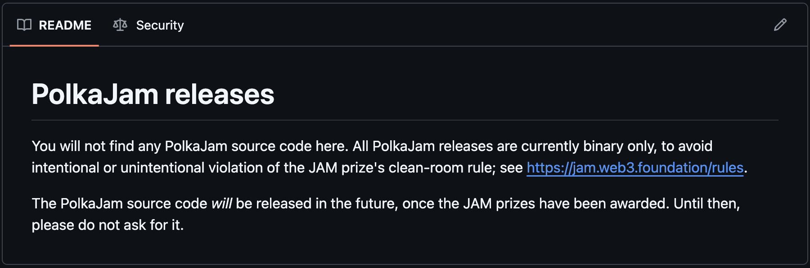
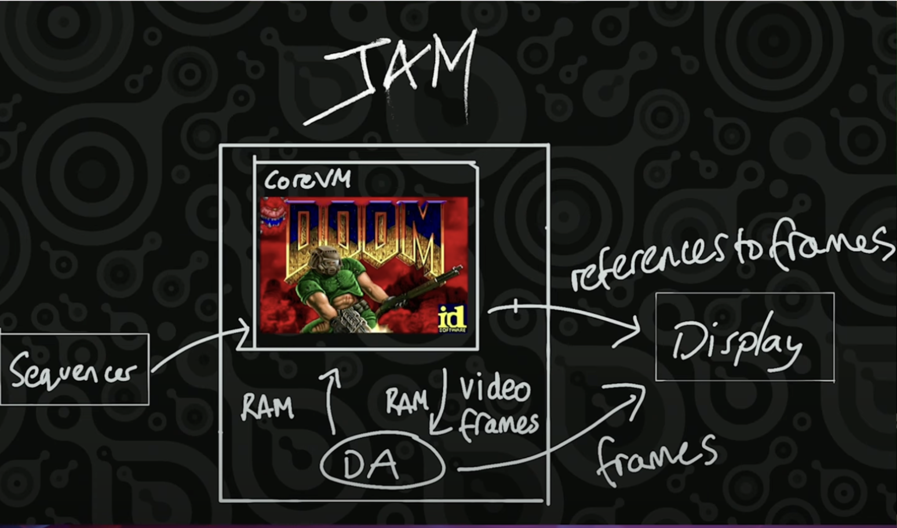
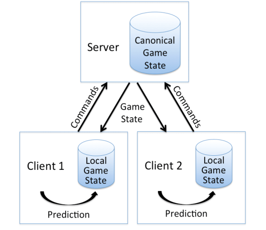

# JAM

## Disclaimers & CoreVM Demo

---

## Polkadot Tech

1. Framework: Substrate
1. VM: WASM
1. Governance: OpenGov
1. Authority: Nominated Proof of Stake
1. Block Production: BABE
1. Sharding: ELVES
1. Shard Interoperability: XCMP + XCM
1. Finality: GRANDPA, BEEFY
1. Scheduling: Agile Coretime
1. Database: RocksDB/ParityDB
1. Encoding: SCALE
1. Networking: LibP2P/LiteP2P
1. APIs: Polkadot.JS / Polkadot API (PAPI)

---v

# Polkadot Tech

1. Framework: Substrate ✅ (parachains only)
1. VM: WASM ❌ -> PVM ⚡ <!-- .element: class="fragment" data-fragment-index="1" -->
1. Governance: OpenGov ✅ <!-- .element: class="fragment" data-fragment-index="2" -->
1. Authority: Nominated Proof of Stake ✅ <!-- .element: class="fragment" data-fragment-index="3" -->
1. Block Production: BABE ❌ -> Safrole ⚡ <!-- .element: class="fragment" data-fragment-index="4" -->
1. Sharding: ELVES ✅ <!-- .element: class="fragment" data-fragment-index="5" -->
1. Shard Interoperability: XCMP 🛠️ + XCM ✅ <!-- .element: class="fragment" data-fragment-index="6" -->
1. Finality: GRANDPA, BEEFY ✅ <!-- .element: class="fragment" data-fragment-index="7" -->
1. Scheduling: Agile Coretime ✅ <!-- .element: class="fragment" data-fragment-index="8" -->
1. Database: RocksDB/ParityDB ❓ <!-- .element: class="fragment" data-fragment-index="9" -->
1. Encoding: SCALE ❌ -> "GP Codec" ⚡ <!-- .element: class="fragment" data-fragment-index="10" -->
1. Networking: LibP2P/LiteP2P ❓ <!-- .element: class="fragment" data-fragment-index="11" -->
1. APIs: Polkadot.JS / Polkadot API (PAPI) 🛠️ <!-- .element: class="fragment" data-fragment-index="12" -->

---

# JAM Motivations

- Protocol clean-up
- Client diversification <!-- .element: class="fragment" data-fragment-index="1" -->
- Backwards compatibility <!-- .element: class="fragment" data-fragment-index="2" -->
- Protocol generalisation <!-- .element: class="fragment" data-fragment-index="3" -->
  - More Open DA <!-- .element: class="fragment" data-fragment-index="4" -->
  - Less compute opinionation (not just parachains) <!-- .element: class="fragment" data-fragment-index="5" -->
- Improved synchronous composability <!-- .element: class="fragment" data-fragment-index="6" -->

---

# JAM Services

- JAM Chain
  - Bootstrap Service <!-- .element: class="fragment" data-fragment-index="1" -->
  - CoreChains Service (Docker for parachains) <!-- .element: class="fragment" data-fragment-index="2" -->
  - CoreVM Service (Docker for generic computation) <!-- .element: class="fragment" data-fragment-index="3" -->
  - CorePlay Service (Smart contract manager service) <!-- .element: class="fragment" data-fragment-index="4" -->

---

# JAM Binaries

https://github.com/paritytech/polkajam-releases



---

# CoreVM

## Docker for generic computation on JAM

---v

# Doom Demo

---v

# Install Dependencies

```bash
# (CoreVM monitor uses SDL2 library that needs
# to be installed in a platform-specific way.)

# Ubuntu
apt-get install libsdl2 libsdl2-ttf

# MacOS
brew install SDL2 SDL2_ttf

# On MacOS you might also need to add SDL2 to the library search path
# (e.g. if Homebrew is installed in a directory other than `/opt/homebrew`).
export DYLD_LIBRARY_PATH=<homebrew-dir>/lib

```

---v

# Run Doom

```bash
# Run local testnet.
./polkajam-testnet

# Create CoreVM.
./jamt vm new ./doom.corevm 1000000000

# Run CoreVM builder (SERVICE_ID is in jamt's output).
./corevm-builder --temp --chain dev --gas 1000000000 SERVICE_ID

# Run CoreVM monitor (SERVICE_ID is in jamt's output).
./corevm-monitor SERVICE_ID

# You can use `export RUST_LOG=corevm` for debugging.
```

---v

# Enjoy Doom

https://www.youtube.com/watch?v=hJcw5FMSjQs&t=140s

---

# Unpacking Doom

What actually happens here?

---v

# Unpacking Doom

- Binary upload
  - The Doom binary (with assets) is uploaded via jamt vm new
  - Stored on-chain as an immutable preimage

---v

# Unpacking Doom

- Binary upload
- Builder start-up
  - Builder generates packages referencing the binary + VM state (instruction counter, registers, memory pages)
  - Sent to CoreVM service for execution

---v

# Unpacking Doom

- Binary upload
- Builder start-up
- Execution
  - Service executes binary step-by-step (“refine”), handles interrupts
  - Produces video/audio frames, console output
  - Stops when gas runs out or unhandled interrupt

---v

# Continuations


---v

# Continuations


---v

# Continuations


---v

# Continuations


---v

# Continuations


---v

# Unpacking Doom

- Binary upload
- Builder start-up
- Execution
- Data dump
  - When execution stops or is interrupted service exports modified memory pages
  - Accumulate verifies correctness: imported pages must be known, outputs consistent

---v

# Unpacking Doom

- Binary upload
- Builder start-up
- Execution
- Data dump
- Monitor
  - Fetches exported segments
  - Renders frames, audio, console messages (with ~6s slot delay)

---v

# Unpacking Doom

- Binary upload
- Builder start-up
- Execution
- Data dump
- Monitor
- Builder again
  - Builder consumes output, imports new memory pages
  - Generates next package → continues execution loop

---v

# Unpacking Doom

- Binary upload
- Builder start-up
- Execution
- Data dump
- Monitor
- Builder again

Notes:
Nightly build uses CoreVM which is a bit old. As such it has a delay of 3 slots and it doesn’t have access to the file system. In the newer version there is no need to bundle the binary with the game assets, you can simply upload the whole directory as a preimage and then access it as a file tree directly from the program (i.e. the same way as any application accesses files).

---v

# Unpacking Doom



---v

# Unpacking Doom

When and where is it actually played?



---

# Questions
