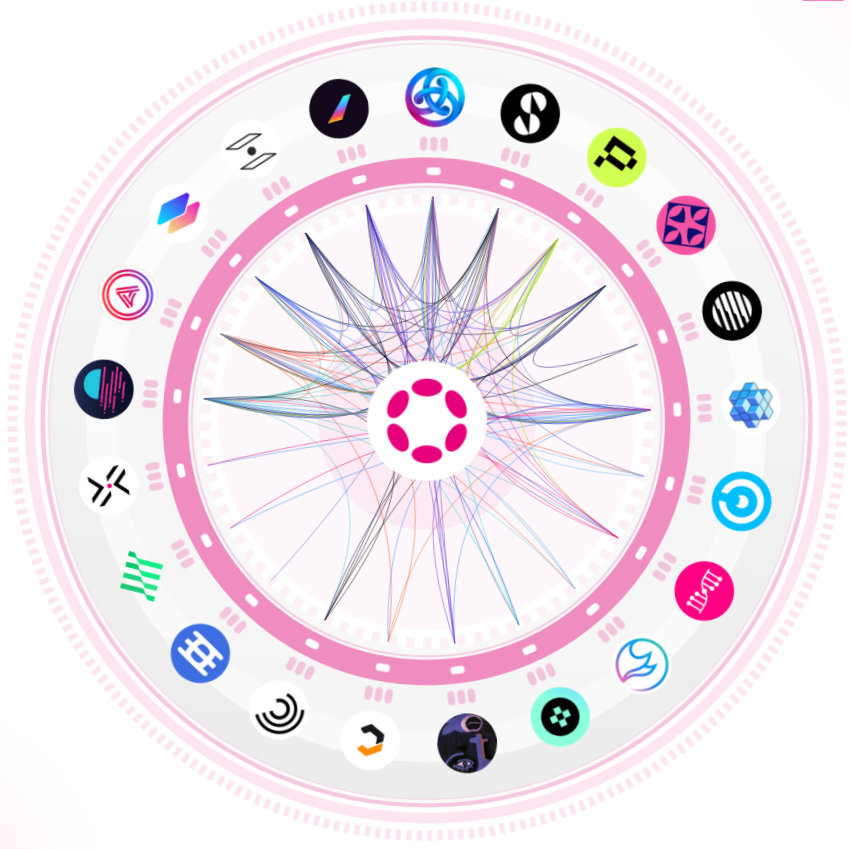

# Introduction to Cross-Consensus Messaging (XCM)

## 💰 Assets in XCM

## Summary

<pba-flex center>

- XCM
- XCM vs XCMP
- Locations
- Sovereign Accounts
- Assets

---v

## Next steps

<pba-flex center>

1. Blog series introducing XCM: Parts [1](https://medium.com/polkadot-network/xcm-the-cross-consensus-message-format-3b77b1373392), [2](https://medium.com/polkadot-network/xcm-part-ii-versioning-and-compatibility-b313fc257b83), and [3](https://medium.com/polkadot-network/xcm-part-iii-execution-and-error-management-ceb8155dd166).
2. XCM Format [repository](https://github.com/paritytech/xcm-format)
3. XCM [Docs](https://paritytech.github.io/xcm-docs/)

---v

<figure>
    
    <figcaption>Source: <a href="https://polkadot.subscan.io/xcm_dashboard">Subscan</a></figcaption>
</figure>
