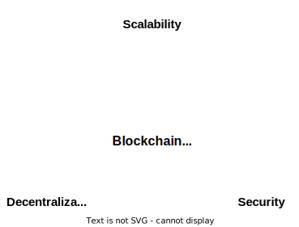
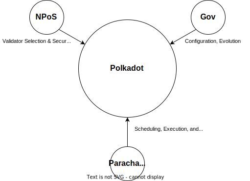
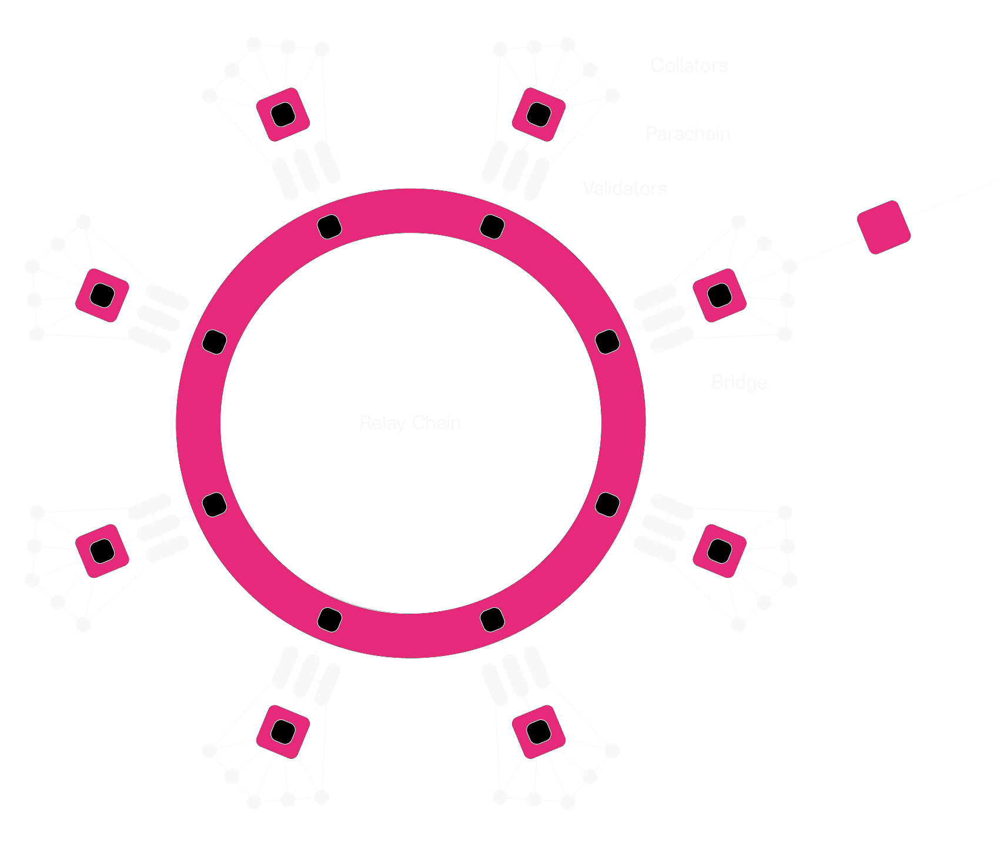
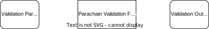

# Introduction to Polkadot

---

## What to expect from this Module?

We will cover the Polkadot platform and its mechanisms in detail. Many lectures will be theoretical, and will enhance students' understanding of Polkadot's inner workings. We will cover the rationale for Polkadot's architectural choices and mechanisms for parachains to interact with Polkadot.

Day 1 will be more theoretical and will focus on Parachains, Sharding, and Governance, while Day 2 will be more practical, with exercises and workshops. Day 3 will cover the staking system, light clients, and conclude with a workshop leading into the XCM module.

---

## Introduction to Polkadot

In this section, we will finally learn about Polkadot, its value proposition, how it works at a high level, and touch on all the key concepts you will expect to learn about throughout the rest of module 6.

---

## What is Polkadot?

Polkadot is a scalable heterogeneous sharded multi-chain network.

---

## What is Polkadot Trying to Solve?

1. Scalability
2. Interoperability
3. Shared Security

---

## The Value of Scalability

We need to create Web3 systems which support the needs of 8 billion people.

Blockchains will be a key part of the Web3 infrastructure.

---

## The Blockchain Scalability Trilemma

1. Security: how much does it _cost_ to attack the network?
2. Throughput: how much work can the network do?
3. Latency: how long does it take for work to be finalized?



---

## Specificity Enhances Scalability

In any engineering task or technical endeavor, specialized solutions for problems are more performant than generalized solutions, as they can incorporate more details about the problem domain.

However, specialized solutions must work in concert with each other in order to provide coherent services. This is the rationale for Polkadot's architecture.

---

## The Value of Interoperability

Interoperability enables blockchains to work together to complete complex end-to-end scenarios.

However, any application reliant on multiple blockchains is vulnerable to security issues on any of those blockchains. The foundations of Web3 infrastructure must be strong.

---

## The Value of Shared Security

Shared security means that multiple chains are secured by the same underlying resource, whether that is PoW (merge-mining) or tokens at stake (PoS). This allows chains to exist under the same security umbrella.

---

## Shared Security and Economic Efficiency

When resources are being reused to provide security for multiple chains, we also gain in economic efficiency, as it requires fewer resources to provide the same amount of security to all chains.

---

## The Problem with Multi-Chain Security Today

- Bootstrapping problem.
- Tokens often provide no utility or value.
- Inherent competition of resources.

---

## The Scaling Problem

When scaling a consensus system, there are three core options:
  - Make execution of blocks more efficient
  - Reduce the number of total nodes
  - Reduce the number of nodes checking each block

---

## The Scaling Problem

**(1) Make execution of blocks more efficient**: This is where specialization becomes important, as well as optimized code execution, disk accesses, etc. However, this path is limited by capabilities of modern hardware and needs to be coupled with other approaches. Relying on highly specialized hardware also introduces centralization risks.

---

## The Scaling Problem

**(2) Reduce the number of total nodes**: Essentially, scale by making the system more centralized altogether. This reduces coordination costs while trading off for security.

---

## The Scaling Problem

**(3) Reduce the number of nodes checking each block**: While keeping the same number of total nodes, split work among the nodes to be done in parallel. The challenge with this approach is maintaining the same level of security and accountability while reducing the work that each node has to do.

---

## Polkadot's Solution: Parallelized Execution

Polkadot combines approaches (1) and (3) by splitting work across multiple parallelized chains (or parachains for short), having those chains specialize for particular use-cases, and only having a small proportion of nodes check each parachain block in the optimistic case.

---

## Polkadot's Architecture and Actors

A high level look into the architecture of Polkadot and the actors which maintain the network.

---

## Polkadot's Architecture: Major Systems



---

## Polkadot Architecture (Parachains):


---

## Simplified Polkadot Architecture (Parachains)



---

## Actors in Polkadot: Validators

Validators are elected within the Nominated-Proof-of-Stake (NPoS) system. All validators have all of these 3 key responsibilities:
  - Authoring and Consensus of Relay-Chain blocks
  - Validation and Security of Parachain blocks
  - Transport of messages between Parachain nodes.

Good validators are rewarded. Bad validators will either miss out on rewards or be slashed if they do not perform their work or perform it wrongly.

---

## Actors in Polkadot: Nominators

Nominators have one responsibility: to nominate validators which they believe to be trustworthy and reliable. Nominators do not actively secure the network.

Nominators share in the rewards of the validators they nominate, as well as the risk that their nominees may misbehave. When a validator is slashed, its nominators are slashed proportionally.

---

## Actors in Polkadot: Collators

Collators are nodes which create parachain blocks. While validators only need to execute parachain blocks, collators are the ones who create

---

## The Relay Chain

The Relay Chain is the "hub" of Polkadot: it provides the following functionality:
  - Governance
  - Staking
  - Registration, scheduling, and Advancement of parachains
  - Communication between parachains
  - Balance Transfers

Notably, the functionality of the Relay Chain is minimized, with the expectation that more complex functionalities will be provided by parachains themselves.

---

## Polkadot Architecture (Parachains):


---

## Message Passing

3 Main Protocols:
  - Upward Messages (Parachain -> Relay Chain)
  - Downward Messages (Relay Chain -> Parachain)
  - Horizontal Message Passing (HRMP, Parachain -> Parachain)

---

## Economics of Polkadot

---

## The DOT Token

The DOT Token has 3 core utilities:
1. Governance
2. Staking
3. Registering and Activating Parachains

The DOT Token underpins the security and evolution of the network.

---

## Polkadot Governance

Polkadot has on-chain governance by referendum of DOT holders, which empowers DOT holders to coordinate the platform:
  - Forkless upgrades of the network
  - Administration of the Treasury funds
  - Configuration of the Parachains protocol
  - Configuration of fees
  - Rescue & recovery operations
  - All other mechanisms of control over the platform

We will have a lecture on the mechanics of OpenGov & will not cover in detail here.

---

## Treasury

Polkadot ensures that a portion of all network fees is collected to the treasury. The treasury is managed by governance, and tokens are burned if they are not spent.

The intention of the treasury is to pay people to help grow Polkadot itself. As tokens are burned, this creates pressure to fund public projects.

---

## Transaction Fees

Transactions executed in the Relay Chain incur fees for inclusion in a block.

Fees automatically adjust based on traffic and demand for transaction inclusion.
- 80% of fees are sent to the Treasury.
- 20% of fees are given to the block producer (authoring validator).
- An optional "tip" can be given directly to the block producer to increase priority.

---

## Parachain Bonding & Registration

Registering a parachain is done by posting the code of the parachain (The "PVF"), the parachain's initial header, and a DOT deposit to the relay chain (The "Bond"). When the parachain is deregistered, the bond is returned.

Scheduling the parachain for execution is done with separate mechanisms after registration.

---

## Parachain Mechanics and Scheduling

---

## Anatomy of a Parachain

Parachains are state-transition functions. The core of a Parachain is the **Parachain Validation Function**, a piece of Wasm code which takes inputs and attempts to validate them to produce outputs.



---

## Head Data and PoVs

```rust
/// Head Data is stored on the relay-chain, and is an abstraction over
/// blockchain headers. Head Data are limited in size, and are often only
/// 32 bytes long.
struct HeadData(Vec<u8>);
/// The Proof-of-Validity (or PoV for short) is a larger piece of data encapsulating
/// the full block itself, as well as any data needed to execute the block.
struct PoV(Vec<u8>);
```

---

## Validation Parameters

```rust
/// Parameters provided to a PVF for validation
pub struct ValidationParams {
	/// The parent parachain block's Head Data
	pub parent_head: HeadData,
	/// The Proof-of-Validity.
	pub pov: PoV,
	/// The current relay-chain block number.
	pub relay_parent_number: RelayChainBlockNumber,
	/// The relay-chain block's storage root.
	pub relay_parent_storage_root: Hash,
}
```

---

## Validation Outputs

```rust
/// Outputs of _successful_ validation of a parachain block.
pub struct ValidationResult {
	/// New head data that should be included in the relay chain state.
	pub head_data: HeadData,
	/// An update to the validation code that should be scheduled in the relay chain.
	pub new_validation_code: Option<ValidationCode>,
	/// Upward messages send by the Parachain.
	pub upward_messages: Vec<UpwardMessage>,
	/// Outbound horizontal messages sent by the parachain.
	pub horizontal_messages: Vec<OutboundHrmpMessage<Id>>,
	/// Number of downward messages that were processed by the Parachain.
	///
	/// It is expected that the Parachain processes them from first to last.
	pub processed_downward_messages: u32,
	/// The mark which specifies the block number up to which all inbound HRMP messages are processed.
	pub hrmp_watermark: RelayChainBlockNumber,
}
```

---

## Cumulus: Creating a PVF

PVFs are simply Wasm blobs that take in the parameters and provide the outputs if valid.

Substrate Runtimes use **host functions** like storage-reads/writes and signature verifications to perform an `execute_block`. With a simple wrapper around `execute_block`, a runtime can be transformed into a PVF. Our framework for doing this is known as **Cumulus**.

It is also possible to create a PVF without using Substrate.

---

## Execution Cores

While the amount of parachains which can be registered is bounded only by the DOT deposits bonded, the amount of parachains which can be scheduled and executed at a time is bounded by the work done in the runtime and the coordination cost of validators.

Polkadot exposes "Execution Cores" which parachains are scheduled onto on a per-block basis. The amount of execution cores is determined by Governance. Like a decentralized CPU, Polkadot schedules and executes code in parallel on its cores.

---

## Scheduling Parachains onto Cores

There are many possible mechanisms for scheduling parachains onto cores, but here are a few live & planned mechanisms:
  - System Parachains (live: Parachain scheduled directly by Governance)
  - Slot Auctions (live: Parachains bid for guaranteed access to a core for long-term duration)
  - Parathreads (in development: on-demand, pay-as-you-go access to cores)

---

## Parachain Slot Auctions

Auctions are scheduled by Governance. The winner of an auction earns guaranteed access to a core for a medium-to-long duration: 6, 12, 18, or 24 months. Bidders bid on behalf of parachains, and bid to _lock up_ DOT tokens, which are returned after the lease is completed. Bidders can be either individual bidders, smart contracts, crowdloans, or anything else that can use a `Signed` origin on the Relay Chain.

---

## System Parachains

System Parachains are scheduled indefinitely and for free by the Governance System. The expectation is that this mechanism will be used to provide parachains that extend the capabilities of Polkadot itself. For instance, Staking and Governance could themselves be moved onto system parachains.

---

## Parathreads

With a cloud computing analogy, if Slot Auctions are "reserved instances" then Parathreads are "spot instances". For chains which don't need to author blocks every 6 or 12 seconds, it is more efficient to buy scheduling on-demand.

Collators will pay a fixed price in DOT for core-time, which goes up and down depending on supply & demand. Collators will then be reimbursed for their cost in transaction fees, the parachain's token, or other mechanisms at higher layers.

---

## Blockspace

> Blockspace is the capacity of a blockchain to finalize and commit operations

Polkadot's primary product is _blockspace_. With the mechanisms described above, as well as future mechanisms, Polkadot aims to provide the most secure blockspace, and be the most efficient allocator of blockspace. The framework of blockspace is useful for evaluating the offerings of different blockchain platforms on 3 properties:
  * Quality
  * Availability
  * Flexibility

---

# Questions?
