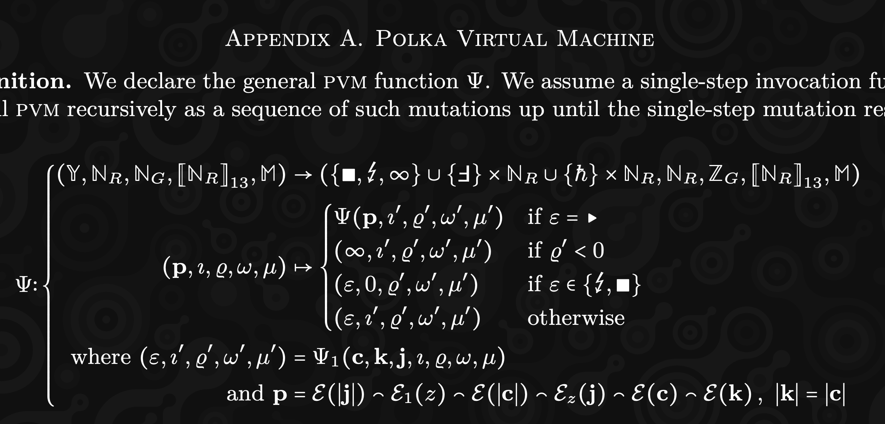

# JAM 

---

#### What is this talk about?

- Our approach to building JAM
- It does not mean that it's the only one!

Notes:
We want to share with you how we approached building JAM from scratch in TypeScript
(crazy idea, I know) in hope to encourage you to do the same in your language
of choice.

---

#### How do you even start?

- The Gray Paper
- JAM Lectures (youtube)
- The Gray Paper
- Element Rooms (#jam:polkadot.io, #graypaper:polkadot.io)
- The Gray Paper
- Did I mention the Gray Paper already?

Notes:
We want to share with you how we approached building JAM from scratch in TypeScript
(crazy idea, I know) in hope to encourage you to do the same in your language
of choice.

---

#### Gray Paper - First impression

Notes:
As you probably already know, the main source of truth for JAM is the Gray Paper.
It's a formal specification of the protocol, which uses a mix of a prose and math
notation to describe the IMPORTANT (consensus-sensitive) details in a language
agnostic way.

So when you start off the first thing you'll see is something like.

---v

#### The Gray Paper - Scary stuff

Notes:
If you go deeper, things might get a little bit more scary though! :)

---v

#### The Gray Paper - Even worse!

Notes:
Or even this!

---

#### Bottom-up approach

Start from the very beginning and go through the formulas 1 by 1

Pros:

- straight forward to start
- works equally well if you have and don't have experience

Cons:

- you might get stuck
- depending on the language you might end up with insufficient architecture

---v

### Top-down approach

Think high level about the client architecture first

Pros:

- you MIGHT build a very efficient client

Cons:

- requires a lot of experience
- extremely easy to get wrong

---v

### Reality (our approach)

- Alternate between bottom-up and top-down.

- Points to consider:
  - Team composition
  - Understanding of the domain
  - Understanding the language/technology

---

#### Who are we?

- JAM implementation in TypeScript
  - `typeberry`

<!-- .element: class="fragment" -->

- JAM tooling (also TS)
  - Gray Paper Reader <small>https://graypaper.fluffylabs.dev</small>
  - PVM Debugger <small>https://pvm.fluffylabs.dev</small>

<!-- .element: class="fragment" -->

- Dev team:
  - 2-4 core developers
  - 2 frontend developers

<!-- .element: class="fragment" -->

---

### How did we start?

- Reading the prose of Gray Paper.
  - Getting the gist of what JAM is about.

<!-- .element: class="fragment" -->

- Working with raw bytes a lot
  - `Bytes<N>` and `BytesBlob` helpers.

<!-- .element: class="fragment" -->

- Reading (not running!) JSON tests (w3f/jamtestvectors)
  - Type-safe custom parser.

<!-- .element: class="fragment" -->

- Performance measurements from day 1
  - Micro-benchmarks for "low-level" stuff.

<!-- .element: class="fragment" -->

Notes:

- Reading/loading JSON tests allows us to get some understanding of what's
  going to be needed and how things might need to be stitched together.
  While it seems super simple `JSON.parse` we've learned a ton just
  by trying to model the data structures in a typesafe way.
- Obviously the choice of the language dictates the steps that you need to
  tackle first. If you have support for bytes natively - why bother :)

---v

#### TODO: Bytes code sample & unit tests

---

#### Implementation as exploration

- We started composing low-level primitives into more complex data structures based on the JSON test vectors.
- Next we were "fact-checking" these structures with the Gray Paper and documenting them.

Notes:

- By searching the structures in the Gray Paper we were gaining better knowledge about the structure of the paper.

---v

#### TODO: Block code sample & unit tests

---

#### In the search of unknown-unknowns

- **known-knowns**: Things we are aware of and understand.
- **known-unknowns**: Things we are aware of but don't fully understand.
- **unknown-unknowns**: Things we are not even aware exist, so we cannot prepare for them.

Notes:

- While you gain understanding of the Gray Paper and the overall domain, you start to realize that there are things
  that you have to do that you didn't even consider ealier. These unknown-unknowns turn into known-unknowns.

---v

### How to proceed?

- Depth-first
- Breadth-first

Notes:

- After we got enough **known-unknowns** we went into breadth-first mode
- and parallelized the work.

---

### First "proper" tasks

- Merkelization
- Codec
- PVM

Notes:

- We figured implementing for JSON test vectors will be simple, so we initially
  went with things that we believed are going to be hard :)

---v

### First tasks take aways

- Don't rely just on JSON test vectors.
- Invest in your own unit testing suite.

Notes:

- JSON test are work in progress and will change.

---

### Benchmarking examples

- What's the most performant way to represent a `Bytes<32>` in TypeScript?
- We need data structures! `Set`, `Dictionary`
- Hashing / Crypto - WASM gives us huge gains.

Notes:
While it's not strictly necessary to be a perofrmant client for the first milestones
we are focusing on the performance as we go since our ambitions reach beyond M2.

---v

### TODO: benchmarking code samples

---

### PVM take aways

- Building an interpreter is fairly easy (common sense).
- Making it fully compatbile with GP is hard (focus on the formulas).
- Taking the intepreter to Polkadot-level performance - extremely hard.

---

### PVM - alternative implementation

- AssemblyScript - sub-set of TypeScript, can be compiled to WASM
- Since optimizing stuff to WASM will be needed it was a fun experiment to learn AS via PVM.

---v

### Second PVM - Why?

- Fuzz testing between the two implementations found us a ton of bugs.
- PVM debuggger was extremely handy in identifying differences.
- More work, but extremely helpful to share experiences and PoVs.

---v

### TODO: Game of life demo https://todr.me/anan-as/conway.html

---

### Tracking changes

- TODO: Gray Paper reader links
- TODO: Gray Paper links overlay (from-code annotations)

---

# Questions?
