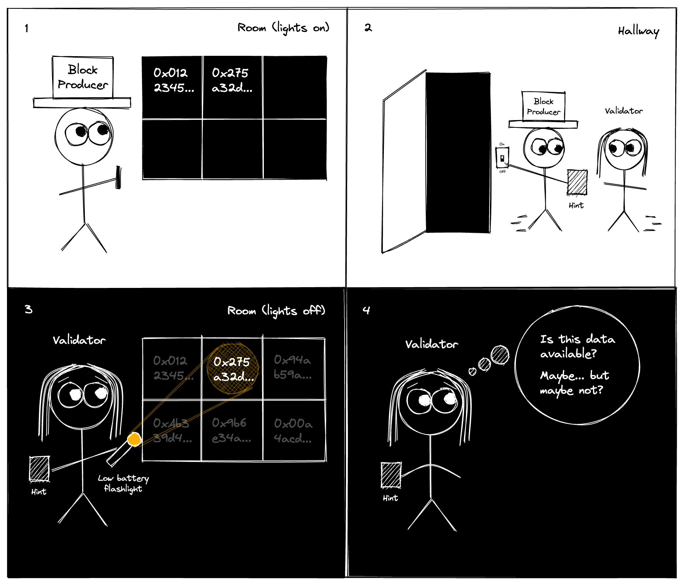
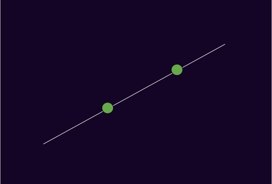
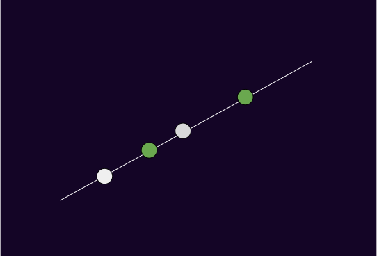
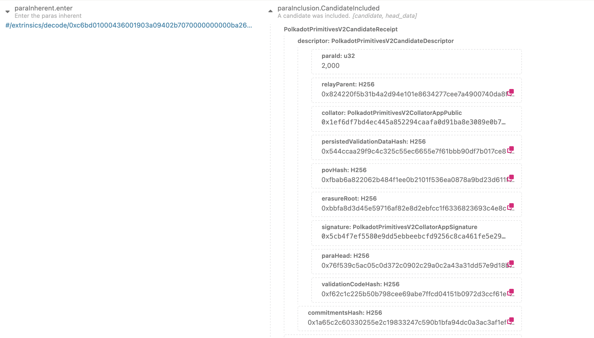

# Data Availability and Sharding.

---

### Outline

<pba-flex center>

1. [Data Availability Problem](#data-availability-problem)
1. [Erasure coding](#erasure-coding)
1. [Data Availability Sampling](#data-availability-sampling)
1. [References](#references)

</pba-flex>

---

## Data Availability Problem

How do we ensure a piece of data is retrievable without storing it on every single node forever?

Incorrectness can be proven (fraud proofs), but unavailability can't.

---v

### Data Availability Problem: Parachains

Imagine a parachain collator produces a block, but only sends it to some  relay chain validators to verify. 

What could such a collator do?

<pba-flex center>

- Prevent nodes and users from learning the parachain state
- Prevent other collators from being able to create blocks

</pba-flex>

---v

### Data Availability Problem: Relaychain

If that block's PoV is only stored by a few validators, what if they go offline or rogue?

<pba-flex center>

- Honest approval-checkers are not able to verify validity

</pba-flex>

---

## Problem

---

## Erasure coding

The goal:

<pba-flex center>

- Encode data of K chunks into a larger encoded data of N chunks
- Any K-subset of N chunks can be used to recover the data

</pba-flex>

---

### Polynomials

---v

### Polynomials: Line

---v

### Even More Polynomials

---v

### Putting it all together

$$ p(x) = \sum_{i=1}^k y_i x^{i-1} $$

---

### Reed-Solomon codes

Congrats! You've just learned Reed-Solomon encoding (almost).

How do we do decoding?

---v

### Lagrange interpolating polynomial

$$ \ell_j(x) = \frac{(x-x_0)}{(x_j-x_0)} \cdots \frac{(x-x_{j-1})}{(x_j-x_{j - 1})} \frac{(x-x_{j+1})}{(x_j-x_{j+1})} \cdots \frac{(x-x_k)}{(x_j-x_k)} $$

$$ L(x) = \sum_{j=0}^{k} y_j \ell_j(x) $$

---

## Polkadot's Data Availability Protocol

- Each PoV is divided into n_validators chunks
- Validator with index i gets a chunk with the same index
- Validators sign statements when they receive their chunk
- Once we have 2/3 + 1 of signed statements, PoV is considered available
- Any subset of 1/3 + 1 of chunks can recover the data

---

### CandidateIncluded

---

### Challenge 1

How does a validator know if a chunk corresponds to the committed data?

---v

### Not that Merkle!

---

### Challenge 2

How do we know if what can be reconstructed from chunks is the same data that was encoded with Reed-Solomon?

- Polkadot uses approval-voting/disputes mechanism for that
- Celestia uses Fraud Proofs
- Danksharding uses KZG commitments

---

## Data Availability Sampling

https://arxiv.org/abs/1809.09044

Ethereum (Danksharding) and Celestia adopt an approach of Data Availability Sampling, where each light makes its own judgement of availability by sampling and distributing a few random chunks.

This can eliminate honest majority assumption.

---

## Comparison with other approaches

- Celestia doesn't implement data sharding
- Data availability is only part of ensuring validity
- Polkadot's DA is able to process dozens of MB per second

---

## Possible future improvements

- Data Availability Sampling for parachain light clients
- Consider using KZG commitments
- Reducing the number of signatures to verify

---

## Questions?

---

### Bonus

- Reed-Solomon encoding actually works with finite fields, not bytes
- Polkadot uses a field of size 2ˆ16 with efficient arithmetic
- Polkadot uses an FFT-based Reed-Solomon algorithm (no Lagrange)

Check out https://github.com/paritytech/reed-solomon-novelpoly

---

## References

1. https://www.youtube.com/watch?v=1pQJkt7-R4Q
1. https://notes.ethereum.org/@vbuterin/proto_danksharding_faq
1. https://www.paradigm.xyz/2022/08/das
