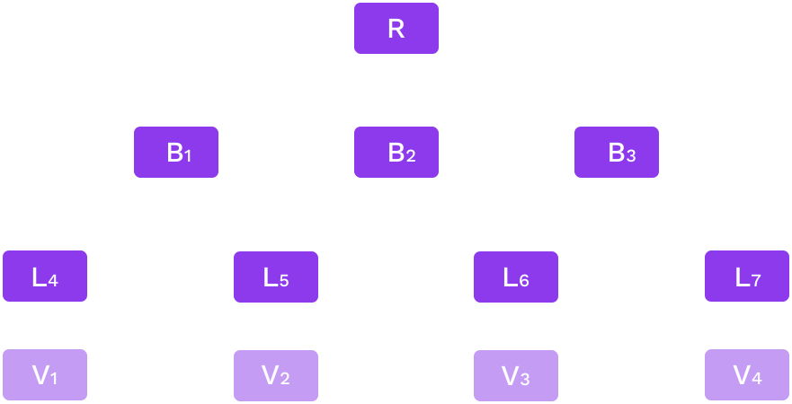
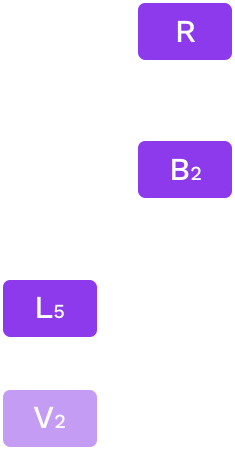
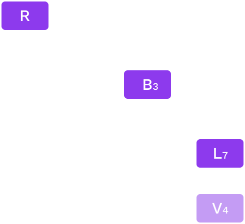
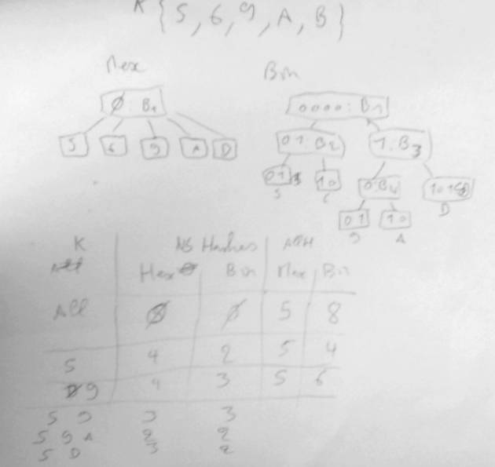

# Costs of Hashing

## _And how these drive Polkadot's design_

---

## Outline

- Polkadot parachain Pvf and attached PoV data.
- Merkle proof
- Cumulus state transition proof
- Is hashing cost only computational?

Notes:

The idea of this session is, starting from general proof system of Polkadot that was already seen (generic state transition proofs distributed with the different Polkadot actor and subsystem: collator availability, validator approval, further dispute).

Focus progressively to the substrate/cumulus merkle trie proof system, and end on the actual
implications of such a model.

Many things will be a bit redundant with previous session on trie, but here in the context of cumulus and Polkadot.

Following workshop will allow seeing how things happen at low level and if all goes well, reach similar conclusion as what we will describe here.

---

## Proof

- Polkadot: Assessing that a parachain state transition is correct.
  No type of proof assumed.
  - PvF wasm
  - Input data from availability
- Cumulus: trie state based parachain.
  Assume a merkle proof as PvF input data.

Notes:

In practice design of system is currently and was historically largely driven by the merkle trie state ethereum like design targeting.

The main point is that we need pvf using pov data that can be checked in a pretty STATELESS way.

---

## Merkle Trie and Proof

**State**



Notes:

<!-- TODO schema from the db & merklized slide lesson? -->

This was already evoked in the substrate module about proof before.
Just a reminder.

Notice that there is no notion of order or sequence

Notice one value here 5 nodes, 2 value 7, but if I add V3 only 9 nodes.

```text
5 -> 7 -> 9
5 -> 3 -> 2
```

generally get something more compact when adding nodes, that's a tree.

---

## Merkle Trie and Proof

**Proof V2**



_Proof of V2: [R, B2, L5, V2]_

---

## Merkle Trie and Proof

**Proof V2, V4**



_Proof of {V2, V4}: [R, B2, B3, L5, L7, V2, V4]_

---

## State Transition Proof

- Prove initial state and execute until same root as next block (through a stateless validation function)
- Proofs do not help scaling, Polkadot validation system does
- Similarity of production (on a full state db) and verification (on a state proof)
- Analogy (e.g. optimistic ZK rollup)

Notes:

we see that proof are just foot print of a state.
We are only really proving the start of block state and it is no different than previous key values proofs.

scalability from Polkadot design not the proof system

When creating proof we run on the state trie db, and record accesses.

<!-- TODO if time speak about cache and proofs -->

Polkadot design is ok for these proofs, what would not be fine is verification being longer than production (would work but would make parachain block size limit ridiculously small in comparison to others.

---

## Wasm and proof

- More Wasm for verification
- Less disk access for verification
- One or two Wasms?

Notes:

About production and verification, it is useful to keep in mind some interesting architectural points, generally the limits of the Wasm.

- Synching: Runtime is running `execute_block` that calls the host function: all the state machine (notably overlay changes) is on the side of host function.
- Block production: We run `execute_transaction` from pool and actually part of execute block are running externally (on init, on finalize - on finalize contains next block storage root calculation call: the call to storage root!!!).
- POV check: All is in Wasm; the whole state machine and calls to host function directly call this runtime state machine, the db call from the state machine is simply the merkle proof).
<!-- TODO can have a slide for it but probably already in other lessons. -->

One can notice that cumulus produce (or did produce) the same wasm for PVF and runtime (just need to expose both 'execute_block' and 'validate_block').
But from a Polkadot point of view it could be split.

can see the validator voting system as rather close to an interactive zk proof system.

---

## Cost

- Computational
- Size of POV

Notes:

About pure computational cost: one can see that we want to have as less node as possible, it is faster to run a hashing function 1 time on the concatenation of N nodes than run the hashing function N time on the N nodes.
But the difference is not that big and generally the question is more about the size of data we are hashing, so the number of branch and their size.
All this ends up to what we will talk after the proof size.
-> less branches involve is better for computation, : in favor of radix 16
-> but for size binary trie
But really these days size is a bigger concern.

Size matters twice as much: good hash function makes it less interesting (try to bench `blake` against `keccak`), but with Polkadot size matter for network and pov data distribution a lot.
So size matter and 'smaller is better'.

---

## Proof Size

- Polkadot limits size

- Smaller is better

- Can grow big

- Compact proof

- zlib compression

Notes:

Be clear that the size is limited for distribution (availability) question.

<!-- TODO find size limit -->

So out of the computational cost of running the wasm logic there is the merkle proof computational cost.
Smaller proof for same operations will allow more computation in a block: more different data can be accessed an more extrinsic run in block.
One can run a lot by doing send 10 token from account A to account B, then same thing but from B to A, then A to B and so on: clearly here the computation limiting factor will not be the size, but generally it can be and we should strive to try to get small proofs.
(related to weight v2: both computation and size factor).

Compact are good, even if it costs to run the hashes again we really favor smaller proof.
But not that from a computational point of view it increase computation cost.

zlib compress mainly the value included in the nodes, generally non deterministic: hard to measure.
→ no way to bound it so it is a gain from availability view, but still not possible to consider for weight V2

---

## Other considerations

Symmetry

Notes:

- Symmetry:
  Other Proofs many are proposing very fast checking scaling the information level.
  e.g. the eth ZK rollup.

In this case the parachains get a lot on his plate: heavy producing with lot of implication, quite challenge and all.
But putting this on parachain model is ok, just the light part would be running there: validator only check the zk proof.
So can think of it as a sub problem.

Merkle trie proofs are relatively simple to understand at a big cost though but Polkadot makes it acceptable.

ZK rollup could fit, just it is less interesting due to small cost of checking proof (actually not true but that is a general opinion/idea)

---

## Runtime Update

Consider a runtime with in state.

If an extrinsic of the block is calling `set_code` through sudo.

What happens?

Notes:

this value runtime is big... usual issues around the question
chunk solution...
Old runtime in proof?

<!-- TODO add a slide on the new trie format or just show how old one was not proper. -->

---

## Runtime Storage Design

- Balanced or Unbalanced trie

- Runtime e.g. StorageMap

- Custom e.g. `:code`

- Module prefix

- Child trie

- Db storage

Notes:

<!-- TODO lot to say here, could be split - already cover in 4.5 can be fast -->

Balancing trie always have been very important for security reason, deterministic weight calculation.
In ethereum for instance all key are hash of key.
→ this way key length is constant and well distributed
→ leading to a balanced trie

Though substrate runtime allows any length of key: meaning we can have unbalanced trie.

There is design concern: a smart contract will use as ethereum.
`:code` will use this short key with few parent branch involve.
Modules will use some prefixing so they don't interfere with each other: if ballance module store a lot, and your nft storage does not, then the proof accessing nft only will not be impacted by the ballance module storage.

Child trie can be seen as prefix, but with their own root (very convenient to extract some state e.g. state of a given crowdloan/contract storage only).

Quick word on db storage, pov is in memory but db can access disk, which makes some choice a tradeoff.
Think about the impact of using a binary trie against a radix 16 trie against a 256 trie?
this goes a bit out of the consideration of this lesson.
But my take on it is hex trie was a trade of related to the db number and size of node, but ultimately one should be looking to use different indexing structure between storage and merkle proof.
Eg: store radix 16 but use binary in memory when hashing and have binary proof.

---

## Reducing Number of Keys?

Value size limit?

Example of a sequence of values:

- Store n value concatenated as a single item
- Less keys
- Splitting big values?
  - Depends on usage, always safer to keep value small

Notes:

Substrate has no size limit, Polkadot adds one due to the size of its pov.

If using all values usually then serializing them together is good.
Using all values together or having a seldom read scenario: e.g. events events are read a lot, but not from runtime.
So write a single value containing all events of a block.

Reduce proof size by requiring to include less parent branches.
Note state machine allows rather low cost update by having an `append` function.

If querying individual values, then storing individually is better: higher write cost accesses are done on individual values: individuals item.
Then please use different storage item, even in case of a list of item.

A third consideration is clearly proof size: we want the PoV to be small: gaining a few branch is a good thing.
But including big value in proof makes it worthless.

Conclusion do serialize values together, but carefully.
e.g. events are not read from runtime, but some proof, for light client notably may use a thinner storage (e.g. attaching event to a given extrinsic index).

Note earlier said Polkadot limit size, but we could have write only value (e.g. event) that go over this size: by simple not being read.
Though all value should be unbounded, because in this scenario such big event value will become a liability when migrating (runtime could not migrate it easily as value is too big).

---

## Summary

- State choices:
  - chain performance
  - Proof size
- Similar execution
- Still room for improvement

Notes:

- chains performance:
  - hex 16 makes is ok for
  - proofs size
  - bin proof better, higher computation
- chain in synch: access a cache & on disk db.
  - btree in state machine
  - chain for block building: good state machine and cache big impact

Cumulus: access in memory proof: overhead of loading it.
Also btree of state machine.

improvement through different storage/state:

- Full parachain: requires forking substrate cumulus significantly
- Some child state only: there is something to do in this direction but also not easy with current codebase.

today we only got hex16 child trie

using a binary child trie will reduce size of proofs for computation storage.

Bounded size child trie could also be interesting.

Things can really be custom

But not an easy task, cumulus really is a great tool.

Just substrate/cumulus does not allow it.

but generally as we Polkadot allows any change and a lot of freedom.

---

<!-- .slide: data-background-color="#4A2439" -->

# Questions

---

## Whiteboard activity: bin vs. hex



Notes:

Should just be done on a whiteboard if interest in the statement that bin produce more compact proof than hex.
