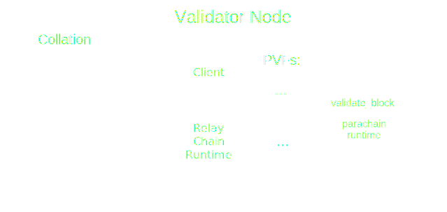
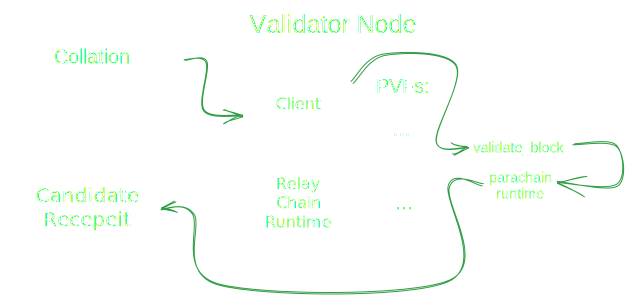
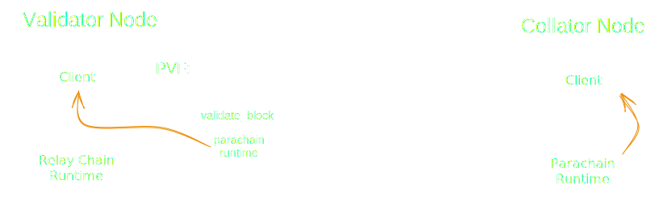
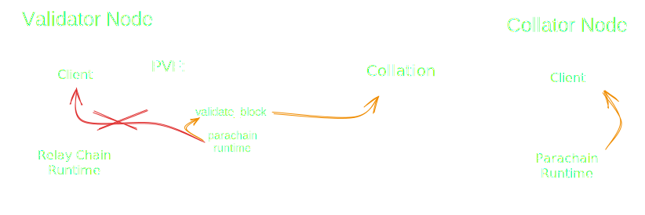

# Cumulus Deep Dive

Notes:

Cumulus is the glue which attaches substrate based chains to Polkadot, converting them into parachains.

---

### Outline

<pba-flex center>

1. What is Cumulus?
1. Cumulus and Para-Relay Communication
<!-- .element: class="fragment" data-fragment-index="1" -->
1. How Cumulus Keeps a Parachain Node Informed
<!-- .element: class="fragment" data-fragment-index="2" -->
1. Collation Generation and Advertisement
<!-- .element: class="fragment" data-fragment-index="3" -->
1. How Cumulus Collations Enable Parablock Validation
<!-- .element: class="fragment" data-fragment-index="4" -->
1. How Cumulus Enables Runtime Upgrades
<!-- .element: class="fragment" data-fragment-index="5" -->

</pba-flex>

---

## What is Cumulus

A collection of code libraries extending a Substrate FRAME chain so that it can interface with the Polkadot API, run relay chain based consensus, and submit parachain blocks for validation.

---

<div class="r-stack">


<!-- .element: class="fragment" data-fragment-index="1" -->

<!-- .element: class="fragment" data-fragment-index="2" -->
</div>

Notes:

- Substrate is a blockchain building framework
- But only "solo" chains
- Split into runtime/node side
- Polkadot is built using substrate
- Cumulus extends substrate to allow any substrate chain to operate as a parachain
- Polkadot provides APIs to collators

---

## Review, Collators and Collations

<pba-flex center>

> What is a collator?

> What is a collation?

> What is the PoV?

</pba-flex>

Notes:

- Collator:
  - Part of consensus authority set
  - Author and submit collations
- Collation: Info necessary for validators to process and validate a parachain block.
- Collations include: upward and horizontal messages, new validation code, resulting head data, proof of validity, processed downward messages, and hrmp_watermark (relay block up to which all hrmp messages have been processed)
- PoV: Information necessary to mimic parachain state and transactions for the purpose of executing a single parachain block.
  Will revisit in more detail.

---

## Cumulus' Key Processes

- Follow relay "new best head" to update para "new best head"
- Follow relay finalized block to update para finalized block
<!-- .element: class="fragment" data-fragment-index="1" -->
- Request parablocks not shared by peers from relay (data recovery)
<!-- .element: class="fragment" data-fragment-index="2" -->
- Collation generation and announcement
<!-- .element: class="fragment" data-fragment-index="3" -->

Notes:

- New best head: New block at the head of the fork most preferred by BABE
  - Decending from finalized block
  - Slightly more complicated form of "longest chain" selection

---

## Cumulus and Para-Relay Communication

<div class="r-stack">


<!-- .element: class="fragment" data-fragment-index="1" -->
</div>

---

## Handling Incoming Relay Information

Before addressing collation generation let's first address the other three key Cumulus processes.
These drive parachain consensus and ensure the availability of parachain blocks.

<br/>
Together they keep parachain nodes up to date such that collating is possible.

---

### Parachain Consensus

Parachain consensus is modified to:

<pba-flex center>

- Achieve sequencing consensus
- Leave finality to the relay chain

</pba-flex>

Notes:

- Sequencing consensus: Decide on an accepted ordering of blocks and of transactions within a block
- Sequencing consensus requires that we update our knowledge of the new best head of the parachain.
  That way nodes are in agreement about which block to build on top of.
- Cumulus sequencing consensus is modular and changeable
- Sequencing options: Aura consensus, tendermint style consensus

---

### Key Process 1: Import Driven Block Authoring

Collators are responsible for authoring new blocks. Prior to the rollout of asynchronous backing, they did so when importing relay blocks.
Honest Collators will choose to author blocks descending from the best head.

```rust[3|4-8|11]
// Greatly simplified
loop {
    let imported = import_relay_chain_blocks_stream.next().await;

    if relay_chain_awaits_parachain_candidate(imported) {
        let pov = match parachain_trigger_block_authoring(imported) {
            Some(p) => p,
            None => continue,
        };

        relay_chain_distribute_pov(pov)
    }
}
```

<!-- .element: class="fragment" data-fragment-index="1" -->

Notes:

- With asynchronous backing, parachain block authoring is untethered from relay block import, though still ultimately reliant on it.

---

### Key Process 2: Finality Updates

To facilitate shared security, parachains inherit their finality from the relay chain.

<br/>

```rust[3|4-8|11]
// Greatly simplified
loop {
    let finalized = finalized_relay_chain_blocks_stream.next().await;

    let finalized_parachain_block =
      match get_parachain_block_from_relay_chain_block(finalized) {
        Some(b) => b,
        None => continue,
    };

    set_finalized_parachain_block(finalized_parachain_block);
}
```

---

### Key Process 3: Ensuring Block Availability

As a part of the parachains protocol, Polkadot makes parachain blocks available for 24 hours after they are backed.
<br/><br/>

<pba-flex center>

- Why is this needed?
  - Approvals
  - Malicious collator

</pba-flex>
<br/><br/>

> What role does cumulus play?

Notes:

- When Cumulus learns of a new parachain block via a receipt on the relay chain, it is responsible for deciding how long to wait before deciding that the block is missing and then requesting it from Polkadot DA.

---

#### Brief Aside, Candidate Receipt

The PoV is too big to be included on-chain when a parablock is backed, so validators instead produce a constant size **Candidate Block Receipt** to represent the freshly validated block and its outputs

Notes:

- The Candidate Receipt contains mainly hashes so its main use is to verify the correctness of known PoVs
- The Candidate Receipt only references a PoV, it does not substitute it

---

### Malicious collator example

<div class="r-stack">

<!-- .element: class="fragment fade-out" data-fragment-index="1" -->

<!-- .element: class="fragment" data-fragment-index="1" -->

<!-- .element: class="fragment" data-fragment-index="2" -->
</div>

Notes:

- On a Parachain, a block only needs to be accepted by the relay chain validators to be part of the canonical chain,
- The problem is that a collator can send a block to the relay chain without distributing it in the Parachain network
- So, the relay chain could expect some parent block for the next block that no one is aware of

---

## Availability Outcome


---

# Key Process 4: Collation Generation and Advertisement

---

## Collation Generation

<pba-flex center>

1. Relay node imports block in which parachain's avail. core was vacated
1. CollationGeneration requests a collation from the collator
<!-- .element: class="fragment" data-fragment-index="1" -->
1. Parachain consensus decides whether it's this collator's turn to author
<!-- .element: class="fragment" data-fragment-index="2" -->
1. Collator proposes, seals, and imports a new block
<!-- .element: class="fragment" data-fragment-index="3" -->
1. Collator bundles the new block and information necessary to process and validate it, a collation!
<!-- .element: class="fragment" data-fragment-index="4" -->

</pba-flex>

---

## Collation Distribution


Notes:

- New parablocks are communicated simultaneously in two ways
  - A collation is sent to the collator's tethered relay node to be processed in the `CollationGeneration` subsystem. There it is repackaged before being forwarded to backers.
  - An advertisement of the new parablock candidate is gossiped to parachain node import queues

---

# How Cumulus Collations Enable Parablock Validation

---

### What is Runtime Validation?

<pba-flex center>

- The relay chain ensures that every parachain block follows the rules defined by that parachain's current code.

<!-- .element: class="fragment" data-fragment-index="1" -->

- Constraint: The relay chain must be able to execute runtime validation of a parachain block without access to the entirety of that parachain's state

<!-- .element: class="fragment" data-fragment-index="2" -->

</pba-flex>

<div class="r-stack">


<!-- .element: class="fragment" data-fragment-index="1" -->

<!-- .element: class="fragment" data-fragment-index="2" -->
</div>

<pba-flex center>

- The building blocks to make this possible, the PVF and PoV, are delivered within collations

<!-- .element: class="fragment" data-fragment-index="3" -->

</pba-flex>

---

#### Parachain Validation Function - PVF

- The current STF of each Parachain is stored on the Relay Chain, wrapped as a PVF

```rust [6]
/// A struct that carries code of a parachain validation function and its hash.
///
/// Should be cheap to clone.
#[derive(Clone)]
pub struct Pvf {
    pub(crate) code: Arc<Vec<u8>>,
    pub(crate) code_hash: ValidationCodeHash,
}
```

<br/>

- New state transitions that occur on a parachain must be validated against the PVF

Notes:

The code is hashed and saved in the storage of the relay chain.

---

#### Why PVF Rather than STF?

<pba-cols>
<pba-col center>


</pba-col>
<pba-col center>

- The PVF is not just a copy paste of the parachain Runtime

<br/>

- The PVF contains an extra function, `validate_block`

<br/>

**WHY!?**

<!-- .element: class="fragment" data-fragment-index="1" -->

</pba-col>
</pba-cols>

Notes:

The function `validate_block` needed to interpret all the extra information in a PoV required for validation.
This extra information is unique to each parachain and opaque to the relay chain.

---

#### Validation Path Visualized

<div class="r-stack">


</div>

Notes:
The input of the runtime validation process is the PoV, and the function called in the PVF is 'validate_block'. Validate block converts the PoV into necessary inputs on top of which a parachain's STF can be run. The output created is called a CandidateReceipt.

---

#### What Does validate_block Actually Do?

<pba-flex center>

- The parachain runtime expects to run in conjunction with a parachain client
- But validation is occurring in a relay chain node
<!-- .element: class="fragment" data-fragment-index="1" -->
- We need to implement the API the parachain client exposes to the runtime, known as host functions
<!-- .element: class="fragment" data-fragment-index="2" -->
- The host functions most importantly allow the runtime to query its state, so we need a light weight replacement for the parachain's state sufficient for the execution of this single block
<!-- .element: class="fragment" data-fragment-index="3" -->
- validate_block prepares said state and host functions, then runs the parachain's STF on top of them
<!-- .element: class="fragment" data-fragment-index="4" -->

</pba-flex>

---

#### Validate Block in Code

```rust [2|3-4|6|8-11|14]
// Very simplified
fn validate_block(input: InputParams) -> Output {
    // First let's initialize the state
    let state = input.storage_proof.into_state().expect("Storage proof invalid");

    replace_host_functions();

    // Run Substrate's `execute_block` on top of the state
    with_state(state, || {
        execute_block(input.block).expect("Block is invalid")
    })

    // Create the output of the result
    create_output()
}
```

Notes:

1. We construct the sparse in-memory database from the storage proof and then ensure that the storage root matches the storage root in the `parent_head`.
2. Replace host functions
3. Execute block
4. Create output. We check whether the `storage_root` and other outputs resulting from validation matched the commitments made by the collator.

But where does `storage_proof` come from?

---

##### Host Function Replacement Visualized

<div class="r-stack">

<!-- .element: class="fragment fade-out" data-fragment-index="1" -->

<!-- .element: class="fragment" data-fragment-index="1" -->
</div>

---

### Collation Revisited

```rust[1|2-9,12-15|10-11]
pub struct Collation<BlockNumber = polkadot_primitives::BlockNumber> {
	/// Messages destined to be interpreted by the Relay chain itself.
	pub upward_messages: UpwardMessages,
	/// The horizontal messages sent by the parachain.
	pub horizontal_messages: HorizontalMessages,
	/// New validation code.
	pub new_validation_code: Option<ValidationCode>,
	/// The head-data produced as a result of execution.
	pub head_data: HeadData,
	/// Proof to verify the state transition of the parachain.
	pub proof_of_validity: MaybeCompressedPoV,
	/// The number of messages processed from the DMQ.
	pub processed_downward_messages: u32,
	/// The mark which specifies the block number up to which all inbound HRMP messages are processed.
	pub hrmp_watermark: BlockNumber,
}
```

Notes:

Code highlighting:

- CandidateCommitments: Messages passed upwards, Downward messages processed, New code, `head_data` (checked against validation outputs)
- PoV (the validation input)

---

### Witness Data (Storage Proof)

- Makes up most if the information in a PoV
- Acts as a replacement for the parachain's pre-state for the purpose of validating a single block
<!-- .element: class="fragment" data-fragment-index="1" -->
- It enables the construction of a sparse in-memory merkle trie
<!-- .element: class="fragment" data-fragment-index="2" -->
- State root can then be compared to that from parent header
<!-- .element: class="fragment" data-fragment-index="3" -->

---

### Example of Witness Data Construction

<div class="r-stack">

<!-- .element: class="fragment fade-out" data-fragment-index="1" -->

<!-- .element: class="fragment" data-fragment-index="1" -->
</div>

<br/>

- Only includes the data modified in this block along with hashes of the data from the rest of the trie
<!-- .element: class="fragment" data-fragment-index="2" -->
- This makes up the majority of the data in a collation (max 5MiB)
<!-- .element: class="fragment" data-fragment-index="3" -->

Notes:

- orange: Data values modified in this block
- green: Hash of the siblings node required for the pov
- white: Hash of the nodes that are constructed with orange and green nodes
- red: Unneeded hash
- blue: Head of the trie, hash present in the previous block header

---

#### Witness Data in Validation

```rust [4]
// Very simplified
fn validate_block(input: InputParams) -> Output {
    // First let's initialize the state
    let state = input.storage_proof.into_state().expect("Storage proof invalid");

    replace_host_functions();

    // Run `execute_block` on top of the state
    with_state(state, || {
        execute_block(input.block).expect("Block is invalid")
    })

    // Create the output of the result
    create_output()
}
```

- Now we know where the **storage_proof** (witness data) comes from!
- into_state constructs our storage trie
<!-- .element: class="fragment" data-fragment-index="1" -->
- Host functions rewritten to access this new storage
<!-- .element: class="fragment" data-fragment-index="2" -->

---

## Cumulus and Parachain Runtime Upgrades

<pba-flex center>

- Every Substrate blockchain supports runtime upgrades
<!-- .element: class="fragment" data-fragment-index="0" -->
- Every time a validator wants to validate a parablock, it must first compile the PVF
<!-- .element: class="fragment" data-fragment-index="1" -->

##### Problem

<!-- .element: class="fragment" data-fragment-index="2" -->

- What happens if PVF compilation takes too long?
  <!-- .element: class="fragment" data-fragment-index="2" -->
  - Approval no-shows
  - In disputes neither side may reach super-majority

<!-- .element: class="fragment" data-fragment-index="2" -->

> Updating a Parachain runtime is not as easy as updating a standalone blockchain runtime

<!-- .element: class="fragment" data-fragment-index="3" -->

</pba-flex>

---

### Solution

The relay chain needs a fairly hard guarantee that PVFs can be compiled within a reasonable amount of time.

<br/>

- Collators execute a runtime upgrade but it is not applied
- Code sent in collation `Option<ValidationCode>`
- The relay chain executes the **PVF Pre-Checking Process**
- The first parachain block to be included after the end of the process applies the new runtime

<!-- .element: class="fragment" data-fragment-index="1" -->

> Cumulus follows the relay chain, waiting for a go ahead signal to apply the runtime change

<!-- .element: class="fragment" data-fragment-index="2" -->

Notes:

https://github.com/paritytech/cumulus/blob/master/docs/overview.md#runtime-upgrade

---

##### PVF Pre-Checking Process

<pba-flex center>

- Track
- Check
<!-- .element: class="fragment" data-fragment-index="1" -->
- Vote
<!-- .element: class="fragment" data-fragment-index="2" -->
- Conclude
<!-- .element: class="fragment" data-fragment-index="3" -->
- Upgrade
<!-- .element: class="fragment" data-fragment-index="4" -->
- Notify
<!-- .element: class="fragment" data-fragment-index="5" -->

</pba-flex>

Notes:

- The relay chain keeps track of all the new PVFs that need to be checked
- Each validator checks if the compilation of a PVF is valid and does not require too much time, then it votes
  - binary vote: accept or reject
- Super majority concludes the vote
- The new PVF replaces the prior one in relay chain state
- A "go ahead" signal is sent, telling the parachain to apply the upgrade

reference: https://paritytech.github.io/polkadot/book/pvf-prechecking.html

---

## References

1. 🦸 [Gabriele Miotti](https://github.com/gabriele-0201), who was a huge help putting together these slides
1. https://github.com/paritytech/cumulus/blob/master/docs/overview.md

---

<!-- .slide: data-background-color="#4A2439" -->

# Questions
